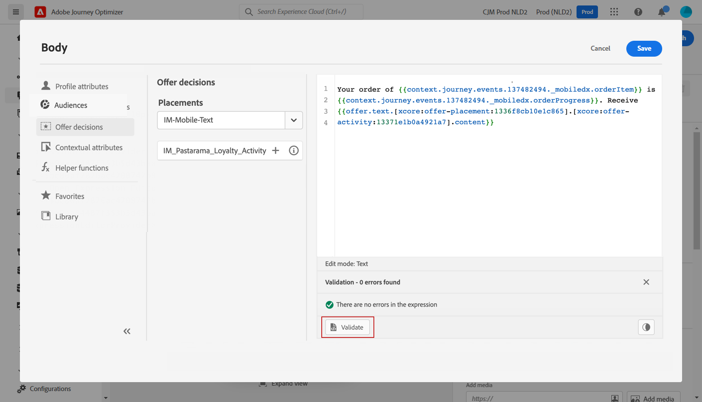

# 個人化使用案例{#personalization-use-case}

在此使用案例中，您將瞭解如何在單一推播通知訊息中使用多種個人化類型。 將使用三種個人化類型：

* 設定檔：基於配置檔案欄位的消息個性化
* 選件決定：基於選件決策變數的個人化
* 內容：基於旅程情境式資料的個人化

此範例的目的是在每次更新客戶訂單時，將事件推送至Journey Optimizer。 隨後，向客戶發送推播通知，其中包含訂單的相關資訊和個人化優惠。

對於此使用案例，需要以下先決條件：

* 建立和設計推播通知訊息，毋需發佈。 請參閱此[節](../create-message.md)。
* 設定訂單事件，包括訂單編號、狀態和項目名稱。 請參閱此[節](../event/about-events.md)。
* 建立決定（先前稱為「選件活動」），請參閱此[章節](../offers/offer-activities/create-offer-activities.md)。

## 步驟1 —— 在個人檔案上新增個人化

1. 按一下&#x200B;**[!UICONTROL Message]**&#x200B;菜單並選擇消息。

   

1. 按一下&#x200B;**Title**&#x200B;欄位。

   

1. 輸入主題並新增個人化設定檔。 使用搜尋列來尋找描述檔的名字欄位。 在主題文本中，將游標置於要插入個性化欄位的位置，然後按一下&#x200B;**+**&#x200B;表徵圖。 按一下&#x200B;**「儲存」**。

   

   >[!NOTE]
   >
   >留下草稿。 請勿發佈。

## 步驟2 —— 建立歷程

1. 按一下&#x200B;**[!UICONTROL Journeys]**&#x200B;功能表並建立新的歷程。

   

1. 添加您的條目事件、**消息**&#x200B;和&#x200B;**結束**&#x200B;活動。

   

1. 在&#x200B;**Message**&#x200B;活動中，選擇以前建立的消息。 按一下&#x200B;**確定**。

   

   系統會顯示一則訊息，通知您已將登入事件資料和歷程屬性傳遞至訊息。

   

   >[!NOTE]
   >
   >此時會出現一則訊息，並附上警告圖示。 這是因為訊息尚未發佈。

## 步驟3 —— 在情境資料上新增個人化

1. 在&#x200B;**Message**&#x200B;活動中，按一下&#x200B;**開啟消息**&#x200B;表徵圖。 訊息會在新標籤中開啟。

   

1. 按一下&#x200B;**Title**&#x200B;欄位。

   

1. 選擇&#x200B;**Context**&#x200B;類別。 只有在歷程將情境資料傳遞至訊息時，才能使用此項目。 按一下&#x200B;**Journey Orchestration**。 出現以下上下文資訊：

   * **事件**:此類別會重新分組旅程中「訊息」活動之前所 **** 有事件的欄位。
   * **歷程屬性**:特定描述檔的歷程相關技術欄位，例如歷程ID或遇到的特定錯誤。請參閱[Journey Orchestration文檔](https://experienceleague.adobe.com/docs/journeys/using/building-advanced-conditions-journeys/syntax/journey-properties.html#building-advanced-conditions-journeys)。

   

1. 展開&#x200B;**Events**&#x200B;項目，並尋找與您的事件相關的訂單編號欄位。 您也可以使用搜尋方塊。 按一下&#x200B;**+**&#x200B;圖示，將個人化欄位插入主題文字。 按一下&#x200B;**「儲存」**。

   

1. 現在按一下&#x200B;**Body**&#x200B;欄位。

   

1. 鍵入消息並插入&#x200B;**Context**&#x200B;類別中的訂單項目名稱和訂單進度。

   

1. 從下拉式清單中，選擇&#x200B;**選件決策**&#x200B;以插入offer decisioning變數。 選取位置，然後按一下決定旁的&#x200B;**+**&#x200B;圖示（先前稱為&#39;offer activity&#39;），將它新增至內文。

   

1. 按一下「validate（驗證）」確保沒有錯誤，然後按一下「Save **（保存**）」。

   

1. 現在，發佈訊息。

   

## 步驟4 —— 測試並發佈歷程

1. 再次開啟旅程。 如果歷程已開啟，請確定您已重新整理頁面。 現在訊息已發佈，您可以看到歷程中沒有錯誤。 按一下&#x200B;**Test**&#x200B;按鈕，然後按一下&#x200B;**觸發事件**。

   

1. 輸入要傳入測試的不同值。 測試模式只適用於測試設定檔。 描述檔識別碼需要與測試描述檔對應。 按一下&#x200B;**發送**。

   

   推播通知會傳送並顯示在測試設定檔的行動電話上。

   

1. 確認沒有錯誤，並發佈歷程。

