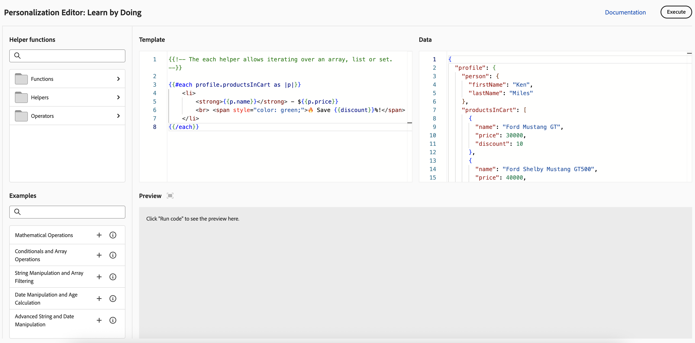

# 開始使用個人化{#add-personalization}

>[!CONTEXTUALHELP]
>id="ajo_homepage_card5"
>title="個人化體驗"
>abstract="使用 **Adobe Journey Optimizer**，利用手邊關於他們的資料與資訊，調整給各個特定接收者的訊息。可以是他們的姓氏、興趣、居住的地方、購買的產品等等。"

[!DNL Adobe Journey Optimizer]個人化功能可讓您運用您擁有的訊息相關資料與資訊，將訊息調整至每個特定收件者。 可以是他們的姓氏、興趣、居住的地方、購買的產品等等。

## 個人化的運作方式

使用&#x200B;**個人化編輯器**，您可以選取、排列、自訂及驗證所有資料，以建立您內容的自訂個人化，並利用各種工具（例如協助程式功能或預先定義的運算式）來有效地自訂訊息。

Journey Optimizer採用以Handlebars為基礎的內嵌個人化語法，可讓您建立包含雙大括弧&#x200B;**`{{}}`**&#x200B;之內容的運算式。

處理訊息時，Journey Optimizer會以Experience Platform資料集中包含的資料取代運算式。 例如，`Hello {{profile.person.name.firstName}} {{profile.person.name.lastName}}`會動態變成`Hello John Doe`。

使用此語法，您可以跨多個欄位個人化訊息，包括電子郵件主旨列、訊息本文、推播通知或URL。

## 用於個人化的資料

Personalization是以由Adobe Experience Platform中定義的&#x200B;**XDM個別設定檔**&#x200B;結構描述管理的設定檔資料為基礎。 **XDM Individual Profile**&#x200B;結構描述是唯一可用來個人化[!DNL Journey Optimizer]中內容的結構描述。 在[Adobe Experience Platform資料模型(XDM)檔案](https://experienceleague.adobe.com/docs/experience-platform/xdm/home.html?lang=zh-Hant){target="_blank"}中進一步瞭解。

您也可以運用&#x200B;**計算屬性**&#x200B;來個人化您的內容。 計算屬性可讓您將個別行為事件摘要為Adobe Experience Platform上可用的計算設定檔屬性。 [瞭解如何使用計算屬性](../audience/computed-attributes.md)

此外，[!DNL Journey Optimizer]可讓您在個人化編輯器中運用Adobe Experience Platform的資料，來個人化您的內容。 若想這樣做，就必須先透過 API 呼叫，啟用查詢個人化所需的資料集。 完成後，您可以使用他們的資料在Journey Optimizer中個人化您的內容。 此功能目前在Beta版中提供。 [了解更多](../personalization/aep-data-perso.md)

## 學習並實驗個人化 {#playground}

**[!DNL Adobe Journey Optimizer]**&#x200B;包含互動式工具，旨在協助您學習及實驗個人化功能。

此遊樂場提供模擬環境，讓您使用範例資料來撰寫和測試個人化程式碼，而不需要即時資料集。 您可以運用預先定義的程式碼範例、編輯虛擬設定檔裝載，並即時預覽個人化程式碼的輸出。

➡️ [存取個人化遊樂場](https://experienceleague.adobe.com/zh-hant/apps/journey-optimizer/ajo-personalization){target="_blank"}

## 讓我們深入探討

現在您已瞭解&#x200B;**[!DNL Journey Optimizer]**&#x200B;中的個人化，是時候深入探討這些檔案區段以開始使用此功能了。

<table style="table-layout:fixed"><tr style="border: 0;">
<td>

<a href="personalization-build-expressions.md"><strong>新增個人化</strong></a>

</td>
<td>

<a href="../personalization/personalization-syntax.md"><strong>Personalization語法</strong>

</td>
<td>

<a href="../personalization/functions/functions.md"><strong>協助程式函式清單</strong></a>

</td>
<td>

<a href="../personalization/personalization-use-case.md"><strong>Personalization使用案例</strong></a>

</td>
</tr></table>

## 作法影片{#video-perso}

瞭解如何使用歷程中的內容事件資訊來個人化訊息。

>[!VIDEO](https://video.tv.adobe.com/v/334165?quality=12)

了解如何將以輪廓為基礎的個人化新增至訊息，以及如何使用客群成員資格作為個人化區塊的先決條件。

>[!VIDEO](https://video.tv.adobe.com/v/334078?quality=12)

瞭解如何善用個人化編輯器遊樂場，使用範例資料來撰寫及測試個人化程式碼。

>[!VIDEO](https://video.tv.adobe.com/v/3457868?quality=12)

在[Personalization教學課程](https://experienceleague.adobe.com/zh-hant/docs/journey-optimizer-learn/tutorials/personalize-content/personalization-editor-overview){target="_blank"}中探索更多有關個人化功能和最佳實務的教學課程影片
