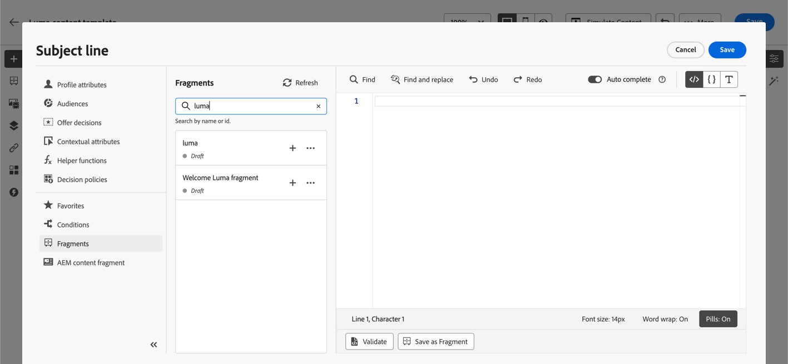
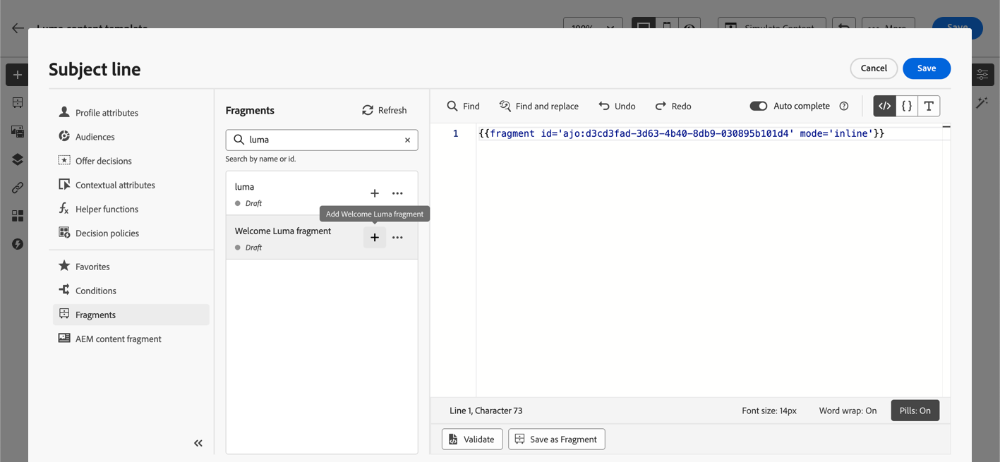
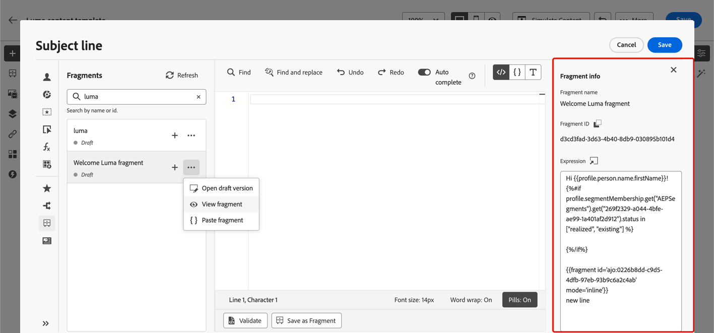
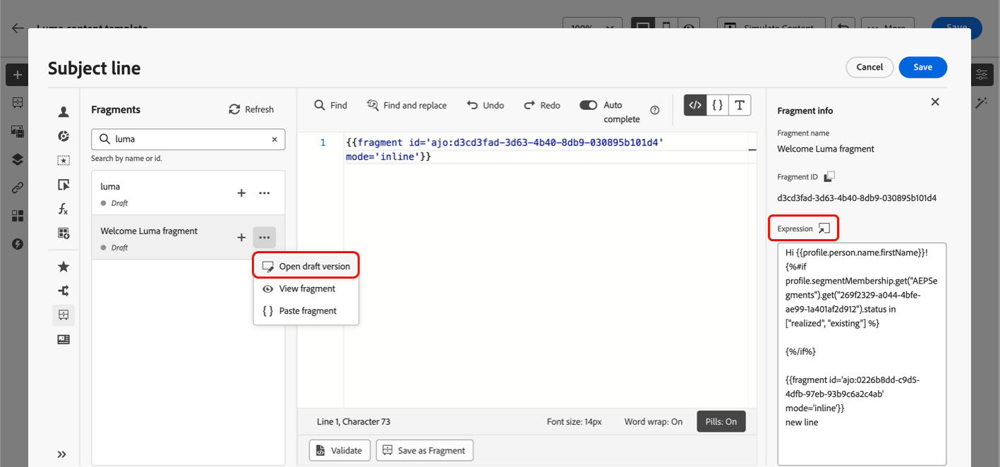
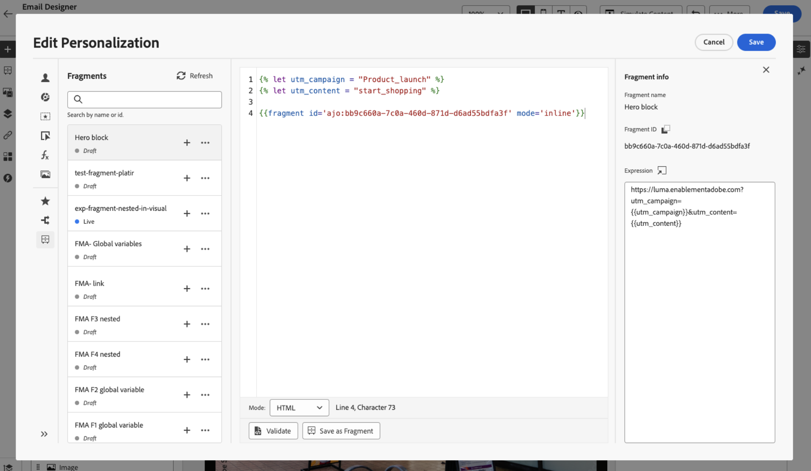
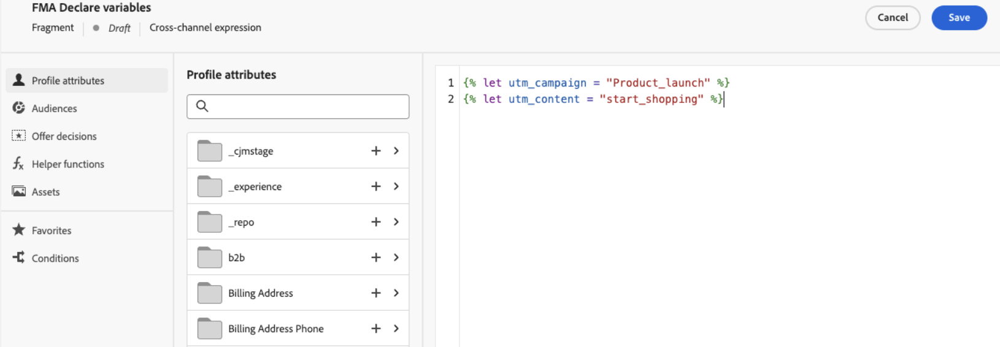
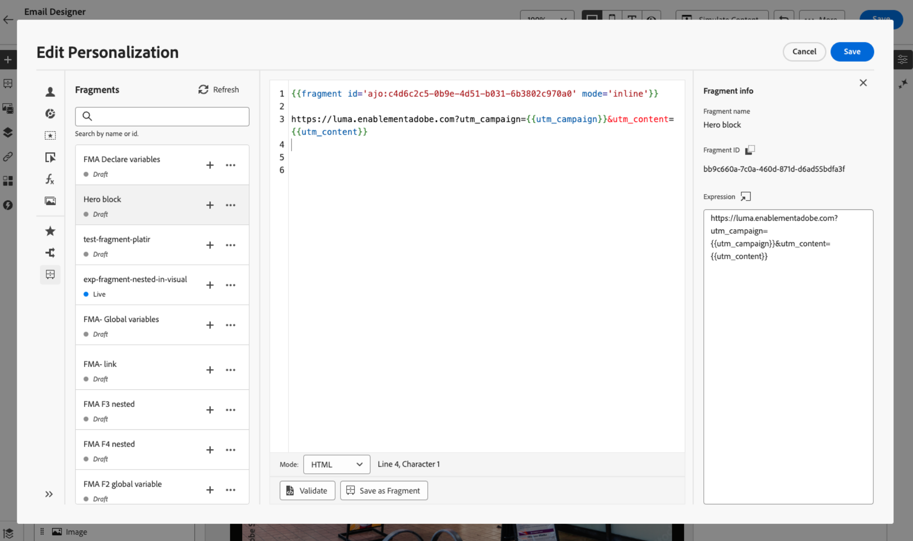
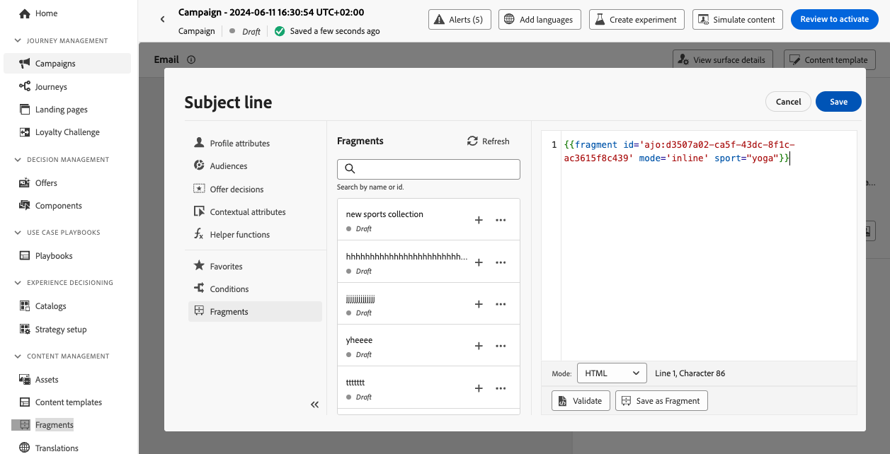
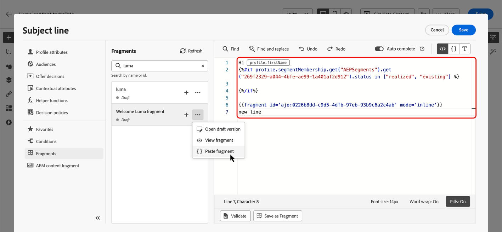

# 利用運算式片段 {#use-expression-fragments}

使用&#x200B;**個人化編輯器**&#x200B;時，您可以利用所有已建立或已儲存至目前沙箱的運算式片段。

片段是可重複使用的元件，可跨[!DNL Journey Optimizer]個行銷活動和歷程參照。 此功能允許預先建置多個自訂內容區塊，可供行銷使用者在改良的設計流程中快速組合內容。 [瞭解如何建立和管理片段](../content-management/fragments.md)。

➡️ [在此影片中瞭解如何管理、編寫和使用片段](../content-management/fragments.md#video-fragments)

## 使用運算式片段 {#use-expression-fragment}

若要將運算式片段新增至您的內容，請遵循下列步驟。

>[!NOTE]
>
>您最多可以在給定傳送中新增30個片段。 片段最多只能巢狀1個層級。

1. 開啟[個人化編輯器](personalization-build-expressions.md)並在左窗格上選取&#x200B;**[!UICONTROL 片段]**&#x200B;按鈕。

   清單會顯示目前沙箱上已建立或儲存為片段的所有運算式片段。 它們會依建立日期排序：最近新增的運算式片段會先顯示在清單中。 [了解更多](../content-management/fragments.md#create-expression-fragment)

   

   您也可以重新整理此清單。

   >[!NOTE]
   >
   >如果您在編輯內容時修改或新增了某些片段，清單會以最新變更更新。

1. 按一下運算式片段旁的+圖示，將對應的片段ID插入編輯器中。

   

   >[!CAUTION]
   >
   >您可以將任何&#x200B;**草稿**&#x200B;或&#x200B;**即時**&#x200B;片段新增至您的內容。 但是，如果歷程或行銷活動中使用了具有&#x200B;**草稿**&#x200B;狀態的片段，則您將無法啟用該歷程或行銷活動。 在歷程或行銷活動發佈中，草稿片段將顯示錯誤，您需要核准它們才能發佈。

1. 在新增片段ID後，如果您開啟對應的運算式片段並從介面[編輯它](../content-management/fragments.md#edit-fragments)，變更便會同步。 它們會自動傳播到包含該片段ID的所有草稿或即時歷程/行銷活動。

1. 按一下片段旁的&#x200B;**[!UICONTROL 更多動作]**&#x200B;按鈕。 從開啟的關聯功能表中，選取&#x200B;**[!UICONTROL 檢視片段]**&#x200B;以取得有關該片段的詳細資訊。 也會顯示&#x200B;**[!UICONTROL 片段ID]**，可從此處複製。

   

1. 您可以在另一個視窗中開啟運算式片段，以編輯其內容和屬性 — 使用內容功能表中的&#x200B;**[!UICONTROL 開啟片段]**&#x200B;選項或從&#x200B;**[!UICONTROL 片段資訊]**&#x200B;窗格。 [瞭解如何編輯片段](../content-management/fragments.md#edit-fragments)

   

1. 然後您就可以照常使用[個人化編輯器](personalization-build-expressions.md)的所有個人化和編寫功能，自訂及驗證您的內容。

>[!NOTE]
>
>如果您建立包含多個分行符號的運算式片段，並將其用於[簡訊](../sms/create-sms.md#sms-content)或[推播](../push/design-push.md)內容，則會保留分行符號。 因此，在傳送您的[簡訊](../sms/send-sms.md)或[推播](../push/send-push.md)訊息之前，請務必先測試該訊息。

## 使用隱含變數 {#implicit-variables}

隱含變數可增強現有片段功能，以提升內容重複使用性及指令碼使用案例的效率。 片段可以使用輸入變數並建立可用於行銷活動和歷程內容的輸出變數。

例如，此功能可用於根據目前的行銷活動或歷程，初始化電子郵件的追蹤引數，並將這些引數用於新增至電子郵件內容的個人化連結。

可以使用的使用案例如下：

1. 在片段中使用輸入變數

   當片段用於行銷活動/歷程動作內容時，它有能力運用在片段外部宣告的變數。 範例如下：

   

   我們可以看見以上在行銷活動內容中宣告`utm_content`變數。 使用片段&#x200B;**Hero區塊**&#x200B;時，將顯示要附加`utm_content`引數值的連結。 最終結果為： `https://luma.enablementadobe.com?utm_campaign= Product_launch&utm_content= start_shopping`。

1. 使用片段的輸出變數

   在片段中計算或定義的變數可用於您的內容。 在以下範例中，片段&#x200B;**F1**&#x200B;宣告了一組變數：

   

   在電子郵件內容中，我們可以提供下列個人化內容：

   

   片段F1初始化下列變數： `utm_campaign`和`utm_content`。 然後，訊息內容中的連結會附加這些引數。 最終結果為： `https://luma.enablementadobe.com?utm_campaign= Product_launch&utm_content= start_shopping`。

>[!NOTE]
>
>在執行階段，系統會展開片段內的內容，然後從上到下解譯個人化程式碼。 請記住，完成更複雜的使用案例。 例如，您可以有片段F1將變數傳遞至下方的另一個片段F2。 您也可以讓視覺化片段F1將變數傳遞至巢狀運算式片段F2。

## 自訂可編輯欄位 {#customize-fields}

如果運算式片段的某些部分已使用變數設為可編輯，您可以使用特定語法覆寫其預設值。 [瞭解如何使您的片段可自訂](../content-management/customizable-fragments.md)

若要自訂欄位，請執行下列步驟：

1. 從&#x200B;**片段**&#x200B;功能表將片段插入您的程式碼中。

1. 在語法結尾使用`<fieldId>="<value>"`程式碼以覆寫變數的預設值。

   在以下範例中，我們以「yoga」值覆寫ID為「sports」之變數的值。 只要引用「sport」變數，片段內容中就會顯示「瑜伽」。

   

[本節](../content-management/customizable-fragments.md#example)提供範例，說明如何在建立電子郵件時，將可編輯欄位新增至運算式片段並覆寫其值。

## 中斷繼承 {#break-inheritance}

將片段ID新增至個人化編輯器時，會同步對原始運算式片段所做的變更。

不過，您也可以將運算式片段的內容貼到編輯器中。 從內容功能表中，選取&#x200B;**[!UICONTROL 貼上片段]**&#x200B;以插入該內容。

在這種情況下，來自原始片段的繼承會中斷。 片段內容會複製到編輯器中，且變更不再同步。

它會變成不再連結至原始片段的獨立元素；您可以像在程式碼中的任何其他元素一樣加以編輯。

