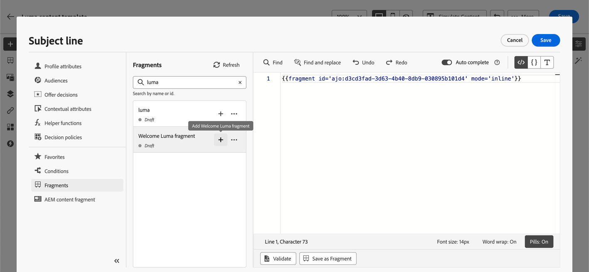
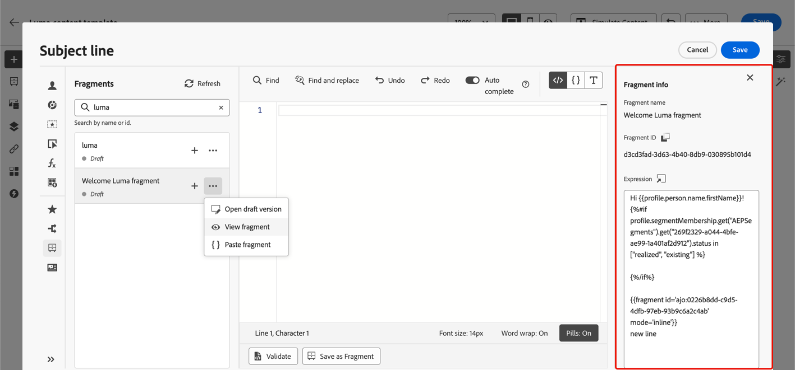
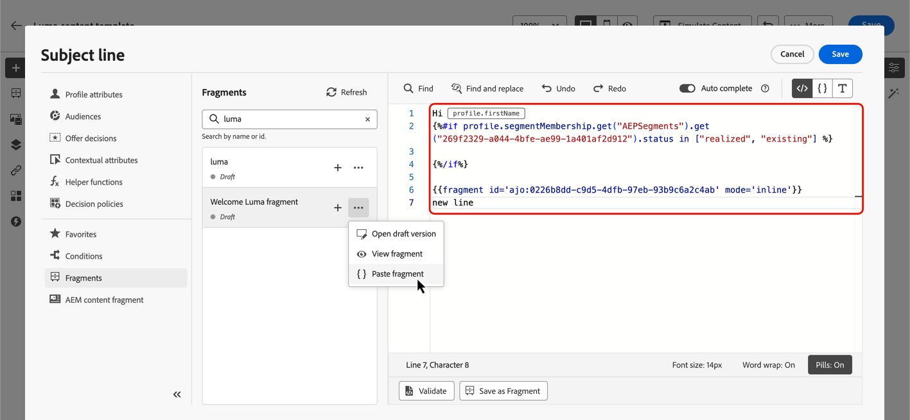

# 利用運算式片段 {#use-expression-fragments}

>[!BEGINSHADEBOX]

**在此頁面上：**&#x200B;瞭解如何在個人化編輯器中插入及重複使用運算式片段、使用隱含變數、在回圈中使用片段、自訂可編輯欄位，以及中斷Adobe Journey Optimizer中的繼承。

>[!ENDSHADEBOX]

使用&#x200B;**個人化編輯器**&#x200B;時，您可以利用所有已建立或已儲存至目前沙箱的運算式片段。

片段是可重複使用的元件，可跨[!DNL Journey Optimizer]個行銷活動和歷程參照。 此功能允許預先建置多個自訂內容區塊，可供行銷使用者在改良的設計流程中快速組合內容。 [進一步瞭解片段](../content-management/fragments.md)

➡️ [在此影片中瞭解如何管理、編寫和使用片段](../content-management/fragments.md#video-fragments)

## 使用運算式片段 {#use-expression-fragment}

若要將運算式片段新增至您的內容，請遵循下列步驟。

>[!NOTE]
>
>您最多可以在給定傳送中新增30個片段。 片段最多只能巢狀1個層級。

1. 開啟[個人化編輯器](personalization-build-expressions.md)並在左窗格上選取&#x200B;**[!UICONTROL 片段]**&#x200B;按鈕。

   清單會顯示目前沙箱上已建立或儲存為片段的所有運算式片段。 [瞭解如何建立片段](../content-management/create-fragments.md)
它們會依建立日期排序：最近新增的運算式片段會先顯示在清單中。

   

   您也可以重新整理此清單。

   >[!NOTE]
   >
   >如果您在編輯內容時修改或新增了某些片段，清單會以最新變更更新。

1. 按一下運算式片段旁的+圖示，將對應的片段ID插入編輯器中。

   

   >[!CAUTION]
   >
   >您可以將任何&#x200B;**草稿**&#x200B;或&#x200B;**即時**&#x200B;片段新增至您的內容。 但是，如果歷程或行銷活動中使用了具有&#x200B;**草稿**&#x200B;狀態的片段，則您將無法啟用該歷程或行銷活動。 在歷程或行銷活動發佈中，草稿片段將顯示錯誤，您需要核准它們才能發佈。

1. 在新增片段ID後，如果您開啟對應的運算式片段並從介面[編輯它](../content-management/manage-fragments.md#edit-fragments)，變更便會同步。 它們會自動傳播到包含該片段ID的所有草稿或即時歷程/行銷活動。

1. 按一下片段旁的&#x200B;**[!UICONTROL 更多動作]**&#x200B;按鈕。 從開啟的關聯功能表中，選取&#x200B;**[!UICONTROL 檢視片段]**&#x200B;以取得有關該片段的詳細資訊。 也會顯示&#x200B;**[!UICONTROL 片段ID]**，可從此處複製。

   

1. 您可以在另一個視窗中開啟運算式片段，以編輯其內容和屬性 — 使用內容功能表中的&#x200B;**[!UICONTROL 開啟片段]**&#x200B;選項或從&#x200B;**[!UICONTROL 片段資訊]**&#x200B;窗格。 [瞭解如何編輯片段](../content-management/manage-fragments.md#edit-fragments)

   

1. 然後您就可以照常使用[個人化編輯器](personalization-build-expressions.md)的所有個人化和編寫功能，自訂及驗證您的內容。

1. 某些情況下，您只需要計算變數，因此您可能想要隱藏運算式片段的內容。 若要這麼做，請使用`render`屬性並將其設定為`false`。 例如:

   ```
   Hi {{profile.person.name.firstName|fragment id='ajo:fragmentId/variantId' mode ='inline' render=false}}
   ```

>[!NOTE]
>
>如果您建立包含多個分行符號的運算式片段，並將其用於[簡訊](../mobile/create-mobile-message.md#sms-content)或[推播](../push/design-push.md)內容，則會保留分行符號。 因此，在傳送您的[簡訊](../mobile/send-mobile-message.md)或[推播](../push/send-push.md)訊息之前，請務必先測試該訊息。

## 使用隱含變數 {#implicit-variables}

隱含變數可增強現有片段功能，以提升內容重複使用性及指令碼使用案例的效率。 片段可以使用輸入變數並建立可用於行銷活動和歷程內容的輸出變數。

例如，此功能可用於根據目前的行銷活動或歷程，初始化電子郵件的追蹤引數，並將這些引數用於新增至電子郵件內容的個人化連結。

可以使用的使用案例如下：

1. **在片段中使用輸入變數。**

   當片段用於行銷活動/歷程動作內容時，它有能力運用在片段外部宣告的變數。 範例如下：

   

   我們可以看見以上在行銷活動內容中宣告`utm_content`變數。 使用片段&#x200B;**Hero區塊**&#x200B;時，將顯示要附加`utm_content`引數值的連結。 最終結果為： `https://luma.enablementadobe.com?utm_campaign= Product_launch&utm_content= start_shopping`。

1. **使用來自片段的輸出變數。**

   在片段中計算或定義的變數可用於您的內容。 在以下範例中，片段&#x200B;**F1**&#x200B;宣告了一組變數：

   

   在電子郵件內容中，您可以進行下列個人化：

   

   片段F1初始化下列變數： `utm_campaign`和`utm_content`。 然後，訊息內容中的連結會附加這些引數。 最終結果為： `https://luma.enablementadobe.com?utm_campaign= Product_launch&utm_content= start_shopping`。

>[!NOTE]
>
>在執行階段，系統會展開片段內的內容，然後從上到下解譯個人化程式碼。 請記住，完成更複雜的使用案例。 例如，您可以有片段F1將變數傳遞至下方的另一個片段F2。 您也可以讓視覺化片段F1將變數傳遞至巢狀運算式片段F2。

## 在回圈中使用運算式片段 {#fragments-in-loops}

在`{{#each}}`回圈中使用運算式片段時，請務必瞭解變數範圍的運作方式。 運算式片段可以存取訊息內容中定義的全域變數，但是這些片段無法接收回圈特定的變數做為引數。

### 支援的模式：使用全域變數 {#global-variables-in-loops}

運算式片段可參考在片段外部定義的全域變數，即使從回圈內呼叫片段亦然。 當您需要使用反複內容中的片段時，這是建議的方法。

**範例：在回圈內使用具有全域變數的片段**

在您的訊息內容中，定義全域變數並使用參考它的片段：

```handlebars


{{#each context.journey.actions.GetProducts.items as |product|}}
  <div class="product">
    <h3>{{product.name}}</h3>
    <p>Price: ${{product.price}}</p>
    {{fragment id='ajo:fragment123/variant456' mode='inline'}}
  </div>
{{/each}}
```

在運算式片段(fragment123)中，您可以參考`globalDiscount`變數：

```handlebars
<p class="discount-info">Save {{globalDiscount}}% on all items!</p>
```

此模式之所以能運作，是因為無論回圈內容為何，整個訊息（包括片段內）皆可存取全域變數。

### 不支援：傳遞回圈變數做為片段引數 {#loop-variables-limitations}

您無法將目前反複專案（例如上述範例中的`product`）以引數形式傳遞至運算式片段。 片段無法從周圍的`{{#each}}`區塊直接存取回圈範圍的變數。

**範例：什麼不運作**

```handlebars
{{#each context.journey.actions.GetProducts.items as |product|}}
  <!-- This will NOT work as expected -->
  {{fragment id='ajo:fragment123/variant456' mode='inline' currentProduct=product}}
{{/each}}
```

片段無法接收`product`做為引數，並在內部使用，因為目前的實作不支援為回圈特定變數傳遞引數。

### 建議的因應措施 {#fragments-in-loops-workarounds}

當您需要將運算式片段用於回圈中的資料時，請考慮以下方法：

1. **直接在訊息中包含邏輯**：不要將片段用於回圈特定的邏輯，而是直接在您的`{{#each}}`區塊中新增個人化程式碼。

   ```handlebars
   {{#each context.journey.actions.GetProducts.items as |product|}}
     <div class="product">
       <h3>{{product.name}}</h3>
       <p>Price: ${{product.price}}</p>
       {{#if product.price > 100}}
         <span class="premium-badge">Premium Product</span>
       {{/if}}
     </div>
   {{/each}}
   ```

2. **使用回圈以外的片段**：如果片段內容不是回圈相依的，請在反複專案區塊之前或之後呼叫片段。

   ```handlebars
   {{fragment id='ajo:fragment123/variant456' mode='inline'}}
   
   {{#each context.journey.actions.GetProducts.items as |product|}}
     <div class="product">
       <h3>{{product.name}}</h3>
       <p>Price: ${{product.price}}</p>
     </div>
   {{/each}}
   ```

3. **設定多個全域變數**：如果您需要跨反複專案傳遞不同的值給片段，請在每個片段呼叫之前設定全域變數（不過這會限制彈性）。

>[!NOTE]
>
>若要反複運算關聯式資料和使用回圈，請參閱[反複運算關聯式資料](iterate-contextual-data.md)的完整指南，其中包括最佳實務、疑難排解提示和進階模式。

## 自訂可編輯欄位 {#customize-fields}

如果運算式片段的某些部分已使用變數設為可編輯，您可以使用特定語法覆寫其預設值。 [瞭解如何使您的片段可自訂](../content-management/customizable-fragments.md)

若要自訂欄位，請執行下列步驟：

1. 從&#x200B;**[!UICONTROL 片段]**&#x200B;功能表將片段插入您的程式碼中。

1. 在語法結尾使用`<fieldId>="<value>"`程式碼以覆寫變數的預設值。

   在以下範例中，我們以「yoga」值覆寫ID為「sports」之變數的值。 只要引用「sport」變數，片段內容中就會顯示「瑜伽」。

   

[本節](../content-management/customizable-fragments.md#example)提供範例，說明如何在建立電子郵件時，將可編輯欄位新增至運算式片段並覆寫其值。

## 使用動態片段解析 {#dynamic-resolution}

您可以在執行階段為每個收件者動態解析片段ID，而不是在設計時靜態嵌入片段ID。 這可讓不同的設定檔根據設定檔屬性、資料集查詢或內容資料，在相同行銷活動或歷程中接收完全不同的內容區塊。

[瞭解如何使用動態片段](../content-management/dynamic-fragments.md)

## 中斷繼承 {#break-inheritance}

將片段ID新增至個人化編輯器時，會同步對原始運算式片段所做的變更。

不過，您也可以將運算式片段的內容貼到編輯器中。 從內容功能表中，選取&#x200B;**[!UICONTROL 貼上片段]**&#x200B;以插入該內容。



在這種情況下，來自原始片段的繼承會中斷。 片段內容會複製到編輯器中，且變更不再同步。

它會變成不再連結至原始片段的獨立元素；您可以像在程式碼中的任何其他元素一樣加以編輯。

## 快速參考 {#quick-reference}

本節包含結構化知識，用於支援與本主題相關的解譯、擷取和問答。

如需完整瞭解，此資訊應結合本頁的檔案。 兩者皆非獨立來源；頁面說明功能，本節提供額外內容，以協助去除術語、意圖、適用性和限制條件的歧義。

>[!BEGINTABS]

>[!TAB 概觀]

**TL；DR**

此頁面說明如何在個人化編輯器中插入、自訂及管理運算式片段，包括隱含變數、使用回圈內的片段、可編輯的欄位、動態解析度，以及中斷繼承。

**個意圖**

* 從片段功能表插入運算式片段，並瞭解自動變更傳播
* 使用隱含變數：輸入變數（在片段外宣告，在內使用）和輸出變數（在片段內宣告，在周圍的訊息內容中使用）
* 在回圈中使用運算式片段 — 利用全域變數來存取片段；瞭解將回圈範圍內的變數作為引數傳遞的限制
* 使用`<fieldId>="<value>"`語法覆寫可自訂片段中的可編輯欄位
* 在執行階段根據設定檔屬性、資料集查詢或內容資料動態解析片段ID
* 將片段內容直接貼到編輯器中，以中斷繼承

>[!TAB 字彙]

* **運算式片段**：在行銷活動和歷程中由ID參考的可重複使用個人化運算式元件；對片段的變更會自動傳播到所有參考它的內容。 *（產品特定）*
* **隱含變數**：擴充片段功能的變數 — 輸入變數（在行銷活動/歷程內容中宣告，在片段內使用）和輸出變數（在片段內宣告，可在周圍的訊息內容中使用）。 *（產品特定）*
* **輸入變數**：在片段外部（在行銷活動或歷程內容中）宣告的變數，片段可以參考並在內部使用。
* **輸出變數**：在呼叫片段後，可在周圍訊息內容中使用的片段內宣告或計算的變數。
* **可編輯的欄位**：片段變數公開以允許插入使用者使用`<fieldId>="<value>"`語法覆寫預設值，而不需編輯片段來源。 *（產品特定）*
* **動態片段解析**：可在執行階段解析片段ID （根據設定檔屬性、資料集查詢或內容資料），而不是在設計階段內嵌靜態片段ID。 *（產品特定）*
* **中斷繼承**：使用內容功能表的「貼上片段」，將片段的內容以獨立元素的形式複製到編輯器中，不再與原始片段同步。 *（產品特定）*

>[!TAB 術語]

* **正式名稱：**&#x200B;運算式片段 — 變體：片段，運算式片段
* **同義字：** &quot;fragment ID&quot; =用來參考運算式中片段的識別碼
* **請勿混淆：**&#x200B;依ID插入片段（參考；變更會自動傳播至所有內容），≠中斷繼承/貼上片段（內容已複製到編輯器；獨立元素，不再連結至原始專案）
* **請勿混淆：**&#x200B;輸入變數（在片段外部宣告，在內部使用）≠輸出變數（在片段內部宣告，在周圍訊息內容外部使用）
* **請勿混淆：**&#x200B;草稿片段（可以新增至內容，但封鎖歷程/行銷活動發佈，直到核准為止）≠即時片段（已完整發佈；對使用中的歷程和行銷活動而言是安全的）

>[!TAB 護欄與限制]

* 在指定的傳遞中最多可以新增30個片段。
* 片段最多只能巢狀1個層級。
* 如果歷程或行銷活動包含具有草稿狀態的片段，則無法啟動或發佈；草稿片段必須在發佈之前獲得核准。
* 運算式片段無法接收回圈範圍的變數（目前的`{{#each}}`反複專案）做為引數 — 這是已知的限制。 暫行解決方法是使用全域變數或內嵌邏輯。
* 如果簡訊或推播內容中使用了包含多個分行符號的片段，則會保留分行符號；在傳送之前先測試內容。

>[!TAB 常見問題集]

**問：單一傳遞中可以新增多少片段？**

最多30個片段。

**問：片段可以巢狀內嵌在其他片段中嗎？**

可以，但最多只能有1層巢狀結構。

**問：如果在歷程或行銷活動中使用草稿片段，會發生什麼情況？**

您可以新增草稿片段到內容，但在片段獲得核准且其狀態變更為即時之前，您無法啟動或發佈歷程或行銷活動。

**問：運算式片段可以接收目前的回圈專案（例如`{{#each}}`中的`product`）做為引數嗎？**

沒有。 運算式片段無法接收回圈範圍的變數做為引數。 使用在回圈之外宣告的全域變數（片段可以存取），或直接在回圈內包含個人化邏輯，而不是使用片段。

**問：中斷繼承的因素是什麼？何時應該使用？**

中斷繼承表示使用內容功能表中的「貼上片段」，將片段的內容直接複製到編輯器中。 貼上的內容變成不再與原始片段同步的獨立元素 — 當您需要自訂內容超過可編輯欄位允許的內容時，請使用此專案，因為您知道未來對原始片段的變更將不會傳播到此副本。

>[!ENDTABS]

<!-- ai-section-version: 1 | source-hash: 64745ff0 -->

