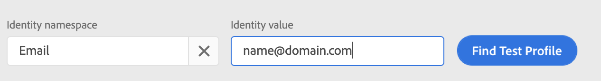
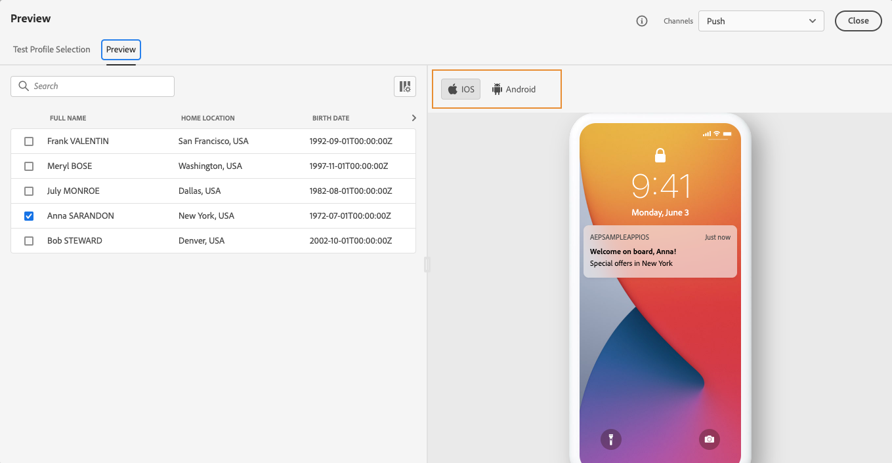

# 預覽和測試您的訊息{#preview-and-proof}

定義訊息內容後，您就可以使用測試設定檔來預覽和測試。 如果您插入[個人化內容](personalization/personalize.md)，則可以利用測試設定檔資料來檢查訊息中此內容的顯示方式。

若要偵測電子郵件內容或個人化設定中可能的錯誤，請傳送校樣至測試設定檔。 每次進行變更時都應傳送校樣，以驗證最新內容。

>[!CAUTION]
>
>您必須有可用的測試設定檔，才能預覽訊息並傳送校樣。
>
>了解如何在[此頁面](building-journeys/creating-test-profiles.md)中建立測試設定檔。

若要測試訊息內容，您必須：

* [選取測試設定檔](#select-test-profiles)
* [檢查訊息預覽](#preview-your-messages)

然後，您就能將校樣[傳送至測試設定檔。](#send-proofs)

此外，將您的&#x200B;**Litmus**&#x200B;帳戶運用至[!DNL Journey Optimizer]，即時在熱門電子郵件用戶端中預覽您的&#x200B;**電子郵件呈現**。 然後，您可以確保您的電子郵件內容看起來很棒，並且在每個收件匣中都正常運作。 了解如何在[此區段](#email-rendering)中解除鎖定Litmus電子郵件預覽

>[!CAUTION]
>
>預覽訊息或傳送校樣時，只會顯示設定檔個人化資料。 根據內容資料的個人化（例如事件資訊）只能在歷程的內容中測試。 了解如何在[此使用案例](personalization/personalization-use-case.md)中測試個人化。

➡️ [了解如何在此影片中預覽、校樣和發佈您的電子郵件](#video-preview)

## 選取測試設定檔{#select-test-profiles}

使用[測試設定檔](building-journeys/creating-test-profiles.md)來鎖定不符合已定義定位准則的其他收件者。

若要選取測試設定檔，請遵循下列步驟：

1. 在訊息介面或電子郵件設計工具中，按一下&#x200B;**[!UICONTROL Show preview]**&#x200B;按鈕以存取測試設定檔選取項目。

   

1. 按一下&#x200B;**[!UICONTROL Identity namespace]**&#x200B;選取圖示，選取要用來識別測試設定檔的命名空間。

   

   在此小節](get-started-identity.md){target=&quot;_blank&quot;}中，深入了解Adobe Experience Platform身分識別命名空間[。

   在以下範例中，我們將使用&#x200B;**Email**&#x200B;命名空間。

1. 使用搜索欄位查找命名空間，選擇該命名空間，然後按一下&#x200B;**[!UICONTROL Select]**

   

1. 輸入值以識別測試設定檔，然後按一下&#x200B;**[!UICONTROL Find test profile]**。

   

1. 如果您在訊息中新增個人化，請新增其他設定檔，這樣您就能根據設定檔資料測試訊息的不同變體。 新增後，設定檔會列在選取欄位下。

   

   此清單會根據訊息個人化元素，顯示相關欄中每個測試設定檔的資料。

## 預覽訊息{#preview-your-messages}

選取[測試設定檔](#select-test-profiles)後，您就可以預覽訊息並檢查內容。

1. 按一下&#x200B;**[!UICONTROL Preview]**&#x200B;標籤以測試您的訊息。

1. 選取測試設定檔。 您可以檢查欄中可用的值。 使用向右/向左箭頭來瀏覽資料。

   

1. 按一下清單上方的&#x200B;**[!UICONTROL Select data]**&#x200B;圖示以新增或移除欄。

   

   您可以在清單的結尾處看到目前訊息專屬的個人化欄位。 在此範例中，設定檔城市、名字和姓氏。 選取這些欄位，並確定這些值已填入您的測試設定檔中。

1. 在訊息預覽中，個人化元素會由選取的測試設定檔資料取代。

   例如，對於此訊息，電子郵件內容和電子郵件主旨都會個人化：

   

1. 選取其他測試設定檔，以針對訊息的每個變體預覽電子郵件呈現。

推播通知預覽：

1. 從&#x200B;**[!UICONTROL Preview]**&#x200B;螢幕左上角的&#x200B;**[!UICONTROL Channels]**&#x200B;下拉清單切換至&#x200B;**[!UICONTROL Push]**&#x200B;通道。

   

1. 套用與上述步驟相同的步驟，以選取測試設定檔，並選取要預覽內容的裝置類型：**[!UICONTROL iOS]**&#x200B;或&#x200B;**[!UICONTROL Android]**

   

1. 在推播預覽中，測試設定檔資料會運用在訊息內容中。

   例如，對於此推播通知，標題和內文都會個人化：

   

## 傳送校樣{#send-proofs}

校樣是特定訊息，可讓您在將訊息傳送給主要對象之前先測試訊息。 校樣的收件者負責核准訊息：轉譯、內容、個人化設定、設定。

選取[測試設定檔](#select-test-profiles)後，您就可以傳送校樣。

1. 在&#x200B;**[!UICONTROL Preview]**&#x200B;畫面中，按一下&#x200B;**[!UICONTROL Send proof]**&#x200B;按鈕。

   

1. 選取將接收校樣的測試設定檔，然後按一下&#x200B;**[!UICONTROL Send proof]**。 您可以視需要在校樣的主旨行新增首碼。

   

1. 返回&#x200B;**[!UICONTROL Preview]**&#x200B;畫面，按一下&#x200B;**[!UICONTROL View proofs]**&#x200B;按鈕以檢查狀態。

   

對訊息內容進行任何修改後，您必須傳送校樣。

>[!NOTE]
>
> 在傳送至測試設定檔的校樣中，鏡像頁面的連結未啟用。 它只會在最終訊息中啟動。

## 電子郵件轉譯{#email-rendering}

您可以將&#x200B;**Litmus**&#x200B;帳戶運用在[!DNL Journey Optimizer]中，即時在熱門電子郵件用戶端中預覽&#x200B;**電子郵件呈現**。

若要存取電子郵件呈現功能，您需要：

* 有Litmus賬戶
* [選取測試設定檔](#select-test-profiles)

接著，請依照下列步驟操作：

1. 在電子郵件設計工具中，按一下&#x200B;**[!UICONTROL Preview]**&#x200B;按鈕並選擇&#x200B;**[!UICONTROL Email rendering]**&#x200B;頁簽。

1. 按一下右上方區段的&#x200B;**連線您的Litmus帳戶** 。

   

1. 輸入您的憑證並登入。

   

1. 按一下&#x200B;**執行測試**&#x200B;按鈕以產生電子郵件預覽。

1. 在熱門的案頭、行動裝置和網頁型用戶端中查看您的電子郵件內容。

   

>[!CAUTION]
>
>將您的&#x200B;**Litmus**&#x200B;帳戶與[!DNL Journey Optimizer]連接時，您同意將測試報文發送到Litmus:傳送後，這些電子郵件便不再由Adobe管理。 因此，Litmus資料保留電子郵件原則會套用至這些電子郵件，包括可能包含在這些測試訊息中的個人化資料。

## 作法影片{#video-preview}

瞭解如何測試各收件匣間的電子郵件呈現、如何根據測試設定檔預覽您的個人化電子郵件、傳送校樣及發佈您的電子郵件。

>[!VIDEO](https://video.tv.adobe.com/v/334239?quality=12)
