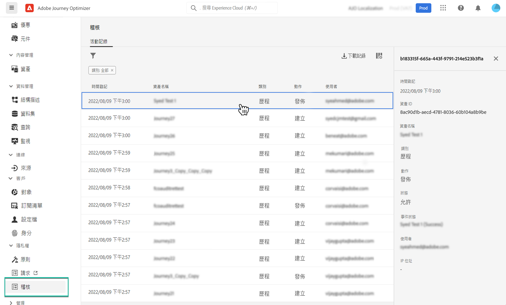

# 對 Journey Optimizer 資源的稽核動作 {#track-changes}

## 關於稽核記錄 {#audit-logs}

使用 Journey Optimizer，您可以識別系統中的使用者對各種服務和功能（如歷程、訊息、登陸頁面）執行的動作。

這使您能夠提高系統中所執行的活動的可見度，疑難排解問題，並幫助您的企業遵守法規和公司資料管理策略。

每項動作都記錄在可在 Adobe Experience Platform 中存取的「稽核記錄」中的中繼資料。 有關稽核記錄的詳細資訊，包括如何在 UI 或 API 中檢視和管理這些記錄，請參閱 [Adobe Experience Platform 文件](https://experienceleague.adobe.com/docs/experience-platform/landing/governance-privacy-security/audit-logs/overview.html?lang=zh-Hant)。

## 由稽核記錄擷取的事件類型 {#events}

下表概述了稽核記錄的 Journey Optimizer 資源行動。

>[!NOTE]
>
>可在 [Adobe Experience Platform 文件](https://experienceleague.adobe.com/docs/experience-platform/landing/governance-privacy-security/audit-logs/overview.html?lang=zh-Hant#category)找到在稽核記錄中擷取的完整操作清單。

| 資源 | 動作 |
|-----------|------------------|
| AJO行銷活動 | 建立/刪除/更新/啟動/停止 |
| AJO 管道一般設定 | 建立/刪除/更新 |
| AJO IP 池 | 建立/刪除/更新 |
| AJO 登陸頁面 | 建立/刪除/更新/發佈/取消發佈 |
| AJO 登陸頁面 HTML 範本 | 建立/刪除/更新 |
| AJO 登陸頁面預設集 | 建立/刪除/更新 |
| AJO 登陸頁面子網域 | 建立/刪除/更新 |
| AJO 訊息 | 建立/刪除/更新/發佈 |
| AJO 訊息預設集 | 建立/刪除/更新 |
| AJO PTR 記錄 | 建立/刪除/更新 |
| AJO 儲存的運算式範本 | 建立/刪除/更新 |
| AJO SMS API 認證 | 建立/刪除/更新 |
| AJO 子網域 | 建立/刪除/更新 |
| AJO 隱藏清單 | 建立/刪除/下載 CSV |
| 欄位群組 | 建立/刪除/更新 |
| 歷程 | 建立/刪除/更新/停止/發佈 |
| 歷程自訂動作 | 建立/刪除/更新 |
| 歷程資料來源 | 建立/刪除/更新 |
| 歷程事件 | 建立/刪除/更新 |
| 訊息頻率規則 | 建立/刪除/更新 |
| 排名策略 | 建立/刪除/更新 |
