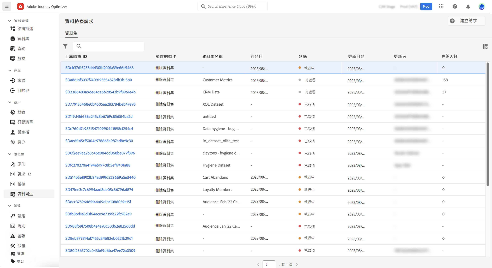

# 執行資料生命週期作業 {#data-hygiene}

>[!AVAILABILITY]
>
>資料生命週期功能目前僅適用已購買 **Healthcare Shield** 與&#x200B;**隱私權與安全性防護**&#x200B;附加產品的組織。

隨著資料不斷被擷取至 Adobe Experience Platform，請務必確保您的資料能如預期般使用、視需要更新，並根據組織原則刪除。

可以使用&#x200B;**[!UICONTROL 資料生命週期]**&#x200B;選單完成這些任務，該選單可讓您設定並排程資料生命週期作業，確保記錄得到正確維護。

## 建議 {#data-hygiene-recommendations}

當執行資料衛生操作（例如刪除身分或資料集）時，請注意，已刪除身分相關的歷史傳遞事件將不會再出現在標準報表，或是資料湖查詢中。這可能會導致回報為&#x200B;**已傳遞**&#x200B;的電子郵件數量，也許會和收件者收件匣中&#x200B;**已接收**&#x200B;電子郵件數量之間存在些許差異，尤其對較舊的歷程來說更是如此。

在執行大規模刪除之前，請先驗證並匯出任何必要的傳遞資料，或是報告資料。 如果資料檢疫後仍需要協調，請與 Adobe 支援協調，以便存取已封存記錄，或者使用訊息意見回饋事件資料集查詢，即可取得近期資料。

## 了解更多 {#data-hygiene-learn-more}

有關隱私權服務以及如何執行資料生命週期操作的詳細資訊，請參閱 Adobe Experience Platform 文件：

* [Privacy Service 概觀](https://experienceleague.adobe.com/docs/experience-platform/privacy/home.html?lang=zh-Hant)
* Adobe Experience Platform中的[資料生命週期](https://experienceleague.adobe.com/docs/experience-platform/hygiene/home.html?lang=zh-Hant)
