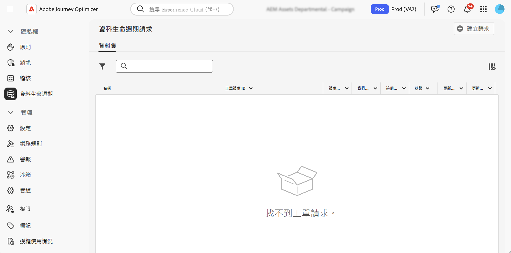

# 執行資料生命週期作業 {#data-hygiene}

>[!AVAILABILITY]
>
>資料生命週期功能目前僅適用已購買 **Healthcare Shield** 與&#x200B;**隱私權與安全性防護**&#x200B;附加產品的組織。

隨著資料不斷被擷取至 Adobe Experience Platform，請務必確保您的資料能如預期般使用、視需要更新，並根據組織原則刪除。

可以使用&#x200B;**[!UICONTROL 資料生命週期]**&#x200B;選單完成這些任務，該選單可讓您設定並排程資料生命週期作業，確保記錄得到正確維護。

## 建議 {#data-hygiene-recommendations}

執行資料衛生操作（例如刪除身分或資料集）時，請注意，與已刪除身分相關的歷史傳遞事件將不再出現在標準報表或資料摘要查詢中。 這可能會導致收件者收件匣中報告為&#x200B;**已傳遞**&#x200B;的電子郵件數目與&#x200B;**已接收**&#x200B;的電子郵件數目不一致，尤其是對於較舊的歷程。

在執行大規模刪除之前，請先驗證並匯出任何必要的傳遞或報告資料。 如果資料檢疫後需要協調，請協調Adobe支援以存取封存的記錄，或使用訊息回饋事件資料集查詢以取得最近的資料。

## 了解更多 {#data-hygiene-learn-more}

有關隱私權服務以及如何執行資料生命週期操作的詳細資訊，請參閱 Adobe Experience Platform 文件：

* [Privacy Service 概觀](https://experienceleague.adobe.com/docs/experience-platform/privacy/home.html?lang=zh-Hant)
* [Adobe Experience Platform 的資料生命週期](https://experienceleague.adobe.com/docs/experience-platform/hygiene/home.html?lang=zh-Hant)
