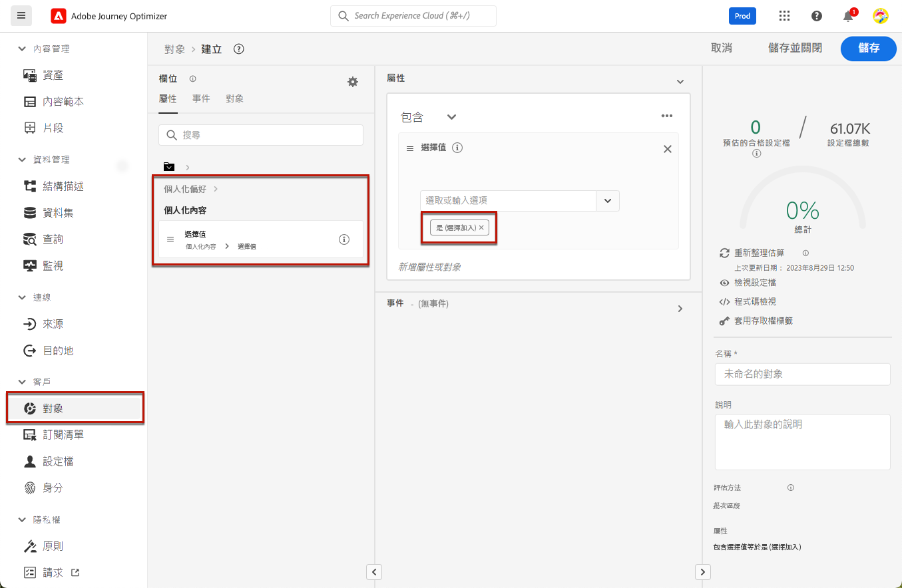
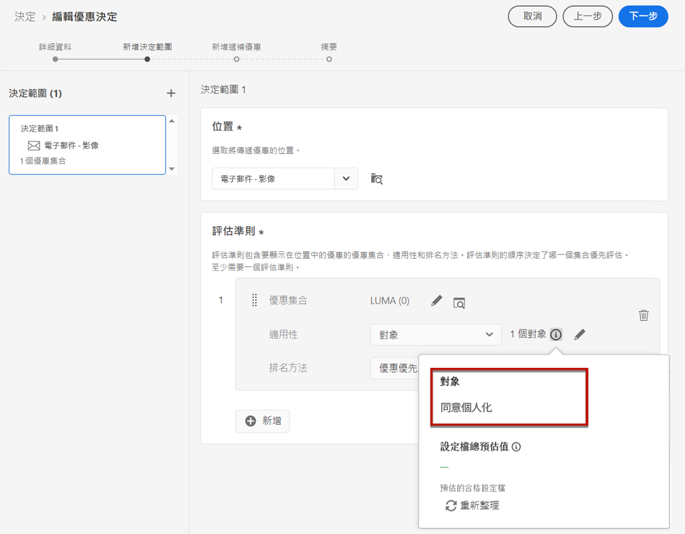
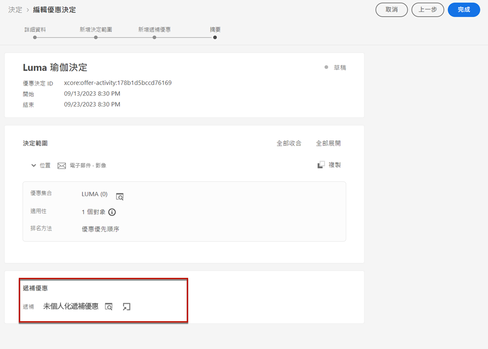
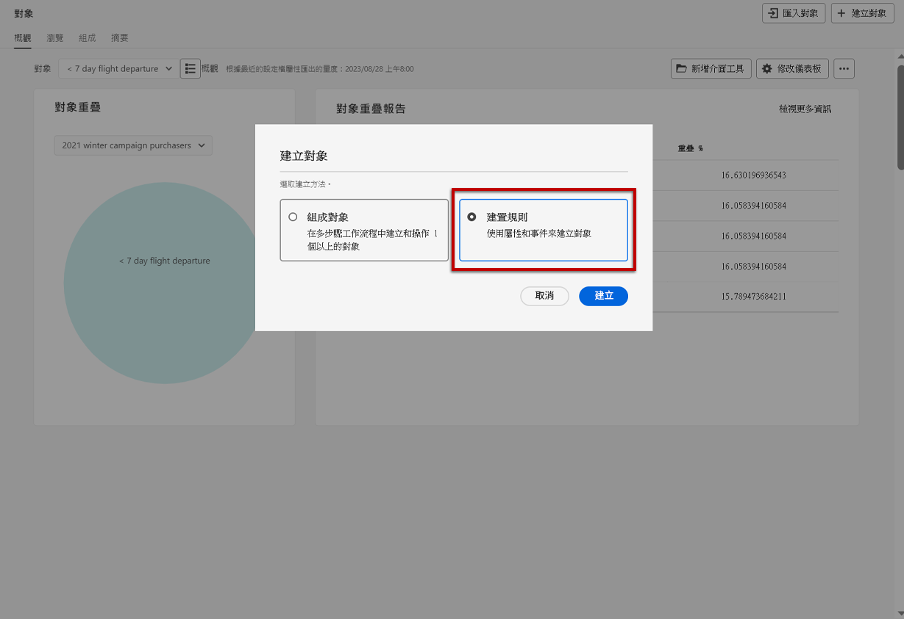
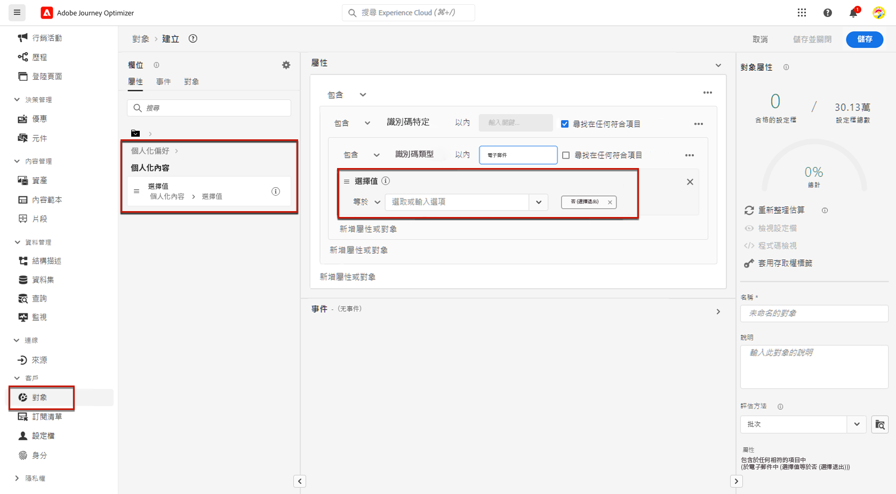
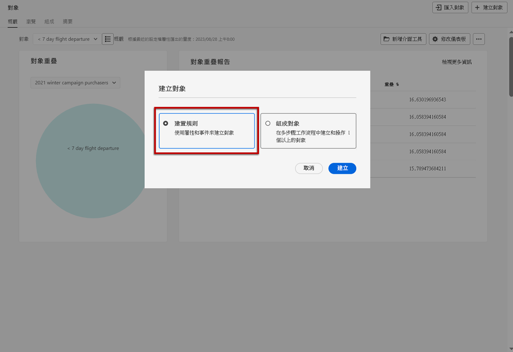
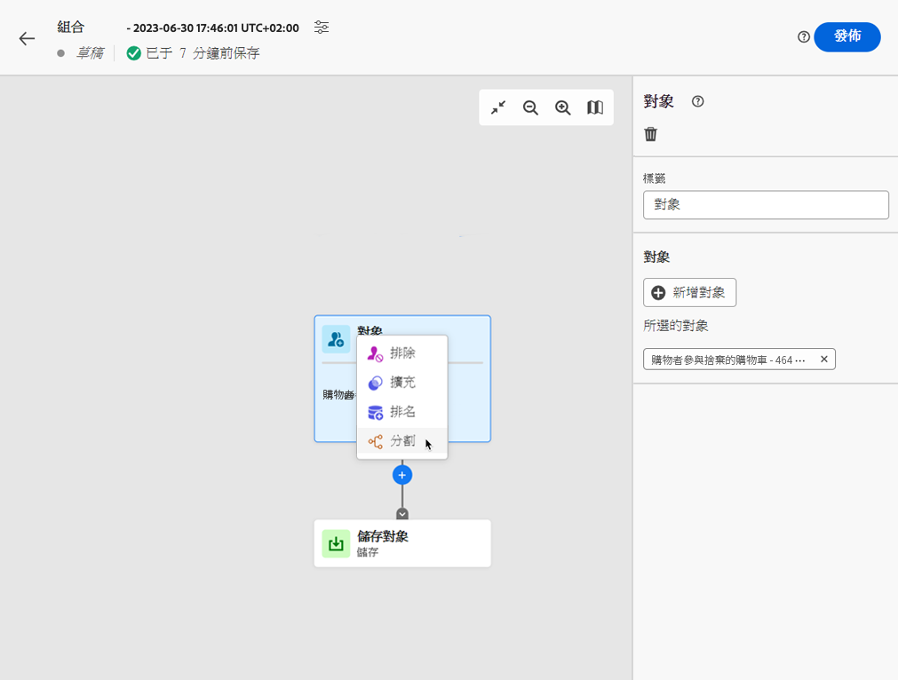
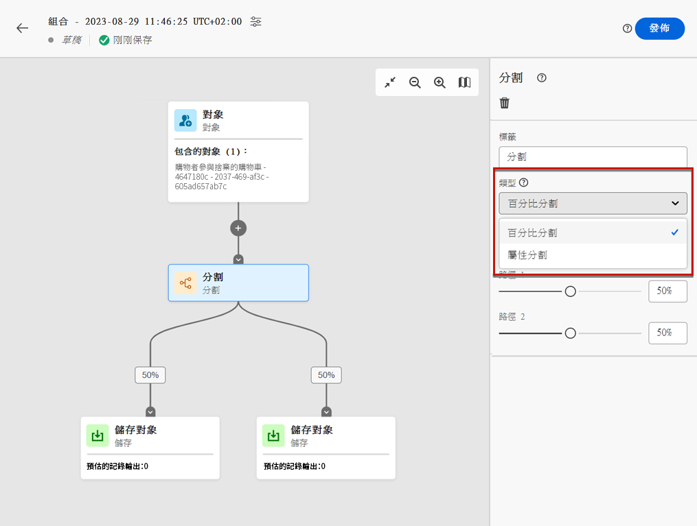
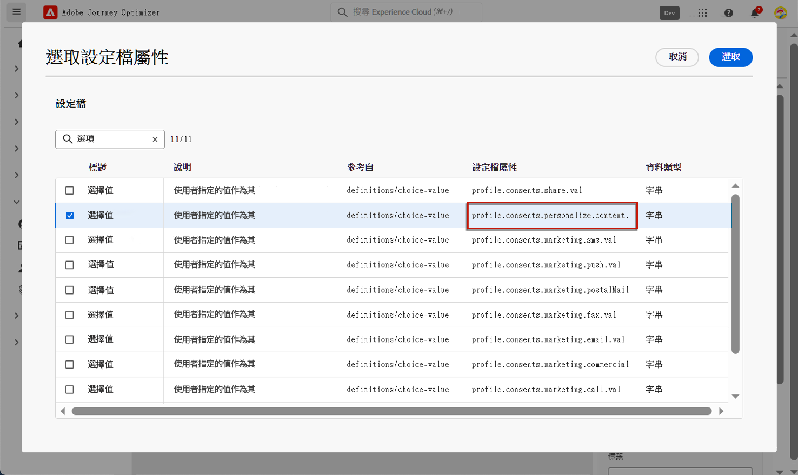
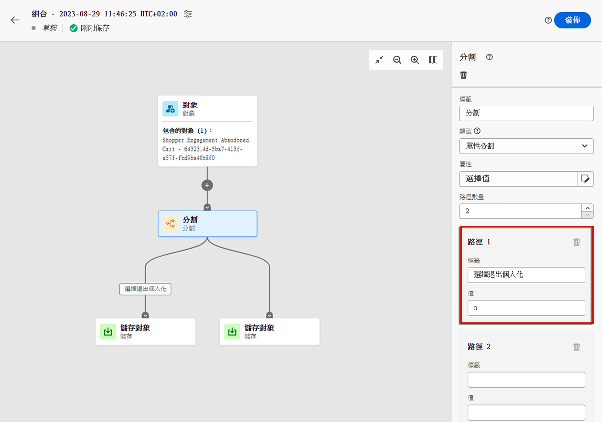

# 管理選擇退出 {#consent}

向接收者提供取消訂閱接收來自品牌通訊的功能是一項法律要求，同時確保此選擇獲得遵守。 進一步瞭解 [Experience Platform 文件](https://experienceleague.adobe.com/docs/experience-platform/privacy/regulations/overview.html?lang=zh-Hant#regulations)的適用法規。{target="_blank"}

**為什麼這很重要？**

* 若未遵守這些法規，您的品牌將面臨法律風險。
* 它可協助您避免傳送未經請求的通訊給您的收件者，這可能會使他們將您的訊息標示為垃圾訊息，並損害您的聲譽。

## 管理歷程和行銷活動中的取消訂閱 {#opt-out-ajo}

從歷程或行銷活動傳送訊息時，您必須一律確保客戶可取消訂閱未來的通訊。 取消訂閱後，個人資料將自動從未來行銷訊息的對象中移除。

**[!DNL Journey Optimizer]** 提供管理電子郵件和簡訊訊息中選擇退出的方式，而推播通知不需要由您執行任何動作，因為收件者可以透過其裝置自行取消訂閱。 例如，在下載或使用您的應用程式時，他們可以選擇停止通知。 同樣地，他們也可以透過行動裝置作業系統變更通知設定。

>[!NOTE]
>
>此外，您也可以利用 Journey Optimizer **Suppression REST API**，使用禁止名單與允許清單控制外寄郵件。 [了解如何使用 Suppression REST API](https://experienceleague.adobe.com/docs/journey-optimizer/using/configuration/monitor-reputation/manage-suppression-list.html?lang=zh-Hant)

在以下章節中了解如何管理 Journey Optimizer 電子郵件和簡訊訊息中的選擇退出：

<table style="table-layout:fixed"><tr style="border: 0;">
<td>

<a href="../email/email-opt-out.md"><strong>電子郵件選擇退出管理</strong>

</td>
<td>

<a href="../sms/sms-opt-out.md"><strong>簡訊選擇退出管理</strong></a>

</td>
</tr></table>

>[!NOTE]
>
>在 [!DNL Journey Optimizer]，同意由 Experience Platform [同意綱要](https://experienceleague.adobe.com/docs/experience-platform/xdm/field-groups/profile/consents.html?lang=zh-Hant)處理{target="_blank"}. By default, the value for the consent field is empty and treated as consent to receive your communications. You can modify this default value while onboarding to one of the possible values listed [here](https://experienceleague.adobe.com/docs/experience-platform/xdm/data-types/consents.html?lang=zh-Hant#choice-values){target="_blank"}。

## 實施個人化同意 {#opt-out-personalization}

您的客戶也可以選擇退出提供的個人化內容。 設定檔從個人化選擇退出後，您需要確保其資料不會用於個人化，且您必須使用遞補變體取代任何個人化內容。

### 在決策管理中 {#opt-out-decision-management}

運用優惠方案時，個人化偏好設定不會自動於使用來自[決策](../offers/api-reference/offer-delivery-api/decisioning-api.md) API 請求或 [邊緣決策](../offers/api-reference/offer-delivery-api/edge-decisioning-api.md) API 請求的[決定範圍](../offers/offer-activities/create-offer-activities.md#add-decision-scopes)實施。 在這種情況下，您需要手動強制執行個人化同意。 若要執行此操作，請遵循下列步驟。

>[!NOTE]
>
>[!DNL Journey Optimizer]發起管道中使用的決定範圍符合其所屬歷程或行銷活動的這項要求。

1. 建立 [Adobe Experience Platform 對象](../audience/access-audiences.md)，使用[細分服務](https://experienceleague.adobe.com/docs/experience-platform/segmentation/ui/overview.html?lang=zh-Hant){target="_blank"}並使用設定檔屬性，例如&#x200B;**[!UICONTROL 個人化內容 = 是 (選擇加入)]**，以同意個人化的使用者為目標。

   

1. 建立[決定](../offers/offer-activities/create-offer-activities.md)時，新增決定範圍，並根據此對象為包含個人化優惠的每個評估條件集合定義適用性限制。

   

1. 建立不包括個人化內容的[遞補優惠](../offers/offer-library/creating-fallback-offers.md)。

1. 將非個人化遞補優惠[指派](../offers/offer-activities/create-offer-activities.md#add-fallback)至決定。

   

1. [檢閱並儲存](../offers/offer-activities/create-offer-activities.md#review)決定。

如果使用者：

* 同意個人化，決定範圍將決定該設定檔的最佳優惠。

* 未同意個人化，對應的設定檔將不符合評估條件中的任何優惠方案資格，因此將收到非個人化的遞補優惠方案。

>[!NOTE]
>
>尚未支援 [!DNL Journey Optimizer] 中將設定檔資料用於[資料模式](../offers/ranking/ai-models.md)的同意。

### 在運算式編輯器中 {#opt-out-expression-editor}

[運算式編輯器](../personalization/personalization-build-expressions.md)本身不涉及傳送訊息，因此不會執行任何同意檢查或強制執行。 

不過，使用以權限為基礎的存取控制標籤可限制哪些欄位能用於個人化。 此[訊息預覽](../content-management/preview.md)和[電子郵件轉譯服務](../content-management/rendering.md)會遮蔽以敏感資訊識別的欄位。

>[!NOTE]
>
>在[本節](../administration/object-based-access.md)中了解更多物件層級存取控制 (OLAC)。

在 [!DNL Journey Optimizer] 行銷活動中，依照下列方式強制執行同意原則：

* 您可以在對象建立過程中加入同意原則定義，以確保為行銷活動選取的對象已&#x200B;**篩選掉不符合同意條件的設定檔**。 

* [!DNL Journey Optimizer] 將在頻道層級執行一般同意檢查，**確保設定檔已選擇**&#x200B;接收對應頻道上的行銷通訊。

  >[!NOTE]
  >
  >[!DNL Journey Optimizer] 行銷活動物件本身目前不會執行任何其他同意原則執行檢查。

若要在行銷活動中手動強制執行個人化同意，請遵循下列其中一個選項。

### 使用區段規則產生器

您可以使用區段規則產生器，建立包含選擇退出設定檔的對象。

1. 使用[細分服務](https://experienceleague.adobe.com/docs/experience-platform/segmentation/ui/overview.html?lang=zh-Hant){target="_blank"}建立 [Adobe Experience Platform 對象](../audience/access-audiences.md)。

   

1. 選取設定檔屬性，例如&#x200B;**[!UICONTROL 個人化內容 = 否 (選擇退出)]**，排除未同意個人化的使用者。

   

1. 按一下&#x200B;**[!UICONTROL 儲存]**。

您現在可以使用此對象，從行銷活動中篩選掉未同意個人化的設定檔。

### 在構成工作流程中使用分割活動

您也可以將分割活動新增至構成工作流程，以將個人化同意檢查新增至對象。

1. 使用&#x200B;**[!UICONTROL 撰寫對象]**&#x200B;選項建立對象。 [了解更多如何建立構成工作流程的相關資訊](../audience/create-compositions.md)

   

1. 使用右側的專用按鈕新增起始對象。

1. 按一下 **+** 圖示，然後選取&#x200B;**[!UICONTROL 分割]**&#x200B;活動以建立分割對象。 [了解更多分割活動的相關資訊](../audience/composition-canvas.md#split)

   

1. 在右窗格中，選取&#x200B;**[!UICONTROL 屬性分割]**&#x200B;作為分割類型。

   

1. 按一下&#x200B;**[!UICONTROL 屬性]**&#x200B;欄位旁邊的鉛筆圖示，以開啟&#x200B;**[!UICONTROL 選取設定檔屬性]**&#x200B;視窗。

1. 搜尋個人化同意屬性 (`profile.consents.personalize.content.val`) 並加以選取。

   

1. **[!UICONTROL 路徑 1]** 將會是非個人化的對象。 選擇相關標籤。

1. 從此[清單](https://experienceleague.adobe.com/docs/experience-platform/xdm/data-types/consents.html?lang=zh-Hant#choice-values){target="_blank"}中選擇適當的值。

   在此情況下，我們將使用 `n` 表示使用者不同意將其資料用於個人化。

   

1. 您可以為其他選擇值建立個別路徑。 您也可以選擇刪除其餘路徑，然後開啟&#x200B;**[!UICONTROL 其他設定檔]**&#x200B;以包含沒有 `n` 選擇值的所有其他設定檔。

1. 完成後，請對每個路徑按一下&#x200B;**[!UICONTROL 儲存對象]**，以將工作流程的結果儲存至新對象。 每個路徑都會將一個對象儲存至 Adobe Experience Platform。

1. 完成後，發佈構成工作流程。

您現在可以使用此對象，從行銷活動中篩選掉未同意個人化的設定檔。

>[!NOTE]
>
>如果您建立的對象未同意個人化，然後您在行銷活動中選取此對象，則個人化工具將仍然可用。 行銷使用者可自行了解，如果他們正與不應接收個人化的對象合作，則他們不應使用個人化工具。
