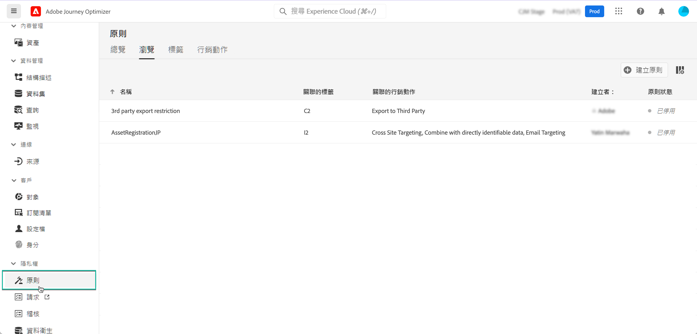

# 資料使用原則 {#Policies}

>[!CONTEXTUALHELP]
>id="ajo_olac_manage_access"
>title="Olac管理訪問"
>abstract="TBC"

藉由 Adobe Experience Platform **資料控管服務**，您可以透過使用標籤、行銷動作和原則來強制實施資料使用限制。

為此， 您可以藉由資料控管服務將資料使用標籤應用到資料集和欄位，並依據相關資料使用原則對每個欄位進行分類。

資料使用原則是描述允許或限制您對 Experience Platform 內的資料執行何種行銷動作的規則。 可從&#x200B;**[!UICONTROL 政策]**&#x200B;功能表存取。

有關資料控管框架以及如何使用標籤和原則的詳細資訊，請參閱 Adobe Experience Platform 文件：

* [資料控管服務總覽](https://experienceleague.adobe.com/docs/experience-platform/data-governance/home.html?lang=zh-Hant)
* [資料使用標籤總覽](https://experienceleague.adobe.com/docs/experience-platform/data-governance/labels/overview.html?lang=zh-Hant)
* [資料使用原則](https://experienceleague.adobe.com/docs/experience-platform/data-governance/policies/overview.html?lang=zh-Hant)
