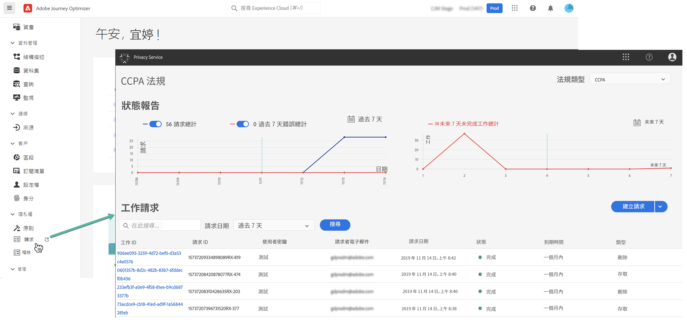
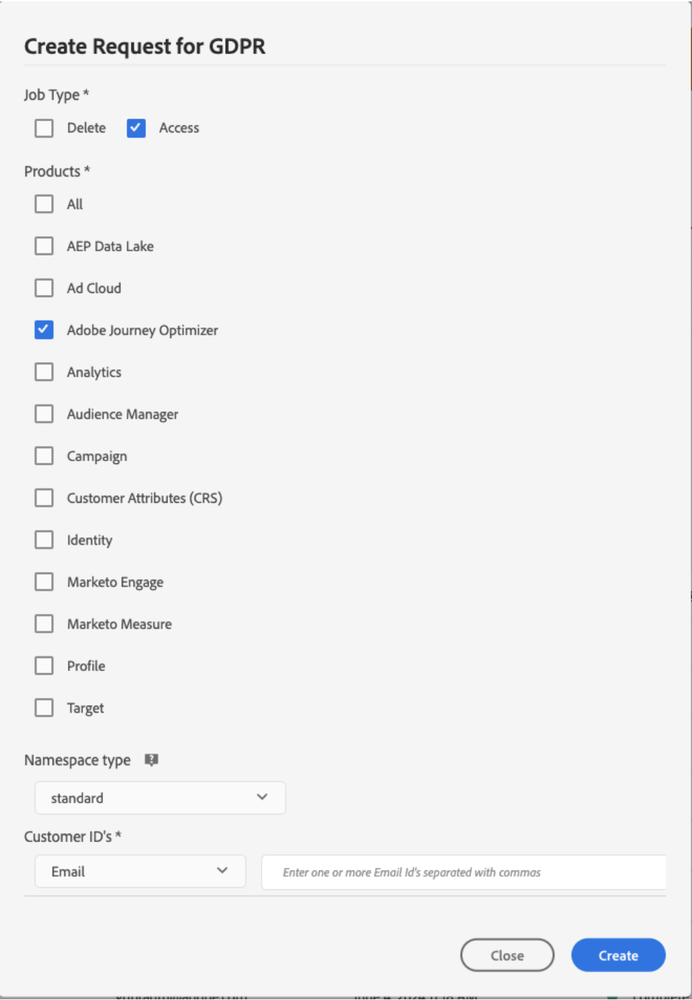
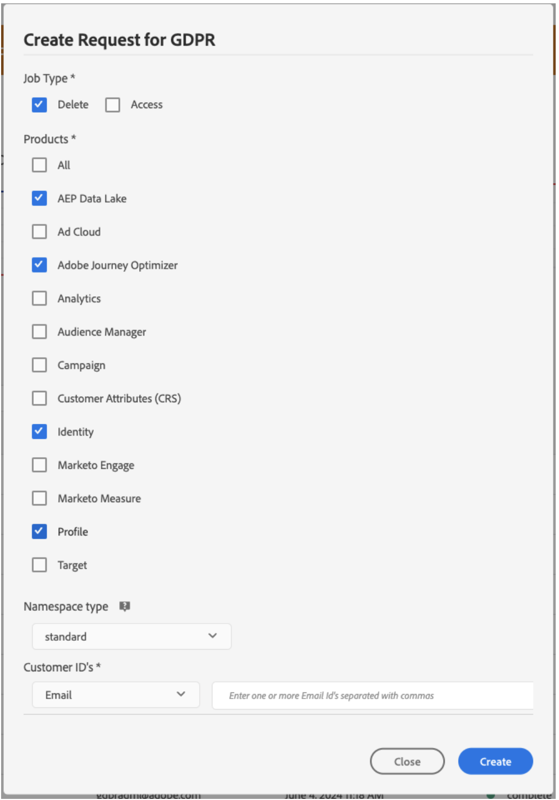

# 隱私權要求 {#track-changes}

Adobe Experience Platform **Privacy Service** 提供 RESTful API 和使用者介面，幫助您管理客戶資料請求。 藉由 Privacy Service，您可以提交存取和刪除 Adobe Experience Cloud 應用程式中的個人客戶資料請求，協助促進法律資訊和組織隱私法規的自動合規性。

可以從&#x200B;**[!UICONTROL 請求]**&#x200B;功能表建立並管理隱私權請求 。



如需Privacy Service以及如何建立和管理隱私權請求的詳細資訊，請參閱[Adobe Experience Platform檔案](https://experienceleague.adobe.com/docs/experience-platform/privacy/home.html?lang=zh-Hant){target="_blank"}。

<!--* [Privacy Service overview](https://experienceleague.adobe.com/docs/experience-platform/privacy/home.html)
* [Managing privacy jobs in the Privacy Service UI](https://experienceleague.adobe.com/docs/experience-platform/privacy/ui/user-guide.html)-->

## 管理您可傳送至 Adobe Journey Optimizer 的個別資料隱私請求 {#data-privacy-requests}

您可以透過兩種方式，提交個別請求以存取和刪除 Adobe Journey Optimizer 中消費者資料：

* 透過 **Privacy Service UI**。[了解更多](https://experienceleague.adobe.com/docs/experience-platform/privacy/ui/user-guide.html?lang=zh-Hant){target="_blank"}
* 透過 **Privacy Service API**。[了解更多](https://experienceleague.adobe.com/zh-hant/docs/experience-platform/privacy/api/overview){target="_blank"}
  <!--More specific information on Privacy Service API [here](https://developer.adobe.com/experience-platform-apis/references/privacy-service/#_blank).-->

Privacy Service 支援兩種類型的請求：**資料存取**&#x200B;和&#x200B;**資料刪除**。

對於&#x200B;**存取請求**，從 UI 指定「**Adobe Journey Optimizer**」(或「**CJM**」作為 API 的產品程式碼)。

對於&#x200B;**刪除請求**，除「**Adobe Journey Optimizer**」請求外，您還必須向&#x200B;**三個上游服務**&#x200B;提交刪除請求，以防止 Journey Optimizer 重新插入已刪除的資料。 如果未指定這些上游服務，「Adobe Journey Optimizer」請求將維持在「處理」狀態，直到建立上游服務的刪除請求為止。

這三種上游服務為：

* 設定檔 (產品代碼：「profileService」)
* AEP 資料湖 (產品代碼：「AdobeCloudPlatform」)
* 身分 (產品代碼：「identity」)

>[!NOTE]
>
>本指南僅涵蓋向 [!UICONTROL Adobe Journey Optimizer] 提出隱私請求的方法。
>
>* 如果您也計劃向 Platform Data Lake 提出隱私請求，除了本教學課程以外，也請參閱此[指南](https://experienceleague.adobe.com/zh-hant/docs/experience-platform/catalog/privacy)。
>
>* 如需即時客戶設定檔，請參閱此[指南](https://experienceleague.adobe.com/zh-hant/docs/experience-platform/profile/privacy)。
>* 如需身分識別服務，請參閱此[指南](https://experienceleague.adobe.com/zh-hant/docs/experience-platform/identity/privacy)。
>
>對於刪除及存取請求，您需要呼叫這些個別系統，以確保每個系統都能處理請求。向 [!DNL Adobe Journey Optimizer] 提出隱私請求並不會移除所有這些系統的資料。

## 建立存取與刪除請求

### 先決條件

若要請求存取及刪除 Adobe Journey Optimizer 的資料，您必須：

* Adobe 組織 ID
* 您要對其採取動作之人員的身分識別碼以及對應名稱空間。如需 Adobe Journey Optimizer 與 Experience Platform 身分命名空間的詳細資訊，請參閱[身分命名空間概觀](https://experienceleague.adobe.com/zh-hant/docs/experience-platform/identity/features/namespaces)。

>[!IMPORTANT]
>
>提交隱私請求時，請務必指定「[!DNL '**Adobe Journey Optimizer**]」作為目標產品名稱，並指定與需要存取或移除的設定檔資料相關聯的&#x200B;**所有身分識別命名空間** (例如「電子郵件」、「ECID」或「熟客 ID」)。尤其是對於刪除請求，如果您未明確包含產品名稱和所有適用的命名空間，就不會從 [!DNL Adobe Journey Optimizer] 中移除資料。

### Journey Optimizer 用於 API 請求的必填欄位值

```json
"companyContexts":
    "namespace": imsOrgID
    "value": <Your Adobe Organization ID Value>

"users":
    "action": either access or delete

    "userIDs":
        "namespace": e.g. email, aaid, ecid, etc.
        "type": standard
        "value": <Data Subject's Identity Identifier>

"include":
    CJM (which is the Adobe product code for Adobe Journey Optimizer)
    profileService (product code for Profile)
    AdobeCloudPlatform (product code for AEP Data Lake)
    identity (product code for Identity)

"regulation":
    gdpr, ccpa, pdpa, lgpd_bra, or nzpa_nzl (which is the privacy regulation that applies to the request)
```


### GDPR 存取請求範例：

從 UI：

{width="60%" align="center"}

使用 API：

```json
// JSON Request
{
   "companyContexts":[
      {
         "namespace":"imsOrgID",
         "value":"745F37C35E4B776E0A49421B@AdobeOrg"
      }
   ],
   "users":[
      {
         "action":[
            "access"
         ],
         "userIDs":[
            {
               "namespace":"ecid",
               "value":"38400000-8cf0-11bd-b23e-10b96e40000d",
               "type":"standard"
            },
            {
               "namespace":"email",
               "value":"johndoe4@gmail.com",
               "type":"standard"
            }
         ]
      }
   ],
   "include":[
      "CJM"
   ],
   "regulation":"gdpr"
}
```

```json
// JSON Response
{
    "requestId": "17163122360480365RX-705",
    "totalRecords": 1,
    "jobs": [
        {
            "jobId": "e709b1f4-1796-11ef-b422-eddd0aebc40d",
            "customer": {
                "user": {
                    "key": "John Doe",
                    "action": [
                        "access"
                    ],
                    "userIDs": [
                        {
                            "namespace": "ecid",
                            "value": "38400000-8cf0-11bd-b23e-10b96e40000d",
                            "type": "standard",
                            "namespaceId": 4,
                            "isDeletedClientSide": false
                        },
                        {
                            "namespace": "email",
                            "value": "johndoe4@gmail.com",
                            "type": "standard",
                            "namespaceId": 6,
                            "isDeletedClientSide": false
                        }
                    ]
                }
            }
        }
    ]
}
```

### GDPR 刪除請求範例：

從 UI：

{width="60%" align="center"}

使用 API：

```json
// JSON Request
{
  "companyContexts": [
    {
      "namespace": "imsOrgID",
      "value": "745F37C35E4B776E0A49421B@AdobeOrg"
    }
  ],
  "users": [
    {
      "action": [
          "delete"
      ],
      "userIDs": [
        {
          "namespace": "ecid",
          "value": "38400000-8cf0-11bd-b23e-10b96e40000d",
          "type": "standard"
        },
                {
          "namespace": "email",
          "value": "johndoe4@gmail.com",
          "type": "standard"
        }
      ]
    }
  ],
  "include": [
    "CJM", "profileService", "AdobeCloudPlatform", "identity"
  ],
  "regulation": "gdpr"
}
```

```json
// JSON Response
{
    "requestId": "17163122360480365RX-705",
    "totalRecords": 1,
    "jobs": [
        {
            "jobId": "e709b1f4-1796-11ef-b422-eddd0aebc40d",
            "customer": {
                "user": {
                    "key": "John Doe",
                    "action": [
                        "delete"
                    ],
                    "userIDs": [
                        {
                            "namespace": "ecid",
                            "value": "38400000-8cf0-11bd-b23e-10b96e40000d",
                            "type": "standard",
                            "namespaceId": 4,
                            "isDeletedClientSide": false
                        },
                        {
                            "namespace": "email",
                            "value": "johndoe4@gmail.com",
                            "type": "standard",
                            "namespaceId": 6,
                            "isDeletedClientSide": false
                        }
                    ]
                }
            }
        }
    ]
}
```
