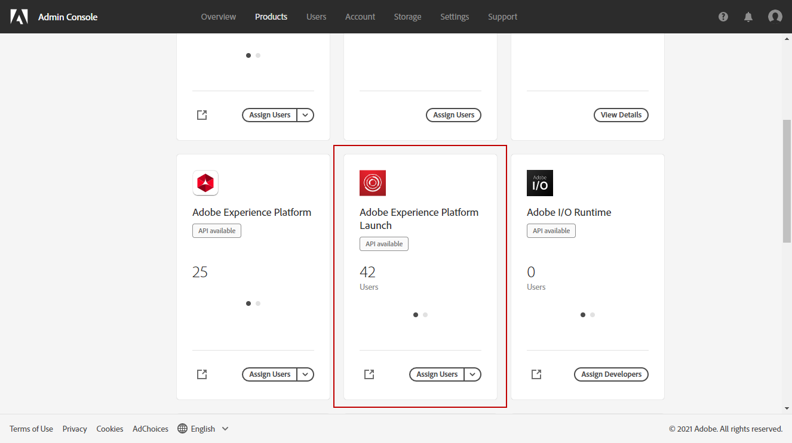
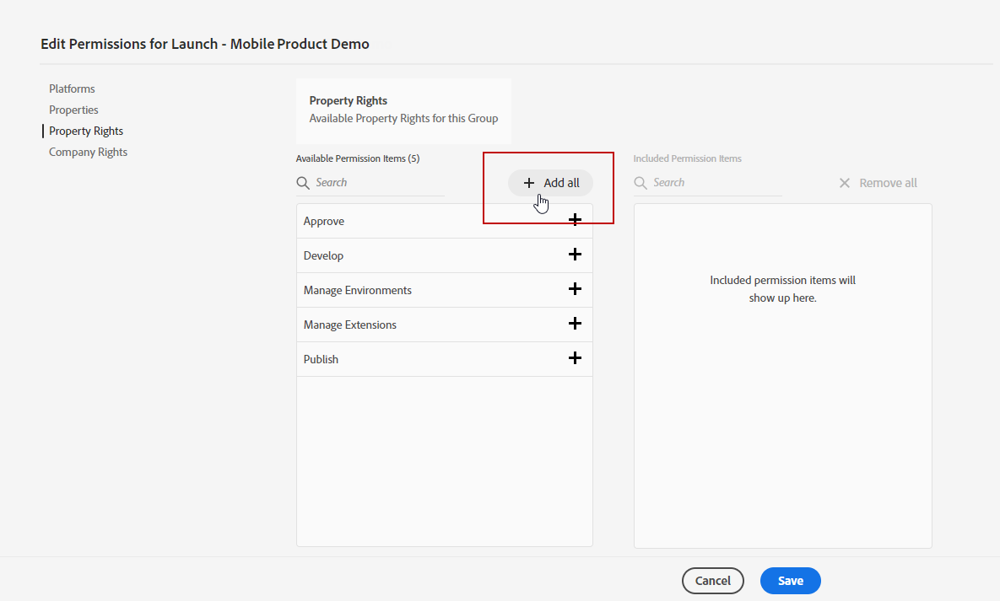
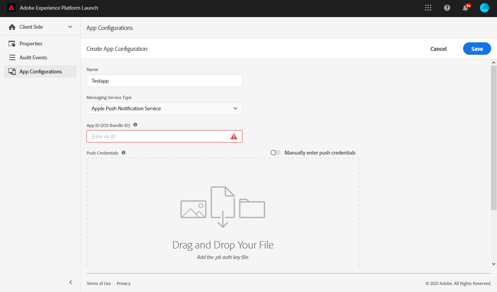
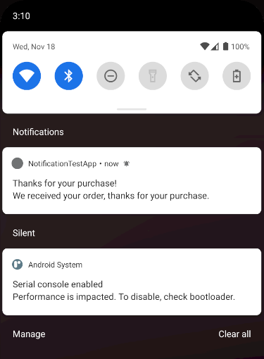

# 設定推播通知通道{#push-notification-configuration}


開始使用[!DNL Journey Optimizer]傳送推播通知前，您必須先在[!DNL Adobe Experience Platform]和[!DNL Adobe Experience Platform Launch]中定義設定。

## Adobe Experience Platform設定{#platform-settings}

若要在[!DNL Adobe Experience Platform Launch]中設定您的行動應用程式，請遵循下列步驟：

1. [指派屬性和公司權利](#push-rights)
1. [在Platform launch中新增行動應用程式的推播憑證](#push-credentials-launch)。
1. [建立Edge](#edge-configuration) 設定，供擴充功 **[!UICONTROL Edge]** 能用來從行動裝置將自訂資料傳送至 [!DNL Adobe Experience Platform]。
1. [設定Platform launch屬性](#launch-property)。
1. [發佈屬性](#publish-property)。
1. [設定ProfileDataSource](#configure-profiledatasource)。

### 步驟1:分配屬性和公司權利{#push-rights}

建立行動應用程式之前，您必須先確定您擁有或指派正確的使用者權限。

有關[!DNL Adobe Experience Platform Launch]的用戶管理的詳細資訊，請參閱[Platform launch文檔](https://experienceleague.adobe.com/docs/launch/using/admin/user-permissions.html#experience-cloud-permissions)。

要分配屬性和公司權利，請執行以下操作：

1. 訪問[!DNL Admin Console]。

1. 從&#x200B;**[!UICONTROL Products]**&#x200B;標籤中，選擇&#x200B;**[!UICONTROL Adobe Experience Platform Launch]**&#x200B;卡。

   

1. 選擇現有的&#x200B;**[!UICONTROL Product Profile]**&#x200B;或使用&#x200B;**[!UICONTROL New profile]**&#x200B;按鈕建立新的。 有關如何建立新&#x200B;**[!UICONTROL New profile]**&#x200B;的詳細資訊，請參閱[管理控制台檔案](https://experienceleague.adobe.com/docs/experience-platform/access-control/ui/create-profile.html#ui)。

1. 從&#x200B;**[!UICONTROL Permissions]**&#x200B;頁簽中，選擇&#x200B;**[!UICONTROL Property rights]**。

   

1. 按一下「**[!UICONTROL Add all]**」。這會將下列權限新增至您的產品設定檔：
   * **[!UICONTROL Approve]**
   * **[!UICONTROL Develop]**
   * **[!UICONTROL Manage Environments]**
   * **[!UICONTROL Manage Extensions]**
   * **[!UICONTROL Publish]**

   

1. 然後，在左側菜單中選擇&#x200B;**[!UICONTROL Company rights]**。

   

1. 新增下列權限：

   * **[!UICONTROL Manage App Configurations]**
   * **[!UICONTROL Manage Properties]**

   

1. 按一下「**[!UICONTROL Save]**」。

要將此&#x200B;**[!UICONTROL Product profile]**&#x200B;分配給用戶：

1. 在[!DNL Admin Console]中，從&#x200B;**[!UICONTROL Products]**&#x200B;標籤中，選擇&#x200B;**[!UICONTROL Adobe Experience Platform Launch]**&#x200B;卡。

1. 選取您先前設定的&#x200B;**[!UICONTROL Product profile]**。

1. 在 **[!UICONTROL Users]** 索引標籤中，按一下 **[!UICONTROL Add user]**。

   

1. 輸入您的使用者名稱或電子郵件地址，然後選取使用者。 然後，按一下&#x200B;**[!UICONTROL Save]**。

   >[!NOTE]
   >
   >如果先前未在Admin Console中建立該使用者，請參閱[新增使用者檔案](https://helpx.adobe.com/enterprise/admin-guide.html/enterprise/using/manage-users-individually.ug.html#add-users)。

   


您現在擁有在[!DNL Adobe Experience Platform Launch]中建立和配置行動應用程式的正確用戶權限。

### 步驟2:在Platform launch{#push-credentials-launch}中新增您的行動應用程式推送憑證

授予正確的使用者權限後，您現在需要在[!DNL Adobe Experience Platform Launch]中新增行動應用程式推送憑證。

如需新增行動應用程式推送憑證的詳細資訊和程式，請參閱[Adobe Experience Platform Mobile SDK檔案](https://aep-sdks.gitbook.io/docs/beta/adobe-journey-optimizer#configure-the-journey-optimizer-extension-in-launch)中詳述的步驟。

<!--
Note that to add push credentials in [!DNL Adobe Experience Platform Launch], the owner of the mobile app should fetch them from APNs/FCM.
1. From [!DNL Adobe Experience Platform Launch], ensure that **[!UICONTROL Client Side]** is selected in the drop-down menu.

1. Select the **[!UICONTROL App Configurations]** tab in the left-hand panel and click **[!UICONTROL App Configuration]** to create a new configuration.

1. Enter a **[!UICONTROL Name]** for the configuration.

1. From the **[!UICONTROL Messaging Service Type]** drop-down menu, select the **[!UICONTROL Messaging service type]** to be used for these credentials. Here, we selected **[!UICONTROL Apple Push Notification Service]** since we are working with iOS.

1. Enter the mobile app **[!UICONTROL Bundle Id]** in the **[!UICONTROL App ID (iOS Bundle ID)]** field if you are using Apple push notification service or in the **[!UICONTROL App ID (Android package name)]** field if you are using Firebase Cloud Messaging.

    

1. Drag and drop the .p8 key file or the .json private key file to the **[!UICONTROL Push Credentials]** field.

1. Enter the **[!UICONTROL Key Id]** and **[!UICONTROL Team Id]** if you are using Apple push notification service.

1. Click **[!UICONTROL Save]** to create your app configuration.
-->

### 步驟3:建立邊緣配置{#edge-configuration}

**[!UICONTROL Edge configuration]** 擴充功能會 **[!UICONTROL Edge]** 使用，將自訂資料從行動裝置傳送至 [!DNL Adobe Experience Platform]。要配置[!DNL Adobe Experience Platform]，必須提供&#x200B;**[!UICONTROL Sandbox]**&#x200B;名稱和&#x200B;**[!UICONTROL Event Dataset]**。

如需有關如何建立&#x200B;**[!UICONTROL Edge configuration]**&#x200B;的詳細資訊和程式，請參閱[Adobe Experience Platform Mobile SDK檔案](https://aep-sdks.gitbook.io/docs/getting-started/configure-datastreams)中詳細說明的步驟。


<!--
1. From [!DNL Adobe Experience Platform Launch], select the **[!UICONTROL Edge Configurations]** tab and click **[!UICONTROL Edge Configurations]**.
    
1. Select **[!UICONTROL New Edge Configuration]** to add a new **[!UICONTROL Edge Configuration]**.
1. Enter a **[!UICONTROL Name]** and click **[!UICONTROL Save]**

1. Click the **[!UICONTROL Adobe Experience Platform]** toggle to enable it.

1. Fill in the **[!UICONTROL Sandbox]**, **[!UICONTROL Event dataset]** and **[!UICONTROL Profile Dataset]** fields. Then, click **[!UICONTROL Save]**.
    
    
-->

### 步驟4:設定Platform launch屬性{#launch-property}

設定[!DNL Adobe Experience Platform Launch]屬性可讓行動應用程式開發人員或行銷人員設定行動SDK屬性，例如工作階段逾時、要定位的[!DNL Adobe Experience Platform]沙箱，以及要用於行動SDK傳送資料的&#x200B;**[!UICONTROL Adobe Experience Platform Datasets]**。

如需設定&#x200B;**[!UICONTROL Platform Launch property]**&#x200B;的詳細資訊和程式，請參閱[Adobe Experience Platform Mobile SDK檔案](https://aep-sdks.gitbook.io/docs/getting-started/create-a-mobile-property#create-a-mobile-property)中詳細說明的步驟。

若要取得推播通知運作所需的SDK，您需要下列SDK擴充功能，適用於Android和iOS:

* **[!UICONTROL Mobile Core]** （自動安裝）
* **[!UICONTROL Profile]** （自動安裝）
* **[!UICONTROL Adobe Experience Platform Edge]**
* **[!UICONTROL Adobe Experience Platform Assurance]**，選用，但建議除錯行動實作。

若要深入了解[!DNL Adobe Experience Platform Launch]擴充功能，請參閱[Platform launch檔案](https://experienceleague.adobe.com/docs/launch-learn/implementing-in-mobile-android-apps-with-launch/configure-launch/launch-add-extensions.html)。

<!--

1. From [!DNL Adobe Experience Platform Launch], ensure that **[!UICONTROL Client Side]** is selected in the drop-down menu.

1. select the **[!UICONTROL Properties]** tab and click **[!UICONTROL New Property]**.

    

1. Enter a **[!UICONTROL Name]** for your new property.

1. Select **[!UICONTROL Mobile]** as **[!UICONTROL Platform]**.

    

1. Click **[!UICONTROL Save]** to create your new property.

To configure **[!UICONTROL Adobe Experience Platform Edge Extension]** to send custom data from mobile devices to [!DNL Adobe Experience Platform].

1. Select your previously created property and select the **[!UICONTROL Extensions]** tab to view the extensions for this property.

    

1. Click **[!UICONTROL Configure]** under the **[!UICONTROL Adobe Experience Platform Edge]** Network' extension.

1. From the **[!UICONTROL Edge Configuration]** drop-down list, select the **[!UICONTROL Edge Configuration]** created in the previous steps. For more information on **[!UICONTROL Edge Configuration]**, refer to this [section](#edge-configuration).

1. Click **[!UICONTROL Save]**.

To configure **[!UICONTROL Adobe Experience Platform Messaging]** extension to send push profile and push interactions to the correct datasets, follow the same steps as above. Use **[!UICONTROL Sandbox]**, **[!UICONTROL Event dataset]** and **[!UICONTROL Profile Dataset]** created in the [Adobe Experience Platform setup](#edge-configuration).
-->

### 步驟5:發佈屬性{#publish-property}

您現在需要發佈屬性，以整合您的設定，並在行動應用程式中使用。

若要發佈屬性，請參閱[Adobe Experience Platform Mobile SDK檔案](https://aep-sdks.gitbook.io/docs/getting-started/create-a-mobile-property#publish-the-configuration)中詳述的步驟

### 步驟6:配置ProfileDataSource {#configure-profiledatasource}

若要設定`ProfileDataSource`，請使用[!DNL Adobe Experience Platform]設定中的`ProfileDCInletURL`，並在行動應用程式中新增下列項目：

```
    MobileCore.updateConfiguration(
    mutableMapOf("messaging.dccs" to <ProfileDCSInletURL>)
```

<!--
## Test your mobile app with custom action {#mobile-app-test}

After configuring your mobile app in both Adobe Experience Platform and Adobe Launch, you can now test it before sending push notifications to your profiles. In this use case, we will create a journey to target our mobile app and set a custom action which will trigger the push notification.

You can use a test mobile app for this use case. For more on this, refer to this [page](https://wiki.corp.adobe.com/pages/viewpage.action?spaceKey=CJM&title=Details+of+setting+the+mobile+test+app) (internal use only).

For this journey to work, you need to create an XDM schema. For more information, refer to [XDM documentation](https://experienceleague.adobe.com/docs/experience-platform/xdm/schema/composition.html?lang=en#schemas-and-data-ingestion).

1. In the left menu, click **[!UICONTROL Data]** then **[!UICONTROL Schemas]** under **[!UICONTROL Data management]** to create your XDM schema.

    

1. Click **[!UICONTROL Create schema]** then select **[!UICONTROL XDM Experience event]**.

    

1. In the right pane, enter the name of your schema and description. Enable this schema for **[!UICONTROL Profile]**.

1. In the left pane, click **[!UICONTROL Add]** under **[!UICONTROL Mixins]** and select  **[!UICONTROL Create a new Mixin]**. For more information on how to create mixin, refer to [XDM System documentation](https://experienceleague.adobe.com/docs/experience-platform/xdm/api/create-mixin.html?lang=en#api).

    

1. Enter a **[!UICONTROL Display Name]** and a **[!UICONTROL Description]**. Click **[!UICONTROL Add mixin]** when done.

    

1. In the **[!UICONTROL Field properties]** window, add a **[!UICONTROL Field name]**, **[!UICONTROL Display name]** and select **[!UICONTROL String]** as **[!UICONTROL Type]**.

    

1. Check **[!UICONTROL Required]** and click **[!UICONTROL Apply]**.

1. Click **[!UICONTROL Save]**. Your schema is now created and can be used in an **[!UICONTROL Event schema]**.

You then need to set up an **[!UICONTROL Event schema]** where you will set the custom action which you will need to enter in your mobile app to trigger your push notification.

1. From the left menu of the home page, click the **[!UICONTROL Admin]** icon, then click **[!UICONTROL Manage]** from the **[!UICONTROL Events]** card to create your new **[!UICONTROL Event schema]**.

1. Click **[!UICONTROL Add]**, the event configuration pane opens on the right side of the screen.

    

1. Enter the name of your event. You can also add a description.

1. In the **[!UICONTROL Event ID type]** field, select **[!UICONTROL Rule Based]**.

1. In the **[!UICONTROL Parameters]**, select your previously created XDM event.

    

1. Click **[!UICONTROL Edit]** in the **[!UICONTROL Event ID condition]** field.

1. Drag and your previously added mixin to define the condition that will be used by the system to identify the events that will trigger your journey.

    

1. Type in the syntax that you will need to use to trigger your push notification in your test app, in this example **order confirmation**.

    

1. Select **[!UICONTROL ECID]** as your **[!UICONTROL Namespace]**.

1. Click **[!UICONTROL Ok]** then **[!UICONTROL Save]**.

Your **[!UICONTROL Event schema]** is now created and can now be used in a journey.

1. In the left menu from [!DNL Journey Optimizer] homepage, click **[!UICONTROL Journeys]**.

1. Click **[!UICONTROL Create]** to create a new journey.

    

1. Edit the journey's properties in the configuration pane displayed on the right side. Learn more in this [section](building-journeys/journey-gs.md#change-properties).

1. Start by drag and dropping the **[!UICONTROL Event schema]** created in the previous steps from the **[!UICONTROL Events]** drop-down.

    

1. From the **[!UICONTROL Actions]** drop-down, drag and drop a **[!UICONTROL Message]** activity to your journey.

1. Select a previously created message. For more information on how to create push notifications, refer to this [page](create-message.md).

1. Drag and drop an **[!UICONTROL End]** activity to your journey.

1. Activate **[!UICONTROL Test]** to your journey to start testing your push notifications and click **[!UICONTROL Trigger an event]**.

    

1. Enter your ECID in the **[!UICONTROL Key]** field then your event that will trigger the push notification in our case **order confirmation**.

    

1. Click **[!UICONTROL Send]**.

Your event will be triggered and you will receive your push notification to your mobile app.


-->

### 步驟7:建立訊息預設集{#message-preset}

在[!DNL Adobe Experience Platform Launch]中設定您的行動應用程式後，您需要建立訊息預設集，才能從&#x200B;**[!DNL Journey Optimizer]**&#x200B;傳送推播通知。

了解如何在[此區段](configuration/message-presets.md)中建立和設定訊息預設集。