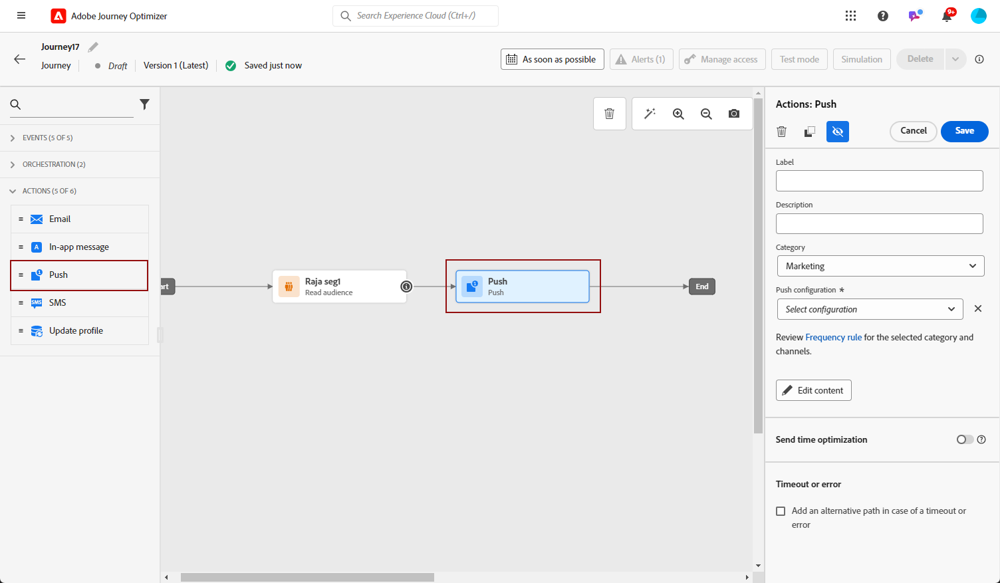
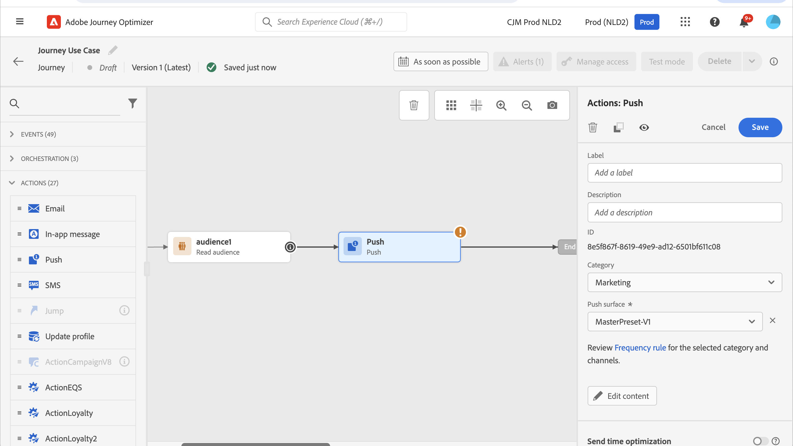
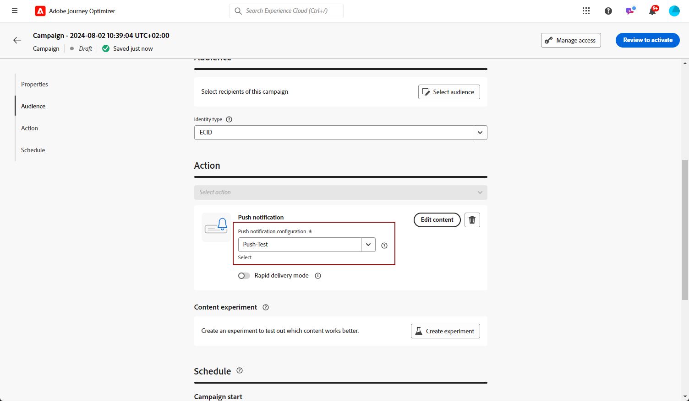
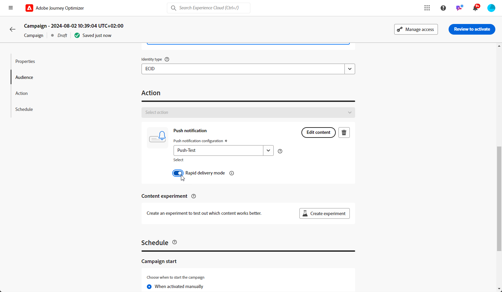

# 建立推播通知 {#create-push-notification}

>[!CONTEXTUALHELP]
>id="ajo_message_push"
>title="推播訊息建立"
>abstract="新增您的推播訊息並開始使用個人化編輯器對其進行個人化。"

您可以建立行動裝置(iOS和Android)的推播通知。 此頁面會引導您完成在歷程或行銷活動中設定推播通知的程式。

## 在歷程或行銷活動中建立推播通知 {#create}

若要建立推播通知，請遵循下列步驟：

>[!BEGINTABS]

>[!TAB 新增推播至歷程]

1. 開啟您的歷程，然後從浮動視窗的「動作」區段拖放推播活動。

   

1. 提供訊息的基本資訊（標籤、說明、類別），然後選擇要使用的訊息設定。

   

   >[!NOTE]
   >
   >如果您從歷程傳送推播通知，您可以運用Adobe Journey Optimizer的傳送時間最佳化功能，根據歷史開啟率和點按率，預測傳送訊息的最佳時機，最大化參與程度。 [瞭解如何使用傳送時間最佳化](../building-journeys/send-time-optimization.md)

   如需如何設定歷程的詳細資訊，請參閱[此頁面](../building-journeys/journey-gs.md)

1. 在歷程設定畫面中，按一下&#x200B;**[!UICONTROL 編輯內容]**&#x200B;按鈕以設定推播內容。 [設計推播通知](design-push.md)

1. 定義訊息內容後，您可以使用測試設定檔，或從CSV / JSON檔案上傳的範例輸入資料，或手動新增以預覽其內容。

1. 當您的推播就緒時，請完成[歷程](../building-journeys/journey-gs.md)的設定以傳送。

   若要透過推播開啟和/或互動來追蹤收件者的行為，請確定已在[電子郵件活動](../building-journeys/journeys-message.md)中啟用追蹤區段中的專用選項。

>[!TAB 新增推播至行銷活動]

1. 存取&#x200B;**[!UICONTROL 促銷活動]**&#x200B;功能表，然後按一下&#x200B;**[!UICONTROL 建立促銷活動]**。

1. 選取您要執行的行銷活動型別

   * **已排程 — 行銷**：立即或在指定日期執行行銷活動。 已排程的行銷活動旨在傳送行銷訊息。 可從使用者介面設定及執行。

   * **API觸發 — 行銷/異動**：使用API呼叫執行行銷活動。 API觸發的行銷活動旨在傳送行銷或交易式訊息，也就是在個人執行動作後傳送的訊息：密碼重設、購物車購買等。

1. 從&#x200B;**[!UICONTROL 屬性]**&#x200B;區段，編輯行銷活動的&#x200B;**[!UICONTROL 標題]**&#x200B;和&#x200B;**[!UICONTROL 描述]**。

1. 按一下&#x200B;**[!UICONTROL 選取對象]**&#x200B;按鈕，從可用的Adobe Experience Platform對象清單中定義要定位的對象。 [了解更多](../audience/about-audiences.md)。

1. 在&#x200B;**[!UICONTROL 身分識別名稱空間]**&#x200B;欄位中，選擇要使用的名稱空間，以識別所選對象中的個人。 [了解更多](../event/about-creating.md#select-the-namespace)。

1. 在&#x200B;**[!UICONTROL 動作]**&#x200B;區段中，選擇&#x200B;**[!UICONTROL 推播通知]**，然後選取或建立新設定。

   在[此頁面](push-configuration.md)進一步瞭解行動裝置的推播設定。

   

1. 按一下&#x200B;**[!UICONTROL 建立實驗]**&#x200B;以開始設定您的內容實驗，並建立處理以測量其效能，並為您的目標對象識別最佳選項。 [了解更多](../content-management/content-experiment.md)

1. 行銷活動旨在特定日期或循環頻率執行。 在&#x200B;**[!UICONTROL 本節]**&#x200B;中瞭解如何設定行銷活動的[排程](../campaigns/create-campaign.md#schedule)。

1. 從&#x200B;**[!UICONTROL 動作觸發程式]**&#x200B;功能表，選擇推播通知的&#x200B;**[!UICONTROL 頻率]**：

   * 一次
   * 每日
   * 每週
   * 每月

1. 在行銷活動設定畫面中，按一下&#x200B;**[!UICONTROL 編輯內容]**&#x200B;按鈕以設定推播內容。 [設計推播通知](design-push.md)

1. 定義訊息內容後，您可以使用測試設定檔，或從CSV / JSON檔案上傳的範例輸入資料，或手動新增以預覽其內容。

1. 當您的推播準備就緒時，請完成[行銷活動](../campaigns/create-campaign.md)的設定以傳送。

   若要透過推播開放專案和/或互動追蹤收件者的行為，請確定已在[行銷活動](../campaigns/create-campaign.md)中啟用追蹤區段中的專用選項。

>[!ENDTABS]

**相關主題**

* [設定推播頻道](push-gs.md)
* [在歷程中新增訊息](../building-journeys/journeys-message.md)

## 快速傳遞模式 {#rapid-delivery}

>[!CONTEXTUALHELP]
>id="ajo_campaigns_rapid_delivery"
>title="快速傳遞模式"
>abstract="快速傳遞模式讓您可以在推播管道上向 3000 萬以下的輪廓規模執行高速傳訊功能。"

快速傳送模式是[!DNL Journey Optimizer]附加元件，允許透過行銷活動以非常快的速度傳送大量推送訊息。

當您想要在行動電話上傳送緊急推播警報（例如傳送重大新聞給已安裝您新聞頻道應用程式的使用者）時，如果訊息傳送延遲對業務至關重要，則會使用快速傳送。

如需使用快速傳遞模式時的效能詳細資訊，就請參閱 [Adobe Journey Optimizer 產品說明](https://helpx.adobe.com/tw/legal/product-descriptions/adobe-journey-optimizer.html){target="_blank"}。

### 先決條件 {#prerequisites}

快速傳送傳訊功能具有下列需求：

* 快速傳送僅適用於&#x200B;**[!UICONTROL 已排程]**&#x200B;行銷活動，不適用於API觸發的行銷活動。
* 推送訊息中不允許個人化，
* 目標對象必須包含少於3,000萬個設定檔，
* 您可使用快速傳送模式同時執行最多5個行銷活動。

### 啟動快速傳遞模式

1. 建立推播通知行銷活動，並開啟&#x200B;**[!UICONTROL 快速傳送]**&#x200B;選項。

   

1. 設定訊息內容並選取要定位的對象。 [了解如何建立行銷活動](#create)

   >[!IMPORTANT]
   >
   >確保訊息內容不包含任何個人化，且對象包含少於3,000萬個設定檔。

1. 照常檢閱並啟用您的行銷活動。 請注意，在測試模式中，訊息不會透過快速傳送模式傳送。