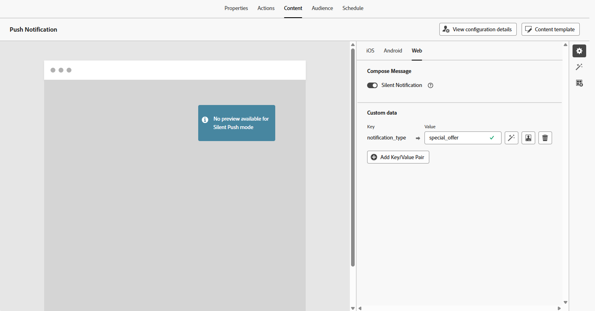
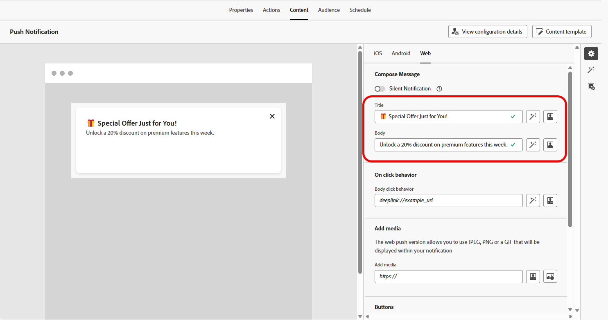
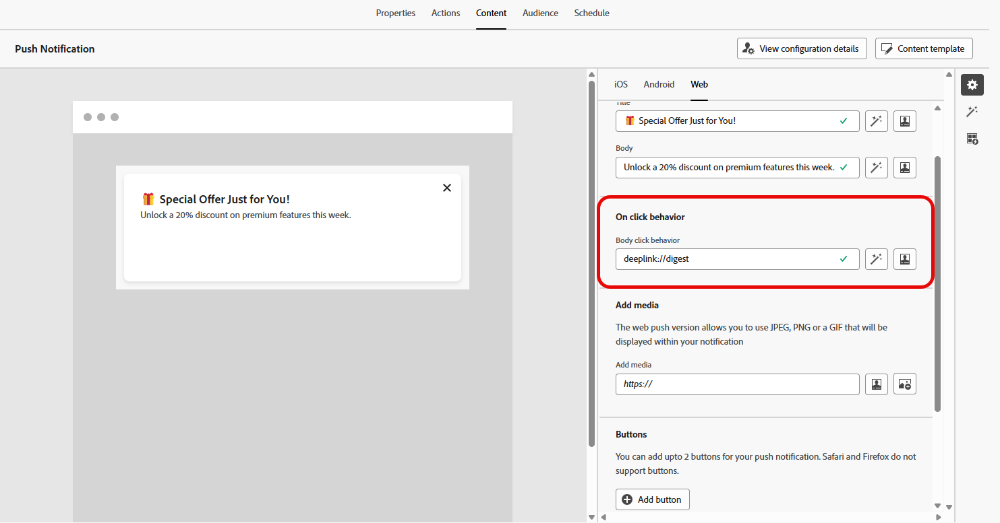
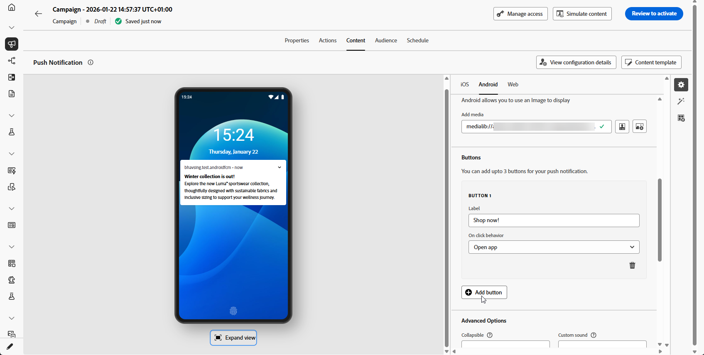
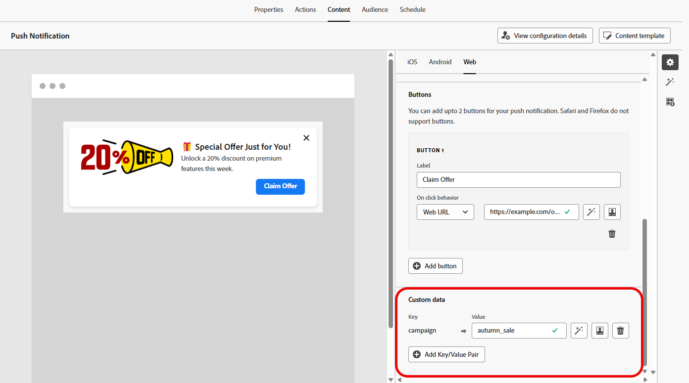

# 設計網頁推播通知 {#design-push-notification}

>[!AVAILABILITY]
>
>目前，Journey Optimizer中的Web推播通知不支援&#x200B;**無訊息通知**&#x200B;和&#x200B;**模擬內容**&#x200B;功能，但將在稍後提供。

建立您的Web推播通知行銷活動或歷程後，您可以繼續根據您的需求設計其內容和結構。 請注意，在傳送任何Web推播通知之前，必須先在您的[頻道設定](push-configuration-web.md)中設定此頻道。

<!--
## Send a silent notification {#silent-notification}

A silent push notification (also called a background notification) is a hidden message sent to your web application without alerting the user.

To enable a silent notification, enable the **[!UICONTROL Silent Notification]** option. When this option is used, the notification is delivered directly to the application, and no alert, banner, or sound is shown to the user.

Use the **Custom Data** section to include additional information in the form of key-value pairs. 

-->

## 標題和本文 {#push-title-body}

若要撰寫訊息，請按一下&#x200B;**[!UICONTROL 標題]**&#x200B;和&#x200B;**[!UICONTROL 內文]**&#x200B;欄位。 使用個人化編輯器來定義內容、[個人化資料](../personalization/personalize.md)並新增[動態內容](../personalization/get-started-dynamic-content.md)。

按一下&#x200B;**[!UICONTROL 使用AI助理編輯文字]**，以使用Journey Optimizer AI助理輕鬆產生您的內容。

## 點按時行為 {#on-click-behavior}

使用&#x200B;**[!UICONTROL 內文點按行為]**&#x200B;欄位來定義深層連結，以決定使用者點按通知內文時會發生什麼情況。 這可讓您將使用者直接傳送至網頁應用程式的特定頁面或區段。

## 新增媒體 {#add-media-push}

在&#x200B;**[!UICONTROL 新增媒體]**&#x200B;欄位中輸入媒體URL。 您也可以在URL中包含個人化代號，以便自訂每個使用者的內容。

按一下，以使用Journey Optimizer AI助理快速產生媒體。

## 新增按鈕 {#add-buttons-push}

將按鈕新增至內容，讓您的網頁推播通知互動式。

請注意，只有當裝置解除鎖定時，按鈕才會顯示。 如果熒幕已鎖定，則只會顯示&#x200B;**[!UICONTROL 標題]**&#x200B;和&#x200B;**[!UICONTROL 訊息]**。

使用&#x200B;**[!UICONTROL 新增按鈕]**&#x200B;選項來定義每個按鈕的標籤和相關動作，如下所述：

* **[!UICONTROL 深層連結]**：將使用者重新導向至您應用程式內的特定檢視、區段或索引標籤。 在相關欄位中輸入深層連結URL。

* **[!UICONTROL 網頁URL]**：將使用者重新導向至外部網頁。 在相關欄位中輸入URL。

## 自訂資料 {#custom-data}

在&#x200B;**[!UICONTROL 自訂資料]**&#x200B;區段中，您可以將自訂索引鍵/值組新增至通知承載。 您的網頁應用程式可使用這些值來觸發特定動作或自訂使用者體驗。 如需如何在Adobe Experience Platform中設定推播通知的詳細資訊，請參閱[本節](push-gs.md)

