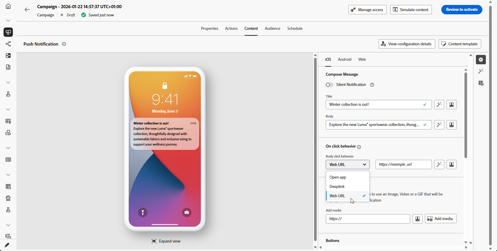
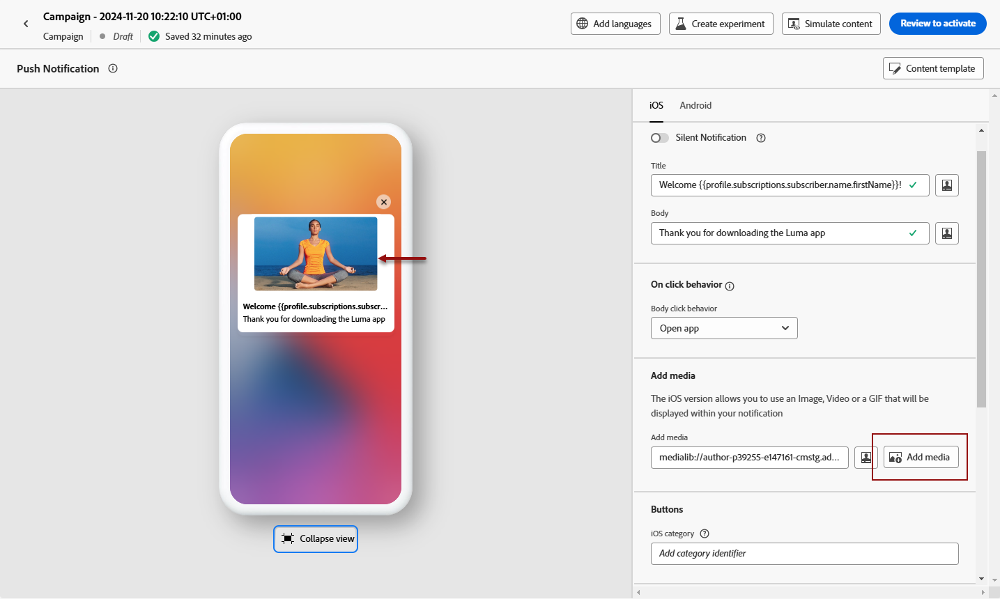

# 設計推播通知 {#design-push-notification}

## 標題和本文 {#push-title-body}

>[!CONTEXTUALHELP]
>id="ajo-message-push-compose"
>title="推播個人化。"
>abstract="若要撰寫您的訊息，請在「**標題**」與「**內文**」欄位輸入內容。若要加入個人化權杖，請開啟個人化對話框。"

若要撰寫訊息，請按一下&#x200B;**[!UICONTROL 標題]**&#x200B;和&#x200B;**[!UICONTROL 內文]**&#x200B;欄位。 使用個人化編輯器來定義內容、個人化資料及新增動態內容。 進一步瞭解個人化編輯器中的[個人化](../personalization/personalize.md)和[動態內容](../personalization/get-started-dynamic-content.md)。

使用裝置預覽區段來視覺化推播通知在iOS和Android裝置上的顯示方式。

## 點按時行為 {#on-click-behavior}

>[!CONTEXTUALHELP]
>id="ajo-message-push-onclick"
>title="關於點按時行為"
>abstract="選取收件者點擊推播通知內文時的行為。"

您可以選取當使用者點按推播通知內文時的行為。

* 若要開啟應用程式，請選取&#x200B;**[!UICONTROL 開啟應用程式]**&#x200B;選項。 與通知相關聯的應用程式定義於[頻道設定](../configuration/channel-surfaces.md) （即訊息預設集）。
* 若要將使用者重新導向至應用程式內的特定內容，請選取&#x200B;**[!UICONTROL 深層連結]**&#x200B;選項。  特定內容可以是特定檢視、頁面的特定區段或特定標籤。 選取選項後，在相關欄位中輸入深層連結。
* 若要將使用者重新導向至外部URL，請使用&#x200B;**[!UICONTROL 網頁URL]**&#x200B;選項。 選取選項後，在相關欄位中輸入URL。

## 新增媒體 {#add-media-push}

>[!CONTEXTUALHELP]
>id="ajo-message-push-media"
>title="在你的推播通知中新增媒體"
>abstract="你可以新增在通知中顯示的影像、影片或 GIF。"

在推播通知的iOS版本中，您可以新增顯示在通知中的影像、影片或GIF。

在Android版本中，您只能新增影像圖示，以及擴充通知的影像。

有兩個可用選項。 您可以：

* 使用「**[!UICONTROL 新增媒體]**」按鈕在&#x200B;**[!DNL Adobe Experience Manager Assets]**&#x200B;中選取資產。

  瞭解如何在&#x200B;**[!DNL Adobe Experience Manager Assets]**&#x200B;此頁面[上使用](../integrations/assets.md)。

* 或在&#x200B;**[!UICONTROL 新增媒體]**&#x200B;欄位中輸入媒體URL。 在這種情況下，您可以將個人化新增至URL。

新增後，媒體會顯示在通知內文的右側。

## 新增按鈕 {#add-buttons-push}

>[!CONTEXTUALHELP]
>id="ajo-message-push-buttons"
>title="新增按鈕讓使用者可以與您的推播互動。"
>abstract="從這個區段開始，在您的訊息中加入召喚行動按鈕。使用 Apple iOS 者請指定通知類別識別碼。使用 Google Android 者可以為每個按鈕加入自訂文字與目標。"

將按鈕新增至推播內容，以建立可操作的通知。

如果裝置熒幕已鎖定，則不會顯示這些按鈕：只會顯示通知的&#x200B;**標題**&#x200B;和&#x200B;**訊息**。 如果解除鎖定其裝置，收件者將會看到按鈕。

在Android版本中，您最多可以新增三個按鈕。

在iOS版本中，會指定通知類別識別碼。 必須在iOS應用程式中預先設定通知類別，以便定義要顯示的按鈕和要採取的動作。 如需詳細資訊，請參閱[Apple檔案](https://developer.apple.com/documentation/usernotifications/declaring_your_actionable_notification_types)。

1. 使用&#x200B;**[!UICONTROL 新增按鈕]**&#x200B;來定義設定：標籤和相關聯的動作。 可能的動作與[點按行為](#on-click-behavior)相同。

1. 使用中央預覽影像下方的&#x200B;**[!UICONTROL 展開檢視]**&#x200B;圖示來預覽您的個人化按鈕。

   

## 傳送靜音通知 {#silent-notification}

>[!CONTEXTUALHELP]
>id="ajo_message_push_silent_notification"
>title="關於靜音通知"
>abstract="在不打擾使用者的情況下傳送通知，通知不會顯示在通知中心或通知列中。"

無訊息推播通知（或背景通知）是傳送至應用程式的隱藏指示。 例如，它可用來通知您的應用程式新內容是否可用，或在背景啟動下載。

選取&#x200B;**[!UICONTROL 無訊息通知]**&#x200B;選項，以無訊息通知應用程式：在此情況下，通知會直接傳輸到應用程式。 裝置畫面上不會顯示任何警示。

使用&#x200B;**[!UICONTROL 自訂資料]**&#x200B;區段來新增機碼值組。

## 自訂資料 {#custom-data}

>[!CONTEXTUALHELP]
>id="ajo-message-push-custom"
>title="設定推播通知的自訂資料。"
>abstract="根據你的行動應用程式設定，在承載中新增自訂變數。"

在&#x200B;**[!UICONTROL 自訂資料]**&#x200B;區段中，您可以根據行動應用程式設定，將自訂變數新增至裝載。 如需如何在Adobe Experience Platform中設定推播通知的詳細資訊，請參閱[本節](push-gs.md)

## 進階選項 {#advanced-options-push}

>[!CONTEXTUALHELP]
>id="ajo-message-push-advanced"
>title="設定推播通知的進階選項。"
>abstract="本區段讓你知道如何增強推播通知的個人化設定。"

您可以為推播通知設定&#x200B;**[!UICONTROL 進階選項]**。 可用的引數列示如下：

| 參數 | 說明 |
|---------|---------|
| **[!UICONTROL 可摺疊]** (iOS / Android) | 可收合的訊息是已過時的訊息，可由新訊息取代。 可摺疊訊息的常見使用案例是用來讓行動應用程式從伺服器同步資料的訊息。 例如，將使用者更新為最新分數的運動應用程式。 只有最近的訊息才相關。 另一方面，若使用不可收合的訊息，每則訊息對於使用者端應用程式都十分重要，必須加以傳送。 |
| **[!UICONTROL 自訂音效]** (iOS / Android) | 收到通知時，行動終端機要播放的聲音。 聲音需要在應用程式中整合。 |
| **[!UICONTROL 徽章]** (iOS / Android) | 徽章可用來直接在應用程式圖示上顯示新未讀取資訊的數量。 當使用者開啟或從應用程式讀取新內容時，徽章值就會消失。 在裝置上收到通知時，它可以重新整理或新增相關應用程式的徽章值。 例如，如果您儲存客戶的未讀文章數目，您可以運用個人化，為每位客戶傳送唯一的未讀文章徽章值。 如需更多個人化資訊，請參閱[本節](../personalization/personalize.md)。 |
| **[!UICONTROL 通知群組]** (僅限iOS) | 將通知群組關聯至推播通知。 從iOS 12開始，通知群組可讓您將訊息執行緒和通知主題整合到執行緒ID中。 例如，品牌可能會以一個群組ID傳送行銷通知，同時以一個或多個不同的ID保留更多營運型別通知。 舉例說明，您可以有groupID： 123 「檢視新的春季毛衣系列」和groupID： 456 「您的包裹已送達」通知群組。 在此範例中，所有傳送通知都會整合在群組ID： 456底下。 |
| **[!UICONTROL 通知頻道]** (僅限Android) | 將通知頻道與推播通知建立關聯。 從Android 8.0 （API層級26）開始，所有通知都必須指派至管道才能顯示。 如需詳細資訊，請參閱[Android開發人員檔案](https://developer.android.com/guide/topics/ui/notifiers/notifications#ManageChannels)。 |
| **[!UICONTROL 新增content-availability旗標]** (僅限iOS) | 傳送推播裝載中的可用內容旗標，以確保應用程式在收到推播通知時立即喚醒，這表示應用程式將能夠存取裝載資料。 即使應用程式在背景執行，而且不需要任何使用者互動（例如點選推播通知），此功能仍可運作。 不過，如果應用程式未執行，則不適用。 如需詳細資訊，請參閱 [Apple開發人員檔案](https://developer.apple.com/library/content/documentation/NetworkingInternet/Conceptual/RemoteNotificationsPG/CreatingtheNotificationPayload.html)。 |
| **[!UICONTROL 新增可變內容旗標]** (僅限iOS) | 在推播裝載中傳送可變內容旗標，並允許在iOS SDK中提供的通知服務應用程式擴充功能修改推播通知內容。 有關詳細資訊，請參閱 [Apple 開發人員文件](https://developer.apple.com/library/content/documentation/NetworkingInternet/Conceptual/RemoteNotificationsPG/ModifyingNotifications.html)。 然後，您就可以運用行動應用程式延伸模組，進一步修改從[!DNL Journey Optimizer]傳送之推播通知的內容或簡報。 例如，使用者可以善用此選項來解密資料、變更通知的正文或標題文字、新增對話串識別碼至通知等。 |
| **[!UICONTROL 新增推播到期日]** (僅限iOS) | 選擇推播到期的&#x200B;**日期和時間**。 在iOS上，通知過期會強製為硬式停止，這表示在過期時間之後送達Apple推播通知服務(APNS)的任何訊息都不會傳送，以確保客戶不會收到過期或不相關的通知。 如需詳細資訊，請參閱 [Apple開發人員檔案](https://developer.apple.com/documentation/usernotifications/sending-notification-requests-to-apns)。 |
| **[!UICONTROL 通知可見度]** (僅限Android) | 定義推播通知的可見度。  <b>私人</b>會在所有鎖定熒幕上顯示通知，但在安全鎖定熒幕隱藏機密或私人資訊。  <b>Public</b>會在所有鎖定熒幕中顯示完整通知。  <b>密碼</b>不會在安全鎖定熒幕上顯示通知的任何部分。  如需詳細資訊，請參閱[Android開發人員檔案](https://developer.android.com/reference/android/app/Notification)。 |
| **[!UICONTROL 通知優先順序]** (僅限Android) | 定義推播通知的重要性從低到高。 這會決定推播通知在傳送時會如何「干擾」。 如需詳細資訊，請參閱[Android開發人員檔案](https://developer.android.com/guide/topics/ui/notifiers/notifications#importance) |
| **[!UICONTROL 傳遞優先順序]** (僅限Android) | 設定推播通知的高優先順序或一般優先順序。 如需訊息優先順序的詳細資訊，請參閱 [Google 開發人員檔案](https://firebase.google.com/docs/cloud-messaging/concept-options#setting-the-priority-of-a-message)。 |
| **[!UICONTROL 存留時間]** (僅限Android) | 設定訊息到期的秒數。 在Android上，到期日會被視為傳遞期間：Firebase Cloud Messaging (FCM)從收到訊息開始，將到期時間轉換為存留時間(TTL)值，這表示未傳遞的行銷活動可能會比預期更晚傳送，甚至超出所需的時間範圍。 如需詳細資訊，請參閱[Android開發人員檔案](https://firebase.google.com/docs/cloud-messaging/concept-options#ttl)。 |
