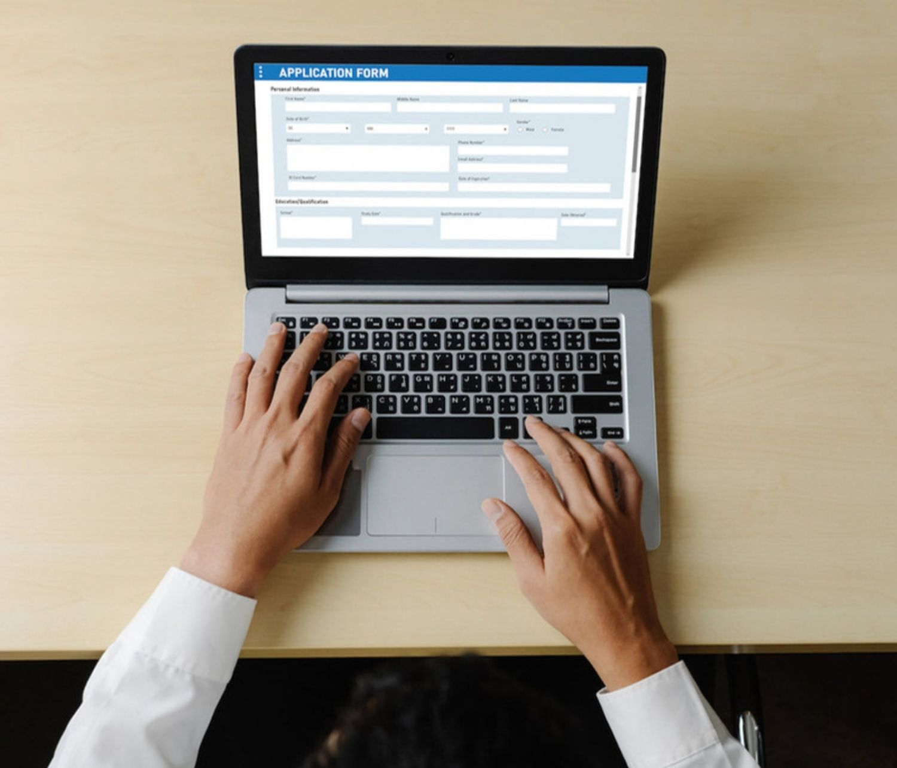

# 開始使用推播通知 {#gs-push-notification}

>[!IMPORTANT]
>
>如果這是您第一次建立推播通知，請確定已設定推播通道。 [了解更多](push-gs.md)。

推播通知可協助您隨時聯絡行動應用程式使用者和Web訪客，尤其是當他們未主動使用您的應用程式或瀏覽您的網站時。 推播通知可協助您達成各種使用案例，例如提供服務的更新、要求使用者採取動作、提醒使用者留意新交易等。 裝置平台需要選擇加入，終端使用者才能收到或檢視您的通知。使用者選擇加入的時間，最早可在應用程式於安裝後首次啟動後收到，或在後續的工作階段或工作流程收到。

[!DNL Journey Optimizer] 支援推播通知，並協助您以領先業界的輸送率傳送高度相關的通知。推播通知可能包括個人化及歷程型內容，以便利用您的品牌透過 Adobe Experience Cloud 獲得的資料洞察。

可建立的推播通知：

* 在&#x200B;**歷程**&#x200B;中：一旦在歷程新增推播活動並定義基本設定後，使用&#x200B;**[!UICONTROL 動作：推播]**&#x200B;右側窗格，建立推播通知的內容。[了解如何建立歷程](../building-journeys/journey-gs.md)

* 在&#x200B;**行銷活動**&#x200B;中：一旦建立行銷活動，請選取「推播通知」作為動作並定義基本設定。了解如何建立[動作行銷活動](../campaigns/campaign-action.md#action-campaign-action) | [API 觸發的行銷活動](../campaigns/api-triggered-campaigns.md) | [協調的行銷活動](../orchestrated/create-orchestrated-campaign.md#create)

使用專用標籤來定義&#x200B;**iOS**、**Android**&#x200B;和&#x200B;**Web**&#x200B;平台的推播通知設定。

>[!NOTE]
>
>**[!DNL Journey Optimizer]** 提供管理電子郵件和簡訊訊息中選擇退出的方式，而推播通知不需要由您執行任何動作，因為收件者可以透過其裝置自行取消訂閱。 例如，在下載或使用您的應用程式時，他們可以選擇停止通知。 同樣地，他們也可以透過行動作業系統或網頁瀏覽器設定來變更通知設定。

<table style="table-layout:fixed"><tr style="border: 0;">
<td>

<a href="create-push.md"><strong>建立推播通知</strong>

</td>
<td>

<a href="design-push.md"><strong>設計推播通知</strong></a>

</td>
<td>

<a href="send-push.md"><strong>傳送推播通知</strong></a>

</td>
<td>

<a href="push-gs.md"><strong>設定推播通知</strong></a>

</td>
</tr></table>
