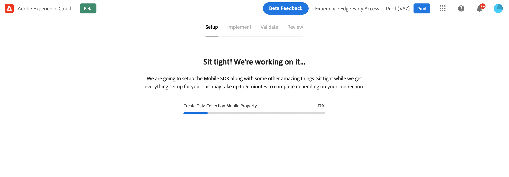

# Mobile 上線快速入門工作流程 {#mobile-wf}

新 **移動登陸快速啟動工作流** 是一項新產品功能，可快速配置Adobe Experience Platform移動軟體開發套件、開始收集和驗證移動事件資料以及發送推送通知 [!DNL Journey Optimizer]。

此功能可通過 **[!DNL Adobe Experience Platform Data Collection]** 作為公共測試版發送給所有客戶的首頁。

## 快速入門{#gs-mobile-wf}

此新工作流通過減少總點擊量和加快Journey Optimizer的移動配置來自動化資料收集設定。 此快速啟動工作流將引導您完成四個簡單步驟 [設定](##setup-mobile-wf)。 [實施](#implement-mobile-wf)。 [驗證](#valid-mobile-wf), [審查](#review-mobile-wf) 您的移動配置。

要訪問新的移動上網快速啟動工作流，請瀏覽至 **[!DNL Data Collection]** 從解決方案切換器。 然後選擇 **[!DNL Start Collecting Mobile Data]** 首頁上的卡片。

以下是幾項附加功能：

* 簡單的四步工作流和用戶介面。
* 提供基本設定，以通過 [Adobe Experience Platform移動SDK](https://developer.adobe.com/client-sdks/documentation/){target="_blank"} 幾分鐘內。
* 能夠利用test和驗證基本移動推送事件 [Adobe Experience Platform](https://experienceleague.adobe.com/docs/experience-platform/assurance/home.html){target="_blank"}。
* 自動建立和配置所有必需的資料收集和Journey Optimizer資產。
* 在產品指導和工具提示中。
* 根據需要為更高級的實施提供自然過渡。

## 設定 {#setup-mobile-wf}

此工作流的第一步是自動建立和配置所有必要的資料收集和Journey Optimizer資產，如移動屬性、移動擴展、Journey Optimizer擴展、規則、資料元素等。

接受Beta條款與條件後，輸入移動應用的名稱，然後按一下 **[!DNL Next]**。

提供iOS和Android平台的資訊，包括您的應用ID和驗證密鑰或密鑰檔案。

## 實作{#implement-mobile-wf}

下一步提供將代碼安裝到移動應用的逐步指導。

## 驗證{#valid-mobile-wf}

檢查並檢查實施以驗證它。 您可以發送test推送通知。

## 請檢閱 {#review-mobile-wf}

自動設定已完成。 現在，您可以訪問您的標籤移動屬性並配置規則或資料元素，然後開始向Adobe Journey Optimizer發送推式通知。

**相關主題**

* [開始使用推播通知](get-started-push.md)
* [推送通知資料流和元件](push-gs.md)
* [配置推送通道](push-configuration.md)
* [推播通知報告](../reports/journey-global-report.md#push-global)
* [建立推播通知](create-push.md)
