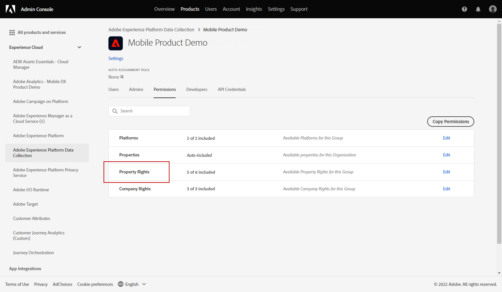
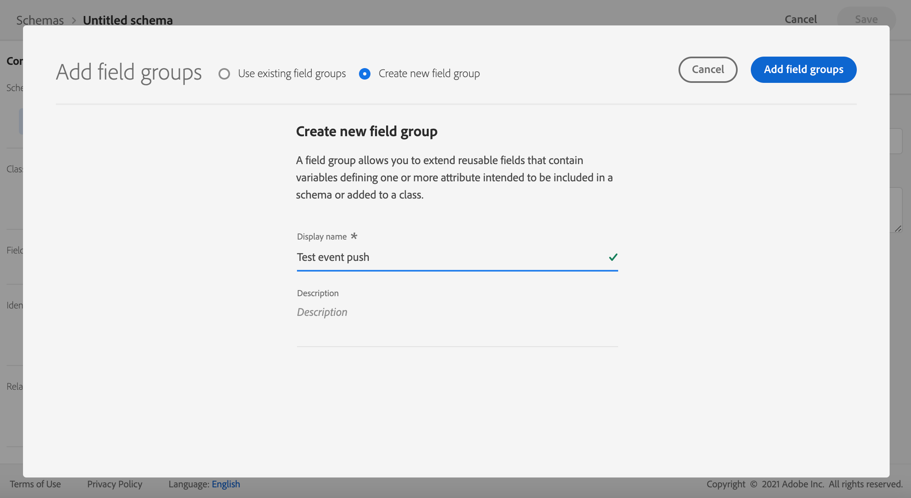

# 設定推播通知頻道 {#push-notification-configuration}

[!DNL Journey Optimizer] 可讓您建立歷程並傳送訊息給目標客群。 開始使用[!DNL Journey Optimizer]傳送推播通知之前，您必須確保行動應用程式上以及Adobe Experience Platform中的標籤已具備設定和整合。 若要瞭解 [!DNL Adobe Journey Optimizer] 中的推播通知資料流程，請參閱[此頁面](push-gs.md)。

>[!AVAILABILITY]
>
>全新&#x200B;**行動入門快速入門工作流程**&#x200B;現已推出。 使用這項新產品功能，快速設定行動SDK，以開始收集和驗證行動事件資料，並傳送行動推播通知。 此功能可作為公開測試版透過Data Collection首頁存取。 [了解更多](mobile-onboarding-wf.md)
>

## 開始之前 {#start-push}

### 設定許可權 {#setup-permissions}

建立行動應用程式之前，您必須先確定您擁有或指派適用於Adobe Experience Platform標籤的正確使用者許可權。 進一步瞭解[標籤檔案](https://experienceleague.adobe.com/docs/experience-platform/tags/admin/user-permissions.html){target="_blank"}。

>[!CAUTION]
>
>推播設定必須由專家使用者執行。 根據您的實施模式以及此實施中涉及的角色，您可能需要將完整的許可權集指派給單一產品設定檔，或應用程式開發人員與&#x200B;**Adobe Journey Optimizer**&#x200B;管理員共用許可權。 在&#x200B;**本檔案**&#x200B;中進一步瞭解[標籤](https://experienceleague.adobe.com/docs/experience-platform/tags/admin/user-permissions.html){target="_blank"}許可權。

<!--ou need to your have access to perform following roles :

* Manage Datastreams
* Manage Client-side Properties
* Manage App Configurations
-->

若要指派&#x200B;**屬性**&#x200B;和&#x200B;**公司**&#x200B;許可權，請遵循下列步驟：

1. 存取&#x200B;**[!DNL Admin Console]**。

1. 從&#x200B;**[!UICONTROL 產品]**&#x200B;索引標籤中，選取&#x200B;**[!UICONTROL Adobe Experience Platform資料彙集]**&#x200B;卡片。

   

1. 選取現有的&#x200B;**[!UICONTROL 產品設定檔]**，或使用&#x200B;**[!UICONTROL 新增設定檔]**&#x200B;按鈕建立新的設定檔。 在&#x200B;**[!UICONTROL Admin Console檔案]**&#x200B;中瞭解如何建立新的[新設定檔](https://experienceleague.adobe.com/docs/experience-platform/access-control/ui/create-profile.html#ui){target="_blank"}。

1. 從&#x200B;**[!UICONTROL 許可權]**&#x200B;索引標籤中，選取&#x200B;**[!UICONTROL 屬性權利]**。

   

1. 按一下&#x200B;**[!UICONTROL 全部新增]**。 這會將以下許可權新增至您的產品設定檔：
   * **[!UICONTROL 核准]**
   * **[!UICONTROL 開發]**
   * **[!UICONTROL 管理環境]**
   * **[!UICONTROL 管理擴充功能]**
   * **[!UICONTROL 發佈]**

   在Adobe Experience Platform Mobile SDK中安裝和發佈Adobe Journey Optimizer擴充功能及發佈應用程式屬性時，需要這些許可權。

1. 然後，在左側功能表中選取&#x200B;**[!UICONTROL 公司權利]**。

   

1. 新增下列許可權：

   * **[!UICONTROL 管理應用程式設定]**
   * **[!UICONTROL 管理屬性]**

   行動應用程式開發人員需要這些許可權，才能在&#x200B;**Adobe Experience Platform資料彙集**&#x200B;中設定推播認證，並在&#x200B;**Adobe Journey Optimizer**&#x200B;中定義推播通知通道設定（即訊息預設集）。

   

1. 按一下&#x200B;**[!UICONTROL 儲存]**。

若要將此&#x200B;**[!UICONTROL 產品設定檔]**&#x200B;指派給使用者，請遵循下列步驟：

1. 存取&#x200B;**[!DNL Admin Console]**。

1. 從&#x200B;**[!UICONTROL 產品]**&#x200B;索引標籤中，選取&#x200B;**[!UICONTROL Adobe Experience Platform資料彙集]**&#x200B;卡片。

1. 選取您先前設定的&#x200B;**[!UICONTROL 產品設定檔]**。

1. 在&#x200B;**[!UICONTROL 使用者]**&#x200B;標籤中，按一下&#x200B;**[!UICONTROL 新增使用者]**。

   

1. 輸入使用者的名稱或電子郵件地址，然後選取使用者。 然後，按一下&#x200B;**[!UICONTROL 儲存]**。

   >[!NOTE]
   >
   >如果使用者先前不是在Admin Console中建立的，請參閱[新增使用者檔案](https://helpx.adobe.com/enterprise/admin-guide.html/enterprise/using/manage-users-individually.ug.html#add-users)。

   


### 檢查您的資料集 {#push-datasets}

推播通知通道可使用下列結構描述和資料集：

| 結構描述<br>資料集 | 欄位群組 | 作業 |
| -------------------------------------------------------------------------------------- | --------------------------------------------------------------------------------------------------------------------------------------------------------------------------------------- | -------------------------------------------------------- |
| CJM推播設定檔結構描述<br>CJM推播設定檔資料集 | 推播通知詳細資料<br>Adobe CJM ExperienceEvent — 訊息設定檔詳細資料<br>Adobe CJM ExperienceEvent — 訊息執行詳細資料<br>應用程式詳細資料<br>環境詳細資料 | 註冊推播權杖 |
| CJM推播追蹤體驗事件結構描述<br>CJM推播追蹤體驗事件資料集 | 推播通知追蹤 | 追蹤互動並為報表UI提供資料 |


>[!NOTE]
>
>將推播追蹤事件擷取至CJM推播追蹤體驗事件資料集時，即使部分資料已成功擷取，仍可能會發生一些失敗。 如果某些對應欄位不存在傳入事件中，就可能發生這種情況：系統記錄警告，但未阻止擷取資料的有效部分。 這些警告在批次狀態中顯示為「失敗」，但反映部分擷取成功。
>
>若要檢視每個結構描述的欄位與屬性完整清單，請參閱 [Journey Optimizer 結構描述字典](https://experienceleague.adobe.com/tools/ajo-schemas/schema-dictionary.html?lang=zh-Hant){target="_blank"}。


### 設定您的應用程式 {#configure-app}

技術設定涉及應用程式開發人員與企業管理員之間的密切合作。 在使用[!DNL Journey Optimizer]開始傳送推播通知之前，您需要在Adobe Journey Optimizer中建立推播認證、推播通道設定，並將您的行動應用程式與Adobe Experience Platform Mobile SDK整合。

請依照下列連結中詳述的實作步驟操作：

* 針對&#x200B;**Apple iOS**：在[Apple檔案](https://developer.apple.com/documentation/usernotifications/registering_your_app_with_apns){target="_blank"}中瞭解如何使用APN註冊您的應用程式
* 針對&#x200B;**Google Android**：在[Google檔案](https://firebase.google.com/docs/cloud-messaging/android/client){target="_blank"}中瞭解如何在Android上設定Firebase Cloud Messaging使用者端應用程式

### 將行動應用程式與Adobe Experience Platform SDK整合 {#integrate-mobile-app}

Adobe Experience Platform Mobile SDK透過Android與iOS相容的SDK，為您的行動裝置提供使用者端整合API。 請依照[Adobe Experience Platform Mobile SDK檔案](https://developer.adobe.com/client-sdks/documentation/getting-started/){target="_blank"}中的指示，在應用程式中設定Adobe Experience Platform Mobile SDK。

到這為止，您也應該在[!DNL Adobe Experience Platform Data Collection]中建立並設定行動屬性。 您通常會為想要管理的每個行動應用程式建立行動屬性。 在[Adobe Experience Platform Mobile SDK檔案](https://developer.adobe.com/client-sdks/documentation/getting-started/create-a-mobile-property/){target="_blank"}中瞭解如何建立及設定行動屬性。

若要啟用&#x200B;**Web推播通知**，請確定[pushNotifications屬性](https://experienceleague.adobe.com/en/docs/experience-platform/web-sdk/commands/configure/pushnotifications)已在Web SDK中正確設定。 然後，使用[sendPushSubscription命令](https://experienceleague.adobe.com/en/docs/experience-platform/web-sdk/commands/sendpushsubscription)向Adobe Experience Platform註冊推播訂閱。

## 步驟1：在Journey Optimizer中新增應用程式推送認證 {#push-credentials-launch}

在授與正確的使用者許可權後，您現在需要在Journey Optimizer中新增行動應用程式推送認證。

行動應用程式推播認證註冊為必填，才能授權Adobe代表您傳送推播通知。 請參閱以下詳細步驟：

1. 存取&#x200B;**[!UICONTROL 管道]** > **[!UICONTROL 推播設定]** > **[!UICONTROL 推播認證]**&#x200B;功能表。

1. 按一下&#x200B;**[!UICONTROL 建立推播認證]**。

1. 從&#x200B;**[!UICONTROL 平台]**&#x200B;下拉式清單中，選取作業系統：

   * 適用於iOS **的**

     

      1. 輸入行動應用程式&#x200B;**[!UICONTROL 應用程式識別碼]**。

      1. 啟用&#x200B;**[!UICONTROL 套用至所有沙箱]**&#x200B;選項，讓這些推送認證可用於所有沙箱。 如果特定沙箱針對相同的平台和應用程式ID組有自己的認證，系統會優先採用這些沙箱專屬的認證。

      1. 已開啟&#x200B;**[!UICONTROL 手動輸入推播認證]**&#x200B;按鈕以新增您的認證。

      1. 拖放您的.p8 Apple推播通知驗證金鑰檔案。 此金鑰可從&#x200B;**憑證**、**識別碼**&#x200B;和&#x200B;**設定檔**&#x200B;頁面取得。

      1. 提供&#x200B;**金鑰識別碼**。 這是在p8驗證金鑰建立期間指派的10字元字串。 您可以在&#x200B;**憑證**、**識別碼**&#x200B;和&#x200B;**設定檔**&#x200B;頁面中的&#x200B;**金鑰**&#x200B;索引標籤下找到它。

      1. 提供&#x200B;**團隊識別碼**。 這是字串值，可在「成員資格」標籤下找到。

   * 適用於Android **的**

     

      1. 提供&#x200B;**[!UICONTROL 應用程式ID]**，封裝名稱通常是`build.gradle`檔案中的應用程式ID。

      1. 啟用&#x200B;**[!UICONTROL 套用至所有沙箱]**&#x200B;選項，讓這些推送認證可用於所有沙箱。 如果特定沙箱針對相同的平台和應用程式ID組有自己的認證，系統會優先採用這些沙箱專屬的認證。

      1. 已開啟&#x200B;**[!UICONTROL 手動輸入推播認證]**&#x200B;按鈕以新增您的認證。

      1. 拖放FCM推送認證。 如需有關如何取得推送認證的詳細資訊，請參閱[Google檔案](https://firebase.google.com/docs/admin/setup#initialize-sdk){target="_blank"}。

   * 適用於Web **的**

     

      1. 提供&#x200B;**[!UICONTROL 應用程式識別碼]**。

      1. 輸入您的&#x200B;**[!UICONTROL VAPID公開金鑰]**&#x200B;和&#x200B;**[!UICONTROL 私密金鑰]**。

1. 按一下&#x200B;**[!UICONTROL 提交]**&#x200B;以建立您的應用程式設定。

<!--
## Step 2: Set up a mobile property in Adobe Experience Platform Launch {#launch-property}

Setting up a mobile property allows the mobile app developer or marketer to configure the mobile SDKs attributes such as Session Timeouts, the [!DNL Adobe Experience Platform] sandbox to be targeted and the **[!UICONTROL Adobe Experience Platform Datasets]** to be used for mobile SDK to send data to.

For further details and procedures on how to set up a **[!UICONTROL Platform Launch property]**, refer to the steps detailed in [Adobe Experience Platform Mobile SDK documentation](https://aep-sdks.gitbook.io/docs/getting-started/create-a-mobile-property#create-a-mobile-property).


To get the SDKs needed for push notification to work you will need the following SDK extensions, for both Android and iOS:

* **[!UICONTROL Mobile Core]** (installed automatically)
* **[!UICONTROL Profile]** (installed automatically)
* **[!UICONTROL Adobe Experience Platform Edge]**
* **[!UICONTROL Adobe Experience Platform Assurance]**, optional but recommended to debug the mobile implementation.

Learn more about [!DNL Adobe Experience Platform Launch] extensions in [Adobe Experience Platform Launch documentation](https://experienceleague.adobe.com/docs/launch-learn/implementing-in-mobile-android-apps-with-launch/configure-launch/launch-add-extensions.html).
-->

## 步驟2：建立推送的通道設定{#message-preset}

建立推播認證後，您需要建立設定才能從&#x200B;**[!DNL Journey Optimizer]**&#x200B;傳送推播通知。

1. 存取&#x200B;**[!UICONTROL 頻道]** > **[!UICONTROL 一般設定]** > **[!UICONTROL 頻道設定]**&#x200B;功能表，然後按一下&#x200B;**[!UICONTROL 建立頻道設定]**。

   

1. 輸入設定的名稱和說明（選擇性）。

   >[!NOTE]
   >
   > 名稱必須以字母(A-Z)開頭。 它只能包含英數字元。 您也可以使用底線 `_`、點 `.` 和連字號 `-` 字元。


1. 若要將自訂或核心資料使用標籤指派給組態，您可以選取&#x200B;**[!UICONTROL 管理存取權]**。 [進一步瞭解物件層級存取控制(OLAC)](../administration/object-based-access.md)。

1. 選取&#x200B;**推播**&#x200B;頻道。

   

1. 選取&#x200B;**[!UICONTROL 行銷動作]**，以使用此設定將同意原則與訊息相關聯。 系統會運用與行銷動作相關的所有同意政策，以尊重客戶的偏好設定。 [了解更多](../action/consent.md#surface-marketing-actions)

1. 選擇您的&#x200B;**[!UICONTROL 平台]**： Android、iOS和/或Web。

1. 選取與上面設定之&#x200B;**[!UICONTROL 推播認證]**&#x200B;相同的[應用程式ID](#push-credentials-launch)。

1. 儲存您的變更。

您現在可以在建立推播通知時選取設定。

## 步驟3：在行動屬性中設定Adobe Journey Optimizer擴充功能 {#configure-journey-optimizer-extension}

適用於Adobe Experience Platform Mobile SDK的&#x200B;**Adobe Journey Optimizer擴充功能**&#x200B;可支援行動應用程式的推播通知，並可協助您收集使用者推播權杖，並管理與Adobe Experience Platform服務的互動測量。

在[Adobe Experience Platform Mobile Journey Optimizer檔案](https://developer.adobe.com/client-sdks/documentation/adobe-journey-optimizer/){target="_blank"}中瞭解如何設定SDK擴充功能。


<!-- 
**[!UICONTROL Edge configuration]** is used by **[!UICONTROL Edge]** extension to send custom data from mobile device to [!DNL Adobe Experience Platform]. 
To configure [!DNL Adobe Experience Platform], you must provide the **[!UICONTROL Sandbox]** name and **[!UICONTROL Event Dataset]**.

1. From [!DNL Adobe Experience Platform Launch], select the **[!UICONTROL Edge Configurations]** tab and click **[!UICONTROL Edge Configurations]**.
    
1. Select **[!UICONTROL New Edge Configuration]** to add a new **[!UICONTROL Edge Configuration]**.
1. Enter a **[!UICONTROL Name]** and click **[!UICONTROL Save]**

1. Click the **[!UICONTROL Adobe Experience Platform]** toggle to enable it.

1. Fill in the **[!UICONTROL Sandbox]**, **[!UICONTROL Event dataset]** and **[!UICONTROL Profile Dataset]** fields. Then, click **[!UICONTROL Save]**.
    
    


1. From [!DNL Adobe Experience Platform Launch], ensure that **[!UICONTROL Client Side]** is selected in the drop-down menu.

1. select the **[!UICONTROL Properties]** tab and click **[!UICONTROL New Property]**.

    

1. Enter a **[!UICONTROL Name]** for your new property.

1. Select **[!UICONTROL Mobile]** as **[!UICONTROL Platform]**.

    

1. Click **[!UICONTROL Save]** to create your new property.

To configure **[!UICONTROL Adobe Experience Platform Edge Extension]** to send custom data from mobile devices to [!DNL Adobe Experience Platform].

1. Select your previously created property and select the **[!UICONTROL Extensions]** tab to view the extensions for this property.

    

1. Click **[!UICONTROL Configure]** under the **[!UICONTROL Adobe Experience Platform Edge]** Network' extension.

1. From the **[!UICONTROL Edge Configuration]** drop-down list, select the **[!UICONTROL Edge Configuration]** created in the previous steps. For more information on **[!UICONTROL Edge Configuration]**, refer to this [section](#edge-configuration).

1. Click **[!UICONTROL Save]**.

To configure **[!UICONTROL Adobe Experience Platform Messaging]** extension to send push profile and push interactions to the correct datasets, follow the same steps as above. Use **[!UICONTROL Sandbox]**, **[!UICONTROL Event dataset]** and **[!UICONTROL Profile Dataset]** created in the [Adobe Experience Platform setup](#edge-configuration).
-->

<!--
## Step 4: Publish the Property {#publish-property}

You now need to publish the property to integrate your configuration and to use it in the mobile app. 

To publish your property, refer to the steps detailed in [Adobe Experience Platform Mobile SDK documentation](https://aep-sdks.gitbook.io/docs/getting-started/create-a-mobile-property#publish-the-configuration)

## Step 5: Configure the ProfileDataSource {#configure-profiledatasource}

To configure the `ProfileDataSource`, use the `ProfileDCInletURL` from [!DNL Adobe Experience Platform] setup and add the following in the mobile app:

```
    MobileCore.updateConfiguration(
    mutableMapOf("messaging.dccs" to <ProfileDCSInletURL>)
```

-->

## 步驟4：使用事件測試您的行動應用程式 {#mobile-app-test}

在Adobe Experience Platform和[!DNL Adobe Experience Platform Data Collection]中設定行動應用程式後，您現在可以在將推播通知傳送至設定檔之前對其進行測試。 在此使用案例中，我們會建立歷程來鎖定行動應用程式，並設定觸發推播通知的事件。

<!--
You can use a test mobile app for this use case. For more on this, refer to this [page](https://wiki.corp.adobe.com/pages/viewpage.action?spaceKey=CJM&title=Details+of+setting+the+mobile+test+app) (internal use only).
-->

為了讓此歷程正常運作，您需要建立XDM結構描述。 如需詳細資訊，請參閱[XDM檔案](https://experienceleague.adobe.com/docs/experience-platform/xdm/schema/composition.html#schemas-and-data-ingestion){target="_blank"}。

1. 在「資料管理」功能表區段中，按一下&#x200B;**[!UICONTROL 結構描述]**。
   
1. 按一下&#x200B;**[!UICONTROL 建立結構描述]**，在右上角選取&#x200B;**[!UICONTROL 體驗事件]**，然後按一下&#x200B;**下一步**。
   
1. 輸入結構描述的名稱和描述，然後按一下&#x200B;**完成**。
   
1. 在&#x200B;**欄位群組**&#x200B;區段中，按一下左側的&#x200B;**新增**&#x200B;並選取&#x200B;**[!UICONTROL 建立新欄位群組]**。

1. 輸入&#x200B;**[!UICONTROL 顯示名稱]**&#x200B;和&#x200B;**[!UICONTROL 描述]**。 完成時，按一下&#x200B;**[!UICONTROL 新增欄位群組]**。 有關如何建立欄位群組的詳細資訊，請參閱[XDM系統檔案](https://experienceleague.adobe.com/docs/experience-platform/xdm/tutorials/create-schema-ui.html?lang=zh-Hant){target="_blank"}。


   

1. 在左側，選取結構。 在右窗格中，為&#x200B;**[!UICONTROL 設定檔]**&#x200B;啟用此結構描述。

   


1. 在左側，選取欄位群組，然後按一下+圖示以建立新欄位。 在&#x200B;**[!UICONTROL 欄位群組屬性]**&#x200B;的右側，輸入&#x200B;**[!UICONTROL 欄位名稱]**、**[!UICONTROL 顯示名稱]**&#x200B;並選取&#x200B;**[!UICONTROL 字串]**&#x200B;作為&#x200B;**[!UICONTROL 型別]**。

   

1. 檢查&#x200B;**[!UICONTROL 必要]**&#x200B;並按一下&#x200B;**[!UICONTROL 套用]**。

1. 按一下&#x200B;**[!UICONTROL 「儲存」]**。您的結構描述現在已建立，並可在事件中使用。

然後，您需要設定事件。

1. 從首頁的左側功能表的[管理]底下，選取&#x200B;**[!UICONTROL 組態]**。 按一下&#x200B;**[!UICONTROL 事件]**&#x200B;區段中的&#x200B;**[!UICONTROL 管理]**&#x200B;以建立您的新事件。

1. 按一下&#x200B;**[!UICONTROL 建立事件]**，事件設定窗格會在畫面右側開啟。

   

1. 輸入事件的名稱。 您也可以新增說明。

1. 在&#x200B;**[!UICONTROL 事件識別碼型別]**&#x200B;欄位中，選取&#x200B;**[!UICONTROL 以規則為基礎]**。

1. 在&#x200B;**[!UICONTROL 引數]**&#x200B;中，選取您先前建立的結構描述。

   

1. 在欄位清單中，檢查是否選取了在結構描述欄位群組中建立的欄位。

   

1. 按一下&#x200B;**[!UICONTROL 事件識別碼條件]**&#x200B;欄位中的&#x200B;**[!UICONTROL 編輯]**。 拖放您先前新增的欄位，以定義系統用來識別觸發歷程之事件的條件。

   

1. 輸入您在測試應用程式中觸發推播通知所需使用的語法，在此範例中為&#x200B;**訂單確認**。

   

1. 選取&#x200B;**[!UICONTROL ECID]**&#x200B;作為您的&#x200B;**[!UICONTROL 名稱空間]**。

1. 按一下「**[!UICONTROL 確定]**」，然後按「**[!UICONTROL 儲存]**」。

您的事件現在已建立，並可用於歷程中。

1. 在左側功能表中，按一下&#x200B;**[!UICONTROL 歷程]**。

1. 按一下&#x200B;**[!UICONTROL 建立歷程]**&#x200B;以建立新歷程。

1. 在右側顯示的設定窗格中，編輯歷程的屬性。在此[節](../building-journeys/journey-properties.md)中瞭解更多。

1. 從&#x200B;**[!UICONTROL 事件]**&#x200B;下拉式清單中，拖放先前步驟中建立的事件。

   

1. 從&#x200B;**[!UICONTROL 動作]**&#x200B;下拉式清單，將&#x200B;**[!UICONTROL 推播]**&#x200B;活動拖放至您的歷程。

1. 設定推播通知。 有關如何建立推播通知的詳細資訊，請參閱此[頁面](create-push.md)。

1. 按一下&#x200B;**[!UICONTROL 測試]**&#x200B;切換以開始測試推播通知，然後按一下&#x200B;**[!UICONTROL 觸發事件]**。

   

1. 在&#x200B;**[!UICONTROL 索引鍵]**&#x200B;欄位中輸入您的ECID，然後在第二個欄位中輸入&#x200B;**訂單確認**。

   

1. 按一下&#x200B;**[!UICONTROL 傳送]**。

您的事件將會觸發，而您將會收到傳送至行動應用程式的推播通知。

