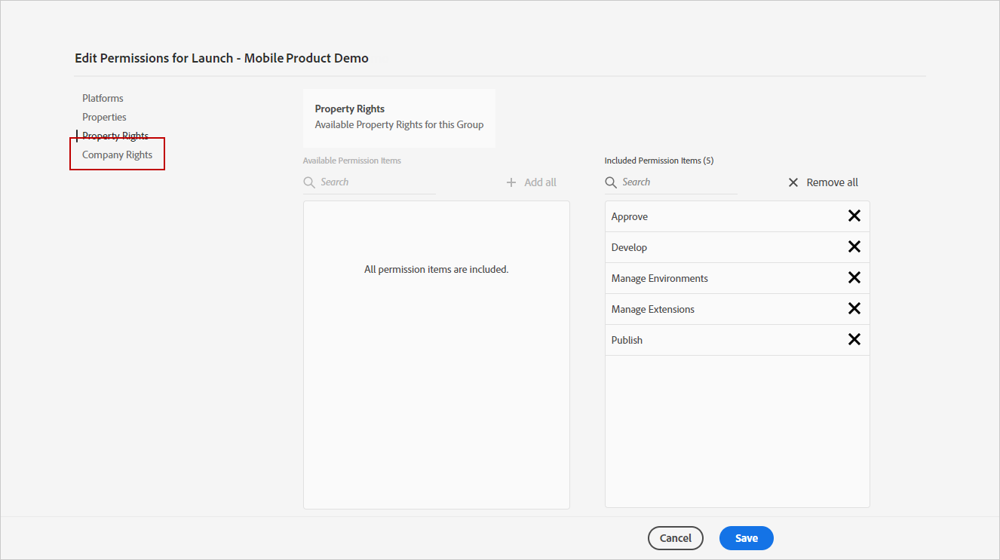

# 設定網頁推播通知管道 {#push-notification-configuration}

[!DNL Journey Optimizer] 可讓您建立歷程並傳送訊息給目標客群。 在開始使用[!DNL Journey Optimizer]傳送Web推播通知之前，您需要確保Adobe Experience Platform中已具備設定和整合。 若要瞭解 [!DNL Adobe Journey Optimizer] 中的推播通知資料流程，請參閱[此頁面](push-gs.md)。

>[!AVAILABILITY]
>
>全新&#x200B;**行動入門快速入門工作流程**&#x200B;現已推出。 使用這項新產品功能，快速設定行動SDK，以開始收集和驗證行動事件資料，並傳送行動推播通知。 此功能可作為公開測試版透過Data Collection首頁存取。 [了解更多](mobile-onboarding-wf.md)
>

## 開始之前 {#start-push}

### 設定許可權 {#setup-permissions}

建立行動應用程式之前，您必須先確定您擁有或指派適用於Adobe Experience Platform標籤的正確使用者許可權。 進一步瞭解[標籤檔案](https://experienceleague.adobe.com/docs/experience-platform/tags/admin/user-permissions.html?lang=zh-Hant){target="_blank"}。

>[!CAUTION]
>
>推播設定必須由專家使用者執行。 根據您的實施模式以及此實施中涉及的角色，您可能需要將完整的許可權集指派給單一產品設定檔，或應用程式開發人員與&#x200B;**Adobe Journey Optimizer**&#x200B;管理員共用許可權。 在&#x200B;**本檔案**&#x200B;中進一步瞭解[標籤](https://experienceleague.adobe.com/docs/experience-platform/tags/admin/user-permissions.html?lang=zh-Hant){target="_blank"}許可權。

<!--ou need to your have access to perform following roles :

* Manage Datastreams
* Manage Client-side Properties
* Manage App Configurations
-->

若要指派&#x200B;**屬性**&#x200B;和&#x200B;**公司**&#x200B;許可權，請遵循下列步驟：

1. 存取&#x200B;**[!DNL Admin Console]**。

1. 從&#x200B;**[!UICONTROL 產品]**&#x200B;索引標籤中，選取&#x200B;**[!UICONTROL Adobe Experience Platform資料彙集]**&#x200B;卡片。

   

1. 選取現有的&#x200B;**[!UICONTROL 產品設定檔]**，或使用&#x200B;**[!UICONTROL 新增設定檔]**&#x200B;按鈕建立新的設定檔。 在&#x200B;**[!UICONTROL Admin Console檔案]**&#x200B;中瞭解如何建立新的[新設定檔](https://experienceleague.adobe.com/docs/experience-platform/access-control/ui/create-profile.html?lang=zh-Hant#ui){target="_blank"}。

1. 從&#x200B;**[!UICONTROL 許可權]**&#x200B;索引標籤中，選取&#x200B;**[!UICONTROL 屬性權利]**。

   

1. 按一下&#x200B;**[!UICONTROL 全部新增]**。 這會將以下許可權新增至您的產品設定檔：
   * **[!UICONTROL 核准]**
   * **[!UICONTROL 開發]**
   * **[!UICONTROL 管理環境]**
   * **[!UICONTROL 管理擴充功能]**
   * **[!UICONTROL 發佈]**

   在Adobe Experience Platform Mobile SDK中安裝和發佈Adobe Journey Optimizer擴充功能及發佈應用程式屬性時，需要這些許可權。

1. 然後，在左側功能表中選取&#x200B;**[!UICONTROL 公司權利]**。

   

1. 新增下列許可權：

   * **[!UICONTROL 管理應用程式設定]**
   * **[!UICONTROL 管理屬性]**

   行動應用程式開發人員需要這些許可權，才能在&#x200B;**Adobe Experience Platform資料彙集**&#x200B;中設定推播認證，並在&#x200B;**Adobe Journey Optimizer**&#x200B;中定義推播通知通道設定（即訊息預設集）。

   

1. 按一下&#x200B;**[!UICONTROL 儲存]**。

若要將此&#x200B;**[!UICONTROL 產品設定檔]**&#x200B;指派給使用者，請遵循下列步驟：

1. 存取&#x200B;**[!DNL Admin Console]**。

1. 從&#x200B;**[!UICONTROL 產品]**&#x200B;索引標籤中，選取&#x200B;**[!UICONTROL Adobe Experience Platform資料彙集]**&#x200B;卡片。

1. 選取您先前設定的&#x200B;**[!UICONTROL 產品設定檔]**。

1. 在&#x200B;**[!UICONTROL 使用者]**&#x200B;標籤中，按一下&#x200B;**[!UICONTROL 新增使用者]**。

   

1. 輸入使用者的名稱或電子郵件地址，然後選取使用者。 然後，按一下&#x200B;**[!UICONTROL 儲存]**。

   >[!NOTE]
   >
   >如果使用者先前不是在Admin Console中建立的，請參閱[新增使用者檔案](https://helpx.adobe.com/tw/enterprise/admin-guide.html/enterprise/using/manage-users-individually.ug.html#add-users)。

   

### 檢查您的資料集 {#push-datasets}

推播通知通道可使用下列結構描述和資料集：

| 結構描述 資料集 | 欄位群組 | 作業 |
| -------------------------------------------------------------------------------------- | --------------------------------------------------------------------------------------------------------------------------------------------------------------------------------------- | -------------------------------------------------------- |
| CJM推播設定檔結構描述 CJM推播設定檔資料集 | 推播通知詳細資料 Adobe CJM ExperienceEvent — 訊息設定檔詳細資料 Adobe CJM ExperienceEvent — 訊息執行詳細資料 應用程式詳細資料 環境詳細資料 | 註冊推播權杖 |
| CJM推播追蹤體驗事件結構描述 CJM推播追蹤體驗事件資料集 | 推播通知追蹤 | 追蹤互動並為報表UI提供資料 |

>[!NOTE]
>
>將推播追蹤事件擷取至CJM推播追蹤體驗事件資料集時，即使部分資料已成功擷取，仍可能會發生一些失敗。 如果某些對應欄位不存在傳入事件中，就可能發生這種情況：系統記錄警告，但未阻止擷取資料的有效部分。 這些警告在批次狀態中顯示為「失敗」，但反映部分擷取成功。
>
>若要檢視每個結構描述的欄位與屬性完整清單，請參閱 [Journey Optimizer 結構描述字典](https://experienceleague.adobe.com/tools/ajo-schemas/schema-dictionary.html?lang=zh-Hant){target="_blank"}。

### 設定pushNotification屬性 {#push-property}

若要啟用&#x200B;**Web推播通知**，您必須先確定已在Web SDK中正確設定[pushNotifications屬性](https://experienceleague.adobe.com/zh-hant/docs/experience-platform/collection/js/commands/configure/pushnotifications)。 此屬性可控制網頁應用程式如何處理推播通知。

此外，您必須產生VAPID金鑰，才能在Journey Optimizer中設定[您的應用程式推送認證](#push-credentials-launch)。

## 步驟1：在Journey Optimizer中新增應用程式推送認證 {#push-credentials-launch}

在授與正確的使用者許可權後，您現在需要在Journey Optimizer中新增行動應用程式推送認證。

行動應用程式推播認證註冊為必填，才能授權Adobe代表您傳送推播通知。 請參閱以下詳細步驟：

1. 存取&#x200B;**[!UICONTROL 管道]** > **[!UICONTROL 推播設定]** > **[!UICONTROL 推播認證]**&#x200B;功能表。

1. 按一下&#x200B;**[!UICONTROL 建立推播認證]**。

1. 從&#x200B;**[!UICONTROL 平台]**&#x200B;下拉式清單中，選取&#x200B;**[!UICONTROL 網頁]**。

   

1. 提供&#x200B;**[!UICONTROL 應用程式識別碼]**。

1. 輸入您的&#x200B;**[!UICONTROL VAPID公開金鑰]**&#x200B;和&#x200B;**[!UICONTROL 私密金鑰]**。

1. 按一下&#x200B;**[!UICONTROL 提交]**&#x200B;以建立您的應用程式設定。

## 步驟2：建立推送的通道設定{#message-preset}

建立推播認證後，您需要建立設定才能從&#x200B;**[!DNL Journey Optimizer]**&#x200B;傳送推播通知。

1. 存取&#x200B;**[!UICONTROL 頻道]** > **[!UICONTROL 一般設定]** > **[!UICONTROL 頻道設定]**&#x200B;功能表，然後按一下&#x200B;**[!UICONTROL 建立頻道設定]**。

   

1. 輸入設定的名稱和說明（選擇性）。

   >[!NOTE]
   >
   > 名稱必須以字母(A-Z)開頭。 它只能包含英數字元。 您也可以使用底線 `_`、點 `.` 和連字號 `-` 字元。

1. 若要將自訂或核心資料使用標籤指派給組態，您可以選取&#x200B;**[!UICONTROL 管理存取權]**。 [進一步瞭解物件層級存取控制(OLAC)](../administration/object-based-access.md)。

1. 選取&#x200B;**推播**&#x200B;頻道。

   

1. 選取&#x200B;**[!UICONTROL 行銷動作]**，以使用此設定將同意原則與訊息相關聯。 系統會運用與行銷動作相關的所有同意政策，以尊重客戶的偏好設定。 [了解更多](../action/consent.md#surface-marketing-actions)

1. 選擇您的&#x200B;**[!UICONTROL 平台]**： Android、iOS和/或Web。

1. 選取與上面設定之&#x200B;**[!UICONTROL 推播認證]**&#x200B;相同的[應用程式ID](#push-credentials-launch)。

1. 儲存您的變更。

您現在可以在建立推播通知時選取設定。

## 步驟3：設定sendPushSubscription屬性 {#sendPushSubscription-property}

設定好推播認證和通道設定後，您必須在網頁應用程式中實作[sendPushSubscription命令](https://experienceleague.adobe.com/zh-hant/docs/experience-platform/collection/js/commands/sendpushsubscription)。 此命令會向Adobe Experience Platform註冊使用者推播訂閱，使系統可追蹤哪些使用者已選擇接收推播通知並保持其訂閱狀態。 此註冊對於Journey Optimizer傳送目標式推播通知給使用者至關重要。

## 步驟4：使用事件測試您的行動應用程式 {#mobile-app-test}

在Adobe Experience Platform和[!DNL Adobe Experience Platform Data Collection]中完成Web推播設定後，您可以在將Web推播通知傳送至設定檔之前先測試實施。 測試可確保訂閱已正確註冊，且通知會正確傳送至使用者的瀏覽器。

如需使用事件建立測試歷程以驗證Web推播設定的詳細指示，請參閱[行動應用程式推播通知設定檔案](push-configuration.md)，其中提供適用於行動裝置和網頁推播通道的完整測試工作流程。
