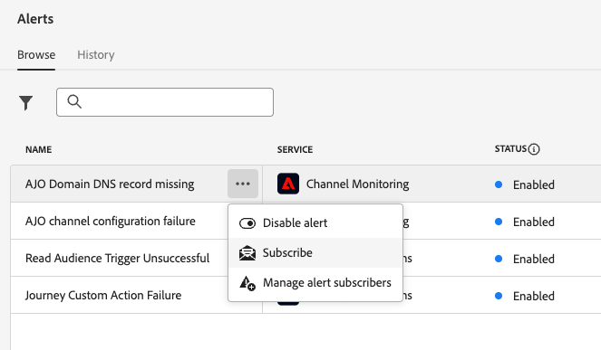
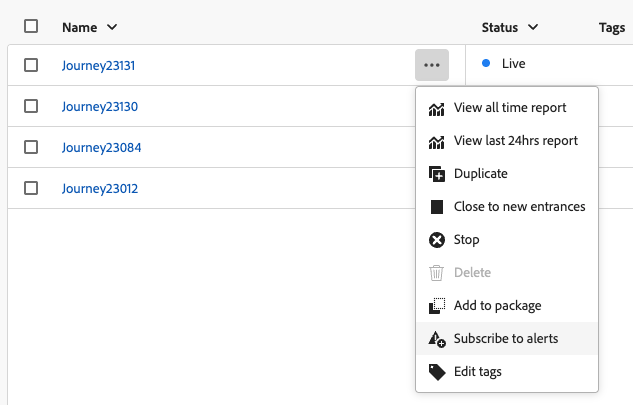
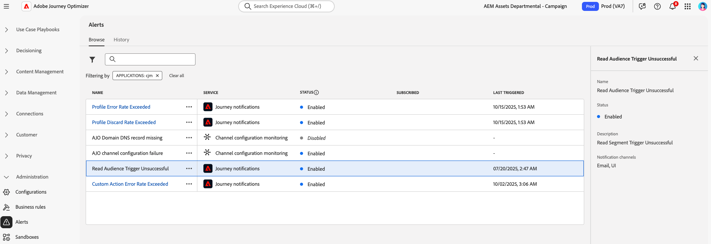
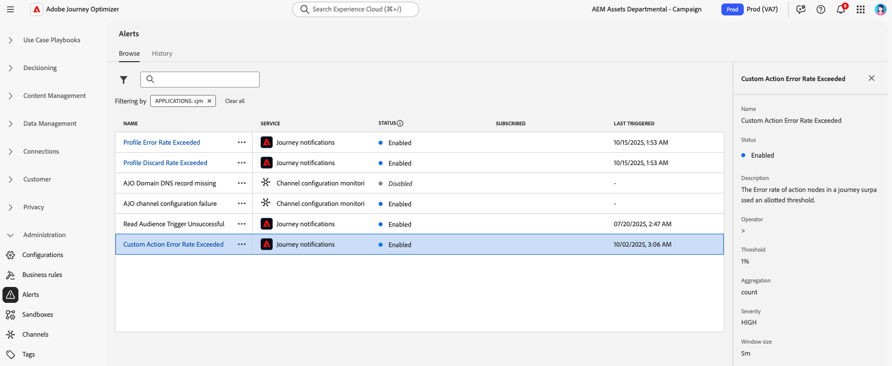
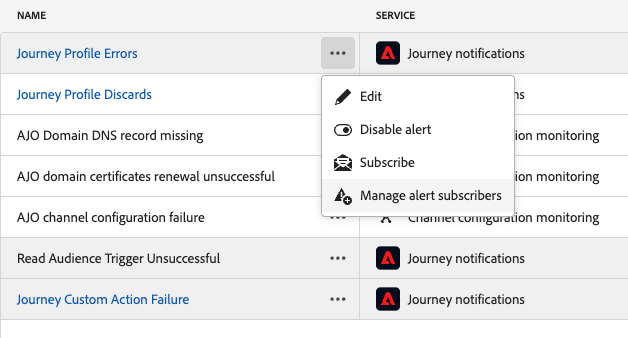
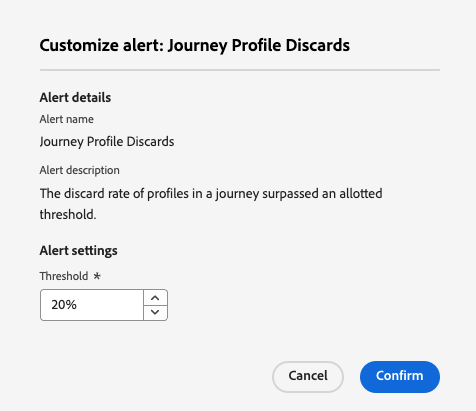
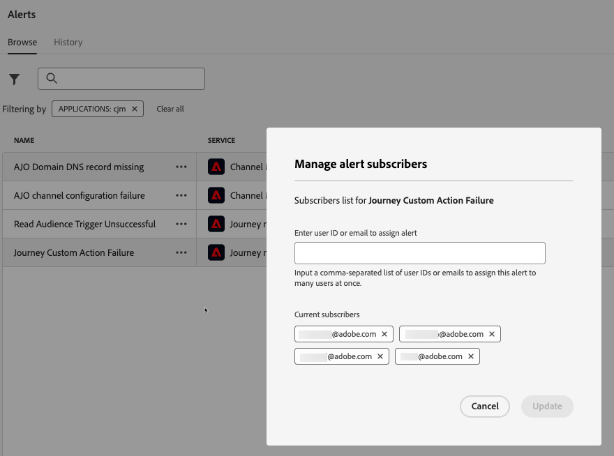

# 存取及訂閱系統警示 {#alerts}

建立您的歷程與行銷活動時，請使用&#x200B;**警示**&#x200B;按鈕，在執行或發佈錯誤之前檢查並解決錯誤。

* 在[此頁面](../building-journeys/troubleshooting.md)瞭解如何疑難排解您的歷程

* 瞭解如何檢閱及啟用您的行銷活動： [動作行銷活動](../campaigns/review-activate-campaign.md) | [API觸發的行銷活動](../campaigns/review-activate-api-triggered-campaign.md) | [協調的行銷活動](../orchestrated/start-monitor-campaigns.md)

除了這些以外，當達到特定條件集時，警示訊息可以傳送給貴組織中已訂閱這些警示訊息的任何使用者。 這些警示可從專用的&#x200B;**[!UICONTROL 警示]**&#x200B;功能表取得。 Adobe Experience Platform提供數個預先定義的警報規則，供您為組織啟用。 此外，您可以訂閱[!DNL Adobe Journey Optimizer]特定系統警示，如本頁所詳述。

>[!NOTE]
>
>在[Adobe Experience Platform檔案](https://experienceleague.adobe.com/docs/experience-platform/observability/alerts/overview.html?lang=zh-Hant){target="_blank"}中進一步瞭解Adobe Experience Platform中的警示。

在左側功能表的&#x200B;**[!UICONTROL 管理]**&#x200B;下，按一下&#x200B;**[!UICONTROL 警示]**。 **瀏覽**&#x200B;索引標籤中有數個預先設定的Journey Optimizer警報。

* 歷程專屬警報：

   * [讀取對象觸發器失敗](#alert-read-audiences)警報
   * [自訂動作錯誤率超過](#alert-custom-action-error-rate)警報（取代先前歷程自訂動作失敗警報）
   * [超過設定檔捨棄率](#alert-discard-rate)警示
   * [設定檔錯誤率超過](#alert-profile-error-rate)警報

* 特定於通道設定的警示：

   * [AJO網域DNS記錄遺失](#alert-dns-record-missing)警報
   * [AJO通道設定失敗](#alert-channel-config-failure)警報
     <!--* the [AJO domain certificates renewal unsuccessful](#alert-certificates-renewal) alert-->

## 訂閱警報 {#subscribe-alerts}

如果發生非預期的行為，和/或您的作業達到特定條件集（例如系統違反臨界值時會發生潛在問題），警示通知會傳送給組織中訂閱這些通知的任何使用者。

您可以從使用者介面個別訂閱每個警示，或是從&#x200B;**[!UICONTROL 警示]**&#x200B;功能表全域訂閱（請參閱[全域訂閱](#global-subscription)），或是單一訂閱特定歷程（請參閱[單一訂閱](#unitary-subscription)）。

根據訂閱者的偏好設定，警報會透過電子郵件傳送，及/或直接在使用者介面右上角的Journey Optimizer通知中心（應用程式內通知）傳送。 選取您要如何在[!DNL Adobe Experience Cloud] **[!UICONTROL 偏好設定]**&#x200B;中接收這些警示。 [了解更多](../start/user-interface.md#in-product-alerts)

警報解決後，訂閱者會收到「已解決」通知。 警報會在1小時後解決，以防止切換值。

### 全域訂閱 {#global-subscription}

若要訂閱/取消訂閱所有歷程與行銷活動的警報，請遵循下列步驟：

1. 從左側功能表瀏覽至&#x200B;**[!UICONTROL 警示]**&#x200B;儀表板，選取您要訂閱之警示的&#x200B;**[!UICONTROL 訂閱]**&#x200B;選項。

   {width=80%}

   >[!NOTE]
   >
   >訂閱僅適用於特定沙箱。 您必須分別為每個沙箱訂閱警報。

1. 使用相同的方法&#x200B;**[!UICONTROL 取消訂閱]**。

您也可以透過[I/O事件通知](https://experienceleague.adobe.com/docs/experience-platform/observability/alerts/subscribe.html?lang=zh-Hant){target="_blank"}來訂閱。 警報規則會整理到不同的訂閱套件中。 與特定Journey Optimizer警示對應的事件訂閱在[底下](#journey-alerts)詳細說明。

### 單一訂閱 {#unitary-subscription}

若要訂閱/取消訂閱特定歷程的警報，請遵循下列步驟：

1. 瀏覽至歷程詳細目錄，並為特定歷程選取&#x200B;**[!UICONTROL 訂閱警示]**&#x200B;選項。

   {width=75%}

1. 選擇警報。 可以使用下列警示： [超過設定檔捨棄率](#alert-discard-rate)、[超過自訂動作錯誤率](#alert-custom-action-error-rate)以及[超過設定檔錯誤率](#alert-profile-error-rate)。

1. 若要取消訂閱警報，請從相同畫面取消選取警報。

1. 按一下&#x200B;**[!UICONTROL 儲存]**&#x200B;以確認。

<!--To enable email alerting, refer to [Adobe Experience Platform documentation](https://experienceleague.adobe.com/docs/experience-platform/observability/alerts/ui.html?lang=zh-Hant#enable-email-alerts){target="_blank"}.-->

## 歷程警報 {#journey-alerts}

以下列出使用者介面中可用的所有歷程通知。

>[!CAUTION]
>
>Adobe Journey Optimizer特定警示僅適用於&#x200B;**即時**&#x200B;歷程。 在測試模式中，不會為歷程觸發警報。

### 讀取對象觸發器失敗 {#alert-read-audiences}

如果&#x200B;**讀取對象**&#x200B;活動在排定的執行時間後10分鐘未處理任何設定檔，此警報會警告您。 此失敗可能是技術問題或對象空白所造成。 如果失敗是由技術問題引起的，請注意，根據問題型別，重試仍可能發生（例如：如果匯出作業建立失敗，我們將每10mn重試一次，最長為1h）。

有關&#x200B;**讀取對象**&#x200B;活動的警示僅適用於週期性歷程。 **在即時歷程中讀取對象**&#x200B;活動，其排程為&#x200B;**執行一次**&#x200B;或&#x200B;**儘快**&#x200B;會被忽略。

當設定檔進入&#x200B;**讀取對象**&#x200B;節點時，或在1小時後，解決&#x200B;**讀取對象**&#x200B;上的警示。

與&#x200B;**讀取對象觸發失敗**&#x200B;警示對應的I/O事件訂閱名稱為&#x200B;**歷程讀取對象延遲、失敗和錯誤**。

若要針對&#x200B;**讀取對象**&#x200B;警示進行疑難排解，請在Experience Platform介面中檢查您的對象計數。

### 超出輪廓捨棄率 {#alert-discard-rate}

如果過去5分鐘內捨棄的設定檔與輸入的設定檔之比超過臨界值，此警報會發出警告。 預設臨界值設定為20%，但您可以[定義自訂臨界值](#custom-threshold)。

按一下警示的名稱以檢查警示詳細資訊和組態。

可以捨棄設定檔有幾個原因，這會通知疑難排解方法。 常見原因如下：

* 因為設定檔已位於單一歷程中，所以在登入時會捨棄設定檔。 若要解決此問題，請確保設定檔有足夠的時間在下一個事件到達該設定檔之前退出歷程。
* 未針對設定檔設定身分，或讀取對象歷程使用的名稱空間未在該設定檔中使用。 若要解決此問題，請確保歷程中的名稱空間與設定檔使用的身分名稱空間相符。
* 超過事件輸送率。 若要解決此問題，請確保進入系統的事件不超過這些限制。

### 超出自訂動作錯誤率 {#alert-custom-action-error-rate}

如果自訂動作錯誤與過去5分鐘成功HTTP呼叫的比率超過臨界值，此警報會警告您。 預設臨界值設定為20%，但您可以[定義自訂臨界值](#custom-threshold)。

>[!NOTE]
>
>此警報會取代先前的&#x200B;**歷程自訂動作失敗**&#x200B;警報。

按一下警示的名稱以檢查警示詳細資訊和組態。

自訂動作錯誤可能因各種原因而發生。 若要疑難排解這些錯誤，您可以：

* 在另一個歷程中使用[測試模式](../building-journeys/testing-the-journey.md)檢查您的自訂動作。
* 檢查您的[歷程報告](../reports/journey-live-report.md)，以檢視動作的錯誤原因。
* 檢查您的歷程stepEvents ，以尋找「failureReason」的詳細資訊。
* 檢查自訂動作是否已正確設定，並驗證驗證是否仍然有效。 例如，使用Postman執行手動檢查。
* 檢查端點是否可連線，以及自訂動作是否可透過自訂動作連線檢查器連線。
* 驗證驗證認證、檢查網際網路連線能力等。

### 超出輪廓錯誤率 {#alert-profile-error-rate}

如果過去5分鐘內錯誤設定檔與輸入設定檔的比率超過臨界值，此警報會警告您。 預設臨界值設定為20%，但您可以[定義自訂臨界值](#custom-threshold)。

按一下警示的名稱以檢查警示詳細資訊和組態。

若要疑難排解設定檔錯誤，您可以查詢步驟事件中的資料，以瞭解設定檔在歷程中失敗的位置和原因。

## 設定警報 {#configuration-alerts}

以下列出使用者介面中可用的通道設定監視警示。

### AJO網域DNS記錄遺失 {#alert-dns-record-missing}

當缺少正確傳遞能力設定所需的關鍵DNS記錄（NS或CNAME）或設定錯誤時，此警報會通知您。 如果沒有這些記錄，電子郵件傳遞能力可能會受到損害。

>[!NOTE]
>
>* NS記錄是委派給Adobe完整子網域所必需的。 [了解更多](../configuration/about-subdomain-delegation.md#full-subdomain-delegation)
>
>* CNAME記錄支援CNAME子網域設定。 [了解更多](../configuration/about-subdomain-delegation.md#cname-subdomain-setup)

當系統偵測到所需的NS或CNAME記錄不存在或不符合設定標準時，就會觸發&#x200B;**AJO網域DNS記錄遺失**&#x200B;警報。

1. 按一下警示以導向介面[中受影響的](../configuration/delegate-subdomain.md)子網域[!DNL Journey Optimizer]。

   <!--For guidance on editing delegated subdomains, see [this section](../configuration/delegate-subdomain.md).-->

1. 請正確設定記錄並再次[提交子網域](../configuration/delegate-subdomain.md#submit-subdomain)委派，以修正DNS設定。

   >[!NOTE]
   >
   >在繼續之前，請確定已在您的網域託管解決方案上正確建立所有記錄。

1. 如果您不確定正確的值，可以在[!DNL Journey Optimizer]中建立與受影響子網域同名的新子網域。 [瞭解如何設定新的子網域](../configuration/delegate-subdomain.md#set-up-subdomain)

如果變更無法解決問題，第二天將再次觸發相同的警報。

<!--The I/O event subscription name corresponding to this alert is xx. > Do we need to mention this?-->

### AJO通道設定失敗 {#alert-channel-config-failure}

>[!IMPORTANT]
>
>此警示僅適用於使用&#x200B;**自訂子網域**&#x200B;委派型別的[電子郵件](../configuration/delegate-custom-subdomain.md)通道設定。<!--Other channel types (such as SMS, push, or in-app) are not covered by this alert.-->

如果系統稽核偵測到電子郵件通道設定問題，則會觸發此警報。 這些問題可能包括設定錯誤的通道設定、無效的DNS設定、隱藏清單問題、IP不一致或任何其他可能影響電子郵件傳送的錯誤。

如果您收到這類警示，解析步驟如下所示：

1. 按一下警示以導向至[介面中受影響的](../email/get-started-email-config.md)電子郵件通道設定[!DNL Journey Optimizer]。

   如需編輯頻道設定的指南，請參閱[本節](../configuration/channel-surfaces.md#edit-channel-surface)。

1. 檢閱提供的設定詳細資料和錯誤訊息。 常見的失敗原因包括：

   * SPF驗證失敗
   * DKIM驗證失敗
   * MX記錄驗證失敗
   * 無效的DNS記錄

   >[!NOTE]
   >
   >可能組態失敗的原因列於[此區段](../configuration/channel-surfaces.md)中。

1. 解決問題：

   * 視需要更新頻道設定。
   * 您可能需要修正警報中提到的特定DNS問題。

   >[!NOTE]
   >
   >由於單一網域可與多個管道設定相關聯，針對一個管道設定解決DNS問題可能會自動修復多個設定中的相關問題。

如果變更無法解決問題，第二天將再次觸發相同的警報。

解決電子郵件設定問題時，請牢記以下列出的最佳實務：

* 立即行動 — 一偵測到設定失敗就立即處理它們，以避免電子郵件傳送中斷。
* 檢查所有設定 — 如果警報指出多個受影響的電子郵件設定，請檢視並修正每個設定。

<!--### AJO domain certificates renewal unsuccessful {#alert-certificates-renewal}

This alert warns you if a domain certificate (CDN, tracking URL) renewal failed for a specific Journey Optimizer subdomain.-->

## 管理警報 {#manage-alerts}

### 編輯警報

您可以按一下警示的行來檢查其詳細資訊。 名稱、狀態和通知通道會顯示在左側面板中。
對於歷程警示，請使用&#x200B;**[!UICONTROL 更多動作]**&#x200B;按鈕來編輯它們。 然後您可以為這些警示定義[自訂臨界值](#custom-threshold)。

{width=60%}

### 定義自訂臨界值 {#custom-threshold}

您可以設定[歷程警示](#journey-alerts)的臨界值。 超過預設值的臨界值警報為20%。

若要變更臨界值：

1. 瀏覽至&#x200B;**警示**&#x200B;畫面
1. 按一下警示的&#x200B;**[!UICONTROL 其他動作]**&#x200B;按鈕以進行更新
1. 輸入新臨界值並確認。 新臨界值適用於&#x200B;**所有**&#x200B;歷程

{width=60%}

>[!CAUTION]
>
>所有歷程的臨界值層級都是全域的，不能為每個歷程個別修改。

### 停用警示

預設會啟用所有警示。 若要停用警示，請選取&#x200B;**[!UICONTROL 停用警示]**&#x200B;選項：此警示的所有訂閱者將不再收到相關通知。

### 警示狀態

可能的警示狀態如下：

* **[!UICONTROL 已啟用]** — 警示已啟用，目前正在監視觸發條件。
* **[!UICONTROL 已停用]** — 警示已停用，目前未監視觸發條件。 您不會收到此警示的通知。
* **[!UICONTROL 已觸發]** — 目前符合警示的觸發條件。

### 檢視和更新訂閱者 {#manage-subscribers}

選取&#x200B;**[!UICONTROL 管理警示訂閱者]**&#x200B;以檢視訂閱警示的使用者清單。

{width=80%}

若要新增更多訂閱者，請輸入以逗號分隔的電子郵件，然後選取&#x200B;**[!UICONTROL 更新]**。

若要移除訂閱者，請從目前的訂閱者中刪除其電子郵件地址，然後選取&#x200B;**[!UICONTROL 更新]**。

## 其他資源 {#additional-resources-alerts}

* 在[此頁面](../building-journeys/troubleshooting.md)瞭解如何疑難排解您的歷程。
* 瞭解如何在[此頁面](../campaigns/review-activate-campaign.md)上檢閱您的行銷活動。
