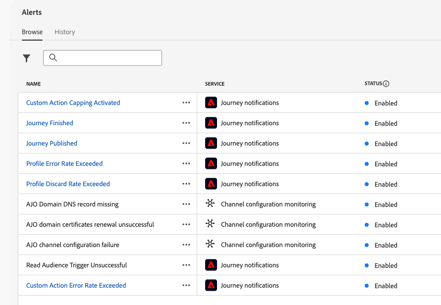

# 存取及訂閱系統警示 {#alerts}

## 概觀

警報是自動化通知，可協助您監視和疑難排解Adobe Journey Optimizer中的問題。 它們可讓您即時察覺歷程、行銷活動和管道設定中的潛在問題，讓您在客戶體驗受到影響之前採取修正動作。

Adobe Journey Optimizer提供兩種警報：

* **畫布內驗證警示**：建立歷程與行銷活動時，請使用畫布中的&#x200B;**警示**&#x200B;按鈕，在發佈之前識別並解決設定錯誤。 瞭解如何[疑難排解您的歷程](../building-journeys/troubleshooting.md)並檢閱您的行銷活動： [動作行銷活動](../campaigns/review-activate-campaign.md) | [API觸發的行銷活動](../campaigns/review-activate-api-triggered-campaign.md) | [協調的行銷活動](../orchestrated/start-monitor-campaigns.md)。

* **系統監視警示** （在此頁面上詳細說明）：當超過操作臨界值或在即時歷程和頻道設定中偵測到問題時，接收主動通知。 系統警報會監控量度，例如錯誤率、設定檔放棄和電子郵件傳遞問題。

**系統警示的主要優點：**

* 在客戶影響之前主動偵測問題
* 自動監控歷程績效和健康狀況
* 電子郵件傳遞能力的早期警告
* 縮短辨識及解決營運問題的時間

系統警示可從&#x200B;**[!UICONTROL 管理]**&#x200B;下的&#x200B;**[!UICONTROL 警示]**&#x200B;功能表取得。 Adobe Experience Platform提供數個您可啟用的預先定義警報規則，包括歷程和通道設定的[!DNL Adobe Journey Optimizer]特定警報。

## 先決條件

處理警示之前：

* **許可權**：您需要特定許可權才能檢視及管理警示。 檢視Adobe Experience Platform[中的](https://experienceleague.adobe.com/docs/experience-platform/observability/alerts/overview.html#permissions){target="_blank"}必要許可權。

* **沙箱感知度**：警示訂閱是沙箱專屬訂閱。 當您訂閱警報時，警報只會套用至目前的沙箱。 沙箱重設時，所有警報訂閱也會重設。

* **通知偏好設定**：設定您在[Adobe Experience Cloud偏好設定](../start/user-interface.md#in-product-uc)中接收警示的方式（電子郵件及/或應用程式內）。

>[!NOTE]
>
>Journey Optimizer特定警示僅適用於&#x200B;**即時**&#x200B;歷程。 在測試模式中，不會為歷程觸發警報。 如需有關警示架構的詳細資訊，請參閱[Adobe Experience Platform警示檔案](https://experienceleague.adobe.com/docs/experience-platform/observability/alerts/overview.html?lang=zh-Hant){target="_blank"}。

## Journey Optimizer中的可用警報 {#available-alerts}

Journey Optimizer提供預先設定的警報規則，可監控歷程和管道設定的特定方面。 您不需要建立這些警報，這些警報是現成可用的，可透過訂閱啟用。

**若要存取警示清單：**

導覽至左側功能表中的&#x200B;**[!UICONTROL 管理]** > **[!UICONTROL 警示]**。 **瀏覽**&#x200B;索引標籤會顯示Journey Optimizer可用的所有預先設定警報。

{width=50%}

### 警示類別

Journey Optimizer提供兩種系統警報類別：

>[!BEGINTABS]

>[!TAB 歷程警示]

監視歷程執行和效能：

* [讀取對象觸發失敗](#alert-read-audiences) — 當讀取對象活動無法處理設定檔時發出警告
* [超出自訂動作錯誤率](#alert-custom-action-error-rate) — 偵測自訂動作API呼叫中的高錯誤率（取代先前的歷程自訂動作失敗警報）
* [超過設定檔捨棄率](#alert-discard-rate) — 識別設定檔以異常速率捨棄的情況
* [超過設定檔錯誤率](#alert-profile-error-rate) — 在歷程執行期間設定檔遇到錯誤時標示錯誤
* [已發佈歷程](#alert-journey-published) — 發佈歷程時的資訊通知
* [歷程已完成](#alert-journey-finished) — 歷程完成時的資訊通知
* [已觸發自訂動作上限](#alert-custom-action-capping) — 在達到API呼叫限制時通知

>[!TAB 頻道設定警示]

偵測電子郵件傳遞能力設定的問題：

* [AJO網域DNS記錄遺失](#alert-dns-record-missing) — 識別遺失或設定錯誤的DNS記錄
* [AJO通道設定失敗](#alert-channel-config-failure) — 偵測到電子郵件設定問題(SPF、DKIM、MX記錄)
  <!--* the [AJO domain certificates renewal unsuccessful](#alert-certificates-renewal) alert-->

>[!ENDTABS]

>[!NOTE]
>
>如需其他Adobe Experience Platform服務（資料擷取、身分解析、細分等）的警示，請參閱[標準警示規則檔案](https://experienceleague.adobe.com/docs/experience-platform/observability/alerts/rules.html){target="_blank"}。

## 訂閱警報 {#subscribe-alerts}

警報訂閱可決定哪些使用者會在符合特定條件時收到通知（例如超過錯誤率臨界值或偵測到設定問題）。 只有已訂閱的使用者會收到所選警示的警示通知。

### 訂閱方法

您可以透過兩種方式訂閱警報：

* **[全域訂閱](#global-subscription)**：套用至目前沙箱中的所有歷程與行銷活動。 當您想要監控整個組織的所有歷程活動時，請使用此方法。
* **[歷程特定訂閱](#unitary-subscription)**：僅套用至個別歷程。 當您想要監視特定高優先順序的歷程，而不接收所有歷程的警報時，請使用此方法。

### 警示通知的運作方式

**警示生命週期：**

1. **正在觸發**：警示會在符合其特定條件時觸發（例如，錯誤率超過20%）
2. **通知**：所有訂閱的使用者都會透過其設定的頻道接收通知
3. **監視**：警示會定期繼續監視狀況
4. **解決方式**：條件解決時，訂閱者會收到「已解決」通知

**通知傳遞：**

* **傳遞管道**：警示會透過電子郵件和/或Journey Optimizer通知中心（右上角的鈴鐺圖示）的應用程式內通知傳送。 在[Adobe Experience Cloud偏好設定](../start/user-interface.md#in-product-uc)中設定您偏好的傳遞管道。

* **警報型別**： Journey Optimizer提供一次性警報（類似「歷程已發佈」之類的資訊性事件）和重複警報（監視臨界值）。 重複警報會持續評估和通知，直到條件解決為止。

* **自動解析**：若要防止通知疲勞使值波動，即使條件持續存在，警示也會在1小時後自動解析。 這可防止在量度暫留在臨界值附近時持續收到通知。

**替代訂閱方法：**

若要進行進階整合，您可以透過I/O事件訂閱以傳送警報給外部系統。 請參閱[Adobe Experience Platform檔案](https://experienceleague.adobe.com/docs/experience-platform/observability/alerts/subscribe.html){target="_blank"}。

### 全域訂閱 {#global-subscription}

全域訂閱可讓您接收目前沙箱中所有歷程和行銷活動的警報。

**訂閱警示：**

1. 導覽至左側功能表中的&#x200B;**[!UICONTROL 管理]** > **[!UICONTROL 警示]**。

1. 在&#x200B;**[!UICONTROL 瀏覽]**&#x200B;標籤中，找出您要監視的警示。

1. 按一下&#x200B;**[!UICONTROL 訂閱]**&#x200B;以取得所需的警示。

   {width=80%}

**取消訂閱：**

按一下警示旁的&#x200B;**[!UICONTROL 取消訂閱]**。

>[!IMPORTANT]
>
>警報訂閱是沙箱專屬的。 您必須在每個要接收通知的沙箱中分別訂閱警報。

**替代訂閱方法：**

您也可以透過[I/O事件通知](https://experienceleague.adobe.com/docs/experience-platform/observability/alerts/subscribe.html){target="_blank"}訂閱，此通知可與外部系統整合。 Journey Optimizer警示的事件訂閱名稱會列在底下的每個[警示說明中](#journey-alerts)。

### 歷程特定訂閱 {#unitary-subscription}

歷程特定訂閱可讓您監視個別高優先順序的歷程，而不會收到組織中所有歷程的警報。

**訂閱特定歷程的警示：**

1. 前往歷程詳細目錄。

1. 按一下您要監視之歷程的&#x200B;**⋯** （其他動作）功能表。

1. 選取&#x200B;**[!UICONTROL 訂閱警示]**。

   {width=75%}

1. 從可用選項中選取要啟用的警示：
   * [超出輪廓捨棄率](#alert-discard-rate)
   * [超出自訂動作錯誤率](#alert-custom-action-error-rate)
   * [超出輪廓錯誤率](#alert-profile-error-rate)
   * [已發佈歷程](#alert-journey-published)
   * [歷程已完成](#alert-journey-finished)
   * [自訂動作上限已觸發](#alert-custom-action-capping)

1. 按一下&#x200B;**[!UICONTROL 儲存]**&#x200B;以確認您的訂閱。

**取消訂閱：**

開啟相同的對話方塊，取消選取警示，然後按一下[儲存]。**&#x200B;**

>[!NOTE]
>
>[讀取對象觸發失敗](#alert-read-audiences)警示只能透過全域訂閱取得，不能透過每個歷程訂閱取得。

<!--To enable email alerting, refer to [Adobe Experience Platform documentation](https://experienceleague.adobe.com/docs/experience-platform/observability/alerts/ui.html#enable-email-alerts){target="_blank"}.-->

## 歷程警報 {#journey-alerts}

以下列出使用者介面中可用的所有歷程通知。

>[!CAUTION]
>
>Adobe Journey Optimizer特定警示僅適用於&#x200B;**即時**&#x200B;歷程。 在測試模式中，不會為歷程觸發警報。

### 讀取對象觸發器失敗 {#alert-read-audiences}

如果&#x200B;**讀取對象**&#x200B;活動在排定的執行時間後10分鐘未處理任何設定檔，此警報會警告您。 此失敗可能是技術問題或對象空白所造成。 如果失敗是由技術問題引起的，請注意，根據問題型別，重試仍可能發生（例如：如果匯出作業建立失敗，我們將每10mn重試一次，最長為1h）。

有關&#x200B;**讀取對象**&#x200B;活動的警示僅適用於週期性歷程。 **在即時歷程中讀取對象**&#x200B;活動，其排程為&#x200B;**執行一次**&#x200B;或&#x200B;**儘快**&#x200B;會被忽略。

當設定檔進入&#x200B;**讀取對象**&#x200B;節點時，或在1小時後，解決&#x200B;**讀取對象**&#x200B;上的警示。

與&#x200B;**讀取對象觸發失敗**&#x200B;警示對應的I/O事件訂閱名稱為&#x200B;**歷程讀取對象延遲、失敗和錯誤**。

若要針對&#x200B;**讀取對象**&#x200B;警示進行疑難排解，請在Experience Platform介面中檢查您的對象計數。

### 超出輪廓捨棄率 {#alert-discard-rate}

如果過去5分鐘內捨棄的設定檔與輸入的設定檔之比超過臨界值，此警報會發出警告。 預設臨界值設定為20%，但您可以[定義自訂臨界值](#custom-threshold)。

按一下警示的名稱以檢查警示詳細資訊和組態。

可以捨棄設定檔有幾個原因，這會通知疑難排解方法。 常見原因如下：

* 因為設定檔已位於單一歷程中，所以在登入時會捨棄設定檔。 若要解決此問題，請確保設定檔有足夠的時間在下一個事件到達該設定檔之前退出歷程。
* 未針對設定檔設定身分，或讀取對象歷程使用的名稱空間未在該設定檔中使用。 若要解決此問題，請確保歷程中的名稱空間與設定檔使用的身分名稱空間相符。
* 超過事件輸送率。 若要解決此問題，請確保進入系統的事件不超過這些限制。

### 超出自訂動作錯誤率 {#alert-custom-action-error-rate}

如果自訂動作錯誤與過去5分鐘成功HTTP呼叫的比率超過臨界值，此警報會警告您。 預設臨界值設定為20%，但您可以[定義自訂臨界值](#custom-threshold)。

>[!NOTE]
>
>此警報會取代先前的&#x200B;**歷程自訂動作失敗**&#x200B;警報。

按一下警示的名稱以檢查警示詳細資訊和組態。

自訂動作錯誤可能因各種原因而發生。 若要疑難排解這些錯誤，您可以：

* 在另一個歷程中使用[測試模式](../building-journeys/testing-the-journey.md)檢查您的自訂動作。
* 檢查您的[歷程報告](../reports/journey-live-report.md)，以檢視動作的錯誤原因。
* 檢查您的歷程stepEvents ，以尋找「failureReason」的詳細資訊。
* 檢查自訂動作是否已正確設定，並驗證驗證是否仍然有效。 例如，使用Postman執行手動檢查。
* 檢查端點是否可連線，以及自訂動作是否可透過自訂動作連線檢查器連線。
* 驗證驗證認證、檢查網際網路連線能力等。

### 超出輪廓錯誤率 {#alert-profile-error-rate}

如果過去5分鐘內錯誤設定檔與輸入設定檔的比率超過臨界值，此警報會警告您。 預設臨界值設定為20%，但您可以[定義自訂臨界值](#custom-threshold)。

按一下警示的名稱以檢查警示詳細資訊和組態。

若要疑難排解設定檔錯誤，您可以查詢步驟事件中的資料，以瞭解設定檔在歷程中失敗的位置和原因。

### 已發佈歷程 {#alert-journey-published}

此警報會在從業人員在歷程畫布中發佈歷程時通知您。

此資訊性警報可協助您追蹤組織中的歷程生命週期事件。 沒有解決標準，因為這是一次性通知。

### 歷程已完成 {#alert-journey-finished}

此警報會在歷程完成後通知您。 「已完成」的定義會因歷程型別而異。 [進一步瞭解何時將歷程視為已完成](../building-journeys/end-journey.md#journey-finished-definition)。

這是資訊性警報，可幫助您追蹤歷程完成。 沒有解決標準，因為這是一次性通知。

### 自訂動作上限已觸發 {#alert-custom-action-capping}

當自訂動作觸發上限時，此警報會警告您。 上限是用來限制傳送至外部端點的呼叫數目，以防止端點過多。

按一下警示的名稱以檢查警示詳細資訊和組態。

觸發上限時，這表示在定義的時段內已達到API呼叫的最大數量，且有更多的呼叫正在節流或排入佇列。 深入瞭解[此頁面](../action/about-custom-action-configuration.md#custom-action-enhancements-best-practices)上的自訂動作上限。

當上限不再作用中，或在評估期間設定檔沒有達到自訂動作時，此警報即解決。

若要疑難排解上限問題：

* 請檢閱自訂動作的上限設定，確保上限適用於您的使用案例。
* 檢查API呼叫量是否高於預期，並考慮調整您的歷程設計或上限設定。
* 監視外部端點，以確保其可以處理預期的負載。

## 設定警報 {#configuration-alerts}

以下列出使用者介面中可用的通道設定監視警示。

### AJO網域DNS記錄遺失 {#alert-dns-record-missing}

當缺少正確傳遞能力設定所需的關鍵DNS記錄（NS或CNAME）或設定錯誤時，此警報會通知您。 如果沒有這些記錄，電子郵件傳遞能力可能會受到損害。

>[!NOTE]
>
>* NS記錄是委派給Adobe完整子網域所必需的。 [了解更多](../configuration/about-subdomain-delegation.md#full-subdomain-delegation)
>
>* CNAME記錄支援CNAME子網域設定。 [了解更多](../configuration/about-subdomain-delegation.md#cname-subdomain-setup)

當系統偵測到所需的NS或CNAME記錄不存在或不符合設定標準時，就會觸發&#x200B;**AJO網域DNS記錄遺失**&#x200B;警報。

1. 按一下警示以導向介面[中受影響的](../configuration/delegate-subdomain.md)子網域[!DNL Journey Optimizer]。

   <!--For guidance on editing delegated subdomains, see [this section](../configuration/delegate-subdomain.md).-->

1. 請正確設定記錄並再次[提交子網域](../configuration/delegate-subdomain.md#submit-subdomain)委派，以修正DNS設定。

   >[!NOTE]
   >
   >在繼續之前，請確定已在您的網域託管解決方案上正確建立所有記錄。

1. 如果您不確定正確的值，可以在[!DNL Journey Optimizer]中建立與受影響子網域同名的新子網域。 [瞭解如何設定新的子網域](../configuration/delegate-subdomain.md#set-up-subdomain)

如果變更無法解決問題，第二天將再次觸發相同的警報。

<!--The I/O event subscription name corresponding to this alert is xx. > Do we need to mention this?-->

### AJO通道設定失敗 {#alert-channel-config-failure}

>[!IMPORTANT]
>
>此警示僅適用於使用&#x200B;**自訂子網域**&#x200B;委派型別的[電子郵件](../configuration/delegate-custom-subdomain.md)通道設定。<!--Other channel types (such as SMS, push, or in-app) are not covered by this alert.-->

如果系統稽核偵測到電子郵件通道設定問題，則會觸發此警報。 這些問題可能包括設定錯誤的通道設定、無效的DNS設定、隱藏清單問題、IP不一致或任何其他可能影響電子郵件傳送的錯誤。

如果您收到這類警示，解析步驟如下所示：

1. 按一下警示以導向至[介面中受影響的](../email/get-started-email-config.md)電子郵件通道設定[!DNL Journey Optimizer]。

   如需編輯頻道設定的指南，請參閱[本節](../configuration/channel-surfaces.md#edit-channel-surface)。

1. 檢閱提供的設定詳細資料和錯誤訊息。 常見的失敗原因包括：

   * SPF驗證失敗
   * DKIM驗證失敗
   * MX記錄驗證失敗
   * 無效的DNS記錄

   >[!NOTE]
   >
   >可能組態失敗的原因列於[此區段](../configuration/channel-surfaces.md)中。

1. 解決問題：

   * 視需要更新頻道設定。
   * 您可能需要修正警報中提到的特定DNS問題。

   >[!NOTE]
   >
   >由於單一網域可與多個管道設定相關聯，針對一個管道設定解決DNS問題可能會自動修復多個設定中的相關問題。

如果變更無法解決問題，第二天將再次觸發相同的警報。

解決電子郵件設定問題時，請牢記以下列出的最佳實務：

* 立即行動 — 一偵測到設定失敗就立即處理它們，以避免電子郵件傳送中斷。
* 檢查所有設定 — 如果警報指出多個受影響的電子郵件設定，請檢視並修正每個設定。

<!--### AJO domain certificates renewal unsuccessful {#alert-certificates-renewal}

This alert warns you if a domain certificate (CDN, tracking URL) renewal failed for a specific Journey Optimizer subdomain.-->

## 管理警報 {#manage-alerts}

### 編輯警報

您可以按一下警示的行來檢查其詳細資訊。 名稱、狀態和通知通道會顯示在左側面板中。
對於歷程警示，請使用&#x200B;**[!UICONTROL 更多動作]**&#x200B;按鈕來編輯它們。 然後您可以為這些警示定義[自訂臨界值](#custom-threshold)。

{width=60%}

### 定義自訂臨界值 {#custom-threshold}

您可以設定[歷程警示](#journey-alerts)的臨界值。 超過預設值的臨界值警報為20%。

若要變更臨界值：

1. 瀏覽至&#x200B;**警示**&#x200B;畫面
1. 按一下警示的&#x200B;**[!UICONTROL 其他動作]**&#x200B;按鈕以進行更新
1. 輸入新臨界值並確認。 新臨界值適用於&#x200B;**所有**&#x200B;歷程

{width=60%}

>[!CAUTION]
>
>所有歷程的臨界值層級都是全域的，不能為每個歷程個別修改。

### 停用警示

預設會啟用所有警示。 若要停用警示，請選取&#x200B;**[!UICONTROL 停用警示]**&#x200B;選項：此警示的所有訂閱者將不再收到相關通知。

### 警示狀態

可能的警示狀態如下：

* **[!UICONTROL 已啟用]** — 警示已啟用，目前正在監視觸發條件。
* **[!UICONTROL 已停用]** — 警示已停用，目前未監視觸發條件。 您不會收到此警示的通知。
* **[!UICONTROL 已觸發]** — 目前符合警示的觸發條件。

### 檢視和更新訂閱者 {#manage-subscribers}

選取&#x200B;**[!UICONTROL 管理警示訂閱者]**&#x200B;以檢視訂閱警示的使用者清單。

{width=80%}

若要新增更多訂閱者，請輸入以逗號分隔的電子郵件，然後選取&#x200B;**[!UICONTROL 更新]**。

若要移除訂閱者，請從目前的訂閱者中刪除其電子郵件地址，然後選取&#x200B;**[!UICONTROL 更新]**。

## 相關主題 {#additional-resources-alerts}

**歷程與行銷活動管理：**

* [疑難排解歷程](../building-journeys/troubleshooting.md) — 識別並解決常見的歷程問題和錯誤
* [測試並發佈歷程](../building-journeys/publishing-the-journey.md) — 發佈前驗證歷程設定
* [檢閱並啟動動作行銷活動](../campaigns/review-activate-campaign.md) — 排程和一次性行銷活動的發佈前驗證
* [檢閱並啟用API觸發的行銷活動](../campaigns/review-activate-api-triggered-campaign.md) - API觸發的行銷活動驗證
* [監視協調的行銷活動](../orchestrated/start-monitor-campaigns.md) — 追蹤和管理協調的行銷活動執行

**警示架構：**

* [Adobe Experience Platform警示概述](https://experienceleague.adobe.com/docs/experience-platform/observability/alerts/overview.html?lang=zh-Hant){target="_blank"} — 瞭解警示架構
* [在UI中管理警報](https://experienceleague.adobe.com/docs/experience-platform/observability/alerts/ui.html){target="_blank"} — 檢視、訂閱和管理警報
* [透過I/O事件訂閱警示](https://experienceleague.adobe.com/docs/experience-platform/observability/alerts/subscribe.html){target="_blank"} — 進階整合選項
* [標準警示規則](https://experienceleague.adobe.com/docs/experience-platform/observability/alerts/rules.html){target="_blank"} — 完整的可用平台警示清單
