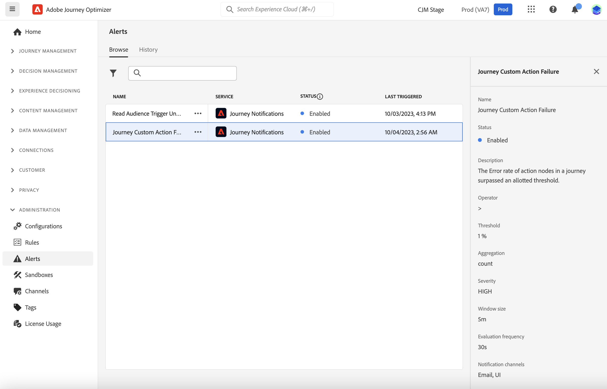
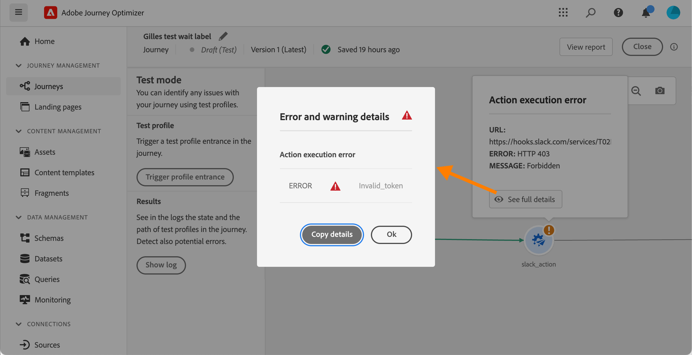
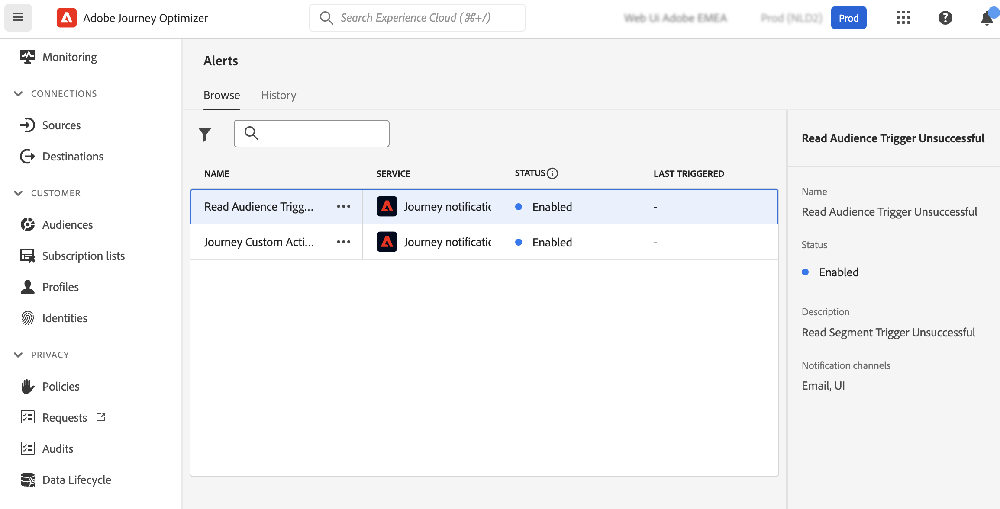
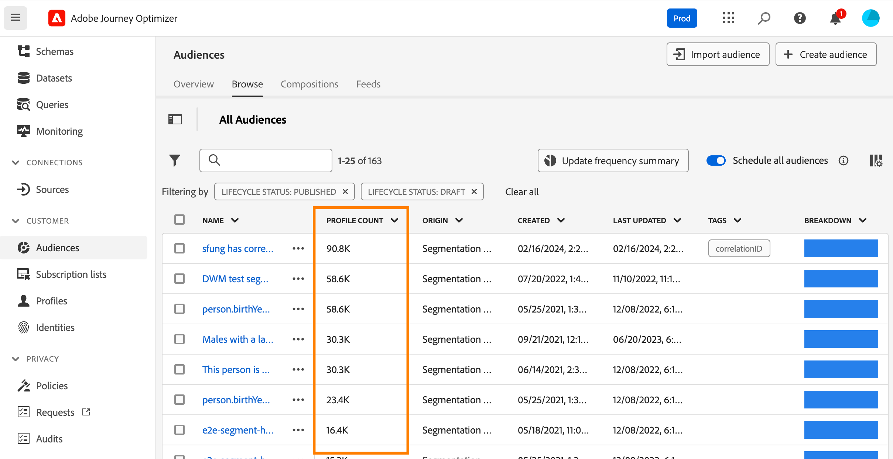
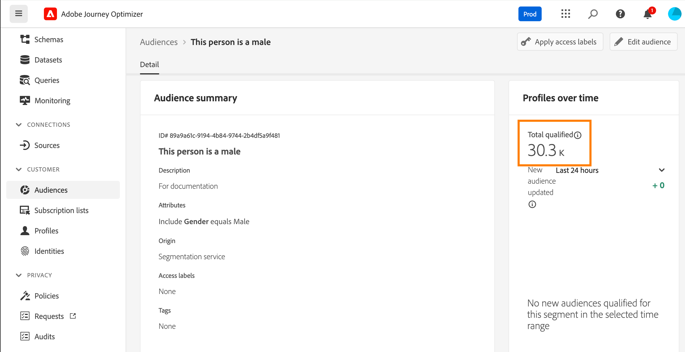

# 存取及訂閱系統警示 {#alerts}

建立您的歷程與行銷活動時，請使用&#x200B;**警示**&#x200B;按鈕，在執行或發佈錯誤之前檢查並解決錯誤。

從專用的&#x200B;**[!UICONTROL 警示]**&#x200B;功能表，您也可以訂閱[!DNL Adobe Journey Optimizer]個系統警示，如本頁所詳述。

## 存取警報 {#access-alerts}

發生失敗時，您可以在Journey Optimizer通知中心取得系統警報（應用程式內警報）及/或接收電子郵件。 若要存取這些警示，請遵循下列步驟。

<!--These messages can repeat over a pre-defined time interval until the alert has been resolved.-->

>[!NOTE]
>
>在[Adobe Experience Platform檔案](https://experienceleague.adobe.com/docs/experience-platform/observability/alerts/overview.html?lang=zh-Hant){target="_blank"}中進一步瞭解Adobe Experience Platform中的警示。

在左側功能表的&#x200B;**[!UICONTROL 管理]**&#x200B;下，按一下&#x200B;**[!UICONTROL 警示]**。 有數種預先設定的Journey Optimizer警報可供使用。

其列示如下，每個警報的詳細資訊如下。

* 歷程專屬警報：

   * [歷程自訂動作失敗](#alert-custom-actions)警報
   * [讀取對象觸發器失敗](#alert-read-audiences)警報
<!--DOCAC-13465   * the [Profile Discard Rate Exceeded](#alert-discard-rate) alert
   * the [Custom Action Error Rate Exceeded](#alert-custom-action-error-rate) alert
   * the [Profile Error Rate Exceeded](#alert-profile-error-rate) alert-->

* 特定於通道設定的警示：

   * [AJO網域DNS記錄遺失](#alert-dns-record-missing)警報
   * [AJO通道設定失敗](#alert-channel-config-failure)警報
     <!--* the [AJO domain certificates renewal unsuccessful](#alert-certificates-renewal) alert-->

## 訂閱警報 {#subscribe-alerts}

如果發生非預期的行為，和/或您的作業達到特定條件集（例如系統違反臨界值時會發生潛在問題），警示通知會傳送給組織中訂閱這些通知的任何使用者。

您可以從使用者介面個別訂閱每個警示，或是從&#x200B;**[!UICONTROL 警示]**&#x200B;功能表全域訂閱（請參閱[全域訂閱](#global-subscription)）<!--DOCAC-13465, or unitary for a specific journey (see [Unitary subscription](#unitary-subscription))-->。

根據訂閱者的偏好設定，警報會透過電子郵件傳送，及/或直接在使用者介面右上角的Journey Optimizer通知中心（應用程式內通知）傳送。 選取您要如何在[!DNL Adobe Experience Cloud] **[!UICONTROL 偏好設定]**&#x200B;中接收這些警示。 [了解更多](../start/user-interface.md#in-product-alerts)

警報解決後，訂閱者會收到「已解決」通知。

### 全域訂閱 {#global-subscription}

若要訂閱/取消訂閱所有歷程與行銷活動的警報，請遵循下列步驟：

1. 從左側功能表瀏覽至&#x200B;**[!UICONTROL 警示]**&#x200B;儀表板，選取您要訂閱之警示的&#x200B;**[!UICONTROL 訂閱]**&#x200B;選項。

   {width=80%}

   >[!NOTE]
   >
   >訂閱僅適用於特定沙箱。 您必須分別為每個沙箱訂閱警報。

1. 使用相同的方法&#x200B;**[!UICONTROL 取消訂閱]**。

您也可以透過[I/O事件通知](https://experienceleague.adobe.com/docs/experience-platform/observability/alerts/subscribe.html?lang=zh-Hant){target="_blank"}來訂閱。 警報規則會整理到不同的訂閱套件中。 與特定Journey Optimizer警示對應的事件訂閱在[底下](#journey-alerts)詳細說明。

<!--DOCAC-13465
### Unitary subscription {#unitary-subscription}

To subscribe/unsubscribe to an alert for a specific journey, follow these steps:

1. Browse to the journey inventory and select the **[!UICONTROL Subscribe to alerts]** option for a specific journey.

      {width=80%}

1. Choose the alert(s). The following alerts are available: [Profile Discard Rate Exceeded](#alert-discard-rate), [Custom Action Error Rate Exceeded](#alert-custom-action-error-rate), and [Profile Error Rate Exceeded](#alert-profile-error-rate).
   
1. To unsubscribe to an alert, unselect it from the same screen.

1. Click **[!UICONTROL Save]** to confirm.
-->

<!--To enable email alerting, refer to [Adobe Experience Platform documentation](https://experienceleague.adobe.com/docs/experience-platform/observability/alerts/ui.html?lang=zh-Hant#enable-email-alerts){target="_blank"}.-->

## 歷程警報 {#journey-alerts}

>[!CAUTION]
>
>Adobe Journey Optimizer特定警示僅適用於&#x200B;**即時**&#x200B;歷程。 在測試模式中，不會為歷程觸發警報。

### 歷程自訂動作失敗 {#alert-custom-actions}

如果自訂動作失敗，此警報會警告您。 我們認為在過去5分鐘內，特定自訂動作發生超過1%的錯誤時失敗。 每30秒評估一次。

按一下警示的名稱以檢查警示詳細資訊和組態。

自訂動作警報會在過去5分鐘內解決：

* 該自訂動作沒有任何錯誤（或低於1%臨界值的錯誤），

* 或者，沒有任何設定檔達到該自訂動作。

對應到自訂動作警示的I/O事件訂閱名稱為&#x200B;**歷程自訂動作失敗**。

若要疑難排解&#x200B;**自訂動作**&#x200B;警示：

* 使用其他歷程上的測試模式檢查您的自訂動作：

  

* 檢查您的歷程報告以檢視動作的錯誤原因。

  

* 檢查您的歷程stepEvents ，以尋找「failureReason」的詳細資訊。

* 檢查您的自訂動作設定，並驗證驗證是否仍然正常。 例如，使用Postman執行手動檢查。

### 讀取對象觸發器失敗 {#alert-read-audiences}

如果&#x200B;**讀取對象**&#x200B;活動在排定的執行時間後10分鐘未處理任何設定檔，此警報會警告您。 此失敗可能是技術問題或對象空白所造成。 如果失敗是由技術問題引起的，請注意，根據問題型別，重試仍可能發生（例如：如果匯出作業建立失敗，我們將每10mn重試一次，最長為1h）。

有關&#x200B;**讀取對象**&#x200B;活動的警示僅適用於週期性歷程。 **在即時歷程中讀取對象**&#x200B;活動，其排程為&#x200B;**執行一次**&#x200B;或&#x200B;**儘快**&#x200B;會被忽略。

當設定檔進入&#x200B;**讀取對象**&#x200B;節點時，**讀取對象**&#x200B;上的警示已解決。

與&#x200B;**讀取對象觸發失敗**&#x200B;警示對應的I/O事件訂閱名稱為&#x200B;**歷程讀取對象延遲、失敗和錯誤**。

若要針對&#x200B;**讀取對象**&#x200B;警示進行疑難排解，請在Experience Platform介面中檢查您的對象計數。

<!--DOCAC-13465

### Profile Discard Rate Exceeded {#alert-discard-rate}

This alert warns you if the ratio of profile discards to entered profiles over the last 5 minutes exceeded threshold. The defaut threshold is set to 20% but you can [define a custom theshold](#custom-threshold).

Click the name of the alert to check the alert details and configuration.

### Custom Action Error Rate Exceeded {#alert-custom-action-error-rate}

This alert warns you if the ratio of custom action errors to successful HTTP calls over the last 5 minutes exceeded threshold. The defaut threshold is set to 20% but you can [define a custom theshold](#custom-threshold).

### Profile Error Rate Exceeded {#alert-profile-error-rate}

This alert warns you if the ratio of custom action errors to successful HTTP calls over the last 5 minutes exceeded threshold. The defaut threshold is set to 20% but you can [define a custom theshold](#custom-threshold).

Click the name of the alert to check the alert details and configuration.
-->

## 設定警報 {#configuration-alerts}

### AJO網域DNS記錄遺失 {#alert-dns-record-missing}

當缺少正確傳遞能力設定所需的關鍵DNS記錄（NS或CNAME）或設定錯誤時，此警報會通知您。 如果沒有這些記錄，電子郵件傳遞能力可能會受到損害。

>[!NOTE]
>
>* NS記錄是委派給Adobe完整子網域所必需的。 [了解更多](../configuration/about-subdomain-delegation.md#full-subdomain-delegation)
>
>* CNAME記錄支援CNAME子網域設定。 [了解更多](../configuration/about-subdomain-delegation.md#cname-subdomain-setup)

當系統偵測到所需的NS或CNAME記錄不存在或不符合設定標準時，就會觸發&#x200B;**AJO網域DNS記錄遺失**&#x200B;警報。

1. 按一下警示以導向介面[中受影響的](../configuration/delegate-subdomain.md)子網域[!DNL Journey Optimizer]。

   <!--For guidance on editing delegated subdomains, see [this section](../configuration/delegate-subdomain.md).-->

1. 請正確設定記錄並再次[提交子網域](../configuration/delegate-subdomain.md#submit-subdomain)委派，以修正DNS設定。

   >[!NOTE]
   >
   >在繼續之前，請確定已在您的網域託管解決方案上正確建立所有記錄。

1. 如果您不確定正確的值，可以在[!DNL Journey Optimizer]中建立與受影響子網域同名的新子網域。 [瞭解如何設定新的子網域](../configuration/delegate-subdomain.md#set-up-subdomain)

如果變更無法解決問題，第二天將再次觸發相同的警報。

<!--The I/O event subscription name corresponding to this alert is xx. > Do we need to mention this?-->

### AJO通道設定失敗 {#alert-channel-config-failure}

>[!IMPORTANT]
>
>此警示僅適用於使用&#x200B;**自訂子網域**&#x200B;委派型別的[電子郵件](../configuration/delegate-custom-subdomain.md)通道設定。<!--Other channel types (such as SMS, push, or in-app) are not covered by this alert.-->

如果系統稽核偵測到電子郵件通道設定問題，則會觸發此警報。 這些問題可能包括設定錯誤的通道設定、無效的DNS設定、隱藏清單問題、IP不一致或任何其他可能影響電子郵件傳送的錯誤。

如果您收到這類警示，解析步驟如下所示：

1. 按一下警示以導向至[介面中受影響的](../email/get-started-email-config.md)電子郵件通道設定[!DNL Journey Optimizer]。

   如需編輯頻道設定的指南，請參閱[本節](../configuration/channel-surfaces.md#edit-channel-surface)。

1. 檢閱提供的設定詳細資料和錯誤訊息。 常見的失敗原因包括：

   * SPF驗證失敗
   * DKIM驗證失敗
   * MX記錄驗證失敗
   * 無效的DNS記錄

   >[!NOTE]
   >
   >可能組態失敗的原因列於[此區段](../configuration/channel-surfaces.md)中。

1. 解決問題：

   * 視需要更新頻道設定。
   * 您可能需要修正警報中提到的特定DNS問題。

   >[!NOTE]
   >
   >由於單一網域可與多個管道設定相關聯，針對一個管道設定解決DNS問題可能會自動修復多個設定中的相關問題。

如果變更無法解決問題，第二天將再次觸發相同的警報。

解決電子郵件設定問題時，請牢記以下列出的最佳實務：

* 立即行動 — 一偵測到設定失敗就立即處理它們，以避免電子郵件傳送中斷。
* 檢查所有設定 — 如果警報指出多個受影響的電子郵件設定，請檢視並修正每個設定。

<!--### AJO domain certificates renewal unsuccessful {#alert-certificates-renewal}

This alert warns you if a domain certificate (CDN, tracking URL) renewal failed for a specific Journey Optimizer subdomain.-->

## 管理警報 {#manage-alerts}

### 編輯警報

您可以按一下警示的行來檢查其詳細資訊。 名稱、狀態和通知通道會顯示在左側面板中。
<!--DOCAC-13465
For Journey alerts, use the **[!UICONTROL More actions]** button to edit them. You can then define a [custom theshold](#custom-threshold) for these alerts.-->

{width=60%}

<!--DOCAC-13465
#### Define a custom threshold {#custom-threshold}

You can set thresholds for the [Journey alerts](#journey-alerts). The threshold alerts above default to 20%. 

To change the threshold:

1. Browse to the **Alerts** screen
1. Click the **[!UICONTROL More actions]** button of the alert to update
1. Enter the new threshold and confirm. The new threshold applies to **all** journeys

{width=60%}

>[!CAUTION]
>
>The threshold levels are global across all journeys and cannot be individually modified per journey.
-->

### 停用警示

預設會啟用所有警示。 若要停用警示，請選取&#x200B;**[!UICONTROL 停用警示]**&#x200B;選項：此警示的所有訂閱者將不再收到相關通知。

### 警示狀態

可能的警示狀態如下：

* **[!UICONTROL 已啟用]** — 警示已啟用，目前正在監視觸發條件。
* **[!UICONTROL 已停用]** — 警示已停用，目前未監視觸發條件。 您不會收到此警示的通知。
* **[!UICONTROL 已觸發]** — 目前符合警示的觸發條件。

### 檢視和更新訂閱者 {#manage-subscribers}

選取&#x200B;**[!UICONTROL 管理警示訂閱者]**&#x200B;以檢視訂閱警示的使用者清單。

{width=80%}

若要新增更多訂閱者，請輸入以逗號分隔的電子郵件，然後選取&#x200B;**[!UICONTROL 更新]**。

若要移除訂閱者，請從目前的訂閱者中刪除其電子郵件地址，然後選取&#x200B;**[!UICONTROL 更新]**。

## 其他資源 {#additional-resources-alerts}

* 在[此頁面](../building-journeys/troubleshooting.md)瞭解如何疑難排解您的歷程。
* 瞭解如何在[此頁面](../campaigns/review-activate-campaign.md)上檢閱您的行銷活動。