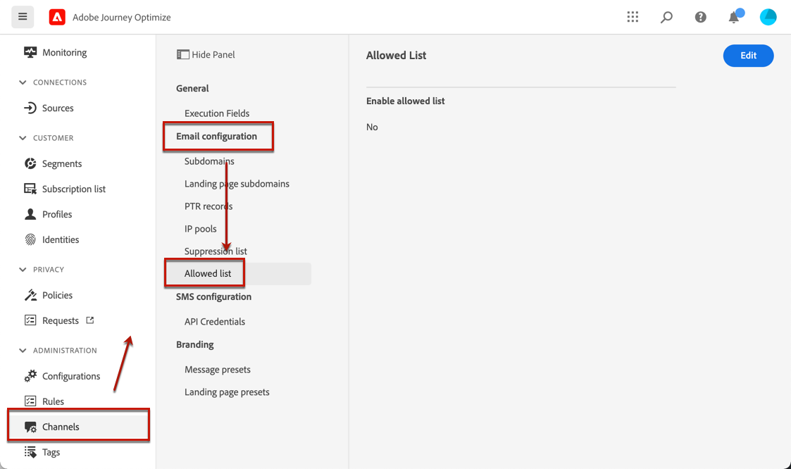
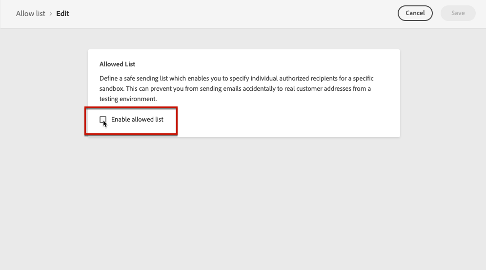

# 允許清單 {#allow-list}

可以在 [沙坑](../administration/sandboxes.md) 級別，具有安全的測試環境。 在可能發生錯誤的非生產執行個體上，允許清單可確保避免您將不需要的訊息傳送給客戶的風險。 

允許的清單允許您指定單個電子郵件地址或域，這些地址或域將是唯一有權接收您從特定沙箱發送的電子郵件的收件人或域。 這可以防止您在測試環境中意外地將電子郵件發送到真實的客戶地址。

>[!CAUTION]
>
>此功能是 **不** 可在生產沙盒上找到。 它只適用於電子郵件通道。

## 啟用允許的清單 {#enable-allow-list}

<!--To enable the allowed list on a non-production sandbox, you need to update the general settings using the corresponding API end point in the Message Presets Service. Using this API, you can also disable the feature at any time.-->

<!--You can update the allowed list before or after enabling the feature. To do so, you need to update the general settings using the corresponding API end point in the Message Presets Service.?-->

要在非生產沙箱上啟用允許的清單，請執行以下步驟。

1. 存取 **[!UICONTROL Channels]** > **[!UICONTROL Email configuration]** > **[!UICONTROL Allow list]** 功能表。

   

1. 按一下「**[!UICONTROL Edit]**」。

   

1. 選擇「**[!UICONTROL Enable allow list]**」。

   

1. 按一下「**[!UICONTROL Save]**」。已啟用允許的清單。

   

啟用功能時，將應用允許的清單邏輯 **和** 的 **不** 空。 瞭解詳情 [此部分](#logic)。

>[!NOTE]
>
>啟用後，在執行行程時，以及在使用測試消息時，都會遵守允許的清單功能 [證明](../design/preview.md#send-proofs) 並測試旅程 [test模式](../building-journeys/testing-the-journey.md)。

## 將實體添加到允許的清單 {#add-entities}

要將新電子郵件地址或域添加到特定沙箱的允許清單中，必須使用 `ALLOWED` 值 `listType` 屬性。 例如：


您可以執行 **添加**。 **刪除** 和 **獲取** 操作。

>[!NOTE]
>
>允許的清單最多可包含1,000個條目。

瞭解有關在中進行API調用的詳細資訊 [Adobe Experience PlatformAPI](https://experienceleague.adobe.com/docs/experience-platform/landing/platform-apis/api-guide.html){target=&quot;_blank&quot;}參考文檔。

## 允許的清單邏輯 {#logic}

當允許清單為 **空**，未應用允許的清單邏輯。 這意味著您可以向任何配置檔案發送電子郵件，前提是這些配置檔案不在 [隱藏清單](suppression-list.md)。

當允許清單為 **空**，將應用允許的清單邏輯：

* 如果實體為 **不在允許的清單中**，而不在禁止清單上，相應的收件人將不會收到電子郵件，原因是 **[!UICONTROL Not allowed]**。

* 如果實體為 **在允許的清單上**，而不是在取消清單中，可以將電子郵件發送給相應的收件人。 但是，如果實體 [隱藏清單](suppression-list.md)，對應的收件人將不會收到電子郵件，原因是 **[!UICONTROL Suppressed]**。

>[!NOTE]
>
>配置檔案 **[!UICONTROL Not allowed]** 在消息發送過程中，狀態被排除。 因此，當 **行程報告** 將顯示這些配置檔案在旅途中移動([讀取段](../building-journeys/read-segment.md) 和 [消息](../building-journeys/journeys-message.md) 活動), **電子郵件報告** 不會把它們包括在 **[!UICONTROL Sent]** 在發送電子郵件之前過濾掉度量。
>
>瞭解 [即時報告](../reports/live-report.md) 和 [全局報告](../reports/global-report.md)。

## 排除報告 {#reporting}

在非生產沙箱上啟用此功能後，可以檢索從發送中排除的電子郵件地址或域，因為這些地址或域不在允許的清單中。 要執行此操作，可使用 [Adobe Experience Platform查詢服務](https://experienceleague.adobe.com/docs/experience-platform/query/api/getting-started.html){target=&quot;_blank&quot;}，以在下面調用API。

獲取 **電子郵件數** 由於收件人不在允許清單中而未發送的，請使用以下查詢：

```sql
SELECT count(distinct _id) from cjm_message_feedback_event_dataset WHERE
_experience.customerJourneyManagement.messageExecution.messageExecutionID = '<MESSAGE_EXECUTION_ID>' AND
_experience.customerJourneyManagement.messageDeliveryfeedback.feedbackStatus = 'exclude' AND
_experience.customerJourneyManagement.messageDeliveryfeedback.messageExclusion.reason = 'EmailNotAllowed'
```

獲取 **電子郵件地址清單** 由於收件人不在允許清單中而未發送的，請使用以下查詢：

```sql
SELECT distinct(_experience.customerJourneyManagement.emailChannelContext.address) from cjm_message_feedback_event_dataset WHERE
_experience.customerJourneyManagement.messageExecution.messageExecutionID IS NOT NULL AND
_experience.customerJourneyManagement.messageDeliveryfeedback.feedbackStatus = 'exclude' AND
_experience.customerJourneyManagement.messageDeliveryfeedback.messageExclusion.reason = 'EmailNotAllowed'
```
