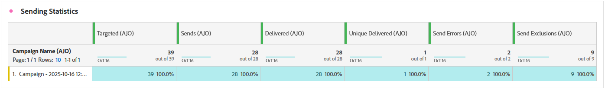
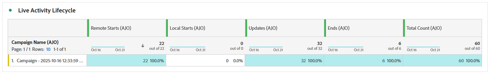
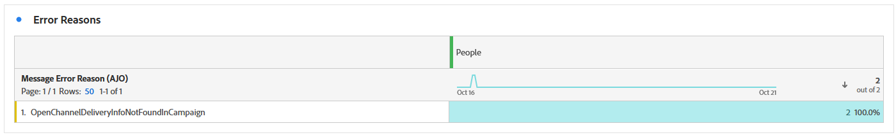
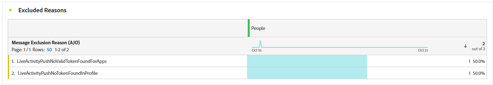

# 即時活動行銷活動報告 {#campaign-global-report-cja-activity}

>[!BEGINSHADEBOX]

您可以按一下行銷活動中的&#x200B;**[!UICONTROL 報告]**&#x200B;按鈕，然後選取&#x200B;**[!UICONTROL 檢視所有時間報告]**，以存取您的即時活動行銷活動報告。 [了解更多](report-gs-cja.md)

>[!ENDSHADEBOX]

## 傳送統計資料 {#sending-statistics-mobile}

**[!UICONTROL 傳送統計資料]**&#x200B;表格提供與您的即時活動行銷活動相關之關鍵量度的詳細概觀。 它會顯示重要資訊，例如目標對象的大小和成功傳送的推播通知數目，協助您評估即時推播通知的整體觸及範圍和效能。

+++ 進一步瞭解如何傳送統計資料

* **[!UICONTROL 已鎖定目標]**：在即時活動期間已鎖定目標的設定檔總數。

* **[!UICONTROL 傳送]**：嘗試傳送至目標設定檔的推播通知總數。

* **[!UICONTROL 已傳遞]**：已成功傳遞至裝置的推播通知數目（與嘗試的傳送總數相關）。

* **[!UICONTROL 傳送錯誤]**：因錯誤而無法傳送的推播通知總數（例如，無效的權杖或連線問題）。

* **[!UICONTROL 傳送排除專案]**： Adobe Journey Optimizer排除的設定檔數目（例如，由於選擇退出狀態或適用性規則）。

+++

## 即時活動生命週期 {#lifecycle}

**[!UICONTROL 已上線活動生命週期]**&#x200B;表格提供已上線活動如何隨著時間進展的完整檢視。 它提供關鍵事件（例如活動開始、更新或結束的時間）的可見度，可幫助您更好地瞭解使用者參與和您的即時活動行銷活動的整體生命週期。

+++ 深入瞭解即時活動生命週期量度

* **[!UICONTROL 遠端啟動]**：從遠端啟動的即時活動數目，通常是由伺服器或後端系統觸發。

* **[!UICONTROL 本機啟動]**：在使用者裝置上本機啟動的已上線活動數目，通常是由使用者互動或使用者端觸發程式所造成。

**[!UICONTROL 更新]**：傳送至裝置的已上線活動更新總數。 更新可以包括狀態變更、新內容或進度通知。

**[!UICONTROL 結束]**：已結束的已上線活動數目，可在完成時自動結束，或透過定義的觸發器或逾時手動結束。

**[!UICONTROL 總計計數]**：所有已上線活動生命週期事件的整體總計，包括開始、更新和結束，提供已上線活動量的完整測量。

+++

## 錯誤原因 {#error-reasons}

**[!UICONTROL 錯誤原因]**&#x200B;表格可讓您識別在Live活動傳送程式期間發生的特定錯誤，協助徹底分析遇到的任何問題。

## 排除原因 {#excluded-reasons}

**[!UICONTROL 排除的原因]**&#x200B;表格以視覺化方式呈現導致目標對象中排除使用者設定檔的各種因素，以防止他們接收您的即時活動。
