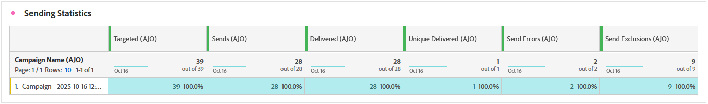
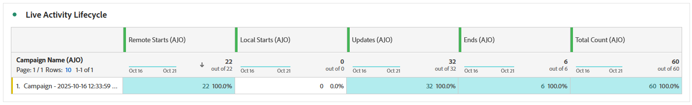

# 即時活動行銷活動報告 {#campaign-global-report-cja-activity}

>[!BEGINSHADEBOX]

您可以按一下行銷活動中的&#x200B;**[!UICONTROL 報告]**&#x200B;按鈕，然後選取&#x200B;**[!UICONTROL 檢視所有時間報告]**，以存取您的即時活動行銷活動報告。 [了解更多](report-gs-cja.md)

>[!ENDSHADEBOX]

## 傳送統計資料 {#sending-statistics-mobile}

**[!UICONTROL 傳送統計資料]**&#x200B;表格提供與您的即時活動行銷活動相關之關鍵量度的詳細概觀。 它會顯示重要資訊，例如目標對象的大小和成功傳送的推播通知數目，協助您評估即時推播通知的整體觸及範圍和效能。

+++ 進一步瞭解如何傳送統計資料

* **[!UICONTROL 已鎖定目標]**：在套用排除、隱藏或同意移除之前，符合對象資格的設定檔數目。

* **[!UICONTROL 傳送]**：嘗試傳送至目標設定檔的推播通知總數。

* **[!UICONTROL 已傳遞]**：已成功傳遞至裝置的推播通知數目（與嘗試的傳送總數相關）。

* **[!UICONTROL 傳送錯誤]**：因錯誤而無法傳送的推播通知總數（例如，無效的權杖或連線問題）。

* **[!UICONTROL 傳送排除專案]**： Adobe Journey Optimizer排除的設定檔數目（例如，由於選擇退出狀態或適用性規則）。

+++

## 即時活動生命週期 {#lifecycle}

**[!UICONTROL 已上線活動生命週期]**&#x200B;表格提供已上線活動如何隨著時間進展的完整檢視。 它提供關鍵事件（例如活動開始、更新或結束的時間）的可見度，可幫助您更好地瞭解使用者參與和您的即時活動行銷活動的整體生命週期。

報表會因您使用「異動」或「行銷」行銷活動而有所不同。

### 異動上線活動

對於異動行銷活動，「即時」活動行銷活動報告會顯示所有生命週期事件，包括遠端開始、本機開始、更新和結束。

+++ 進一步瞭解具有異動行銷活動的即時活動生命週期量度

* **[!UICONTROL 遠端啟動]**：從遠端啟動的即時活動啟動事件總數，通常由伺服器或後端系統觸發。

* **[!UICONTROL 本機啟動]**：在使用者裝置上由本機啟動的已上線活動啟動事件總數，通常是由使用者互動或使用者端觸發器所造成。

* **[!UICONTROL 更新]**：傳送至裝置的已上線活動更新總數。 更新可以包括狀態變更、新內容或進度通知。

* **[!UICONTROL 結束]**：傳送至裝置的已上線活動結束事件總數。

* **[!UICONTROL 總計計數]**：所有已上線活動生命週期事件的整體總計，包括開始、更新和結束，提供已上線活動量的完整測量。

+++

### 行銷直播活動

行銷活動會將即時活動用於廣播使用案例，同時傳送更新至多個裝置。

對於行銷活動中的iOS Live活動，報告只顯示&#x200B;**[!UICONTROL 遠端開始]**&#x200B;個事件和&#x200B;**[!UICONTROL 遠端開始錯誤]**&#x200B;個開始事件。 未追蹤&#x200B;**[!UICONTROL 更新]**&#x200B;和&#x200B;**[!UICONTROL 結束]**&#x200B;事件，因為APN會散發更新給所有裝置而不提供回饋。 若要檢視&#x200B;**[!UICONTROL 更新]**&#x200B;和&#x200B;**[!UICONTROL 結束]**&#x200B;事件，請使用[Apple的推播通知主控台](https://developer.apple.com/notifications/push-notifications-console/)。

+++ 進一步瞭解包含行銷活動的即時活動生命週期量度

* **[!UICONTROL 遠端啟動]**：從遠端啟動的即時活動啟動事件總數，通常由伺服器或後端系統觸發。

* **[!UICONTROL 遠端啟動錯誤]**：嘗試從遠端啟動即時活動時發生的總錯誤數（例如，無效的權杖或連線問題）。

+++

## 錯誤原因 {#error-reasons}

**[!UICONTROL 錯誤原因]**&#x200B;表格可讓您識別在Live活動傳送程式期間發生的特定錯誤，協助徹底分析遇到的任何問題。

## 排除原因 {#excluded-reasons}

**[!UICONTROL 排除的原因]**&#x200B;表格以視覺化方式呈現導致目標對象中排除使用者設定檔的各種因素，以防止他們接收您的即時活動。
