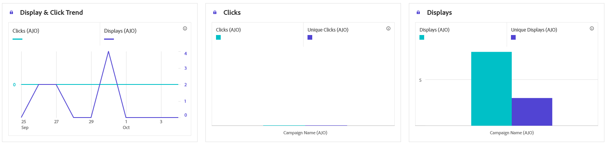
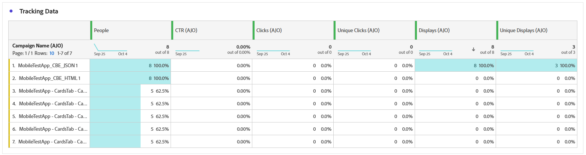
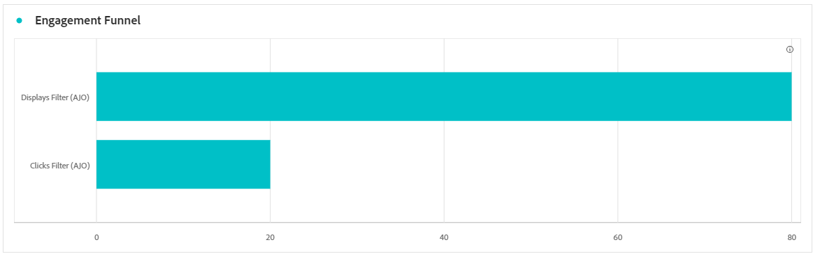
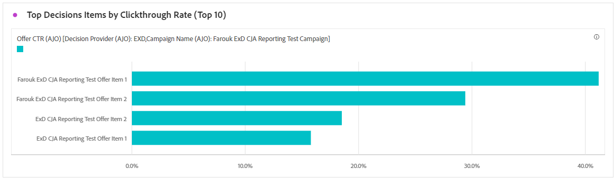
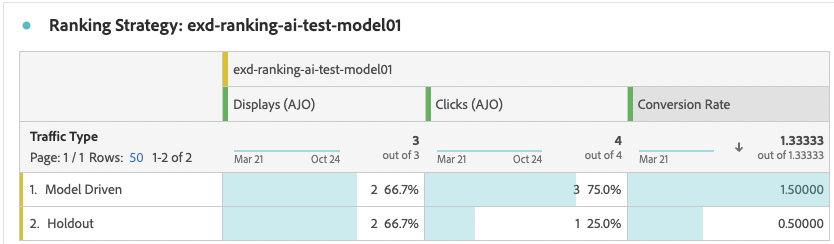
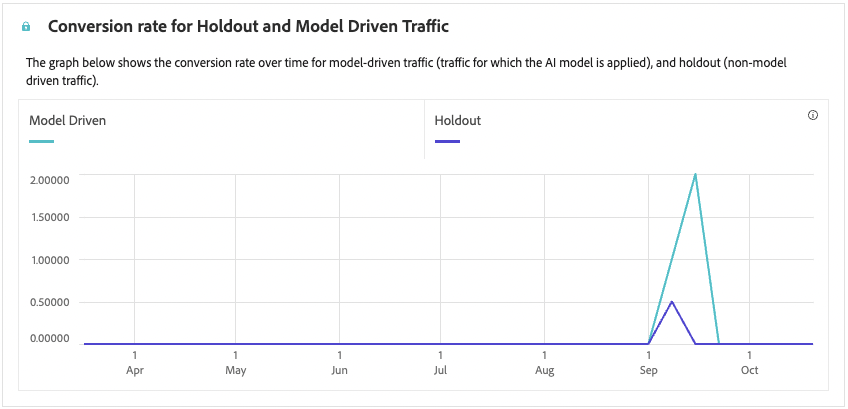

# 程式碼型行銷活動報告 {#campaign-global-report-cja-code}

>[!BEGINSHADEBOX]

您可以按一下行銷活動中的&#x200B;**[!UICONTROL 報表]**&#x200B;按鈕，然後選取&#x200B;**[!UICONTROL 檢視所有時間報表]**，以存取您的程式碼型行銷活動報表。 [了解更多](report-gs-cja.md)

>[!ENDSHADEBOX]

## 顯示並按一下 {#impressions-code}

**[!UICONTROL 顯示和點按]**&#x200B;圖表會顯示設定檔與程式碼型體驗互動的詳細分析，提供設定檔與內容互動方式的寶貴見解。

+++ 進一步瞭解曝光和點選量度

* **[!UICONTROL 不重複點按]**：在您的體驗中點按內容的設定檔數目。

* **[!UICONTROL 點按次數]**：內容在您的體驗中被點按的次數。

* **[!UICONTROL 顯示]**：體驗開啟的次數。

* **[!UICONTROL 不重複顯示]**：體驗開啟的次數，未考慮一個設定檔的多個互動。

+++

## 追蹤資料 {#track-data-code}

**[!UICONTROL 追蹤資料]**&#x200B;表格提供與您的程式碼式體驗繫結的設定檔活動詳細快照，提供參與和體驗有效性的基本深入分析。

+++ 進一步瞭解追蹤資料量度

* **[!UICONTROL 人員]**：符合體驗目標設定檔資格的使用者設定檔數目。

* **[!UICONTROL 點進率(CTR)]**：與您體驗互動的使用者百分比。

* **[!UICONTROL 點按次數]**：內容在您的體驗中被點按的次數。

* **[!UICONTROL 不重複點按]**：在您的體驗中點按內容的設定檔數目。

* **[!UICONTROL 顯示]**：您的體驗開啟的次數。

* **[!UICONTROL 不重複顯示]**：您的體驗開啟的次數，一個設定檔的多個互動未列入考量。

+++

## 追蹤的連結標籤 {#track-link-code}

**[!UICONTROL 追蹤的連結標籤]**&#x200B;表格提供程式碼型體驗中連結標籤的完整概觀，其中會強調產生最高訪客流量的連結。 此功能可讓您識別最熱門的連結並加以優先處理。

+++ 深入瞭解追蹤的連結標籤量度

* **[!UICONTROL 不重複點按]**：在您的程式碼型體驗中點按內容的設定檔數目。

* **[!UICONTROL 點按次數]**：在您的程式碼型體驗中點按內容的次數。

* **[!UICONTROL 顯示]**：體驗開啟的次數。

* **[!UICONTROL 不重複顯示]**：體驗開啟的次數，未考慮一個設定檔的多個互動。

+++

## 決策報告 {#decisioning-reporting}

### 決策KPI {#decisioning-kpis}

**決策KPI**&#x200B;提供訪客與您的體驗互動的重要深入分析，包括量度，例如：

* **[!UICONTROL 專案總數]**：在指定期間內屬於個人化體驗或決策程式一部分的個別專案總數。

* **[!UICONTROL 顯示總數]**：

* **[!UICONTROL 總點按次數]**：使用者在指定期間點選專案、連結、產品或其他互動式元素的總次數。

* **[!UICONTROL 遞補率]**：沒有符合選取策略的執行個體百分比，導致顯示一般或較不明確的選項。

### 參與漏斗 {#engagement-funnel}

**[!UICONTROL 參與漏斗]**&#x200B;表格會評估漏斗每個階段驅動使用者互動的效能，藉此監控個人化體驗的效能。

* **[!UICONTROL 顯示]**：在各種接觸點向使用者顯示或展示個人化體驗的總次數。

* **[!UICONTROL 點按]**：使用者點按顯示給他們之個人化體驗的總次數。

### 依點進率排名最前的決定專案 {#top-decision}

依CTR **[!UICONTROL 排名的]**&#x200B;個最上層決定專案表格會根據個別專案的點進率來強調其效能。 此量度有助於評估哪些專案最能有效吸引使用者並促進互動。

* **[!UICONTROL 點進率(CTR)]**：使用者點按連結、廣告或推薦的次數與顯示次數比較的百分比。

### 依選擇策略區分的參與漏斗 {#engagement-funnel-selection}

**[!UICONTROL 依選擇策略的「參與漏斗」]**&#x200B;表格可協助您監視和分析不同的選擇策略如何有效地吸引具有個人化體驗的使用者。

* **[!UICONTROL 顯示]**：在各種接觸點向使用者顯示或展示個人化體驗的總次數。

* **[!UICONTROL 點按]**：使用者點按顯示給他們之個人化體驗的總次數。

### 決定專案績效 {#decision-items-performance}

**[!UICONTROL 決定專案績效]**&#x200B;表格會評估每個專案在吸引使用者並促使所需動作（例如購買、點按或其他回應）執行時的表現。

* **[!UICONTROL 顯示]**：在各種接觸點向使用者顯示或展示個人化體驗的總次數。

* **[!UICONTROL 點按]**：使用者點按顯示給他們之個人化體驗的總次數。

### 排名策略 {#ranking-strategy}

>[!NOTE]
>
>**[!UICONTROL 排名策略]**&#x200B;表格只有在行銷活動中納入[AI模型](../experience-decisioning/ranking/ai-models.md)時才能使用。<!--[Learn more](../experience-decisioning/ranking/ranking-formulas.md)-->

**[!UICONTROL 排名策略]**&#x200B;表格提供在比較兩種流量型別的個人化體驗中，AI驅動排名模型效能的深入分析：

* **模型導向**：使用者會收到由AI模型排名的內容，針對相關性和參與度進行最佳化。

* **保留**：使用者在模型探索階段會收到隨機提供的內容。

顯示的關鍵量度包括：

* **[!UICONTROL 顯示]**：在各種接觸點向使用者顯示或展示個人化體驗的總次數。

* **[!UICONTROL 點按]**：使用者點按顯示給他們之個人化體驗的總次數。

* **[!UICONTROL 轉換率]**：產生使用者動作（例如點按）的顯示百分比，表示模型成功與使用者互動。

>[!NOTE]
>
>目前[提升度測量](../experience-decisioning/ranking/auto-optimization-model.md#lift)報告僅適用於[個人化最佳化](../experience-decisioning/ranking/personalized-optimization-model.md) AI模型。 如果您需要提升度測量報表，請改用個人化最佳化模型。

### 保留和模型導向流量的轉換率 {#conversion-rate}

>[!NOTE]
>
>只有當行銷活動中納入&#x200B;**[!UICONTROL AI模型]**&#x200B;時，才能使用Holdout和模型驅動流量[圖表的](../experience-decisioning/ranking/ai-models.md)轉換率。<!--[Learn more](../experience-decisioning/ranking/ranking-formulas.md)-->

保留和模型驅動流量的&#x200B;**[!UICONTROL 轉換率]**&#x200B;圖表顯示兩種流量型別在一段時間內的轉換率：

* **模型導向**：使用者會收到由AI模型排名的內容，針對相關性和參與度進行最佳化。

* **保留**：使用者在模型探索階段會收到隨機提供的內容。

>[!CAUTION]
>
>使用合併到[排名公式](../experience-decisioning/ranking/ranking-formulas.md)中的AI模型時，轉換率報表中不會反映資料。
