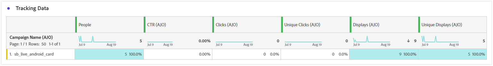

# 內容卡行銷活動報告 {#campaign-global-report-cja-content}

>[!BEGINSHADEBOX]

**在此頁面上：**&#x200B;瞭解如何在Adobe Journey Optimizer中閱讀內容卡行銷活動報告，以分析內容卡的顯示和點選趨勢、追蹤資料和追蹤標籤。

>[!ENDSHADEBOX]

>[!BEGINSHADEBOX]

您可以按一下行銷活動中的&#x200B;**[!UICONTROL 報告]**&#x200B;按鈕，然後選取&#x200B;**[!UICONTROL 檢視所有時間報告]**，以存取您的內容卡行銷活動報告。 [了解更多](report-gs-cja.md)

>[!ENDSHADEBOX]

## 顯示與點選趨勢 {#display-click}

**[!UICONTROL 顯示和點選趨勢]**&#x200B;圖表可協助您瞭解訊息的整體觸及範圍和與其互動的不重複設定檔數目。

+++ 進一步瞭解「顯示和點按」量度

* **[!UICONTROL 點按]**：內容卡片中的內容點按次數。

* **[!UICONTROL 顯示]**：訊息開啟的次數。

* **[!UICONTROL 不重複顯示]**：訊息開啟的次數，一個設定檔的多個互動未列入考量。

+++

## 追蹤資料 {#tracking-data}

**[!UICONTROL 追蹤資料]**&#x200B;表格提供繫結至內容卡的設定檔活動詳細快照，提供參與度和內容卡有效性的基本深入分析。

+++ 進一步瞭解追蹤資料量度

* **[!UICONTROL 人員]**：符合內容卡目標設定檔資格的使用者設定檔數目。

* **[!UICONTROL 點進率(CTR)]**：與內容卡互動的使用者百分比。

* **[!UICONTROL 點按次數]**：內容卡中被點按的次數。

* **[!UICONTROL 不重複點按]**：點按內容卡中內容的設定檔數目。

* **[!UICONTROL 顯示]**：訊息開啟的次數。

* **[!UICONTROL 不重複顯示]**：訊息開啟的次數，一個設定檔的多個互動未列入考量。

+++

## 追蹤的標籤 {#tracked-labels}

**[!UICONTROL 追蹤的標籤]**&#x200B;表格提供內容卡中連結標籤的完整概觀，重點說明產生最高訪客流量的連結。 此功能可讓您識別最熱門的連結並加以優先處理。

+++ 進一步瞭解追蹤的標籤量度

* **[!UICONTROL 不重複點按]**：在內容卡片中點按內容的設定檔數目。

* **[!UICONTROL 點按]**：內容卡片中的內容點按次數。

* **[!UICONTROL 顯示]**：訊息開啟的次數。

* **[!UICONTROL 不重複顯示]**：訊息開啟的次數，一個設定檔的多個互動未列入考量。

+++
