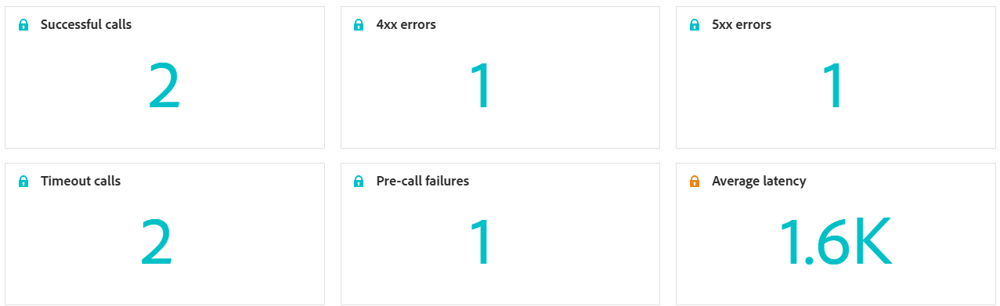

# 自訂管道行銷活動報告 {#campaign-global-report-cja-custom-channel}

>[!BEGINSHADEBOX]

**在此頁面上：**&#x200B;瞭解如何在Adobe Journey Optimizer中閱讀自訂管道行銷活動報告，以檢閱自訂管道呼叫的KPI、結果、延遲和結果劃分。

>[!ENDSHADEBOX]

>[!BEGINSHADEBOX]

您可以按一下行銷活動中的&#x200B;**[!UICONTROL 報表]**&#x200B;按鈕，然後選取&#x200B;**[!UICONTROL 檢視所有時間報表]**，以存取自訂管道行銷活動報表。 [了解更多](report-gs-cja.md)

>[!ENDSHADEBOX]

## KPI {#kpis-custom}

**[!UICONTROL KPI]**&#x200B;區段提供自訂管道呼叫的運作狀況與可靠性的整合檢視。

+++ 進一步瞭解KPI量度

* **[!UICONTROL 成功的呼叫]**：傳回有效回應且沒有錯誤的HTTP呼叫總數。

* **[!UICONTROL 4xx錯誤]**：由於使用者端錯誤而失敗的呼叫數目，強調設定問題或端點失敗。

* **[!UICONTROL 5xx錯誤]**：因伺服器端錯誤而失敗的呼叫數目，強調設定問題或端點失敗。

* **[!UICONTROL 逾時呼叫]**：因超過最大回應時間而失敗的呼叫數。 這有助於顯示外部端點的延遲或效能問題。

* **[!UICONTROL 預先呼叫失敗]**：對外部端點進行HTTP呼叫之前失敗的自訂通道傳送數目。 這些失敗發生在[!DNL Journey Optimizer]自己的基礎結構層，而不是您的外部系統中，並且包括驗證失敗、請求產生錯誤和HTTP剖析錯誤。

* **[!UICONTROL 平均延遲]**：所有HTTP呼叫的平均端對端回應時間（以毫秒為單位），包括成功的呼叫、錯誤和逾時。

+++

## 自訂管道結果 {#outcomes-custom}

**[!UICONTROL 結果]**&#x200B;圖表顯示所選時段的HTTP呼叫KPI趨勢，其詳細程度取決於所選的時間範圍（7天報告每天一次、1天時間範圍每小時一次，或1小時時間範圍每分鐘一次），而&#x200B;**[!UICONTROL 結果劃分]**&#x200B;表格提供這些HTTP呼叫量度的階層式劃分，從最上層的每個端點的整體量度，到使用該端點的每個自訂管道的量度，再到最下層依賴它們的行銷活動和歷程。

+++ 進一步瞭解結果劃分量度

* **[!UICONTROL 自訂通道成功]**：傳回有效回應且無錯誤的HTTP呼叫總數。

* **[!UICONTROL 4xx錯誤]**：由於使用者端錯誤而失敗的呼叫數目，強調設定問題或端點失敗。

* **[!UICONTROL 5xx錯誤]**：因伺服器端錯誤而失敗的呼叫數目，強調設定問題或端點失敗。

* **[!UICONTROL 逾時呼叫]**：因超過最大回應時間而失敗的呼叫數。 這有助於顯示外部端點的延遲或效能問題。

* **[!UICONTROL 預先呼叫失敗]**：對外部端點進行HTTP呼叫之前失敗的自訂通道傳送數目。 這些失敗發生在[!DNL Journey Optimizer]自己的基礎結構層，而不是您的外部系統中，並且包括驗證失敗、請求產生錯誤和HTTP剖析錯誤。

* **[!UICONTROL 呼叫]**： HTTP呼叫總數，包括成功的呼叫、錯誤和逾時。

+++

## 延遲性 {#latency-custom}

**[!UICONTROL 延遲]**&#x200B;圖表和表格可呈現延遲量度的趨勢。 這些檢視可讓您追蹤效能模式、識別尖峰延遲期間，以及監控最佳化或系統變更隨時間流逝的影響。

+++ 進一步瞭解延遲量度

* **[!UICONTROL 平均延遲]**：所有HTTP呼叫的平均端對端回應時間（以毫秒為單位），包括成功的呼叫、錯誤和逾時。

* **[!UICONTROL 平均成功延遲]**：傳回正確回應且無錯誤的HTTP呼叫的平均端對端回應時間（毫秒）。

+++
