# 電子郵件行銷活動報告 {#campaign-global-report-cja-email}

>[!INFO]
>
>由於Apple為原生郵件應用程式引入了新的隱私權保護功能，包括郵件隱私權保護，因此傳送者無法再使用追蹤畫素來收集已啟用Apple郵件隱私權保護的設定檔資料。 因此，Adobe Journey Optimizer使用追蹤畫素來追蹤電子郵件開啟的能力可能會受到影響。
>&#x200B;> [深入瞭解](https://experienceleaguecommunities.adobe.com/t5/adobe-campaign-classic-blogs/the-impact-of-apple-ios-privacy-changes-on-email-marketing-and/ba-p/699780) Apple iOS隱私權變更對電子郵件行銷的影響。
> 
> 我們建議將重點放在點按次數和轉換量度上，而非開放率，以取得更準確的深入分析。

>[!BEGINSHADEBOX]

您可以按一下行銷活動中的&#x200B;**[!UICONTROL 報告]**&#x200B;按鈕，然後選取&#x200B;**[!UICONTROL 檢視所有時間報告]**，以存取電子郵件行銷活動報告。 [了解更多](report-gs-cja.md)

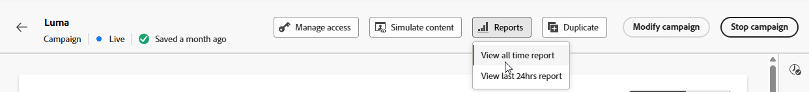

>[!ENDSHADEBOX]

## 電子郵件KPI

**[!UICONTROL 電子郵件]**&#x200B;關鍵績效指標(KPI)提供不重複與彙總量度的重點儀表板，可反映電子郵件行銷活動的績效和參與度等級。

+++ 進一步瞭解電子郵件KPI量度

* **[!UICONTROL 不重複點進率]**：按一下電子郵件中至少一個連結的不重複設定檔的百分比（與不重複傳送的電子郵件數目相關）。

* **[!UICONTROL 點進開啟率(CTOR)]**：與訊息互動的設定檔百分比。

* **[!UICONTROL 不重複開啟率]**：相對於不重複傳遞電子郵件數目，至少開啟一次電子郵件的不重複設定檔百分比。

* **[!UICONTROL 不重複跳出率]**：根據不重複傳送總數，電子郵件至少跳出一次的不重複設定檔百分比。

* **[!UICONTROL 已傳遞]**：成功傳送的電子郵件數目，與已傳送的訊息總數相關。

* **[!UICONTROL 唯一傳遞]**：成功收到至少一則訊息的唯一設定檔數目。

* **[!UICONTROL 預估開啟次數]**：預估由設定檔直接開啟及郵件伺服器觸發自動開啟的電子郵件開啟總數。 此量度會套用由手動開啟電子郵件的收件者所計算的開啟率，並將此開啟率套用至僅由郵件伺服器開啟電子郵件的收件者，藉此調整郵件伺服器為隱私權或安全性掃描所觸發的開啟。

* **[!UICONTROL 不重複預估開啟次數]**：預估可能開啟電子郵件之不重複電子郵件收件者的數量。 此量度旨在套用唯一開啟率（由手動開啟電子郵件的不重複設定檔計算得出），將郵件伺服器觸發的隱私權或安全性掃描的個別參與計數，準確度較高。

* **[!UICONTROL 點按次數]**：訊息中任何連結被點按的總次數，包括相同設定檔的多次點按。

* **[!UICONTROL 不重複點按]**：點按您訊息中內容的不重複設定檔數目。

+++

## 不重複點按漏斗

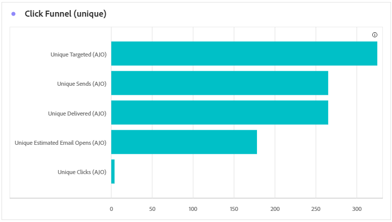

**[!UICONTROL 點按漏斗]**&#x200B;圖表提供設定檔如何與您的電子郵件內容互動的詳細分析，針對互動的每個階段（從傳送到點按）提供有價值的深入分析，協助您瞭解您的訊息如何有效地促進使用者參與。

+++ 深入瞭解點選漏斗量度

* **[!UICONTROL 唯一目標]**：傳送程式期間鎖定的唯一設定檔數目。

* **[!UICONTROL 不重複傳送次數]**：至少嘗試傳送一封電子郵件的不重複設定檔數目。

* **[!UICONTROL 唯一傳遞]**：成功收到至少一則訊息的唯一設定檔數目。

* **[!UICONTROL 不重複預估開啟次數]**：預估可能開啟電子郵件之不重複電子郵件收件者的數量。 此量度旨在套用唯一開啟率（由手動開啟電子郵件的不重複設定檔計算得出），將郵件伺服器觸發的隱私權或安全性掃描的個別參與計數，準確度較高。

* **[!UICONTROL 不重複點按]**：點按您訊息中內容的不重複設定檔數目。

+++

## 不重複傳遞狀態

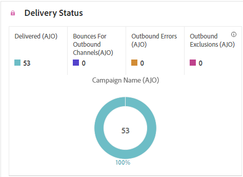

**[!UICONTROL 傳遞狀態]**&#x200B;圖表提供行銷活動中已傳送電子郵件相關資料的完整檢視，提供關鍵量度的深入分析，例如傳遞和跳出。 這可啟用電子郵件傳送流程的詳細分析，提供關於行銷活動效率和績效的寶貴資訊。

+++ 進一步瞭解傳遞狀態量度

* **[!UICONTROL 不重複傳送錯誤]**：在輸出程式期間至少發生一次傳送錯誤的不重複設定檔數目。

* **[!UICONTROL 唯一傳遞]**：成功收到至少一則訊息的唯一設定檔數目。

* **[!UICONTROL 不重複傳送排除]**：由於預先定義的規則或對象條件，無法接收訊息的不重複設定檔數目。

* **[!UICONTROL 不重複退信]**：傳送過程中至少有一則訊息退信的不重複設定檔數目。

+++

## 已傳遞vs點選趨勢 {#delivered-click}

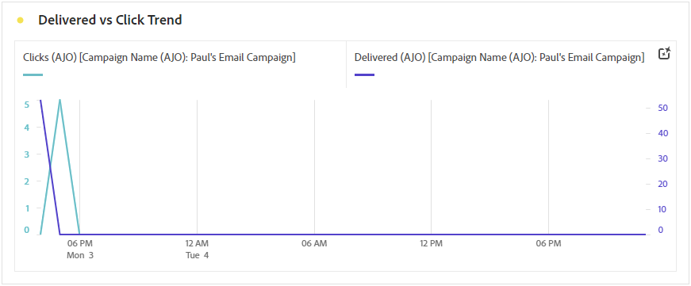

**[!UICONTROL 已傳遞與點選趨勢]**&#x200B;圖表提供您設定檔與電子郵件互動的詳細分析，提供設定檔與內容互動方式的寶貴見解。 圖表使用兩個軸來並排顯示傳送的電子郵件和點按次數，因此與傳送的電子郵件數量相比，更容易發現互動中的異常模式或變更。

+++ 深入瞭解已傳遞與點選趨勢量度

* **[!UICONTROL 已傳遞]**：與已傳送電子郵件總數相關的成功傳送電子郵件數目。

* **[!UICONTROL 點按]**：內容在電子郵件中的點按次數。

+++

## 不重複傳送統計資料 {#unique-sending-statistics-email}

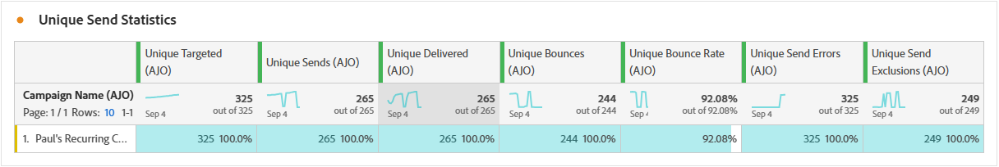

**[!UICONTROL 不重複傳送統計資料]**&#x200B;表格提供行銷活動中不重複電子郵件績效量度的詳細總覽。 它著重於個別設定檔，例如唯一鎖定目標、傳送至、退回或排除的設定檔，讓您更深入地瞭解電子郵件如何觸及及吸引您的受眾。

+++ 深入瞭解不重複傳送統計量度

* **[!UICONTROL 唯一目標]**：傳送程式期間鎖定的唯一設定檔數目。

* **[!UICONTROL 不重複傳送次數]**：至少嘗試傳送一封電子郵件的不重複設定檔數目。

* **[!UICONTROL 不重複送達]**：成功收到至少一封電子郵件的不重複設定檔數目。

* **[!UICONTROL 不重複退信]**：至少有一封電子郵件導致退信的不重複設定檔數目。

* **[!UICONTROL 不重複跳出率]**：根據不重複傳送總數，電子郵件至少跳出一次的不重複設定檔百分比。

* **[!UICONTROL 不重複傳送錯誤]**：在輸出程式期間遇到至少一個傳送錯誤的不重複設定檔數目。

* **[!UICONTROL 不重複傳送排除]**：因適用性規則、對象細分或設定檔狀態而排除無法接收訊息的不重複設定檔數目。

+++

## 不重複追蹤統計資料 {#unique-tracking-statistics-email}

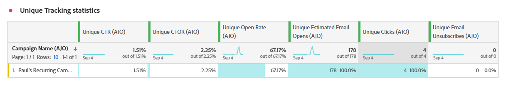

**[!UICONTROL 不重複追蹤統計資料]**&#x200B;表格可提供行銷活動中電子郵件之設定檔層級參與度的焦點檢視。 它強調獨特的量度，提供寶貴的深入分析，讓您瞭解個別設定檔如何在參與的關鍵階段與您的電子郵件內容互動。

+++ 進一步瞭解追蹤統計量度

* **[!UICONTROL 不重複點進率(CTR)]**：按一下電子郵件中至少一個連結的不重複設定檔百分比，與不重複傳送電子郵件數目相關。

* **[!UICONTROL 不重複點進開啟率(CTOR)]**：根據不重複開啟，在開啟電子郵件後點按連結的不重複設定檔百分比。

* **[!UICONTROL 不重複開啟率]**：相對於不重複傳遞電子郵件數目，至少開啟一次電子郵件的不重複設定檔百分比。

* **[!UICONTROL 不重複點按]**：至少在電子郵件中點選過一段內容的不重複設定檔數。

* **[!UICONTROL 不重複預估電子郵件開啟次數]**：預估可能開啟電子郵件之不重複電子郵件收件者的數量。 此量度旨在套用唯一開啟率（由手動開啟電子郵件的不重複設定檔計算得出），將郵件伺服器觸發的隱私權或安全性掃描的個別參與計數，準確度較高。

* **[!UICONTROL 不重複電子郵件取消訂閱]**：在電子郵件或相關登陸頁面上按一下取消訂閱連結的不重複設定檔數目。

+++

## 正在傳送統計數據 {#sending-statistics-email}

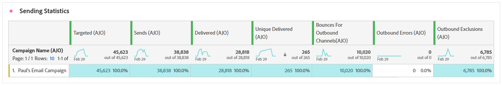

**[!UICONTROL 傳送統計資料]**&#x200B;表格提供有關行銷活動中電子郵件之基本資料的完整摘要。 它詳細說明關鍵量度，例如與您的電子郵件的互動和成功傳送的電子郵件數量，提供對您的電子郵件和行銷活動的成效和觸及範圍的寶貴見解。

+++ 進一步瞭解如何傳送統計資料

* **[!UICONTROL 已鎖定目標]**：傳送程式期間處理的電子郵件總數。

* **[!UICONTROL 傳送]**：您電子郵件的傳送總數。

* **[!UICONTROL 已傳遞]**：與已傳送訊息總數相關的成功傳送電子郵件總數。

* **[!UICONTROL 跳出數]**：在傳送程式期間累積的錯誤總數，以及相對於已傳送訊息總數的自動傳回處理次數。

* **[!UICONTROL 跳出率]**：相對於已傳送電子郵件總數，導致跳出的電子郵件百分比。

* **[!UICONTROL 傳送錯誤]**：傳送程式期間發生的總錯誤數，使它無法傳送至設定檔。

* **[!UICONTROL 傳送排除專案]**： Adobe Journey Optimizer已排除的設定檔總數。

+++

## 追蹤統計資料 {#tracking-statistics-email}

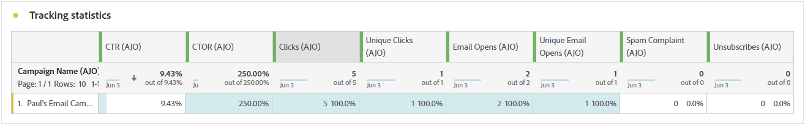

**[!UICONTROL 電子郵件 — 追蹤統計資料]**&#x200B;表格提供與行銷活動中所含電子郵件相關的設定檔活動詳細帳戶。 其中包括開啟次數、點按次數和其他相關的參與指標，以提供設定檔與電子郵件內容互動方式的完整檢視。

+++ 進一步瞭解追蹤統計量度

* **[!UICONTROL 點進率(CTR)]**：與電子郵件互動的使用者百分比。

* **[!UICONTROL 點進開啟率(CTOR)]**：電子郵件開啟的次數。

* **[!UICONTROL 預估的電子郵件開啟次數]**：預估的電子郵件開啟總次數，包括設定檔直接開啟以及郵件伺服器觸發的自動開啟次數。 此量度會套用由手動開啟電子郵件的收件者所計算的開啟率，並將此開啟率套用至僅由郵件伺服器開啟電子郵件的收件者，藉此調整郵件伺服器為隱私權或安全性掃描所觸發的開啟。

* **[!UICONTROL 點按]**：內容在電子郵件中的點按次數。

* **[!UICONTROL 垃圾訊息申訴]**：訊息被宣告為垃圾郵件或垃圾訊息的次數。

* **[!UICONTROL 取消訂閱]**：取消訂閱連結或相關登陸頁面的點按次數。

+++

## 電子郵件網域 {#email-domains}

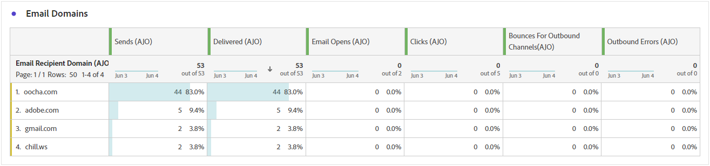

**[!UICONTROL 電子郵件網域]**&#x200B;表格提供依網域分類的電子郵件深入劃分，讓您深入瞭解電子郵件行銷活動的效能量度。 這項全方位的分析可讓您瞭解不同網域在回應電子郵件內容時的行為。

+++ 進一步瞭解電子郵件網域量度

* **[!UICONTROL 不重複送達]**：成功收到至少一封電子郵件的不重複設定檔數目。

* **[!UICONTROL 預估的電子郵件開啟次數]**：預估的電子郵件開啟總次數，包括設定檔直接開啟以及郵件伺服器觸發的自動開啟次數。 此量度會套用由手動開啟電子郵件的收件者所計算的開啟率，並將此開啟率套用至僅由郵件伺服器開啟電子郵件的收件者，藉此調整郵件伺服器為隱私權或安全性掃描所觸發的開啟。

* **[!UICONTROL 不重複點按]**：至少在電子郵件中點選過一段內容的不重複設定檔數。

* **[!UICONTROL 不重複退信]**：至少有一封電子郵件導致退信的不重複設定檔數目。

* **[!UICONTROL 不重複傳送錯誤]**：在輸出程式期間遇到至少一個傳送錯誤的不重複設定檔數目。

* **[!UICONTROL 不重複傳送排除]**：因適用性規則、對象細分或設定檔狀態而排除無法接收訊息的不重複設定檔數目。

+++

## 追蹤的連結標籤 {#track-link-label}

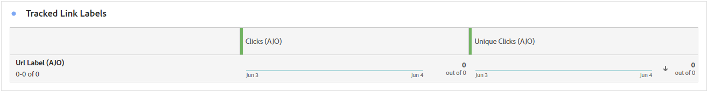

**[!UICONTROL 追蹤的連結標籤]**&#x200B;表格提供您電子郵件中連結標籤的完整概觀，其中會強調產生最高訪客流量的連結。 此功能可讓您識別最熱門的連結並加以優先處理。

+++ 深入瞭解追蹤的連結標籤量度

* **[!UICONTROL 不重複點按]**：點按電子郵件中內容的設定檔數目。

* **[!UICONTROL 點按]**：內容在電子郵件中的點按次數。

+++

## 追蹤的連結 URL {#track-link-url}

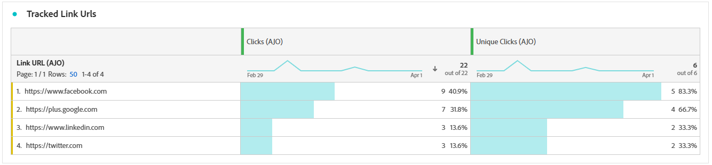

**[!UICONTROL 追蹤的連結URL]**&#x200B;表格提供您電子郵件中吸引最高訪客流量之URL的完整概觀。 這可讓您識別最熱門的連結並排定其優先順序，進而更瞭解電子郵件中特定內容的設定檔參與情形。

+++ 深入瞭解追蹤的連結URL量度

* **[!UICONTROL 不重複點按]**：點按電子郵件中內容的設定檔數目。

* **[!UICONTROL 點按]**：內容在電子郵件中的點按次數。

+++

## 電子郵件主旨 {#email-subjects}

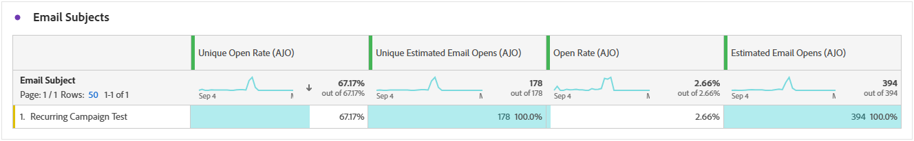

**[!UICONTROL 電子郵件主題]**&#x200B;表格提供吸引最多訪客流量的電子郵件主題的完整概觀。 此資源提供受眾參與動態的寶貴見解。

+++ 進一步瞭解電子郵件主題量度

* **[!UICONTROL 不重複開啟率]**：相對於不重複傳遞電子郵件數目，至少開啟一次電子郵件的不重複設定檔百分比。

* **[!UICONTROL 不重複預估電子郵件開啟次數]**：預估可能開啟電子郵件之不重複電子郵件收件者的數量。 此量度旨在套用唯一開啟率（由手動開啟電子郵件的不重複設定檔計算得出），將郵件伺服器觸發的隱私權或安全性掃描的個別參與計數，準確度較高。

* **[!UICONTROL 開啟率]**：電子郵件開啟次數相對於已傳遞電子郵件總數的百分比，包括相同設定檔的多重開啟。

* **[!UICONTROL 預估的電子郵件開啟次數]**：預估的電子郵件開啟總次數，包括設定檔直接開啟以及郵件伺服器觸發的自動開啟次數。 此量度會套用由手動開啟電子郵件的收件者所計算的開啟率，並將此開啟率套用至僅由郵件伺服器開啟電子郵件的收件者，藉此調整郵件伺服器為隱私權或安全性掃描所觸發的開啟。

+++

## 排除原因 {#excluded-reasons}

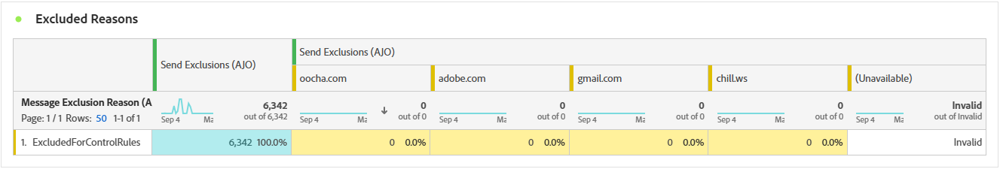

**[!UICONTROL 排除的原因]**&#x200B;表格提供不同因素的完整檢視，這些因素導致從目標對象中排除使用者設定檔，導致未收到訊息。

如需排除原因的完整清單，請參閱[此頁面](exclusion-list.md)。

## 退回原因 {#bounce-reasons-email}

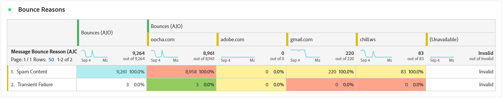

**[!UICONTROL 退回原因]**&#x200B;表格會編譯與退回訊息相關的可用資料，提供電子郵件退回背後特定原因的詳細深入分析。

如需退信的詳細資訊，請參閱[隱藏清單](../reports/suppression-list.md)頁面。

## 錯誤原因 {#error-reasons-email}

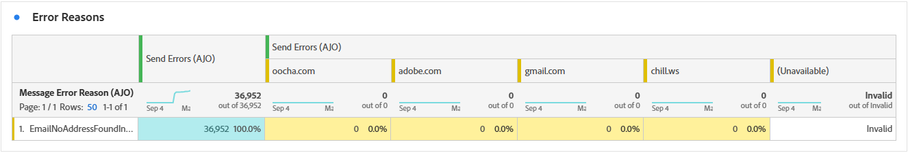

**[!UICONTROL 錯誤原因]**&#x200B;表格提供傳送程式期間發生的特定錯誤的可見度，提供有關錯誤性質和發生情況的寶貴資訊。
