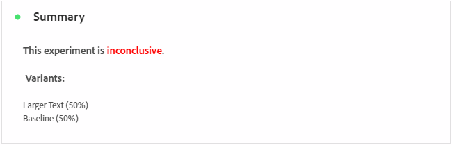
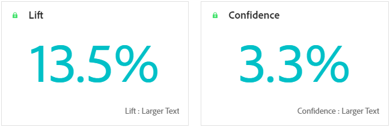

# 實驗行銷活動報告 {#campaign-global-report-cja-experimentation}

>[!CONTEXTUALHELP]
>id="ajo_campaigns_content_experiment_click"
>title="成功量度"
>abstract="先前在建立實驗時選取的成功量度的總值除以設定檔的數量。"

## 實驗 {#experimentation}

**[!UICONTROL Experimentation]**&#x200B;索引標籤提供每個變體效能的重要深入分析，並識別最成功的變體。

請注意，定義績效最佳者可能需要一些時間。 如果您的實驗不成功，它將會設定為&#x200B;**尚無結果**。

### 實驗KPI {#experimentation-kpis}

**[!UICONTROL Experimentation]**&#x200B;關鍵績效指標(KPI)可作為全方位儀表板，提供與您的實驗相關之基本量度的分析。

+++ 進一步瞭解實驗KPI量度

* **[!UICONTROL 提升度]**：測量指定處理的轉換率相對於基準的提升百分比。

* **[!UICONTROL 信賴度]**：指定處理與基準處理相同的證據。 [了解更多](../content-management/experiment-calculations.md#adobes-statistical-methodology-any-time-valid-confidence-sequences)

+++

### 依成功量度的變體 {#variant-inbound}

成功量度的&#x200B;**變體**&#x200B;表格會根據設定實驗時選取的成功量度，顯示每個變體的執行方式。
如需深入瞭解這些結果以及如何解譯，請參閱[此頁面](../content-management/get-started-experiment.md#interpret-results)。

+++ 進一步瞭解「依成功量度區分的變體」

* **[!UICONTROL 人員]**：符合訊息目標設定檔資格的使用者設定檔數目。

* **[!UICONTROL 傳入點按次數]**：建立實驗時，先前選取的成功量度總值。

* **[!UICONTROL 轉換率]**：建立實驗時先前選取的成功量度總值除以設定檔數目。

* **[!UICONTROL 提升度]**：測量指定處理的轉換率相對於基準的提升百分比。

* **[!UICONTROL 信賴下限]**：在選擇的信賴區間內，處理與基準之間轉換率差異的最低預估值。

* **[!UICONTROL 信賴度]**：指定處理與基準處理相同的證據。 [了解更多](../content-management/experiment-calculations.md#adobes-statistical-methodology-any-time-valid-confidence-sequences)

* **[!UICONTROL 信賴上限]**：在選擇的信賴區間內，處理與基準之間轉換率差異的最大估計值。

+++

### 成功量度的轉換率 {#conversion-rate}

**[!UICONTROL 信賴區間]**&#x200B;圖表會顯示可能的改善範圍，比較基準與所選成功量度的最佳績效處理方式。 [了解更多](../content-management/experiment-calculations.md#adobes-statistical-methodology-any-time-valid-confidence-sequences)。