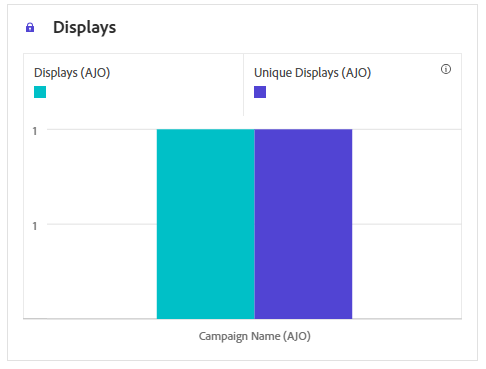
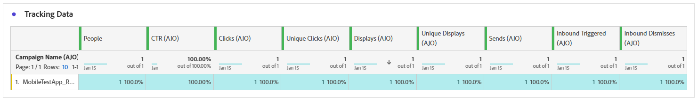

# 應用程式內行銷活動報告 {#campaign-global-report-cja-inapp}

>[!IMPORTANT]
>
>在您報告應用程式內行銷活動和歷程之前，請務必遵循[本頁面](../in-app/inapp-configuration.md#experiment-prerequisites)提供的報告先決條件。

>[!BEGINSHADEBOX]

您可以按一下行銷活動中的&#x200B;**[!UICONTROL 報表]**&#x200B;按鈕，然後選取&#x200B;**[!UICONTROL 檢視所有時間報表]**，以存取應用程式內行銷活動報表。 [了解更多](report-gs-cja.md)

>[!ENDSHADEBOX]

## 顯示與點選趨勢 {#impression-click-trend}

**[!UICONTROL 曝光與點按趨勢]**&#x200B;圖表提供設定檔與應用程式內訊息互動的詳細分析，提供設定檔與內容互動方式的寶貴見解。

+++ 進一步瞭解「曝光與點按」趨勢量度

* **[!UICONTROL 點按]**：使用者與應用程式內訊息互動的次數。

* **[!UICONTROL 顯示]**：向使用者顯示應用程式內訊息的次數。

+++

## 點按次數 {#clicks-inapp}

**[!UICONTROL 點按次數]**&#x200B;圖形會顯示應用程式內點按量度，說明內容點按總次數和點按內容的不重複設定檔數量。

+++ 進一步瞭解點選量度

* **[!UICONTROL 不重複點按]**：在您的應用程式內訊息中點按內容的設定檔數目

* **[!UICONTROL 點按]**：使用者與應用程式內訊息互動的次數。

+++

## 顯示 {#display-inapp}

**[!UICONTROL 顯示]**&#x200B;圖表可協助您瞭解訊息的整體觸及範圍和與其互動的不重複設定檔數目。

+++ 進一步瞭解顯示量度

* **[!UICONTROL 顯示]**：向使用者顯示應用程式內訊息的次數。

* **[!UICONTROL 不重複顯示]**：訊息開啟的次數，一個設定檔的多個互動未列入考量。

+++

## 追蹤資料 {#tracking-data-inapp}

**[!UICONTROL 追蹤資料]**&#x200B;表格提供與您的應用程式內訊息繫結的設定檔活動詳細快照，提供參與和應用程式內訊息有效性的基本深入分析。

+++ 進一步瞭解追蹤資料量度

* **[!UICONTROL 人員]**：符合應用程式內訊息目標設定檔資格的使用者設定檔數目。

* **[!UICONTROL 點進率(CTR)]**：與應用程式內訊息互動的使用者百分比。

* **[!UICONTROL 點進開啟率(CTOR)]**：應用程式內訊息開啟的次數。

* **[!UICONTROL 點按]**：使用者與應用程式內訊息互動的次數。

* **[!UICONTROL 不重複點按]**：在您的應用程式內訊息中點按內容的設定檔數目。

* **[!UICONTROL 顯示]**：向使用者顯示應用程式內訊息的次數。

* **[!UICONTROL 不重複顯示]**：訊息開啟的次數，一個設定檔的多個互動未列入考量。

* **[!UICONTROL 傳送]**：應用程式要求應用程式內行銷活動的次數。 若未快取行銷活動資料，則每個使用者工作階段有多個請求（例如，在啟動或重新載入時）可能會導致此值超過不重複使用者計數。

* **[!UICONTROL 傳入已觸發]**：應用程式考慮顯示應用程式內訊息的次數。 如果應用程式端規則禁止訊息顯示，則此數字可能會低於傳送總數。

* **[!UICONTROL 傳入解除次數]**：使用者未與應用程式內訊息互動即解除該訊息的次數。

+++

## 追蹤的連結標籤 {#track-link-label-inapp}

**[!UICONTROL 追蹤的連結標籤]**&#x200B;表格提供您應用程式內訊息中連結標籤的完整概觀，其中會強調產生最高訪客流量的連結。 此功能可讓您識別最熱門的連結並加以優先處理。

+++ 深入瞭解追蹤的連結標籤量度

* **[!UICONTROL 不重複點按]**：在您的應用程式內訊息中點按內容的設定檔數目。

* **[!UICONTROL 點按]**：使用者與應用程式內訊息互動的次數。

* **[!UICONTROL 顯示]**：向使用者顯示應用程式內訊息的次數。

* **[!UICONTROL 不重複顯示]**：訊息開啟的次數，一個設定檔的多個互動未列入考量。

+++

## 追蹤的連結 URL {#track-link-url-inapp}

**[!UICONTROL 追蹤的連結URL]**&#x200B;表格提供應用程式內訊息中吸引最高訪客流量的URL的完整概觀。 這可讓您識別最熱門的連結並排定其優先順序，進而更瞭解應用程式內訊息中特定內容的設定檔參與情形。

+++ 深入瞭解追蹤的連結URL量度

* **[!UICONTROL 不重複點按]**：在您的應用程式內訊息中點按內容的設定檔數目。

* **[!UICONTROL 點按]**：使用者與應用程式內訊息互動的次數。

+++
