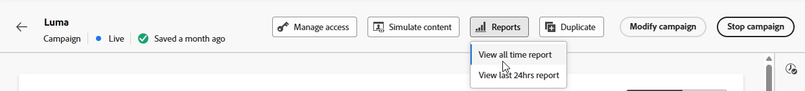
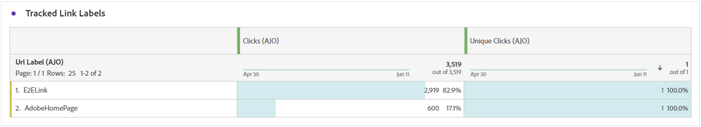

# 推播通知行銷活動報告 {#campaign-global-report-cja-push}

>[!BEGINSHADEBOX]

**在此頁面上：**&#x200B;瞭解如何在Adobe Journey Optimizer中閱讀推播通知行銷活動報告，以檢閱推播通知的傳送和追蹤統計資料、追蹤的連結，以及退回、錯誤和排除原因。

>[!ENDSHADEBOX]

>[!BEGINSHADEBOX]

您可以按一下行銷活動中的&#x200B;**[!UICONTROL 報表]**&#x200B;按鈕，然後選取&#x200B;**[!UICONTROL 檢視所有時間報表]**，以存取推播通知行銷活動報表。 [了解更多](report-gs-cja.md)

>[!ENDSHADEBOX]

## 傳送統計資料 {#sending-statistics-push}

**[!UICONTROL 傳送統計資料]**&#x200B;表格提供有關推播通知行銷活動的完整基本資料摘要。 它會詳細說明關鍵量度，例如目標對象的大小和成功傳送的推播通知的數量，為您的推播通知提供有效性和觸及範圍的寶貴見解。

+++ 進一步瞭解如何傳送統計資料

* **[!UICONTROL 已鎖定目標]**：在套用排除、隱藏或同意移除之前，符合對象資格的設定檔數目。 在啟用重新進入的歷程中，設定檔可能會鎖定多次。

* **[!UICONTROL 傳送]**：推播通知的傳送總數。

* **[!UICONTROL 已傳遞]**：成功傳送的推播通知數目（與已傳送的推播通知總數相關）。

* **[!UICONTROL 唯一傳遞]**：成功收到至少一個推播通知的設定檔數。

* **[!UICONTROL 傳出錯誤]**：發生且無法傳送至設定檔的錯誤總數。

* **[!UICONTROL 傳出排除]**： Adobe Journey Optimizer已排除的設定檔數目。

+++

## 追蹤統計資料 {#tracking-statistics-push}

**[!UICONTROL 追蹤統計資料]**&#x200B;表格提供與您的推播通知連結的設定檔活動詳細快照，提供參與和推播通知有效性的基本深入分析。

+++ 進一步瞭解追蹤統計量度

* **[!UICONTROL 點進率(CTR)]**：與推播通知互動的使用者百分比。

* **[!UICONTROL 點按]**：推播通知內容被點按的次數。

* **[!UICONTROL 不重複點按]**：點按推播通知中內容的設定檔數目。

* **[!UICONTROL 推播自訂動作]**：設定檔回應推播通知所採取的自訂動作數目。

+++

## 追蹤的標籤 {#track-link-label-push}

**[!UICONTROL 追蹤的連結標籤]**&#x200B;表格提供推播通知內連結標籤的完整概觀，其中會強調產生最高訪客流量的連結。 此功能可讓您識別最熱門的連結並加以優先處理。

+++ 深入瞭解追蹤的連結標籤量度

* **[!UICONTROL 不重複點按]**：點按推播通知中內容的設定檔數目。

* **[!UICONTROL 點按]**：推播通知內容被點按的次數。

+++

## 追蹤的連結 URL {#track-link-url-push}

**[!UICONTROL 追蹤的連結URL]**&#x200B;表格提供您推播通知中吸引最高訪客流量的URL的完整概觀。 這可讓您識別最熱門的連結並排定其優先順序，進而更瞭解推播通知中特定內容的設定檔參與情形。

+++ 深入瞭解追蹤的連結URL量度

* **[!UICONTROL 不重複點按]**：點按推播通知中內容的設定檔數目。

* **[!UICONTROL 點按]**：推播通知內容被點按的次數。

+++

## 退回原因 {#bounce-reasons-push}

「**[!UICONTROL 彈回原因]**」表格提供與彈回推播通知相關之資料的完整概觀，針對推播通知彈回例項背後的特定原因提供寶貴的見解。

## 錯誤原因 {#error-reasons-push}

**[!UICONTROL 錯誤原因]**&#x200B;表格可讓您識別推播通知傳送過程中發生的特定錯誤，協助徹底分析所遇到的任何問題。

+++ 進一步瞭解錯誤原因

根據推播通知提供者（[!DNL Apple Push Notification service (APNs)]或[!DNL Firebase Cloud Messaging (FCM)]）傳回的回應，每個推播通知傳送都會分類為下列其中一個原因：

* **SENT**：提供者已接受通知。
* **DENYLIST**：裝置權杖已無效（例如，應用程式已解除安裝或權杖已過期）。 代號會新增至封鎖清單，並略過未來傳送至該代號。
* **MALFORM_NOTIFICATION**：提供者拒絕通知裝載為無效（例如，裝載太大、空白或遺漏必要欄位）。
* **INVALID_PUSH_CREDENTIAL**：用來傳送通知的推播認證（憑證、金鑰或主題組態）無效或不符合目標裝置/應用程式。
* **PUSH_PROVIDER_ERROR**：提供者傳回暫時性或意外的錯誤（例如，速率限制或內部錯誤）。 系統會自動重試這些傳送。

**個APN**

| HTTP狀態 | APNs原因 | 錯誤原因 |
| --- | --- | --- |
| 400 / 410 | `Unregistered`, `ExpiredToken`, `BadDeviceToken` | 封鎖清單 |
| 400 / 413 | `PayloadTooLarge`, `PayloadEmpty`, `InvalidPushType`, `BadTopic`, `MissingTopic` | 格式錯誤的NOTIFICATION |
| 400 / 403 | `DeviceTokenNotForTopic`, `BadCertificate`, `TopicDisallowed`, `BadCertificateEnvironment` | INVALID_PUSH_CREDENTIAL |
| 429 / 500 / 503 | `TooManyRequests`, `TooManyProviderTokenUpdates`, `InternalServerError`, `ServiceUnavailable` | PUSH_PROVIDER_ERROR |
| 任何其他 | 任何其他/無 | PUSH_PROVIDER_ERROR |

**FCM**

| HTTP狀態 | FCM錯誤碼 | 錯誤原因 |
| --- | --- | --- |
| 404 | `UNREGISTERED` (`NOT_FOUND`) | 封鎖清單 |
| 400 | `INVALID_ARGUMENT` | 格式錯誤的NOTIFICATION |
| 403 | `SENDER_ID_MISMATCH` (`PERMISSION_DENIED`) | INVALID_PUSH_CREDENTIAL |
| 429 | `QUOTA_EXCEEDED` (`RESOURCE_EXHAUSTED`) | PUSH_PROVIDER_ERROR |
| 500 | `INTERNAL` | PUSH_PROVIDER_ERROR |
| 503 | `UNAVAILABLE` | PUSH_PROVIDER_ERROR |
| 任何其他 | `UNSPECIFIED_ERROR` /任何其他/無 | PUSH_PROVIDER_ERROR |

+++

## 排除原因 {#exclude-reasons-push}

**[!UICONTROL 排除原因]**&#x200B;表格以視覺化方式呈現導致從目標對象中排除使用者設定檔的各種因素，以防止他們收到您的推播通知。

如需排除原因的完整清單，請參閱[此頁面](exclusion-list.md)。
