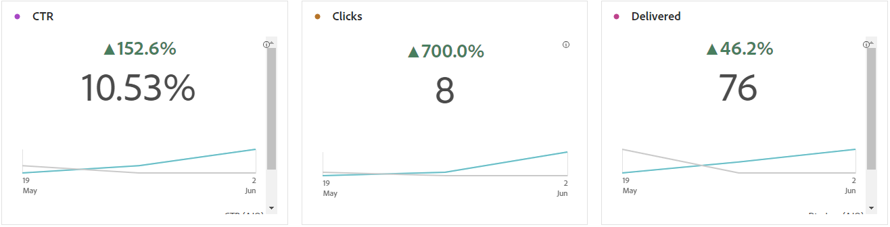
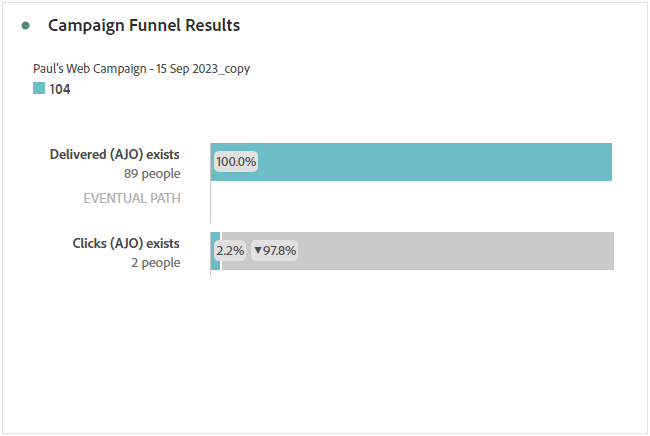
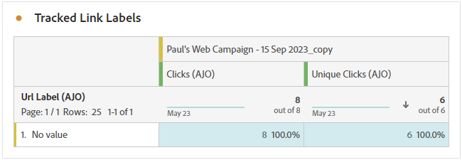

# 行銷活動報告 {#campaign-global-report-cja}

>[!BEGINSHADEBOX]

您可以按一下行銷活動中的&#x200B;**[!UICONTROL 報表]**&#x200B;按鈕，然後選取&#x200B;**[!UICONTROL 檢視所有時間報表]**，以存取行銷活動報表。 [了解更多](report-gs-cja.md)

>[!ENDSHADEBOX]

## 行銷活動KPI {#campaign-kpis}

**[!UICONTROL 行銷活動]**&#x200B;關鍵績效指標(KPI)可作為全方位儀表板，提供與行銷活動相關之基本量度的分析。 其中包含點按次數和已傳送訊息數等詳細資訊，可針對行銷活動的成效和參與層級提供全面的insight。

KPI會因行銷活動中使用的管道而有所不同。

+++ 進一步瞭解行銷活動KPI量度

* **[!UICONTROL 點進率]**：與訊息互動的使用者百分比。

* **[!UICONTROL 點按]**：內容在訊息中的點按次數。

* **[!UICONTROL 已傳遞]**：成功傳送的電子郵件數目，與已傳送的訊息總數相關。

* **[!UICONTROL 顯示]**：訊息開啟的次數。

+++

>[!AVAILABILITY]
>協調的行銷活動僅支援簡訊、電子郵件和推播頻道。 其他管道（應用程式內、Web、直接郵件等）無法用於協調的行銷活動，也不會出現在報表中。

### Campaign 概觀 {#delivery-global}

**[!UICONTROL 行銷活動概覽]**&#x200B;表格可作為完整儀表板，提供與行銷活動相關之關鍵量度的詳細劃分。 這包括基本資訊，例如已傳送的設定檔數和動作，讓您透徹瞭解行銷活動的績效和參與。

請注意，量度會因行銷活動中使用的管道而有所不同。

+++ 進一步瞭解Campaign概觀量度

* **[!UICONTROL 人員]**：符合訊息目標設定檔資格的使用者設定檔數目。

* **[!UICONTROL 點進率]**：與訊息互動的使用者百分比。

* **[!UICONTROL 點按]**：內容在訊息中的點按次數。

* **[!UICONTROL 不重複點按]**：點按您訊息中內容的設定檔數目。

* **[!UICONTROL 已傳遞]**：成功傳送的電子郵件數目，與已傳送的訊息總數相關。

* **[!UICONTROL 傳出頻道的跳出數]**：在傳送程式與自動傳回處理期間，累積的錯誤總數與傳送的訊息總數有關。

* **[!UICONTROL 傳出錯誤]**：在傳送過程中發生的錯誤總數，導致無法將其傳送至設定檔。

* **[!UICONTROL 傳出排除]**： Adobe Journey Optimizer已排除的設定檔數目。

* **[!UICONTROL 顯示]**：訊息開啟的次數。

* **[!UICONTROL 不重複顯示]**：訊息開啟的次數，一個設定檔的多個互動未列入考量。

+++

### Campaign 漏斗結果 {#campaign-funnel}

**[!UICONTROL 行銷活動漏斗結果]**&#x200B;圖表提供您設定檔與訊息互動的詳細分析，提供各種設定檔與內容互動方式的寶貴見解。

+++ 深入瞭解Campaign漏斗結果量度

* **[!UICONTROL 已傳遞]**：成功傳送的電子郵件數目，與已傳送的訊息總數相關。

* **[!UICONTROL 點按]**：內容在訊息中的點按次數。
+++

### 追蹤的連結標籤 {#campaign-track}

**[!UICONTROL 追蹤連結標籤]**&#x200B;表格提供訪客與訊息中所包含URL互動的基本深入分析，提供有關哪些連結吸引最多互動的寶貴資訊。

+++ 深入瞭解追蹤的連結標籤量度

* **[!UICONTROL 不重複點按]**：點按您訊息中內容的設定檔數目。

* **[!UICONTROL 點按]**：內容在訊息中的點按次數。

+++
