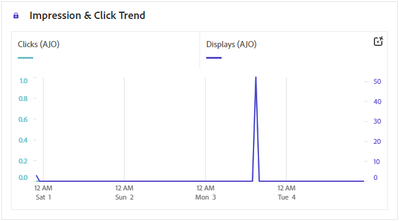
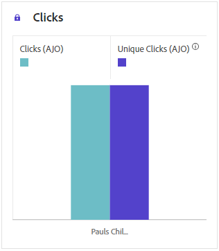
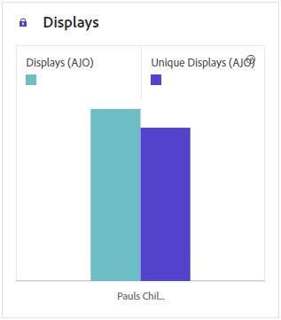
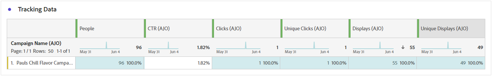
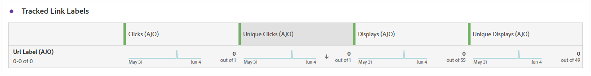
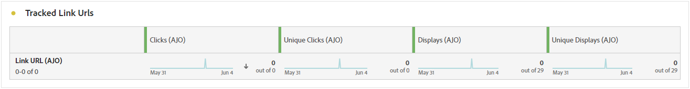

# 行銷活動報告 {#campaign-global-report-cja}

**行銷活動報告**&#x200B;可作為完整的儀表板，提供與行銷活動相關之關鍵量度的詳細分析。 其中包含點按計數、傳送的訊息、設定檔編號和所採取的動作等資料。 透過提供行銷活動成效和參與等級的完整概觀，報告可確保全面瞭解行銷活動的整體成效。

行銷活動報告可以直接從您的行銷活動使用&#x200B;**[!UICONTROL 報告]**&#x200B;按鈕存取。

根據所選的頻道，**行銷活動報告**&#x200B;頁面將顯示以下索引標籤：

* [Campaign](#campaign-global)
* [實驗](#experimentation)
* [電子郵件](#email-global)
* [簡訊](#sms)
* [推播通知](#push-notification)
* [直接郵件](#direct-mail)
* [Web](#web)
* [內容卡](#content-card)
* [程式碼型體驗](#code-based)

若要瞭解有關Customer Journey AnalyticsWorkspace以及如何篩選和分析資料的詳細資訊，請參閱[此頁面](https://experienceleague.adobe.com/en/docs/analytics-platform/using/cja-workspace/home)。

## Campaign {#campaign-global}

### 行銷活動KPI {#campaign-kpis}

**[!UICONTROL 行銷活動]**&#x200B;關鍵績效指標(KPI)可作為全方位儀表板，提供與行銷活動相關之基本量度的分析。 其中包含點按次數和已傳送訊息數量等詳細資訊，可全面分析您的行銷活動的成效和參與程度。

KPI會因行銷活動中使用的管道而有所不同。

+++ 進一步瞭解行銷活動KPI量度

* **[!UICONTROL 點進率]**：與訊息互動的使用者百分比。

* **[!UICONTROL 點按]**：內容在訊息中的點按次數。

* **[!UICONTROL 已傳遞]**：成功傳送的電子郵件數目，與已傳送的訊息總數相關。

* **[!UICONTROL 顯示]**：訊息開啟的次數。

+++

### Campaign 概觀 {#delivery-global}

**[!UICONTROL 行銷活動概覽]**&#x200B;表格可作為完整儀表板，提供與行銷活動相關之關鍵量度的詳細劃分。 這包括基本資訊，例如已傳送的設定檔數和動作，讓您透徹瞭解行銷活動的績效和參與。

請注意，量度會因行銷活動中使用的管道而有所不同。

+++ 進一步瞭解Campaign概觀量度

* **[!UICONTROL 人員]**：符合訊息目標設定檔資格的使用者設定檔數目。

* **[!UICONTROL 點進率]**：與訊息互動的使用者百分比。

* **[!UICONTROL 點按]**：內容在訊息中的點按次數。

* **[!UICONTROL 不重複點按]**：點按您訊息中內容的設定檔數目。

* **[!UICONTROL 已傳遞]**：成功傳送的電子郵件數目，與已傳送的訊息總數相關。

* **[!UICONTROL 傳出頻道的跳出數]**：在傳送程式與自動傳回處理期間，累積的錯誤總數與傳送的訊息總數有關。

* **[!UICONTROL 傳出錯誤]**：在傳送過程中發生的錯誤總數，導致無法將其傳送至設定檔。

* **[!UICONTROL 傳出排除]**： Adobe Journey Optimizer已排除的設定檔數目。

* **[!UICONTROL 顯示]**：訊息開啟的次數。

* **[!UICONTROL 不重複顯示]**：訊息開啟的次數，一個設定檔的多個互動未列入考量。

+++

### Campaign 漏斗結果 {#campaign-funnel}

**[!UICONTROL 行銷活動漏斗結果]**&#x200B;圖表提供您設定檔與訊息互動的詳細分析，提供各種設定檔與內容互動方式的寶貴見解。

+++ 深入瞭解Campaign漏斗結果量度

* **[!UICONTROL 已傳遞]**：成功傳送的電子郵件數目，與已傳送的訊息總數相關。

* **[!UICONTROL 點按]**：內容在訊息中的點按次數。
+++

### 追蹤的連結標籤 {#campaign-track}

**[!UICONTROL 追蹤連結標籤]**&#x200B;表格提供訪客與訊息中所包含URL互動的基本深入分析，提供有關哪些連結吸引最多互動的寶貴資訊。

+++ 深入瞭解追蹤的連結標籤量度

* **[!UICONTROL 不重複點按]**：點按您訊息中內容的設定檔數目。

* **[!UICONTROL 點按]**：內容在訊息中的點按次數。

+++

## 實驗 {#experimentation}

**[!UICONTROL Experimentation]**&#x200B;索引標籤提供每個變體效能的重要深入分析，並識別最成功的變體。

請注意，定義績效最佳者可能需要一些時間。 如果您的實驗不成功，它將會設定為&#x200B;**尚無結果**。

### 實驗KPI {#experimentation-kpis}

**[!UICONTROL Experimentation]**&#x200B;關鍵績效指標(KPI)可作為全方位儀表板，提供與您的實驗相關之基本量度的分析。

+++ 進一步瞭解實驗KPI量度

* **[!UICONTROL 提升度]**：測量指定處理的轉換率相對於基準的提升百分比。

* **[!UICONTROL 信賴度]**：指定處理與基準處理相同的證據。 [了解更多](../content-management/experiment-calculations.md#understand-confidence)

+++

### 依傳入點按次數區分的變體 {#variant-inbound}

依傳入點按次數區分的&#x200B;**[!UICONTROL 變體]** Widget詳細說明每個變體的效能。
如需深入瞭解這些結果以及如何解譯，請參閱[此頁面](../content-management/get-started-experiment.md#interpret-results)。

+++ 進一步瞭解依據傳入點按量度的變體

* **[!UICONTROL 人員]**：符合訊息目標設定檔資格的使用者設定檔數目。

* **[!UICONTROL 傳入點按次數]**：跨傳出管道的點按總數。

* **[!UICONTROL 轉換率]**：建立實驗時先前選取的成功量度總值除以設定檔數目。

* **[!UICONTROL 提升度]**：測量指定處理的轉換率相對於基準的提升百分比。

* **[!UICONTROL 信賴度]**：指定處理與基準處理相同的證據。 [了解更多](../content-management/experiment-calculations.md#understand-confidence)

<!--
* **[!UICONTROL Confidence Upper bound]**:

* **[!UICONTROL Confidence Lower bound]**:
-->
+++

### 傳入點按的轉換率 {#conversion-rate}

**[!UICONTROL 信賴區間]**&#x200B;圖表會測量改善的不確定性。 它詳細說明基準線和最佳執行處理之間的效能百分比差異。 [了解更多](../content-management/experiment-calculations.md#confidence-intervals)。

## 電子郵件 {#email-global}

### 已傳遞vs點選趨勢 {#delivered-click}

**[!UICONTROL 已傳遞與點選趨勢]**&#x200B;圖表提供您設定檔與電子郵件互動的詳細分析，提供設定檔與內容互動方式的寶貴見解。

+++ 深入瞭解傳遞與點選趨勢量度

* **[!UICONTROL 已傳遞]**：與已傳送電子郵件總數相關的成功傳送電子郵件數目。

* **[!UICONTROL 點按]**：內容在電子郵件中的點按次數。

+++

### 傳遞狀態 {#delivery-status}

**[!UICONTROL 傳遞狀態]**&#x200B;圖表提供行銷活動中已傳送電子郵件相關資料的完整檢視，提供關鍵量度的深入分析，例如傳遞和跳出。 這可啟用電子郵件傳送流程的詳細分析，提供關於行銷活動效率和績效的寶貴資訊。

+++ 進一步瞭解傳遞狀態量度

* **[!UICONTROL 已傳遞]**：與已傳送電子郵件總數相關的成功傳送電子郵件數目。

* **[!UICONTROL 傳出頻道的跳出數]**：傳送程式與自動傳回處理期間累計的錯誤總數，與已傳送訊息總數相關。

* **[!UICONTROL 傳出錯誤]**：傳送程式期間發生的錯誤總數，使它無法傳送至設定檔。

* **[!UICONTROL 傳出排除]**： Adobe Journey Optimizer已排除的設定檔數目。

+++

### 正在傳送統計數據 {#sending-statistics-email}

**[!UICONTROL 傳送統計資料]**&#x200B;表格提供有關行銷活動中電子郵件之基本資料的完整摘要。 它詳細說明關鍵量度，例如與您的電子郵件的互動和成功傳送的電子郵件數量，提供對您的電子郵件和行銷活動的成效和觸及範圍的寶貴見解。

+++ 進一步瞭解如何傳送統計資料

* **[!UICONTROL 人員]**：符合訊息目標設定檔資格的使用者設定檔數目。

* **[!UICONTROL 已鎖定目標]**：傳送程式期間處理的電子郵件總數。

* **[!UICONTROL 傳送]**：您電子郵件的傳送總數。

* **[!UICONTROL 已傳遞]**：成功傳送的電子郵件數目，與已傳送的訊息總數相關。

* **[!UICONTROL 傳出頻道的跳出數]**：傳送程式與自動傳回處理期間累計的錯誤總數，與已傳送訊息總數相關。

* **[!UICONTROL 傳出錯誤]**：在傳送過程中發生的錯誤總數，導致無法將其傳送至設定檔。

* **[!UICONTROL 傳出排除]**： Adobe Journey Optimizer已排除的設定檔數目。

+++

### 追蹤統計資料 {#tracking-statistics-email}

**[!UICONTROL 電子郵件 — 追蹤統計資料]**&#x200B;表格提供與行銷活動中所含電子郵件相關的設定檔活動詳細帳戶。 其中包括開啟次數、點按次數和其他相關的參與指標，以提供設定檔與電子郵件內容互動方式的完整檢視。

+++ 進一步瞭解追蹤統計量度

* **[!UICONTROL 點進率(CTR)]**：與電子郵件互動的使用者百分比。

* **[!UICONTROL 點進開啟率(CTOR)]**：電子郵件開啟的次數。

* **[!UICONTROL 點按]**：內容在電子郵件中的點按次數。

* **[!UICONTROL 不重複點按]**：點按電子郵件中內容的設定檔數目。

* **[!UICONTROL 電子郵件開啟次數]**：您的電子郵件在行銷活動中開啟的次數。

* **[!UICONTROL 不重複電子郵件開啟次數]**：開啟電子郵件的百分比。

* **[!UICONTROL 垃圾訊息申訴]**：訊息被宣告為垃圾郵件或垃圾訊息的次數。

* **[!UICONTROL 取消訂閱]**：取消訂閱連結的點按次數。

+++

### 電子郵件網域 {#email-domains}

**[!UICONTROL 電子郵件網域]**&#x200B;表格提供依網域分類的電子郵件深入劃分，讓您深入瞭解電子郵件行銷活動的效能量度。 這項全方位的分析可讓您瞭解不同網域在回應電子郵件內容時的行為。

+++ 進一步瞭解電子郵件網域量度

* **[!UICONTROL 傳送]**：您電子郵件的傳送總數。

* **[!UICONTROL 已傳遞]**：與已傳送電子郵件總數相關的成功傳送電子郵件數目。

* **[!UICONTROL 電子郵件開啟次數]**：您的電子郵件在行銷活動中開啟的次數。

* **[!UICONTROL 點按]**：內容在電子郵件中的點按次數。

* **[!UICONTROL 傳出頻道的跳出數]**：傳送程式與自動傳回處理期間累計的錯誤總數，與已傳送電子郵件總數相關。

* **[!UICONTROL 傳出錯誤]**：在傳送過程中發生的錯誤總數，導致無法將其傳送至設定檔。
+++

### 追蹤的連結標籤 {#track-link-label}

**[!UICONTROL 追蹤的連結標籤]**&#x200B;表格提供您電子郵件中連結標籤的完整概觀，其中會強調產生最高訪客流量的連結。 此功能可讓您識別最熱門的連結並加以優先處理。

+++ 進一步瞭解追蹤的連結標籤量度

* **[!UICONTROL 不重複點按]**：點按電子郵件中內容的設定檔數目。

* **[!UICONTROL 點按]**：內容在電子郵件中的點按次數。

+++

### 追蹤的連結 URL {#track-link-url}

**[!UICONTROL 追蹤的連結URL]**&#x200B;表格提供您電子郵件中吸引最高訪客流量之URL的完整概觀。 這可讓您識別最熱門的連結並排定其優先順序，進而更瞭解電子郵件中特定內容的設定檔參與情形。

+++ 深入瞭解追蹤的連結URL量度

* **[!UICONTROL 不重複點按]**：點按電子郵件中內容的設定檔數目。

* **[!UICONTROL 點按]**：內容在電子郵件中的點按次數。

* **[!UICONTROL 顯示]**：電子郵件開啟的次數。

* **[!UICONTROL 唯一顯示]**：電子郵件開啟的次數，一個設定檔的多個互動未列入考量。

+++

### 電子郵件主旨 {#email-subjects}

**[!UICONTROL 電子郵件主題]**&#x200B;表格提供吸引最多訪客流量的電子郵件主題的完整概觀。 此資源提供受眾參與動態的寶貴見解。

+++ 進一步瞭解電子郵件主題量度

* **[!UICONTROL 人員]**：符合電子郵件目標設定檔資格的使用者設定檔數目。

+++

### 排除原因 {#excluded-reasons}

**[!UICONTROL 排除的原因]**&#x200B;表格提供不同因素的完整檢視，這些因素導致從目標對象中排除使用者設定檔，導致未收到訊息。

如需排除原因的完整清單，請參閱[此頁面](exclusion-list.md)。

### 退回原因 {#bounce-reasons-email}

**[!UICONTROL 退回原因]**&#x200B;表格會編譯與退回訊息相關的可用資料，提供電子郵件退回背後特定原因的詳細深入分析。

如需退信的詳細資訊，請參閱[隱藏清單](../reports/suppression-list.md)頁面。

### 錯誤原因 {#error-reasons-email}

**[!UICONTROL 錯誤原因]**&#x200B;表格提供傳送程式期間發生的特定錯誤的可見度，提供有關錯誤性質和發生情況的寶貴資訊。

## 簡訊 {#sms}

### 已傳遞vs點選趨勢 {#delivered-click-sms}

**[!UICONTROL 已傳遞與點選趨勢]**&#x200B;圖表提供您設定檔與電子郵件互動的詳細分析，提供設定檔與內容互動方式的寶貴見解。

+++ 深入瞭解傳遞與點選趨勢量度

* **[!UICONTROL 已傳遞]**：成功傳送的SMS訊息數目（與SMS訊息總數相關）。

* **[!UICONTROL 點按]**：內容在簡訊訊息中的點按次數。

+++

### 傳遞狀態 {#delivery-status-sms}

**[!UICONTROL 傳遞狀態]**&#x200B;表格提供與您的SMS行銷活動相關的設定檔活動的詳細帳戶。 這包括已傳送的量度、點按次數和其他相關的參與指標，以提供設定檔與簡訊內容互動方式的完整檢視。

+++ 進一步瞭解傳遞狀態量度

* **[!UICONTROL 已傳遞]**：成功傳送的SMS訊息數目（與SMS訊息總數相關）。

* **[!UICONTROL 傳出頻道的跳出數]**：傳送程式與自動傳回處理期間累計的錯誤總數，與傳送的SMS訊息總數相關。

* **[!UICONTROL 傳出錯誤]**：發生且無法傳送至設定檔的錯誤總數。

* **[!UICONTROL 傳出排除]**： Adobe Journey Optimizer已排除的設定檔數目。

+++

### 追蹤的連結標籤 {#track-link-label-sms}

**[!UICONTROL 追蹤的連結標籤]**&#x200B;表格提供您SMS訊息中連結標籤的完整概觀，強調產生最高訪客流量的連結。 此功能可讓您識別最熱門的連結並加以優先處理。

+++ 進一步瞭解追蹤的連結標籤量度

* **[!UICONTROL 不重複點按]**：點按SMS訊息中內容的設定檔數目。

* **[!UICONTROL 點按]**：內容在簡訊訊息中的點按次數。

+++

### 追蹤的連結 URL {#track-link-url-sms}

**[!UICONTROL 追蹤的連結URL]**&#x200B;表格提供您SMS訊息中吸引最高訪客流量的URL的完整概觀。 這可讓您識別最熱門的連結並排定其優先順序，讓您更瞭解簡訊訊息中特定內容的設定檔參與情形。

+++ 深入瞭解追蹤的連結URL量度

* **[!UICONTROL 不重複點按]**：點按SMS訊息中內容的設定檔數目。

* **[!UICONTROL 點按]**：內容在簡訊訊息中的點按次數。

* **[!UICONTROL 顯示]**：訊息開啟的次數。

* **[!UICONTROL 不重複顯示]**：訊息開啟的次數，一個設定檔的多個互動未列入考量。

+++

### 簡訊傳入訊息 {#sms-inbound}

**[!UICONTROL SMS傳入訊息]**&#x200B;表格提供哪些SMS訊息吸引最多訪客流量的完整概觀。 此資源提供受眾參與動態的寶貴見解。

+++ 進一步瞭解簡訊傳入訊息量度

* **[!UICONTROL 人員]**：符合簡訊訊息目標設定檔資格的使用者設定檔數目。

+++

### 簡訊型別 {#sms-message-type}

**[!UICONTROL SMS訊息型別]**&#x200B;表格提供哪種SMS訊息型別吸引最多訪客流量的完整概觀。 此資源提供受眾參與動態的寶貴見解。

+++ 進一步瞭解簡訊型別量度

* **[!UICONTROL 人員]**：符合簡訊訊息目標設定檔資格的使用者設定檔數目。

+++

### 簡訊提供者 {#sms-providers}

**[!UICONTROL SMS提供者]**&#x200B;表格提供訪客流量最高的SMS提供者的完整概觀。 此資源提供受眾參與動態的寶貴見解。

+++ 進一步瞭解簡訊提供者量度

* **[!UICONTROL 人員]**：符合簡訊訊息目標設定檔資格的使用者設定檔數目。

+++

### 退回原因 {#bounce-reasons-sms}

「**[!UICONTROL 退信原因]**」表格提供與退信SMS訊息相關之資料的完整概觀，針對SMS訊息退信例項背後的特定原因提供寶貴的見解。

### 錯誤原因 {#error-reasons-sms}

**[!UICONTROL 錯誤原因]**&#x200B;表格可讓您識別SMS訊息傳送過程中發生的特定錯誤，協助徹底分析遇到的任何問題。

### 排除原因 {#excluded-reasons-sms}

**[!UICONTROL 排除原因]**&#x200B;表格以視覺化方式呈現導致目標對象中排除使用者設定檔的各種因素，以防止他們接收您的SMS訊息。

如需排除原因的完整清單，請參閱[此頁面](exclusion-list.md)。

## 推播通知 {#push-notification}

### 正在傳送統計數據 {#sending-statistics-push}

**[!UICONTROL 傳送統計資料]**&#x200B;表格提供有關推播通知行銷活動的完整基本資料摘要。 它會詳細說明關鍵量度，例如目標對象的大小和成功傳送的推播通知的數量，為您的推播通知提供有效性和觸及範圍的寶貴見解。

+++ 進一步瞭解如何傳送統計資料

* **[!UICONTROL 人員]**：符合推播通知目標設定檔資格的使用者設定檔數目。

* **[!UICONTROL 已鎖定目標]**：分析期間處理的推播通知總數。

* **[!UICONTROL 傳送]**：推播通知的傳送總數。

* **[!UICONTROL 已傳遞]**：成功傳送的推播通知數目（與已傳送的推播通知總數相關）。

* **[!UICONTROL 傳出頻道的跳出數]**：傳送程式與自動傳回處理期間累計的錯誤總數，與推播通知總數相關。

* **[!UICONTROL 傳出錯誤]**：發生且無法傳送至設定檔的錯誤總數。

* **[!UICONTROL 傳出排除]**： Adobe Journey Optimizer已排除的設定檔數目。

+++

### 追蹤統計資料 {#tracking-statistics-push}

**[!UICONTROL 追蹤統計資料]**&#x200B;表格提供與您的推播通知連結的設定檔活動詳細快照，提供參與和推播通知有效性的基本深入分析。

+++ 進一步瞭解追蹤統計量度

* **[!UICONTROL 點進率(CTR)]**：與推播通知互動的使用者百分比。

* **[!UICONTROL 點進開啟率(CTOR)]**：推播通知開啟的次數。

* **[!UICONTROL 點按]**：推播通知內容被點按的次數。

* **[!UICONTROL 不重複點按]**：點按推播通知中內容的設定檔數目。

<!--
* **[!UICONTROL Push custom actions]**: 
-->
+++

### 追蹤的連結標籤 {#track-link-label-push}

**[!UICONTROL 追蹤的連結標籤]**&#x200B;表格提供推播通知內連結標籤的完整概觀，其中會強調產生最高訪客流量的連結。 此功能可讓您識別最熱門的連結並加以優先處理。

+++ 進一步瞭解追蹤的連結標籤量度

* **[!UICONTROL 不重複點按]**：點按推播通知中內容的設定檔數目。

* **[!UICONTROL 點按]**：推播通知內容被點按的次數。

+++

### 追蹤的連結 URL {#track-link-url-push}

**[!UICONTROL 追蹤的連結URL]**&#x200B;表格提供您推播通知中吸引最高訪客流量的URL的完整概觀。 這可讓您識別最熱門的連結並排定其優先順序，進而更瞭解推播通知中特定內容的設定檔參與情形。

+++ 深入瞭解追蹤的連結URL量度

* **[!UICONTROL 不重複點按]**：點按推播通知中內容的設定檔數目。

* **[!UICONTROL 點按]**：推播通知內容被點按的次數。

+++

### 退回原因 {#bounce-reasons-push}

「**[!UICONTROL 彈回原因]**」表格提供與彈回推播通知相關之資料的完整概觀，針對推播通知彈回例項背後的特定原因提供寶貴的見解。

### 錯誤原因 {#error-reasons-push}

**[!UICONTROL 錯誤原因]**&#x200B;表格可讓您識別推播通知傳送過程中發生的特定錯誤，協助徹底分析所遇到的任何問題。

### 排除原因 {#exclude-reasons-push}

**[!UICONTROL 排除原因]**&#x200B;表格以視覺化方式呈現導致從目標對象中排除使用者設定檔的各種因素，以防止他們收到您的推播通知。

如需排除原因的完整清單，請參閱[此頁面](exclusion-list.md)。

## 應用程式內 {#in-app}

### 曝光與點按趨勢 {#impression-click-trend}

**[!UICONTROL 曝光與點按趨勢]**&#x200B;圖表提供設定檔與應用程式內訊息互動的詳細分析，提供設定檔與內容互動方式的寶貴見解。

+++ 進一步瞭解「曝光與點選」趨勢量度

* **[!UICONTROL 點按]**：內容在您應用程式內訊息中的點按次數。

* **[!UICONTROL 顯示]**：訊息開啟的次數。

+++

### 點按次數 {#clicks-inapp}

**[!UICONTROL 點按次數]**&#x200B;圖形會顯示應用程式內點按量度，說明內容點按總次數和點按內容的不重複設定檔數量。

+++ 進一步瞭解點按量度

* **[!UICONTROL 不重複點按]**：在您的應用程式內訊息中點按內容的設定檔數目

* **[!UICONTROL 點按]**：內容在您應用程式內訊息中的點按次數。

+++

### 顯示 {#display-inapp}

**[!UICONTROL 顯示]**&#x200B;圖表可協助您瞭解訊息的整體觸及範圍和與其互動的不重複設定檔數目。

+++ 深入瞭解顯示量度

* **[!UICONTROL 顯示]**：訊息開啟的次數。

* **[!UICONTROL 不重複顯示]**：訊息開啟的次數，一個設定檔的多個互動未列入考量。

+++

### 追蹤資料 {#tracking-data-inapp}

**[!UICONTROL 追蹤資料]**&#x200B;表格提供與您的應用程式內訊息繫結的設定檔活動詳細快照，提供參與和應用程式內訊息有效性的基本深入分析。

+++ 進一步瞭解追蹤資料量度

* **[!UICONTROL 人員]**：符合應用程式內訊息目標設定檔資格的使用者設定檔數目。

* **[!UICONTROL 點進率(CTR)]**：與應用程式內訊息互動的使用者百分比。

* **[!UICONTROL 點進開啟率(CTOR)]**：應用程式內訊息開啟的次數。

* **[!UICONTROL 點按]**：內容在您應用程式內訊息中的點按次數。

* **[!UICONTROL 不重複點按]**：在您的應用程式內訊息中點按內容的設定檔數目。

* **[!UICONTROL 顯示]**：訊息開啟的次數。

* **[!UICONTROL 不重複顯示]**：訊息開啟的次數，一個設定檔的多個互動未列入考量。

* **[!UICONTROL 傳送]**：您的應用程式內訊息的傳送總數。

<!--
* **[!UICONTROL Inbound triggered]**: 

* **[!UICONTROL Inbound dismisses]**: 
-->
+++

### 追蹤的連結標籤 {#track-link-label-inapp}

**[!UICONTROL 追蹤的連結標籤]**&#x200B;表格提供您應用程式內訊息中連結標籤的完整概觀，其中會強調產生最高訪客流量的連結。 此功能可讓您識別最熱門的連結並加以優先處理。

+++ 進一步瞭解追蹤的連結標籤量度

* **[!UICONTROL 不重複點按]**：在您的應用程式內訊息中點按內容的設定檔數目。

* **[!UICONTROL 點按]**：內容在您應用程式內訊息中的點按次數。

* **[!UICONTROL 顯示]**：訊息開啟的次數。

* **[!UICONTROL 不重複顯示]**：訊息開啟的次數，一個設定檔的多個互動未列入考量。

+++

### 追蹤的連結 URL {#track-link-url-inapp}

**[!UICONTROL 追蹤的連結URL]**&#x200B;表格提供應用程式內訊息中吸引最高訪客流量的URL的完整概觀。 這可讓您識別最熱門的連結並排定其優先順序，進而更瞭解應用程式內訊息中特定內容的設定檔參與情形。

+++ 深入瞭解追蹤的連結URL量度

* **[!UICONTROL 不重複點按]**：在您的應用程式內訊息中點按內容的設定檔數目。

* **[!UICONTROL 點按]**：內容在您應用程式內訊息中的點按次數。

+++

## 直接郵件 {#direct-mail}

### 正在傳送統計數據 {#sending-statistics-directmail}

**[!UICONTROL 傳送統計資料]**&#x200B;表格提供有關直接郵件行銷活動的完整基本資料摘要。 它會詳細說明關鍵量度，例如目標對象的大小和成功傳送的直接郵件數量，提供您直接郵件訊息的有效性和觸及範圍的寶貴見解。

+++ 進一步瞭解如何傳送統計資料

* **[!UICONTROL 人員]**：符合訊息目標設定檔資格的使用者設定檔數目。

* **[!UICONTROL 目標]**：傳送過程中已處理的直接郵件訊息總數。

* **[!UICONTROL 傳送]**：直接郵件訊息的傳送總數。

* **[!UICONTROL 已傳遞]**：成功傳送的直接郵件訊息數目，與已傳送的訊息總數相關。

* **[!UICONTROL 傳出錯誤]**：在傳送過程中發生的錯誤總數，導致無法將其傳送至設定檔。

* **[!UICONTROL 傳出排除]**： Adobe Journey Optimizer已排除的設定檔數目。

+++

### 傳遞狀態 {#delivery-status-directmail}

**[!UICONTROL 傳遞狀態]**&#x200B;圖表提供行銷活動中與已傳送直接郵件訊息相關之資料的完整檢視，提供關鍵量度的深入分析，例如傳遞和錯誤。 這可讓您詳細分析直接郵件訊息傳送流程，提供行銷活動的效率和成效的寶貴資訊。

+++ 進一步瞭解傳遞狀態量度

* **[!UICONTROL 已傳遞]**：成功傳送的直接郵件訊息數目，與已傳送的直接郵件訊息總數相關。

* **[!UICONTROL 傳出錯誤]**：傳送程式期間發生的錯誤總數，導致直接郵件訊息無法傳送至設定檔。

* **[!UICONTROL Ountbound排除]**： Adobe Journey Optimizer已排除的設定檔數目。

+++

### 錯誤原因 {#error-reasons-directmail}

**[!UICONTROL 錯誤原因]**&#x200B;表格可讓您識別直接郵件訊息傳送過程中發生的特定錯誤，以便深入分析所發生的任何問題。

### 排除原因 {#exclude-reasons-directmail}

**[!UICONTROL 排除原因]**&#x200B;表格以視覺化方式呈現導致目標對象中排除使用者設定檔的各種因素，以防止他們接收您的直接郵件訊息。

如需排除原因的完整清單，請參閱[此頁面](exclusion-list.md)。

## Web {#web}

### 曝光與點按趨勢 {#impressions-web}

**[!UICONTROL 曝光與點按趨勢]**&#x200B;圖表提供設定檔與網頁互動的詳細分析，提供設定檔與內容互動方式的寶貴見解。

+++ 進一步瞭解「曝光與點選」趨勢量度

* **[!UICONTROL 點按]**：內容在網頁中的點按次數。

* **[!UICONTROL 顯示]**：訊息開啟的次數。

+++

### 點按次數 {#clicks-web}

**[!UICONTROL 點按次數]**&#x200B;圖形會顯示網頁點按量度，說明內容點按總次數和點按內容的不重複設定檔數量。

+++ 進一步瞭解點按量度

* **[!UICONTROL 不重複點按]**：點按您網頁中內容的設定檔數目。

* **[!UICONTROL 點按]**：內容在網頁中的點按次數。

+++

### 展示次數 {#displays-web}

**[!UICONTROL 顯示]**&#x200B;圖表可協助您瞭解訊息的整體觸及範圍和與其互動的不重複設定檔數目。

+++ 深入瞭解顯示量度

* **[!UICONTROL 顯示]**：訊息開啟的次數。

* **[!UICONTROL 不重複顯示]**：訊息開啟的次數，一個設定檔的多個互動未列入考量。

+++

### 追蹤資料 {#track-data-web}

**[!UICONTROL 追蹤資料]**&#x200B;表格提供與您的網頁繫結的設定檔活動詳細快照，提供參與度和網頁效益的基本深入分析。

+++ 進一步瞭解追蹤資料量度

* **[!UICONTROL 人員]**：符合網頁目標設定檔資格的使用者設定檔數目。

* **[!UICONTROL 點進率(CTR)]**：與網頁互動的使用者百分比。

* **[!UICONTROL 點按]**：內容在網頁中的點按次數。

* **[!UICONTROL 不重複點按]**：點按您網頁中內容的設定檔數目。

* **[!UICONTROL 顯示]**：網頁開啟的次數。

* **[!UICONTROL 不重複顯示]**：網頁開啟的次數，未考慮一個設定檔的多個互動。

+++

### 追蹤的連結標籤 {#track-link-web}

**[!UICONTROL 追蹤的連結標籤]**&#x200B;表格提供您網頁內連結標籤的完整概觀，並醒目提示產生最高訪客流量的連結。 此功能可讓您識別最熱門的連結並加以優先處理。

+++ 進一步瞭解追蹤的連結標籤量度

* **[!UICONTROL 不重複點按]**：點按您網頁中內容的設定檔數目。

* **[!UICONTROL 點按]**：內容在網頁中的點按次數。

* **[!UICONTROL 顯示]**：訊息開啟的次數。

* **[!UICONTROL 不重複顯示]**：訊息開啟的次數，一個設定檔的多個互動未列入考量。

+++

### 追蹤的連結 URL {#track-url-web}

**[!UICONTROL 追蹤的連結URL]**&#x200B;表格提供您網頁內吸引最高訪客流量之URL的完整概觀。 這可讓您識別最熱門的連結並排定其優先順序，進而更瞭解個人檔案參與網頁中特定內容的情形。

+++ 深入瞭解追蹤的連結URL量度

* **[!UICONTROL 不重複點按]**：點按您網頁中內容的設定檔數目。

* **[!UICONTROL 點按]**：內容在網頁中的點按次數。

* **[!UICONTROL 顯示]**：訊息開啟的次數。

* **[!UICONTROL 不重複顯示]**：訊息開啟的次數，一個設定檔的多個互動未列入考量。

+++

## 內容卡 {#content-card}

### 顯示與點選趨勢 {#display-click}

**[!UICONTROL 顯示和點選趨勢]**&#x200B;圖表可協助您瞭解訊息的整體觸及範圍和與其互動的不重複設定檔數目。

+++ 進一步瞭解「顯示和點按」量度

* **[!UICONTROL 點按]**：內容卡片中的內容點按次數。

* **[!UICONTROL 顯示]**：訊息開啟的次數。

* **[!UICONTROL 不重複顯示]**：訊息開啟的次數，一個設定檔的多個互動未列入考量。

+++

### 追蹤資料 {#tracking-data}

**[!UICONTROL 追蹤資料]**&#x200B;表格提供繫結至內容卡的設定檔活動詳細快照，提供參與度和內容卡有效性的基本深入分析。

+++ 進一步瞭解追蹤資料量度

* **[!UICONTROL 人員]**：符合內容卡目標設定檔資格的使用者設定檔數目。

* **[!UICONTROL 點進率(CTR)]**：與內容卡互動的使用者百分比。

* **[!UICONTROL 點按次數]**：內容卡中被點按的次數。

* **[!UICONTROL 不重複點按]**：點按內容卡中內容的設定檔數目。

* **[!UICONTROL 顯示]**：訊息開啟的次數。

* **[!UICONTROL 不重複顯示]**：訊息開啟的次數，一個設定檔的多個互動未列入考量。

+++

### 追蹤的標籤 {#tracked-labels}

**[!UICONTROL 追蹤的標籤]**&#x200B;表格提供內容卡中連結標籤的完整概觀，重點說明產生最高訪客流量的連結。 此功能可讓您識別最熱門的連結並加以優先處理。

+++ 進一步瞭解追蹤的標籤量度

* **[!UICONTROL 不重複點按]**：在內容卡片中點按內容的設定檔數目。

* **[!UICONTROL 點按]**：內容卡片中的內容點按次數。

* **[!UICONTROL 顯示]**：訊息開啟的次數。

* **[!UICONTROL 不重複顯示]**：訊息開啟的次數，一個設定檔的多個互動未列入考量。

+++

## 程式碼型體驗 {#code-based}

### 顯示並按一下 {#impressions-code}

**[!UICONTROL 顯示和點按]**&#x200B;圖表會顯示設定檔與程式碼型體驗互動的詳細分析，提供設定檔與內容互動方式的寶貴見解。

+++ 進一步瞭解「曝光與點按」量度

* **[!UICONTROL 不重複點按]**：在您的體驗中點按內容的設定檔數目。

* **[!UICONTROL 點按次數]**：內容在您的體驗中被點按的次數。

* **[!UICONTROL 顯示]**：體驗開啟的次數。

* **[!UICONTROL 不重複顯示]**：體驗開啟的次數，未考慮一個設定檔的多個互動。

+++

### 追蹤資料 {#track-data-code}

**[!UICONTROL 追蹤資料]**&#x200B;表格提供與您的程式碼式體驗繫結的設定檔活動詳細快照，提供參與和體驗有效性的基本深入分析。

+++ 進一步瞭解追蹤資料量度

* **[!UICONTROL 人員]**：符合體驗目標設定檔資格的使用者設定檔數目。

* **[!UICONTROL 點進率(CTR)]**：與您體驗互動的使用者百分比。

* **[!UICONTROL 點按次數]**：內容在您的體驗中被點按的次數。

* **[!UICONTROL 不重複點按]**：在您的體驗中點按內容的設定檔數目。

* **[!UICONTROL 顯示]**：您的體驗開啟的次數。

* **[!UICONTROL 不重複顯示]**：您的體驗開啟的次數，一個設定檔的多個互動未列入考量。

+++

### 追蹤的連結標籤 {#track-link-code}

**[!UICONTROL 追蹤的連結標籤]**&#x200B;表格提供程式碼型體驗中連結標籤的完整概觀，其中會強調產生最高訪客流量的連結。 此功能可讓您識別最熱門的連結並加以優先處理。

+++ 進一步瞭解追蹤的連結標籤量度

* **[!UICONTROL 不重複點按]**：在您的程式碼型體驗中點按內容的設定檔數目。

* **[!UICONTROL 點按次數]**：在您的程式碼型體驗中點按內容的次數。

* **[!UICONTROL 顯示]**：體驗開啟的次數。

* **[!UICONTROL 不重複顯示]**：體驗開啟的次數，未考慮一個設定檔的多個互動。

+++
