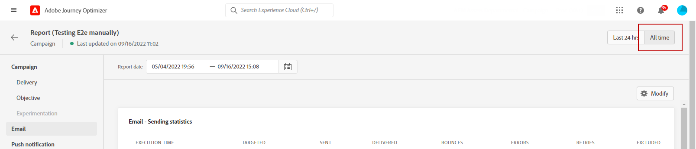
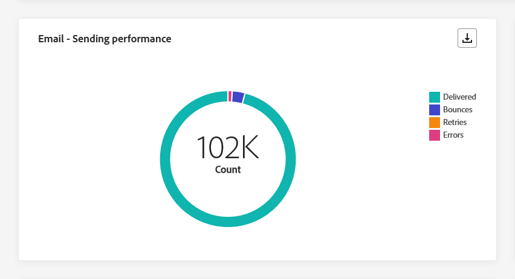
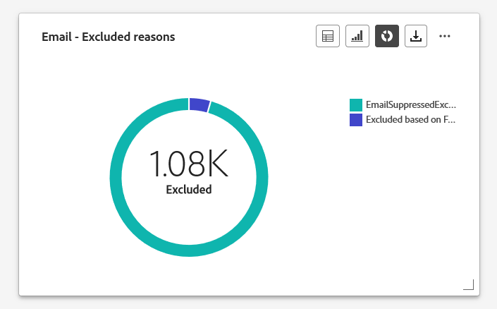
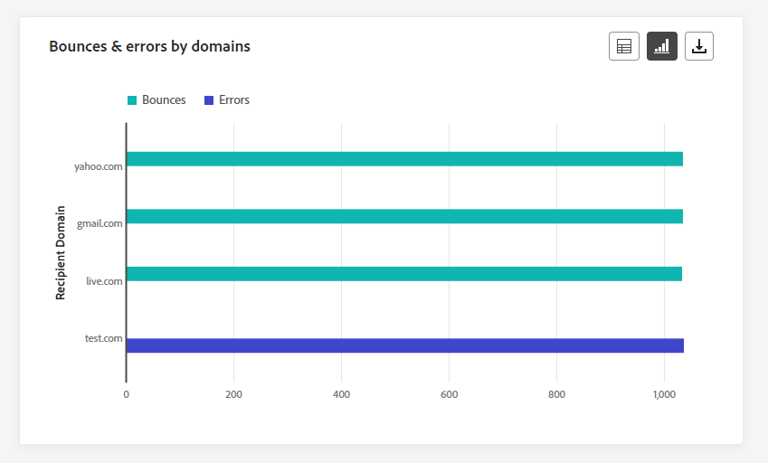
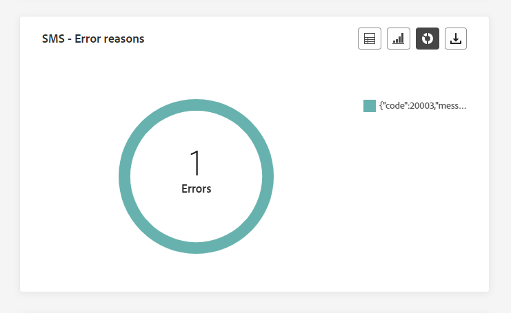
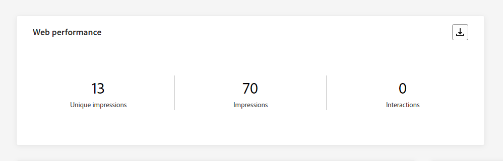

# 行銷活動全域報告 {#campaign-global-report}

>[!CONTEXTUALHELP]
>id="ajo_campaign_global_report"
>title="行銷活動全域報告"
>abstract="行銷活動全域報告可測量您的行銷活動在選取時段內的影響。您的報表會分為不同的介面工具，詳述促銷活動的成功和錯誤。每個報告儀表板都可以透過調整大小或移除介面工具來修改。"

全域報告，可從存取 **所有時間** 標籤，顯示至少兩小時前發生的事件，以及所選時段內的封面事件。 相較之下，即時報表著重於過去24小時內發生的事件，最短間隔為事件發生後的2分鐘。

行銷活動全域報告可透過以下直接從行銷活動存取： **[!UICONTROL 檢視報告]** 按鈕。

行銷活動 **[!UICONTROL 全域報告]** 頁面會顯示以下索引標籤：

* [Campaign](#campaign-global)
* [電子郵件](#email-global)
* [應用程式內](#inapp-global)
* [推播](#push-global)
* [簡訊](#sms-global)
* [Web](#web-tab)
* [直接郵件](#direct-mail-global)

行銷活動 **[!UICONTROL 全域報告]** 分成不同的Widget，詳細說明行銷活動的成功和錯誤。 如有需要，可以調整每個Widget的大小並將其刪除。 如需詳細資訊，請參閱此 [區段](../reports/global-report.md#modify-dashboard).

如需Adobe Journey Optimizer中可用每個量度的詳細清單，請參閱 [此頁面](global-report.md#list-of-components-global.md)

## 行銷活動標籤 {#campaign-global}

### 傳遞 {#delivery-global}

>[!CONTEXTUALHELP]
>id="ajo_campaign_delivery_global"
>title="行銷活動的統計資料"
>abstract="行銷活動的統計資料介面工具詳細說明與行銷活動相關的主要資訊，例如所輸入的設定檔及已完成的動作。"

此 **[!UICONTROL 行銷活動的統計資料]** KPI可做為完整的儀表板，提供與行銷活動相關之關鍵量度的詳細劃分。 這包括基本資訊，例如已傳送的設定檔數和動作，讓您透徹瞭解行銷活動的績效和參與。

+++ 進一步瞭解Campaign的統計量度

* **[!UICONTROL 對象]**：目標設定檔數目。

* **[!UICONTROL 動作已傳送]**：動作已傳送的不重複總次數。

* **[!UICONTROL 動作失敗百分比]**：動作失敗的不重複次數與動作已傳送的不重複次數總數的百分比。

+++

<!--
### Objectives report {#objectives-global}

The **[!UICONTROL Objectives]** tab allows you to better fine-tune your deliveries' reports by targeting one specific metric.

The **[!UICONTROL Objectives]** listed are linked to **[!UICONTROL Datasets]** that define a connection to a system in order to retrieve additional information. A list of built-in **[!UICONTROL Objectives]** is available but you can add your own by adding new **[!UICONTROL Dataset]**. For the detailed procedure, refer to this [section](../content-management/reporting-configuration.md).

After selecting the Objectives you want to target on, the two **[!UICONTROL Performance overview]** and **[!UICONTROL Campaign objective]** widgets will provide a detailed summary of your delivery performance. 

With the **[!UICONTROL Campaign objective]** widget, you can also choose to compare your main objective with another metric.
-->

### 實驗報告 {#experimentation-global}

>[!CONTEXTUALHELP]
>id="ajo_campaigns_content_experiment_click"
>title="成功量度"
>abstract="先前在建立實驗時選取的成功量度的總值除以設定檔的數量。"

此 **[!UICONTROL 實驗]** Tab提供每個變體績效的關鍵分析，並識別最成功的變體。

請注意，定義績效最佳者可能需要一些時間，其將以此圖示表示 .

+++進一步瞭解Experimentation報表中可用的不同量度和Widget。

此 **[!UICONTROL 實驗結果]** widget詳細說明每個變體的效能。 您可以透過以下方式選取處理方式之一來變更基準線： **[!UICONTROL 基線]** 下拉式清單。 最佳處理方式會以星形圖示表示。

如需這些結果的深入瞭解以及如何解讀，請參閱 [此頁面](../content-management/get-started-experiment.md#interpret-results).

此表格會顯示下列量度：

* **[!UICONTROL 提升度超過基準線]**：測量指定處理的轉換率相對於基線的增進百分比。

* **[!UICONTROL 信賴度]**：指定處理與基線處理相同的證據。 [了解更多](../content-management/experiment-calculations.md#understand-confidence)

* **[!UICONTROL 不重複傳出點按]**：跨傳出頻道的點按總數。

* **[!UICONTROL 設定檔]**：針對此處理的設定檔數。

* **[!UICONTROL 不重複傳出點按次數/設定檔]**：建立實驗時先前選取的成功量度總值除以設定檔數量。

此 **[!UICONTROL 信賴區間]** 圖表會測量改善的不確定性。 它詳細說明基準線和最佳執行處理之間的效能百分比差異。 [了解更多](../content-management/experiment-calculations.md#confidence-intervals)。

最後一個Widget提供的資料與 **[!UICONTROL 成功量度]** 您先前已為「處理」選取。 您可以選擇從中選擇不同的目標量度 **[!UICONTROL 量度]** 用於追蹤替代資料的下拉式功能表。

>[!CAUTION]
>
>使用實驗中的篩選量度時，請注意，從實驗比較頁面上的下拉式清單中變更量度選取範圍時，不會保留篩選值。 例如，從「點按」切換至「不重複點按」會導致套用的篩選器遺失，導致比較不準確或無效。

+++

## 電子郵件標籤 {#email-global}

### 電子郵件 - 傳送統計資料 {#sending-statistics-email}

>[!CONTEXTUALHELP]
>id="ajo_campaign_global_email_sending_statistics"
>title="電子郵件 - 傳送統計資料"
>abstract="「電子郵件 - 發送統計資料」表格總結你的電子郵件的基本資料，例如「指定對象」或「已送達」。"

此 **[!UICONTROL 電子郵件傳送統計資料]** 表格提供有關電子郵件行銷活動之基本資料的完整摘要。 它會詳細說明關鍵量度，例如目標對象的大小和成功傳送的電子郵件數量，為您的電子郵件提供有效性和觸及範圍的寶貴見解。

+++ 進一步瞭解電子郵件傳送統計量度

* **[!UICONTROL 已鎖定目標]**：傳送過程中處理的電子郵件總數。

* **[!UICONTROL 已傳送]**：電子郵件的傳送總數。

* **[!UICONTROL 已傳遞]**：成功傳送的電子郵件數量，與已傳送訊息總數相關。

* **[!UICONTROL 傳遞率]**：成功傳送的電子郵件百分比。

* **[!UICONTROL 跳出數]**：與已傳送訊息總數相關的傳送程式與自動傳回處理期間累計的錯誤總數。

* **[!UICONTROL 跳出率]**：與已傳送電子郵件相比跳出的電子郵件百分比。

* **[!UICONTROL 錯誤]**：在傳送過程中發生且無法傳送至設定檔的錯誤總數。

* **[!UICONTROL 錯誤率]**：與已傳送的電子郵件相比，在傳送過程中發生而無法傳送的錯誤百分比。

* **[!UICONTROL 重試]**：重試佇列中的電子郵件數。

* **[!UICONTROL 已排除]**：Adobe Journey Optimizer已排除的設定檔數。

+++

### 電子郵件 - 追蹤統計資料 {#tracking-statistics-email}

>[!CONTEXTUALHELP]
>id="ajo_campaign_global_email_tracking_statistics"
>title="電子郵件 - 追蹤統計資料"
>abstract="「電子郵件 - 追蹤統計資料」表格提供你的電子郵件設定檔活動的資料。"

此 **[!UICONTROL 電子郵件 — 追蹤統計資料]** 表格提供與您的電子郵件行銷活動相關的設定檔活動的詳細帳戶。 其中包括開啟次數、點按次數和其他相關的參與指標，以提供設定檔與電子郵件內容互動方式的完整檢視。

+++ 進一步瞭解電子郵件 — 追蹤統計量度

* **[!UICONTROL 開啟次數]**：電子郵件開啟的次數。

* **[!UICONTROL 不重複開啟次數]**：已開啟電子郵件的百分比。

* **[!UICONTROL 開啟率]**：與已傳遞電子郵件數量相比較的已開啟電子郵件總數。

* **[!UICONTROL 點按次數]**：內容在您的電子郵件中被點按的次數。

* **[!UICONTROL 不重複點按]**：點按電子郵件中內容的設定檔數。

* **[!UICONTROL 不重複點按率]**：與您的電子郵件互動的使用者百分比。

* **[!UICONTROL 取消訂閱]**：對取消訂閱連結的點按次數。

* **[!UICONTROL 垃圾郵件投訴數]**：訊息被宣告為垃圾郵件或垃圾郵件的次數。

+++

### 電子郵件 - 傳送效能 {#sending-performance-email}

>[!CONTEXTUALHELP]
>id="ajo_campaign_global_email_sending_performance"
>title="電子郵件 - 傳送效能"
>abstract="「電子郵件 - 傳送效能」圖表顯示有關已發送電子郵件的綜合資料，提供關鍵量度 (例如送出郵件和退回郵件) 的深入分析，以利針對電子郵件傳送過程進行詳細分析。"

此 **[!UICONTROL 電子郵件 — 傳送績效]** graph提供與已傳送電子郵件相關的完整資料檢視，提供關鍵量度的深入分析，例如傳遞和跳出。 這可啟用電子郵件傳送流程的詳細分析，提供電子郵件行銷活動的效率和效能的寶貴資訊。

+++ 進一步瞭解電子郵件 — 傳送效能量度

* **[!UICONTROL 已傳遞]**：成功傳送的電子郵件數，與已傳送電子郵件總數相關。

* **[!UICONTROL 跳出數]**：與已傳送電子郵件總數相關的傳送程式與自動傳回處理期間累計的錯誤總數。

* **[!UICONTROL 重試]**：重試佇列中的電子郵件數。

* **[!UICONTROL 錯誤]**：在傳送過程中發生且無法傳送至設定檔的錯誤總數。

+++

### 電子郵件 - 退回郵件的原因和類別 {#bounces-email}

>[!CONTEXTUALHELP]
>id="ajo_campaign_global_email_bounce_categories"
>title="電子郵件 - 退回類別"
>abstract="「電子郵件 - 退回」類別圖表和表格提供有關暫時性和永久錯誤的資料。"

>[!CONTEXTUALHELP]
>id="ajo_campaign_global_email_bounce_reasons"
>title="電子郵件 - 退回原因"
>abstract="「電子郵件 - 退回原因」圖表和表格包含與退回郵件相關的可用資料。"

此 **[!UICONTROL 電子郵件 — 退回原因]** 和 **[!UICONTROL 電子郵件 — 退回類別]** Widget會編譯與退回訊息相關的可用資料，提供電子郵件退回背後的特定原因和類別的詳細深入分析。

有關退信的詳細資訊，請參閱 [隱藏清單](../reports/suppression-list.md) 頁面。

+++ 進一步瞭解電子郵件 — 退回類別量度

* **[!UICONTROL 硬退信]**：永久錯誤的總數，例如錯誤的電子郵件地址。 這包含明確指出地址無效的錯誤訊息，例如「未知使用者」。

* **[!UICONTROL 軟退信]**：暫時性錯誤的總數，例如完整的收件匣。

* **[!UICONTROL 已忽略]**：暫時性總數，例如「不在辦公室」或技術錯誤，例如，如果傳送者型別是郵遞員。

+++

### 電子郵件 - 錯誤原因 {#errors-email}

>[!CONTEXTUALHELP]
>id="ajo_campaign_global_email_error_reasons"
>title="電子郵件 - 錯誤原因"
>abstract="「電子郵件 - 錯誤原因」圖表和表格讓你能夠識別傳送過程中發生的特定錯誤。"

此 **[!UICONTROL 錯誤原因]** 圖表和表格可讓您檢視傳送過程中發生的特定錯誤，提供有關錯誤性質和發生次數的寶貴資訊。

您可以選擇從表格、長條圖或環形圖切換。

### 電子郵件 - 排除原因 {#excluded-email}

>[!CONTEXTUALHELP]
>id="ajo_campaign_global_email_excluded_reasons"
>title="電子郵件 - 排除原因"
>abstract="「排除原因」圖表和表格說明導致使用者設定檔被排除在目標對象之外，而未能收到訊息的各項因素。"

此 **[!UICONTROL 排除的原因]** 圖表和表格可全面檢視導致從目標對象中排除使用者設定檔，從而導致未收到訊息的不同因素。

請參閱 [此頁面](exclusion-list.md) 以取得排除原因的完整清單。

### 依網域劃分的已傳送和已送達郵件 {#sent-domains}

>[!CONTEXTUALHELP]
>id="ajo_campaign_global_email_sent_domains"
>title="依網域劃分的已傳送和已送達郵件"
>abstract="「依網域劃分的已傳送和已送達郵件」表格和圖表提供依網域分類的電子郵件劃分資料，呈現對電子郵件通訊整體績效的深入解析。"

此 **[!UICONTROL 依網域傳送和傳遞]** 表格和圖表提供網域層級的電子郵件詳細劃分，提供電子郵件效能的完整深入分析。

+++ 進一步瞭解依網域進行之傳送和傳遞的量度

* **[!UICONTROL 已傳送]**：電子郵件的傳送總數。

* **[!UICONTROL 已傳遞]**：成功傳送的電子郵件數，與已傳送電子郵件總數相關。

+++

### 依網域劃分的退回情形與錯誤 {#bounces-domains}

>[!CONTEXTUALHELP]
>id="ajo_campaign_global_email_bounces_domains"
>title="依網域劃分的退回情形與錯誤"
>abstract="「依網域劃分的退回情形與錯誤」圖表和表格提供網域層級的精細劃分資料，可讓您深入了解電子郵件傳送過程中遇到的特定錯誤。"

此 **[!UICONTROL 依網域區分的退回和錯誤]** 圖表和表格提供傳送程式期間所遇到特定錯誤的網域層級劃分，針對所發生的問題提供詳細分析。

+++ 進一步瞭解依網域量度的跳出和錯誤

* **[!UICONTROL 跳出數]**：與已傳送電子郵件總數相關的傳送程式與自動傳回處理期間累計的錯誤總數。

* **[!UICONTROL 錯誤]**：在傳送過程中發生且阻止您的電子郵件傳送至設定檔的錯誤總數。

+++

### 依網域劃分的開啟和點按動作 {#opens-domains}

>[!CONTEXTUALHELP]
>id="ajo_campaign_global_email_open_domains"
>title="依網域劃分的開啟和點按動作"
>abstract="「依網域劃分的開啟和點按動作」圖表和表格提供網域層級的詳細劃分資料，呈現對象與您電子郵件互動方式的全面檢視。"

此 **[!UICONTROL 依網域開啟和點按]** 圖形和表格會顯示設定檔與電子郵件互動的網域層級劃分，提供不同網域與內容互動方式的寶貴見解。

+++ 進一步瞭解依網域量度的開啟和點按次數

* **[!UICONTROL 開啟次數]**：電子郵件開啟的次數。

* **[!UICONTROL 點按次數]**：內容在電子郵件中的點按次數。

+++

### 依網域劃分的退回原因 {#bounce-reasons-domains}

>[!CONTEXTUALHELP]
>id="ajo_campaign_global_email_bounces_reasons_domains"
>title="依網域劃分的退回原因"
>abstract="「依網域劃分的退回原因」圖表和表格提供網域層級的劃分資料，讓您取得對臨時和永久錯誤的全面深入解析。此詳細分析會為您提供有關退回郵件背後具體原因的珍貴資訊。"

此 **[!UICONTROL 依網域區分的退回原因]** 圖表和表格提供有關暫時和永久錯誤的網域層級資料劃分，提供退回訊息背後原因的詳細深入分析。

+++ 進一步瞭解依網域量度的退回原因

* **[!UICONTROL 開啟次數]**：電子郵件開啟的次數。

* **[!UICONTROL 點按次數]**：內容在電子郵件中的點按次數。

+++

### 電子郵件 - 熱門 URL {#top-url-email}

>[!CONTEXTUALHELP]
>id="ajo_campaign_global_email_top_url"
>title="電子郵件 - 熱門 URL"
>abstract="「電子郵件 - 熱門 URL」圖表和表格提供電子郵件中訪客流量最高的 URL 的綜合概觀，讓你能夠確認最受歡迎的連結。"

此 **[!UICONTROL 電子郵件 — 熱門URL]** 圖表和表格提供電子郵件中吸引最高訪客流量之URL的完整概觀。 這可讓您識別最熱門的連結並排定其優先順序，進而更瞭解電子郵件中特定內容的設定檔參與情形。

### 電子郵件 - 最佳收件者網域 {#top-recipient-email}

>[!CONTEXTUALHELP]
>id="ajo_campaign_global_email_best_recipient"
>title="電子郵件 - 最佳收件者網域"
>abstract="「電子郵件 - 最佳收件者」網域圖表和表格提供收件者開啟電子郵件時最常使用網域的詳細劃分，針對收件者行為提供重要的深入分析。"

>[!CAUTION]
>
> 此 **[!UICONTROL 電子郵件 — 最佳收件者網域]** widget的正確率為99.95%。

此 **[!UICONTROL 電子郵件 — 最佳收件者網域]** 圖表和表格提供設定檔最常用於開啟電子郵件之網域的詳細劃分。 這可提供描述檔行為的寶貴見解，可幫助您瞭解偏好的平台。

+++ 進一步瞭解電子郵件 — 最佳收件者網域量度

* **[!UICONTROL 已傳遞]**：成功傳送的電子郵件數，與已傳送電子郵件總數相關。

* **[!UICONTROL 傳遞率]**：成功傳送的電子郵件百分比。

* **[!UICONTROL 退回數+錯誤率]**：與已傳送電子郵件相比跳出的電子郵件百分比。

+++

### 電子郵件 - 最佳化 {#optimized-email}

>[!NOTE]
>
>此 **[!UICONTROL 已最佳化與未最佳化]** 和 **[!UICONTROL 傳送時間最佳化]** 只有當您的電子郵件已啟用傳送時間最佳化選項時，才可使用Widget。 如需傳送時間最佳化的詳細資訊，請參閱 [此頁面](../building-journeys/journeys-message.md#send-time-optimization).

此 **[!UICONTROL 已最佳化與未最佳化]** 和 **[!UICONTROL 傳送時間最佳化]** Widget會詳細說明與訊息相關的主要資訊，無論是否已最佳化。

+++ 進一步瞭解傳送時間最佳化量度

* **[!UICONTROL 已傳送]**：傳送總數。

* **[!UICONTROL 開啟次數]**：訊息開啟的次數。

* **[!UICONTROL 點按次數]**：內容在電子郵件中的點按次數。

* **[!UICONTROL 已傳遞]**：成功傳送的訊息數，與已傳送訊息總數相關。

* **[!UICONTROL 跳出數]**：與已傳送訊息總數相關的傳送程式與自動傳回處理期間累計的錯誤總數。

+++

### 電子郵件 - 優惠 {#email-offers}

此 **[!UICONTROL 優惠統計資料]**， **[!UICONTROL 一段時間內的優惠統計資料]** 和 **[!UICONTROL 優惠詳細統計資料]** Widget可測量您選件的成功程度以及對目標受眾的影響。

+++ 進一步瞭解電子郵件 — 優惠方案量度

* **[!UICONTROL 已傳送的優惠]**：選件的傳送總數。

* **[!UICONTROL 優惠印象]**：在您的電子郵件中開啟選件的次數。

* **[!UICONTROL 優惠點選次數]**：在您的電子郵件中點按優惠的次數。

* **[!UICONTROL 位置名稱]**：用來顯示優惠方案的位置名稱。 如需位置的詳細資訊，請參閱此 [頁面](../offers/offer-library/creating-placements.md).

* **[!UICONTROL 選件名稱]**：在傳送中新增的優惠方案名稱。 如需位置的詳細資訊，請參閱此 [頁面](../offers/offer-library/creating-personalized-offers.md).

* **[!UICONTROL 已傳送的優惠]**：選件的傳送總數。

* **[!UICONTROL 優惠曝光率]**：已開啟選件相對於已傳送選件數量的百分比。

+++

## 應用程式內標籤 {#inapp-global}

從您的行銷活動 **[!UICONTROL 全域報告]**，則 **[!UICONTROL 應用程式內]** 索引標籤詳細說明與在您的行銷活動中傳送的應用程式內訊息相關的主要資訊。

### 應用程式內績效 {#in-app-performance}

>[!CONTEXTUALHELP]
>id="ajo_campaign_global_inapp_performance"
>title="應用程式內績效"
>abstract="應用程式內效能 KPI 提供有關訪客參與應用程式內訊息的重要深入分析。"

此 **[!UICONTROL 應用程式內績效]** KPI可讓您深入瞭解訪客與應用程式內訊息的互動程度，並提供基本量度，以評估應用程式內行銷活動的效益和影響。

+++ 進一步瞭解應用程式內績效量度

* **[!UICONTROL 不重複曝光次數]**：應用程式內訊息已傳送給的不重複使用者人數。

* **[!UICONTROL 曝光數]**：傳送給所有使用者的應用程式內訊息總數。

* **[!UICONTROL 互動]**：應用程式內訊息的參與總數。 這包括使用者所執行的任何動作，例如點選、解僱或任何其他互動。

+++

### 依類型劃分的互動 {#interactions-type}

>[!CONTEXTUALHELP]
>id="ajo_campaign_global_inapp_interactions"
>title="依類型劃分的互動"
>abstract="「依類型劃分的互動」圖表和表格透過追蹤任何點選、關閉或互動，詳細說明使用者如何與應用程式內訊息互動。"

此 **[!UICONTROL 依型別的互動]** 圖表和表格詳細說明設定檔如何與您的應用程式內訊息、追蹤動作（例如點選、解僱或任何其他形式的參與）互動。

### 應用程式內摘要 {#in-app-summary}

>[!CONTEXTUALHELP]
>id="ajo_campaign_global_inapp_summary"
>title="應用程式內摘要"
>abstract="應用程式內摘要圖表顯示指定時間內應用程式內曝光與互動的進展。"

此 **[!UICONTROL 應用程式內摘要]** 圖表會說明應用程式內曝光次數和互動在指定期間內的進度，提供應用程式內訊息效能的完整概覽。

+++ 進一步瞭解應用程式內摘要量度

* **[!UICONTROL 不重複曝光次數]**：應用程式內訊息已傳送給的不重複使用者人數。

* **[!UICONTROL 曝光數]**：傳送給所有使用者的應用程式內訊息總數。

* **[!UICONTROL 互動]**：應用程式內訊息的參與總數。 這包括使用者所執行的任何動作，例如點選、解僱或任何其他互動。

+++

## 推播通知標籤 {#push-global}

從您的行銷活動 **[!UICONTROL 全域報告]**，則 **[!UICONTROL 推播通知]** 索引標籤會詳細說明與行銷活動中傳送之推播通知相關的主要資訊。

### 推播通知 - 傳送統計資料 {#push-sending-statistics}

>[!CONTEXTUALHELP]
>id="ajo_campaign_global_push_sending_statistics"
>title="推播通知 - 傳送統計資料"
>abstract="「推播通知傳送統計資料」表格總結有關推播通知的基本資料，例如指定對象或已送達的訊息。"

此 **[!UICONTROL 推播通知 — 傳送統計資料]** 此表格提供與推播通知相關之基本資料的簡要摘要，包括關鍵量度，例如目標訊息數目以及成功傳送的訊息數目。

+++ 進一步瞭解推播通知 — 傳送統計量度

* **[!UICONTROL 執行時間]**：您每次執行循環推播通知的開始時間。 若要僅定位一或多個循環推播通知，請從 **[!UICONTROL 執行時間]** 下拉式清單。

* **[!UICONTROL 已鎖定目標]**：分析期間處理的推播通知總數。

* **[!UICONTROL 已傳送]**：推播通知的傳送總數。

* **[!UICONTROL 已傳遞]**：成功傳送的推播通知數，與已傳送推播通知總數相關。

* **[!UICONTROL 傳遞率]**：成功傳送的推播通知百分比。

* **[!UICONTROL 跳出數]**：與推播通知總數相關的傳送程式與自動傳回處理期間累計的錯誤總數。

* **[!UICONTROL 跳出率]**：與已傳送的推播通知相比退回的推播通知百分比。

* **[!UICONTROL 錯誤]**：發生且無法傳送至設定檔的錯誤總數。

* **[!UICONTROL 錯誤率]**：與已傳送的推播通知相比，無法傳送期間發生的錯誤百分比。

* **[!UICONTROL 已排除]**：Adobe Journey Optimizer已排除的設定檔數。

+++

### 推播通知 - 追蹤統計資料 {#push-tracking-statistics}

>[!CONTEXTUALHELP]
>id="ajo_campaign_global_push_tracking_statistics"
>title="推播通知 - 追蹤統計資料"
>abstract="「推播追蹤統計資料」提供有關推播通知的設定檔活動的資料。"

此 **[!UICONTROL 推播通知 — 追蹤統計資料]** widget提供與您的推播通知相連結的個人資料活動的詳細快照，提供參與和推播通知有效性的基本深入分析。

+++ 進一步瞭解推播通知 — 追蹤統計量度

* **[!UICONTROL 執行時間]**：您每次執行循環推播通知的開始時間。 若要僅定位一或多個循環推播通知，請從 **[!UICONTROL 執行時間]** 下拉式清單。

* **[!UICONTROL 開啟次數]**：您的推播通知開啟次數。

* **[!UICONTROL 動作]**：推播通知已傳送的動作總數，例如按鈕點選或解除。

+++

### 推播通知 - 傳送摘要 {#push-summary}

>[!CONTEXTUALHELP]
>id="ajo_campaign_global_push_sending_summary"
>title="推播通知 - 傳送摘要"
>abstract="「推播通知傳送摘要」圖表顯示已傳送的推播通知的可用資料。"

此 **[!UICONTROL 推播通知 — 傳送摘要]** 圖表提供動態表示，顯示推播通知活動的分析。 此圖形表示提供已傳送推播通知的完整劃分。

+++ 進一步瞭解推播通知 — 傳送摘要量度

* **[!UICONTROL 開啟次數]**：您的推播通知開啟次數。

* **[!UICONTROL 動作]**：推播通知已傳送的動作總數，例如按鈕點選或解除。

* **[!UICONTROL 跳出數]**：相對於已傳送推播通知的總數，已累計和自動傳回處理的錯誤總數。

* **[!UICONTROL 已傳遞]**：成功傳送的推播通知數，與已傳送推播通知總數相關。

* **[!UICONTROL 錯誤]**：發生且無法傳送至設定檔的錯誤總數。

+++

### 推播通知 — 最佳化 {#push-optimized}

>[!NOTE]
>
>此 **[!UICONTROL 已最佳化與未最佳化]** 和 **[!UICONTROL 傳送時間最佳化]** 只有為您的推播通知啟動傳送時間最佳化選項時，才可使用Widget。 如需傳送時間最佳化的詳細資訊，請參閱 [此頁面](../building-journeys/journeys-message.md#send-time-optimization).

此 **[!UICONTROL 已最佳化與未最佳化]** 和 **[!UICONTROL 傳送時間最佳化]** Widget會詳細說明與訊息相關的主要資訊，無論是否已最佳化。

+++ 進一步瞭解推播通知 — 傳送時間最佳化量度

* **[!UICONTROL 已傳遞]**：成功傳送的推播通知數，與已傳送推播通知總數相關。

* **[!UICONTROL 開啟次數]**：您的推播通知開啟次數。

* **[!UICONTROL 動作]**：推播通知已傳送的動作總數，例如按鈕點選或解除。

* **[!UICONTROL 跳出數]**：與已傳送推播通知總數相關的傳送程式與自動傳回處理期間累計的錯誤總數。

+++

### 推播通知 - 錯誤原因 {#error-reasons-push}

>[!CONTEXTUALHELP]
>id="ajo_campaign_global_push_error_reasons"
>title="推播通知 - 錯誤原因"
>abstract="「錯誤原因」圖表和表格讓你能夠確認傳送過程中發生的特定錯誤。"

此 **[!UICONTROL 錯誤原因]** 表格和圖表可讓您識別在傳送推播通知的過程中發生的特定錯誤，針對過程中遇到的任何問題提供詳細分析。

### 推播通知 - 排除原因 {#excluded-push}

>[!CONTEXTUALHELP]
>id="ajo_campaign_global_push_excluded_reasons"
>title="推播通知 - 排除原因"
>abstract="「排除原因」圖表和表格說明導致使用者設定檔被排除在目標對象之外而未能收到訊息的各項因素。"

此 **[!UICONTROL 排除的原因]** 圖表和表格會顯示從目標設定檔中排除的使用者設定檔無法接收推播通知的不同原因。

請參閱 [此頁面](exclusion-list.md) 以取得排除原因的完整清單。

### 推播通知 - 依平台劃分 {#breakdown-platform-push}

>[!CONTEXTUALHELP]
>id="ajo_campaign_global_push_breakdown_platform"
>title="推播通知 - 依平台劃分"
>abstract="「推播通知 - 依平台劃分」圖表和表格，會根據設定檔的作業系統提供推播通知成功傳送的劃分資料。"

此 **[!UICONTROL 推播通知 — 依據平台的劃分]** 圖表和表格提供推送通知成功的詳細分析，根據您的設定檔作業系統提供深入分析。 此劃分可讓您更瞭解推播通知在不同平台上的執行情形。

+++ 進一步瞭解推播通知 — 依平台量度劃分

* **[!UICONTROL 已鎖定目標]**：分析期間處理的推播通知總數。

* **[!UICONTROL 已傳遞]**：成功傳送的推播通知數，與已傳送推播通知總數相關。

* **[!UICONTROL 開啟次數]**：您的推播通知開啟次數。

* **[!UICONTROL 動作]**：推播通知已傳送的動作總數，例如按鈕點選或解除。

* **[!UICONTROL 跳出數]**：相對於已傳送推播通知的總數，已累計和自動傳回處理的錯誤總數。

* **[!UICONTROL 錯誤]**：發生且無法傳送至設定檔的錯誤總數。

* **[!UICONTROL 已排除]**：Adobe Journey Optimizer已排除的設定檔數。

+++

## 簡訊標籤 {#sms-global}

從您的行銷活動 **[!UICONTROL 全域報告]**，則 **[!UICONTROL 簡訊]** 索引標籤會詳細說明與行銷活動中傳送之SMS訊息相關的主要資訊。

### 簡訊 - 傳送統計資料 {#sms-sending-statistics}

>[!CONTEXTUALHELP]
>id="ajo_campaign_global_sms_sending_statistics"
>title="簡訊 - 傳送統計資料"
>abstract="「簡訊 - 傳送統計資料」表格會總結有關簡訊的基本資料，例如指定對象或已送達的簡訊。"

此 **[!UICONTROL 簡訊 — 傳送統計資料]** 表格提供與您的SMS訊息相關之基本資料的簡要摘要，包含關鍵量度，例如目標訊息數目和成功傳送訊息的計數。

+++ 進一步瞭解簡訊 — 傳送統計量度

* **[!UICONTROL 執行時間]**：您每次執行循環SMS訊息的開始時間。 若要僅定位一或多個循環的SMS訊息，請從 **[!UICONTROL 執行時間]** 下拉式清單。

* **[!UICONTROL 已鎖定目標]**：符合目標設定檔資格的使用者設定檔數目。

* **[!UICONTROL 已排除]**：從目標設定檔中排除且未收到訊息的使用者設定檔數。

* **[!UICONTROL 已傳送]**：您的SMS訊息傳送總數。

* **[!UICONTROL 跳出數]**：與已傳送SMS訊息總數相關的傳送程式與自動傳回處理期間累計的錯誤總數。

* **[!UICONTROL 錯誤]**：發生且無法傳送至設定檔的錯誤總數。

+++

### 簡訊 - 追蹤統計資料 {#sms-tracking-statistics}

>[!CONTEXTUALHELP]
>id="ajo_campaign_sms_tracking_statistics"
>title="簡訊 - 追蹤統計資料"
>abstract="「簡訊 - 追蹤統計資料」Widget 會提供訪客與您的 URL 互動相關基本資訊的全面概觀。"

此 **[!UICONTROL 簡訊 — 追蹤統計資料]** Widget提供與訪客與您URL互動相關之關鍵資訊的詳細概觀，提供您SMS訊息有效性的深入分析。

+++ 進一步瞭解簡訊 — 追蹤統計量度

* **[!UICONTROL 執行時間]**：您每次執行週期性SMS的開始時間。 若要只定位一或多個循環的SMS，請從 **[!UICONTROL 執行時間]** 下拉式清單。

* **[!UICONTROL 點按次數]**：內容在SMS訊息中被點按的次數。

+++

### 簡訊 - 依日期劃分的效能 {#sms-perfomance-date}

>[!CONTEXTUALHELP]
>id="ajo_campaign_global_sms_performance"
>title="簡訊 - 依日期劃分的績效"
>abstract="「簡訊 - 依日期劃分的績效」Widget 透過圖形呈現方式提供有關您簡訊的重要資訊。"

此 **[!UICONTROL 依日期的SMS效能]** widget提供與訊息相關之關鍵資訊的詳細概觀，透過圖表呈現，提供特定時段內績效趨勢的深入分析。

+++ 進一步瞭解簡訊 — 依據日期量度的績效

* **[!UICONTROL 已傳送]**：您的SMS訊息傳送總數。

* **[!UICONTROL 跳出數]**：與已傳送SMS訊息總數相關的傳送程式與自動傳回處理期間累計的錯誤總數。

* **[!UICONTROL 錯誤]**：發生且無法傳送至設定檔的錯誤總數。

+++

### 簡訊 - 錯誤原因 {#sms-error}

>[!CONTEXTUALHELP]
>id="ajo_campaign_global_sms_error_reasons"
>title="簡訊 - 錯誤原因"
>abstract="「簡訊 - 錯誤原因」圖表和表格讓你能夠確認傳送過程中發生的特定錯誤。"

此 **[!UICONTROL 錯誤原因]** 圖表和表格可讓您識別SMS訊息傳送過程中發生的特定錯誤，促進對所遇到的任何問題進行徹底分析。

### 簡訊 - 排除原因 {#sms-excluded-reasons}

>[!CONTEXTUALHELP]
>id="ajo_campaign_global_sms_excluded_reasons"
>title="簡訊 - 排除原因"
>abstract="「排除原因」圖表和表格說明導致使用者設定檔被排除在目標對象之外，而未能收到訊息的各項因素。"

此 **[!UICONTROL 排除原因]** 圖表和表格會以視覺化方式呈現導致目標對象中排除使用者設定檔的各種因素，以防止他們接收您的SMS訊息。

請參閱 [此頁面](exclusion-list.md) 以取得排除原因的完整清單。

### 簡訊 - 退回原因 {#sms-bounces-reasons}

>[!CONTEXTUALHELP]
>id="ajo_campaign_global_sms_bounces_reasons"
>title="簡訊 - 退回原因"
>abstract="「退回原因」圖表和表格包含與退回郵件相關的可用資料。"

此 **[!UICONTROL 退回原因]** 圖表和表格提供與彈回SMS訊息相關的完整資料概觀，針對SMS訊息彈回例項背後的特定原因提供有價值的深入分析。

### 簡訊 - 依連結劃分的點按次數 {#sms-clicks-links}

>[!CONTEXTUALHELP]
>id="ajo_campaign_global_sms_clicks_links"
>title="簡訊 - 依連結劃分的點按次數"
>abstract="「簡訊 - 依連結劃分的點按次數」Widget 會提供有關訪客與您訊息中 URL 互動的重要深入解析。"

此 **[!UICONTROL 簡訊 — 依據連結的點按]** Widget提供訪客與訊息中URL互動的基本深入分析，提供關於哪些連結吸引最多互動的寶貴資訊。

## 網頁標籤 {#web-tab}

從您的行銷活動 **[!UICONTROL 全域報告]**，則 **[!UICONTROL Web]** 標籤會詳細說明與網頁相關的主要資訊。

### 網頁績效 {#web-performance}

>[!CONTEXTUALHELP]
>id="ajo_campaign_global_web_performance"
>title="網頁效能"
>abstract="Web 效能 KPI 提供有關訪客參與 Web 體驗相關情形的綜合資訊。"

此 **[!UICONTROL 網頁效能]** KPI可提供訪客與網頁互動情況的全方位分析，包含曝光數和互動數等關鍵量度。

+++ 進一步瞭解網站績效計量

* **[!UICONTROL 不重複曝光次數]**：提供網頁體驗的不重複使用者人數。

* **[!UICONTROL 曝光數]**：傳送給所有使用者的網站體驗總數。

* **[!UICONTROL 互動率]**：與您的網頁互動的百分比。 這包括使用者所執行的任何動作，例如點按或任何其他互動。

+++

### 網頁摘要 {#web-summary}

>[!CONTEXTUALHELP]
>id="ajo_campaign_global_web_summary"
>title="網頁摘要"
>abstract="「網頁摘要」圖表說明指定時間內你的 Web 體驗的進展情況，包括曝光、唯一曝光和互動的次數。"

此 **[!UICONTROL 網頁摘要]** 圖表會顯示相關期間您網站體驗（曝光數、不重複曝光數和互動數）的演變。

+++ 進一步瞭解網頁摘要量度

* **[!UICONTROL 不重複曝光次數]**：提供網頁體驗的不重複使用者人數。

* **[!UICONTROL 曝光數]**：傳送給所有使用者的網站體驗總數。

* **[!UICONTROL 互動]**：與您的網頁互動的總次數。 這包括使用者所執行的任何動作，例如點按或任何其他互動。

+++

### 依元素劃分的互動 {#web-interactions}

>[!CONTEXTUALHELP]
>id="ajo_campaign_global_web_interactions"
>title="依元素劃分的互動"
>abstract="「依元素劃分的互動」表格提供訪客與網頁上不同元素互動的重要資訊。"

此 **[!UICONTROL 依元素的互動]** 表格提供關於訪客與您網頁上各種元素互動的完整資訊，提供使用者互動和偏好設定的寶貴見解。

+++ 進一步瞭解依元素量度的互動

* **[!UICONTROL 互動]**：與您的網頁互動的總次數。 這包括使用者所執行的任何動作，例如點按或任何其他互動。

* **[!UICONTROL 互動率]**：與您的網頁互動的百分比。 這包括使用者所執行的任何動作，例如點按或任何其他互動。

+++

## 直接郵件標籤 {#direct-mail-global}

從您的行銷活動 **[!UICONTROL 全域報告]**，則 **[!UICONTROL 直接郵件]** 索引標籤會詳細說明與直接郵件訊息相關的主要資訊。

### 直接郵件 - 傳送統計資料 {#direct-mail-sending-statistics}

>[!CONTEXTUALHELP]
>id="ajo_campaign_global_direct_sending_statistics"
>title="直接郵件 - 傳送統計資料"
>abstract="「直接郵件傳送統計資料」表格總結有關直接郵件的基本資料，例如指定對象或已送達的郵件。"

此 **[!UICONTROL 直接郵件 — 傳送統計資料]** 此表格提供與直接郵件訊息相關之基本資料的簡要摘要，包含關鍵量度，例如目標訊息數目以及成功傳遞訊息的計數。

+++ 深入瞭解直接郵件 — 傳送統計量度

* **[!UICONTROL 執行時間]**：您每次執行循環直接郵件的開始時間。 若要只定位一或多個循環的直接郵件，請從 **[!UICONTROL 執行時間]** 下拉式清單。

* **[!UICONTROL 已鎖定目標]**：符合直接郵件訊息目標設定檔資格的使用者設定檔數目。

* **[!UICONTROL 已傳送]**：直接郵件訊息的傳送總數。

* **[!UICONTROL 錯誤]**：在傳送過程中發生且無法傳送至設定檔的錯誤總數。

* **[!UICONTROL 已排除]**：從目標設定檔中排除且未收到直接郵件訊息的使用者設定檔數。

+++

### 直接郵件 - 錯誤原因 {#direct-mail-error}

>[!CONTEXTUALHELP]
>id="ajo_campaign_global_direct_error_reasons"
>title="直接郵件 - 錯誤原因"
>abstract="「直接郵件 - 錯誤原因」圖表和表格讓你能夠確認傳送過程中發生的特定錯誤。"

此 **[!UICONTROL 直接郵件 — 錯誤原因]** 圖表和表格會提供方法，識別直接郵件訊息傳送過程中發生的特定錯誤，以便詳細分析遇到的任何問題。

### 直接郵件 - 排除原因 {#direct-mail-excluded}

>[!CONTEXTUALHELP]
>id="ajo_campaign_global_direct_excluded_reasons"
>title="直接郵件 - 排除原因"
>abstract="「直接郵件排除原因」圖表和表格說明導致使用者設定檔被排除在目標對象之外而未能收到訊息的各項因素。"

此 **[!UICONTROL 直接郵件 — 排除的原因]** 圖表和表格會以視覺化方式說明導致目標對象中排除使用者設定檔的各種因素，以防止他們接收您的直接郵件訊息。

請參閱 [此頁面](exclusion-list.md) 以取得排除原因的完整清單。

## 其他資源

* [開始使用行銷活動](../campaigns/get-started-with-campaigns.md)
* [建立行銷活動](../campaigns/create-campaign.md)
* [建立API觸發的行銷活動](../campaigns/api-triggered-campaigns.md)
* [修改或停止行銷活動](../campaigns/modify-stop-campaign.md)
* [行銷活動即時報告](campaign-live-report.md)
