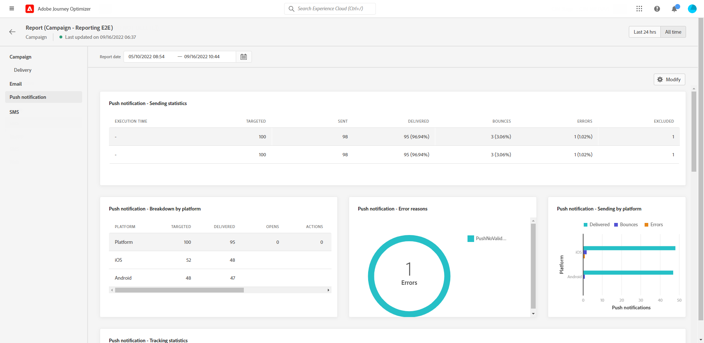

# 行銷活動全域報告 {#campaign-global-report}

>[!CONTEXTUALHELP]
>id="ajo_campaign_global_report"
>title="行銷活動全域報告"
>abstract="行銷活動全域報告可測量您的行銷活動在選取時段內的影響。您的報告會分為不同的 Widget，詳細說明您的行銷活動的成功和錯誤。每個報告儀表板都可以透過調整大小或移除 Widget 來修改。"

全域報告可從「所有時間」標籤存取，顯示至少兩小時前發生的事件，以及涵蓋選定時段內的事件。 相較之下，即時報表著重於過去24小時內發生的事件，最短時間間隔為事件發生後的2分鐘。

行銷活動全域報告可透過以下連結直接從行銷活動存取： **[!UICONTROL 檢視報告]** 按鈕。

行銷活動 **[!UICONTROL 全域報告]** 頁面會顯示以下索引標籤：

* [Campaign](#campaign-global)
* [電子郵件](#email-global)
* [應用程式內](#inapp-global)
* [推播](#push-global)
* [簡訊](#sms-global)
* [Web](#web-tab)

行銷活動 **[!UICONTROL 全域報告]** 分成不同的Widget，詳細說明行銷活動的成功和錯誤。 如有需要，可以調整每個Widget的大小並將其刪除。 如需詳細資訊，請參閱此 [區段](../reports/global-report.md#modify-dashboard).

如需Adobe Journey Optimizer中可用每個量度的詳細清單，請參閱 [此頁面](global-report.md#list-of-components-global.md)

## 行銷活動標籤 {#campaign-global}

### 傳送 {#delivery-global}

此 **[!UICONTROL 行銷活動的統計資料]** Widget會詳細說明與行銷活動相關的主要資訊：

* **[!UICONTROL 輸入的設定檔]**：開始歷程的設定檔數。

* **[!UICONTROL 動作已傳送]**：歷程中某個動作已傳送的不重複次數總計。

* **[!UICONTROL 動作失敗百分比]**：歷程中動作失敗的不重複次數總計，與動作已傳送的不重複次數總數比較。

<!--
### Objectives report {#objectives-global}

The **[!UICONTROL Objectives]** tab allows you to better fine-tune your deliveries' reports by targeting one specific metric.

The **[!UICONTROL Objectives]** listed are linked to **[!UICONTROL Datasets]** that define a connection to a system in order to retrieve additional information. A list of built-in **[!UICONTROL Objectives]** is available but you can add your own by adding new **[!UICONTROL Dataset]**. For the detailed procedure, refer to this [section](../campaigns/reporting-configuration.md).

After selecting the Objectives you want to target on, the two **[!UICONTROL Performance overview]** and **[!UICONTROL Campaign objective]** widgets will provide a detailed summary of your delivery performance. 

With the **[!UICONTROL Campaign objective]** widget, you can also choose to compare your main objective with another metric.
-->

### 實驗報告 {#experimentation-global}

>[!CONTEXTUALHELP]
>id="ajo_campaigns_content_experiment_click"
>title="成功量度"
>abstract="先前在建立實驗時選取的成功量度的總值除以設定檔的數量。"

此 **[!UICONTROL 實驗]** Tab提供每個變體效能的關鍵分析，並識別最成功的變體。

請注意，定義績效最佳者可能需要一些時間，其將以此圖示表示 .

+++進一步瞭解Experimentation報告可用的不同量度和Widget。

此 **[!UICONTROL 實驗結果]** Widget詳細說明每個變體的效能。 您可以變更基線，方法是從 **[!UICONTROL 基線]** 下拉式清單。 最佳處理方式將以星形圖示表示。

此表格會顯示下列量度：

* **[!UICONTROL 提升度超過基準線]**：測量指定處理的轉換率相對於基線的改善百分比。

* **[!UICONTROL 信賴度]**：指定處理與基準處理相同的證據。 [了解更多](../campaigns/experiment-calculations.md#understand-confidence)

* **[!UICONTROL 不重複傳出點按]**：跨傳出頻道的點按總數。

* **[!UICONTROL 設定檔]**：針對此處理的設定檔數目。

* **[!UICONTROL 不重複傳出點按次數/設定檔]**：建立實驗時先前選取的成功量度總值除以設定檔數目。

此 **[!UICONTROL 信賴區間]** 圖表會測量改善的不確定性。 它詳細說明基準線和最佳績效處理之間的績效百分比差異。 [了解更多](../campaigns/experiment-calculations.md#confidence-intervals)。
+++

如需這些結果的深入瞭解及如何解讀，請參閱 [此頁面](../campaigns/get-started-experiment.md#interpret-results).

## 電子郵件索引標籤 {#email-global}

從您的行銷活動 **[!UICONTROL 全域報告]**，則 **[!UICONTROL 電子郵件]** 標籤會詳細說明與行銷活動中傳送之電子郵件傳遞相關的主要資訊。

+++進一步瞭解電子郵件報表可用的不同量度和Widget。

此 **[!UICONTROL 電子郵件傳送統計資料]** 圖表會詳細說明您的傳送是否成功：

* **[!UICONTROL 已定位]**：傳遞分析期間處理的訊息總數。

* **[!UICONTROL 已傳送]**：傳遞的傳送總數。

* **[!UICONTROL 已傳遞]**：成功傳送的訊息數，與已傳送訊息總數相關。

* **[!UICONTROL 傳遞率]**：成功傳送的訊息百分比。

* **[!UICONTROL 彈回數]**：與已傳送訊息總數相關的傳送和自動傳回處理期間累計的錯誤總數。

* **[!UICONTROL 跳出率]**：與已傳送電子郵件相比跳出的電子郵件百分比。

* **[!UICONTROL 錯誤]**：傳送期間發生且無法傳送至設定檔的錯誤總數。

* **[!UICONTROL 錯誤率]**：與已傳送電子郵件相比，在傳送期間發生且無法傳送的錯誤百分比。

* **[!UICONTROL 重試]**：重試佇列中的電子郵件數量。

* **[!UICONTROL 已排除]**：Adobe Journey Optimizer已排除的設定檔數。

此 **[!UICONTROL 電子郵件 — 追蹤統計資料]** widget包含傳遞的收件者活動可用資料：

* **[!UICONTROL 開啟次數]**：傳遞在傳遞中開啟的次數。

* **[!UICONTROL 不重複開啟次數]**：已開啟傳遞的百分比。

* **[!UICONTROL 開啟率]**：已開啟電子郵件總數與已傳遞電子郵件數的比較。

* **[!UICONTROL 點按次數]**：內容在電子郵件中的點按次數。

* **[!UICONTROL 不重複點按]**：點按電子郵件中內容的收件者人數。

* **[!UICONTROL 不重複點按率]**：與傳送互動的使用者百分比。

* **[!UICONTROL 取消訂閱]**：對取消訂閱連結的點按次數。

* **[!UICONTROL 垃圾郵件投訴]**：將郵件宣告為垃圾郵件或垃圾郵件的次數。

此 **[!UICONTROL 傳送統計資料]** 圖表包含可用於已傳送電子郵件的資料，例如：

* **[!UICONTROL 已傳遞]**：成功傳送的訊息數，與已傳送訊息總數相關。

* **[!UICONTROL 彈回數]**：與已傳送訊息總數相關的傳送和自動傳回處理期間累計的錯誤總數。

* **[!UICONTROL 重試]**：重試佇列中的電子郵件數量。

* **[!UICONTROL 錯誤]**：傳送期間發生且無法傳送至設定檔的錯誤總數。

此 **[!UICONTROL 退回原因]** 和 **[!UICONTROL 退回類別]** Widget包含與退信相關的可用資料，例如：

* **[!UICONTROL 硬跳出]**：永久錯誤的總數，例如錯誤的電子郵件地址。 這包含明確指出地址無效的錯誤訊息，例如「未知使用者」。

* **[!UICONTROL 軟退信]**：暫時性錯誤總數，例如完整收件匣。

* **[!UICONTROL 已忽略]**：暫時性的總數，例如「不在辦公室」，或是技術錯誤，例如，如果寄件者型別是postmaster。

如需退信的詳細資訊，請參閱 [隱藏清單](../reports/suppression-list.md) 頁面。

此 **[!UICONTROL 錯誤原因]** 圖表和表格可讓您檢視傳送期間發生的錯誤。

此 **[!UICONTROL 排除的原因]** 圖表和表格會顯示從目標設定檔中排除的使用者設定檔無法接收訊息的不同原因。

此 **[!UICONTROL 電子郵件 — 熱門URL]** 圖表和表格詳細說明來自您傳送的哪些URL的瀏覽次數最多。

此 **[!UICONTROL 電子郵件 — 熱門收件者網域]** 圖表和表格詳細說明收件者最常用來開啟電子郵件的網域。

>[!NOTE]
>
>此 **[!UICONTROL 已最佳化與未最佳化]** 和 **[!UICONTROL 傳送時間最佳化]**  只有針對您的傳送啟用傳送時間最佳化選項時，才可使用Widget。 如需傳送時間最佳化的詳細資訊，請參閱 [此頁面](../building-journeys/journeys-message.md#send-time-optimization).

此 **[!UICONTROL 已最佳化與未最佳化]** 圖表詳細說明與訊息相關的主要資訊（無論是否已最佳化）：

* **[!UICONTROL 已傳送]**：傳遞的傳送總數。
* **[!UICONTROL 開啟次數]**：傳遞在傳遞中開啟的次數。
* **[!UICONTROL 點按次數]**：內容在電子郵件中的點按次數。

此 **[!UICONTROL 傳送時間最佳化]** 根據傳送方式詳細說明您的傳送是否成功：已最佳化或正常。

* **[!UICONTROL 已傳遞]**：成功傳送的訊息數，與已傳送訊息總數相關。
* **[!UICONTROL 彈回數]**：與已傳送訊息總數相關的傳送和自動傳回處理期間累計的錯誤總數。
+++

## 應用程式內標籤 {#inapp-global}

從您的行銷活動 **[!UICONTROL 全域報告]**，則 **[!UICONTROL 應用程式內]** 索引標籤詳細說明與行銷活動中傳送之應用程式內傳遞相關的主要資訊。

+++進一步瞭解應用程式內報表可用的不同量度和Widget。

此 **[!UICONTROL 應用程式內績效]** KPI會詳細說明與訪客與您應用程式內訊息的參與度相關的主要資訊，例如：

* **[!UICONTROL 不重複曝光次數]**：應用程式內訊息傳遞至的不重複使用者人數。

* **[!UICONTROL 曝光次數]**：傳送給所有使用者的應用程式內訊息總數。

* **[!UICONTROL 點按率]**：與已看過訊息的使用者相比，與應用程式內訊息中所包含按鈕互動的使用者百分比。

* **[!UICONTROL 解除率]**：收件者已解除的應用程式內訊息百分比。

此 **[!UICONTROL 應用程式內摘要]** 圖表會顯示相關期間應用程式內曝光次數的演變。

此 **[!UICONTROL 依據按鈕的點按次數]** 圖表和表格包含每個按鈕的收件者行為可用資料：

* **[!UICONTROL 點按次數]**：與應用程式內訊息所含按鈕互動的收件者總數。

* **[!UICONTROL 點按率]**：與已看過訊息的使用者相比，與應用程式內訊息中所包含按鈕互動的使用者百分比。
+++

## 推播通知標籤 {#push-global}

從您的行銷活動 **[!UICONTROL 全域報告]**，則 **[!UICONTROL 推播通知]** 索引標籤會詳細說明與行銷活動中傳送之推播傳遞相關的主要資訊。

+++進一步瞭解推送報告可用的不同量度和Widget。

此 **[!UICONTROL 推播通知 — 傳送統計資料]** 表格會使用圖表和KPI詳細列出與推播通知相關的主要資訊：

* **[!UICONTROL 已定位]**：傳遞分析期間處理的訊息總數。

* **[!UICONTROL 已傳送]**：傳遞的傳送總數。

* **[!UICONTROL 已傳遞]**：成功傳送的訊息數，與已傳送訊息總數相關。

* **[!UICONTROL 傳遞率]**：成功傳送的訊息百分比。

* **[!UICONTROL 彈回數]**：與已傳送訊息總數相關的傳送和自動傳回處理期間累計的錯誤總數。

* **[!UICONTROL 跳出率]**：與已傳送的推播通知相比，已跳出的推播通知的百分比。

* **[!UICONTROL 錯誤]**：傳送期間發生且無法傳送至設定檔的錯誤總數。

* **[!UICONTROL 錯誤率]**：與已傳送的推播通知相比，在傳送期間發生且無法傳送的錯誤百分比。

* **[!UICONTROL 已排除]**：Adobe Journey Optimizer已排除的設定檔數。

此 **[!UICONTROL 推播 — 追蹤統計資料]** 包含傳遞的收件者活動可用資料：

* **[!UICONTROL 開啟次數]**：在傳遞中開啟訊息的次數。

* **[!UICONTROL 開啟率]**：已開啟推播通知的百分比。

* **[!UICONTROL 動作]**：推播通知已傳遞的動作總數，例如按鈕點選或解除。

* **[!UICONTROL 參與]**：此推播通知的開啟和動作總數，即設定檔是否已開啟推播，或按鈕是否已點按。

* **[!UICONTROL 參與率]**：此推播通知的開啟和動作百分比，亦即設定檔是否已開啟推播，或按鈕是否已點按。

此 **[!UICONTROL 推播通知摘要]** 圖表包含可用於傳送推播通知的資料，例如：

* **[!UICONTROL 開啟次數]**：在傳遞中開啟訊息的次數。

* **[!UICONTROL 動作]**：推播通知已傳遞的動作總數，例如按鈕點選或解除。

* **[!UICONTROL 彈回數]**：與已傳送訊息總數相關的傳送和自動傳回處理期間累計的錯誤總數。

* **[!UICONTROL 已傳遞]**：成功傳送的訊息數，與已傳送訊息總數相關。

* **[!UICONTROL 錯誤]**：傳送期間發生且無法傳送至設定檔的錯誤總數。

>[!NOTE]
>
>此 **[!UICONTROL 已最佳化與未最佳化]** 和 **[!UICONTROL 傳送時間最佳化]**  只有針對您的傳送啟用傳送時間最佳化選項時，才可使用Widget。 如需傳送時間最佳化的詳細資訊，請參閱 [此頁面](../building-journeys/journeys-message.md#send-time-optimization).

此 **[!UICONTROL 已最佳化與未最佳化]** 圖表詳細說明與訊息相關的主要資訊（無論是否已最佳化）：

* **[!UICONTROL 已傳遞]**：成功傳送的訊息數，與已傳送訊息總數相關。
* **[!UICONTROL 開啟次數]**：傳遞在傳遞中開啟的次數。
* **[!UICONTROL 動作]**：推播通知已傳遞的動作總數，例如按鈕點選或解除。

此 **[!UICONTROL 傳送時間最佳化]** 根據傳送方式詳細說明您的傳送是否成功：已最佳化或正常。

* **[!UICONTROL 已傳遞]**：成功傳送的訊息數，與已傳送訊息總數相關。
* **[!UICONTROL 彈回數]**：與已傳送訊息總數相關的傳送和自動傳回處理期間累計的錯誤總數。

此 **[!UICONTROL 錯誤原因]** 圖表和表格可讓您檢視傳送期間發生的錯誤。

此 **[!UICONTROL 排除的原因]** 圖表和表格會顯示從目標設定檔中排除的使用者設定檔無法接收訊息的不同原因。

此 **[!UICONTROL 依據平台的追蹤]**， **[!UICONTROL 由平台傳送]** 和 **[!UICONTROL 依平台劃分]** 圖表和表格會根據收件者的作業系統，詳細說明推播通知的成功與否。
+++

## 簡訊索引標籤 {#sms-global}

從您的行銷活動 **[!UICONTROL 全域報告]**，則 **[!UICONTROL 簡訊]** 索引標籤會詳細說明與行銷活動中傳送之SMS傳遞相關的主要資訊。

+++進一步瞭解SMS報表可用的不同量度和Widget。

此 **[!UICONTROL 簡訊 — 傳送統計資料]** 表格詳細說明您的傳送是否成功：

* **[!UICONTROL 已定位]**：符合此傳送目標設定檔資格的使用者設定檔數目。

* **[!UICONTROL 已排除]**：從目標設定檔中排除且未收到訊息的使用者設定檔數目。

* **[!UICONTROL 已傳送]**：傳遞的傳送總數。

* **[!UICONTROL 已傳遞]**：成功傳送的訊息數，與已傳送訊息總數相關。

* **[!UICONTROL 彈回數]**：與已傳送訊息總數相關的傳送和自動傳回處理期間累計的錯誤總數。

* **[!UICONTROL 錯誤]**：傳送期間發生且無法傳送至設定檔的錯誤總數。

此 **[!UICONTROL 依日期的SMS效能]** Widget會以圖表詳細列出與訊息相關的主要資訊：

* **[!UICONTROL 已傳送]**：傳遞的傳送總數。

* **[!UICONTROL 已傳遞]**：成功傳送的訊息數，與已傳送訊息總數相關。

* **[!UICONTROL 彈回數]**：與已傳送訊息總數相關的傳送和自動傳回處理期間累計的錯誤總數。

* **[!UICONTROL 錯誤]**：傳送期間發生且無法傳送至設定檔的錯誤總數。

此 **[!UICONTROL 排除原因]**， **[!UICONTROL 退回原因]** 和 **[!UICONTROL 錯誤原因]** 圖表和表格可讓您檢視傳送期間發生哪些錯誤和排除。

此 **[!UICONTROL 簡訊 — 依據連結的點按次數]** 和 **[!UICONTROL 簡訊 — 追蹤統計資料]** Widget會詳細說明與訪客對您URL的參與度相關的主要資訊。

+++

## 網頁標籤 {#web-tab}

從您的行銷活動 **[!UICONTROL 全域報告]**，則 **[!UICONTROL Web]** 標籤會詳細說明與您的網頁相關的主要資訊。

+++進一步瞭解網頁報表可用的不同量度和Widget。

此 **[!UICONTROL 網頁效能]** KPI會詳細說明與訪客對您的Web體驗的參與度相關的主要資訊，例如：

* **[!UICONTROL 不重複曝光次數]**：提供網頁體驗的不重複使用者人數。

* **[!UICONTROL 曝光次數]**：傳送給所有使用者的網頁體驗總數。

* **[!UICONTROL 點按率]**：與網頁上各種元素互動的訪客百分比。

此 **[!UICONTROL 網頁摘要]** 圖表會顯示在相關期間內，您的Web體驗（曝光數、不重複曝光數和點按數）的演變。

此 **[!UICONTROL 依元素的點按次數]** 表格詳細說明與訪客對網頁上各種元素的參與度相關的主要資訊。
+++

## 其他資源

* [開始使用行銷活動](../campaigns/get-started-with-campaigns.md)
* [建立行銷活動](../campaigns/create-campaign.md)
* [建立API觸發的行銷活動](../campaigns/api-triggered-campaigns.md)
* [修改或停止行銷活動](../campaigns/modify-stop-campaign.md)
* [行銷活動即時報告](campaign-live-report.md)
