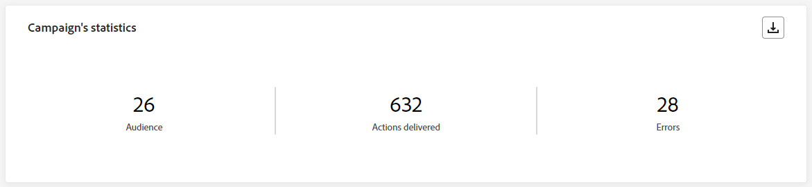
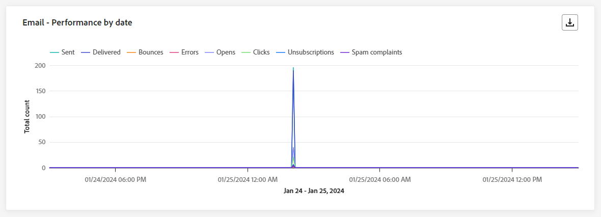
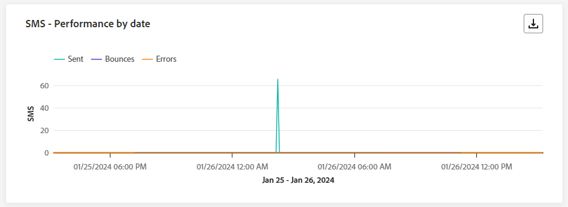
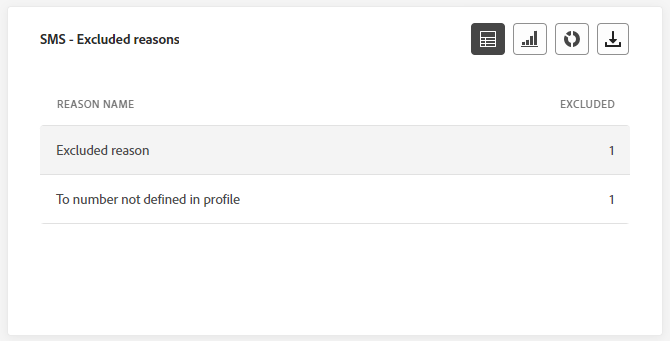
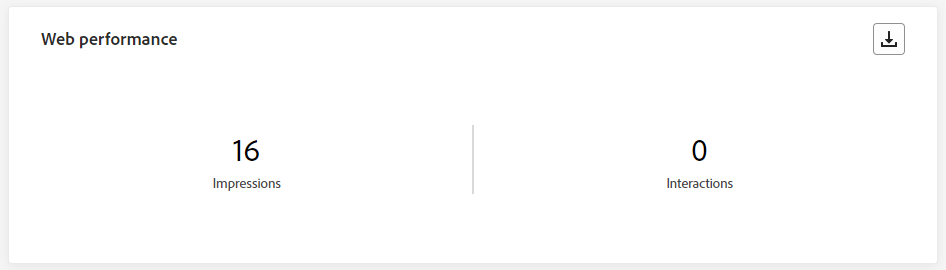

# 行銷活動即時報告 {#campaign-live-report}

>[!CONTEXTUALHELP]
>id="ajo_campaign_live_report"
>title="行銷活動即時報告"
>abstract="行銷活動即時報告可即時測量和視覺化行銷活動的影響和效能，範圍僅限於過去 24 小時。您的報告會分為不同的小工具，詳述行銷活動的成功和錯誤。每個報告儀表板都可以透過調整大小或移除小工具來修改。"

從「最近24小時」索引標籤存取的即時報告，會顯示過去24小時內發生的事件，從事件發生起的最短時間間隔為兩分鐘。 相較之下，Customer Journey Analytics報表著重於至少兩小時前發生的事件，並涵蓋選定時段內的事件。

您可以按一下&#x200B;**[!UICONTROL 報告]**&#x200B;按鈕，然後選取&#x200B;**[!UICONTROL 檢視過去24小時的報告]**，直接從行銷活動存取即時行銷活動報告。

行銷活動&#x200B;**[!UICONTROL 即時報告]**&#x200B;頁面將會顯示以下索引標籤：

* [Campaign](#campaign-live)
* [電子郵件](#email-live)
* [應用程式內](#inapp-live)
* [推播](#push-live)
* [簡訊](#sms-live)
* [網頁](#web-tab)
* [直接郵件](#direct-mail-tab)

>[!AVAILABILITY]
>協調的行銷活動僅支援簡訊、電子郵件和推播頻道。 其他管道（應用程式內、Web、直接郵件等）無法用於協調的行銷活動，也不會出現在報表中。

行銷活動&#x200B;**[!UICONTROL 即時報告]**&#x200B;會分成不同的Widget，詳細說明行銷活動的成功與錯誤。 如有需要，可以調整每個Widget的大小並將其刪除。 如需詳細資訊，請參閱此[區段](../reports/live-report.md#modify-dashboard)。

如需Adobe Journey Optimizer中每個可用量度的詳細清單，請參閱[此頁面](live-report.md#live-report)。

## 行銷活動標籤 {#campaign-live}

### 傳遞 {#delivery-live}

**[!UICONTROL 行銷活動的統計資料]** KPI可作為完整的儀表板，提供與行銷活動相關之過去24小時關鍵量度的詳細劃分。 這包括基本資訊，例如已傳送的設定檔數和動作，讓您透徹瞭解行銷活動的績效和參與。

+++ 進一步瞭解Campaign的統計量度

* **[!UICONTROL 對象]**：目標設定檔數目。

* **[!UICONTROL 已傳遞的動作]**：已傳遞動作的唯一次數總計。

* **[!UICONTROL 錯誤]**：在傳送過程中發生的錯誤總數，導致無法將其傳送至設定檔。

+++

<!--
### Experimentation tab (#experimentation-live)

From your Campaign **[!UICONTROL Live report]**, the **[!UICONTROL Experimentation]** tab details the main information relative to how each variant is performing and if there is was winner during the test.
-->

## 電子郵件標籤 {#email-live}

從您的行銷活動&#x200B;**[!UICONTROL 即時報告]**，**[!UICONTROL 電子郵件]**&#x200B;索引標籤會詳細說明與行銷活動中傳送之電子郵件相關的主要資訊。

### 電子郵件 - 傳送效能 {#email-sending-performance}

>[!CONTEXTUALHELP]
>id="ajo_campaign_live_email_sending_statistics"
>title="電子郵件 - 傳送統計資料"
>abstract="「電子郵件 - 傳送統計資料」圖表總結有關你的電子郵件的基本資料，例如過去 24 小時內的指定對象或已送達的郵件。"

**[!UICONTROL 電子郵件 — 傳送效能]**&#x200B;提供過去24小時內傳送之電子郵件相關資料的完整概觀。 它提供基本量度的深入分析，例如傳送和跳出，以便詳細檢查電子郵件傳送過程。

+++ 進一步瞭解電子郵件傳送效能度量

* **[!UICONTROL 已傳遞]**：成功傳送的電子郵件數目。

* **[!UICONTROL 退回]**：傳送程式與自動傳回處理期間累積的錯誤總數。

* **[!UICONTROL 重試]**：重試佇列中的電子郵件數目。

* **[!UICONTROL 錯誤]**：在傳送過程中發生的錯誤總數，導致無法將其傳送至設定檔。
+++

### 電子郵件 - 統計資料

>[!CONTEXTUALHELP]
>id="ajo_campaign_live_email_statistics"
>title="電子郵件 - 統計資料"
>abstract="「電子郵件 - 統計資料」表格提供過去 24 小時內你的電子郵件的設定檔活動資料。"

**[!UICONTROL 依電子郵件傳送量度]**&#x200B;表格提供過去24小時資料的完整摘要。 它概述基本量度，包括目標對象人數和成功傳送電子郵件的計數。 這可提供針對電子郵件行銷活動之成效和觸及範圍的寶貴見解。

+++ 進一步瞭解電子郵件 — 統計量度

* **[!UICONTROL 執行時間]**：每次執行您週期性電子郵件的開始時間。 若要只鎖定一或多個週期性電子郵件，請從&#x200B;**[!UICONTROL 執行時間]**&#x200B;下拉式清單中選取它。

* **[!UICONTROL 已鎖定目標]**：在套用排除、隱藏或同意移除之前，符合對象資格的設定檔數目。

* **[!UICONTROL 已排除]**：從目標設定檔中排除且未收到訊息的使用者設定檔數目。

* **[!UICONTROL 已傳送]**：傳送總數。

* **[!UICONTROL 已傳遞]**：已成功傳送的訊息數。

* **[!UICONTROL 退回]**：傳送程式與自動傳回處理期間累積的錯誤總數。

* **[!UICONTROL 錯誤]**：在傳送過程中發生的錯誤總數，導致無法將其傳送至設定檔。

* **[!UICONTROL 開啟]**：訊息開啟的次數。

* **[!UICONTROL 點按]**：內容被點按的次數。

* **[!UICONTROL 取消訂閱]**：取消訂閱連結的點按次數。

* **[!UICONTROL 垃圾訊息申訴]**：訊息被宣告為垃圾郵件或垃圾訊息的次數。

* **[!UICONTROL 重試]**：重試佇列中的電子郵件數目。
+++

### 電子郵件 - 退回郵件的類別和原因 {#bounce-categories}

>[!CONTEXTUALHELP]
>id="ajo_campaign_live_email_bounce_categories"
>title="電子郵件 - 退回類別"
>abstract="「電子郵件 - 退回類別」圖表和表格提供有關過去 24 小時內暫時性和永久錯誤的資料。"

>[!CONTEXTUALHELP]
>id="ajo_campaign_live_email_bounce_reasons"
>title="電子郵件 - 退回原因"
>abstract="「電子郵件 - 退回原因」圖表和表格包含與過去 24 小時內退回郵件相關的可用資料。"

**[!UICONTROL 退回原因]**&#x200B;和&#x200B;**[!UICONTROL 退回類別]**&#x200B;介面工具會編譯過去24小時與退回訊息相關的可用資料，提供電子郵件退回背後特定原因和類別的詳細深入分析。

如需退信的詳細資訊，請參閱[隱藏清單](../reports/suppression-list.md)頁面。

+++ 深入瞭解電子郵件 — 退回類別和原因量度

* **[!UICONTROL 硬退信]**：永久錯誤的總數，例如錯誤的電子郵件地址。 這包含明確指出地址無效的錯誤訊息，例如「未知使用者」。

* **[!UICONTROL 軟退信]**：暫時性錯誤的總數，例如完整的收件匣。

* **[!UICONTROL Ignored]**：暫時性的總數，例如「不在辦公室」，或是技術錯誤，例如，如果寄件者型別是郵遞員。

+++

### 電子郵件 - 依日期劃分的效能 {#email-performance-date}

>[!CONTEXTUALHELP]
>id="ajo_campaign_live_email_performance_bydate"
>title="電子郵件 - 依日期劃分的效能"
>abstract="「電子郵件 - 依日期劃分的效能」圖表顯示過去 24 小時內有關已傳送電子郵件的綜合資料，提供關鍵量度例如送出和退回郵件的洞察，進而對電子郵件傳送過程進行詳細分析。"

**[!UICONTROL 電子郵件 — 依據日期的效能]**&#x200B;介面工具集提供與訊息相關之重要資訊的詳細概觀，透過圖表呈現，提供過去24小時效能趨勢的深入分析。

+++ 進一步瞭解電子郵件 — 依據日期和原因的績效量度

* **[!UICONTROL 已傳送]**：傳送總數。

* **[!UICONTROL 已傳遞]**：已成功傳送的訊息數。

* **[!UICONTROL 退回]**：傳送程式與自動傳回處理期間累積的錯誤總數。

* **[!UICONTROL 錯誤]**：在傳送過程中發生的錯誤總數，導致無法將其傳送至設定檔。

* **[!UICONTROL 開啟]**：訊息開啟的次數。

* **[!UICONTROL 點按]**：內容被點按的次數。

* **[!UICONTROL 取消訂閱]**：取消訂閱連結的點按次數。

* **[!UICONTROL 垃圾訊息申訴]**：訊息被宣告為垃圾郵件或垃圾訊息的次數。

+++

### 錯誤原因 {#email-error-reasons}

>[!CONTEXTUALHELP]
>id="ajo_campaign_live_email_error_reasons"
>title="電子郵件 - 錯誤原因"
>abstract="「電子郵件 - 錯誤原因」圖表和表格讓你能夠確認過去 24 小時內發送過程中發生的特定錯誤。"

**[!UICONTROL 錯誤原因]**&#x200B;圖表和表格會針對過去24小時內傳送程式期間發生的特定錯誤，提供insight。 此資訊對於瞭解錯誤的性質和頻率非常有用。

### 排除原因 {#email-exclude-reasons}

>[!CONTEXTUALHELP]
>id="ajo_campaign_live_email_excluded_reasons"
>title="電子郵件 - 排除原因"
>abstract="「排除原因」圖表和表格說明在過去 24 小時內導致使用者設定檔被排除在目標對象之外，而未能收到訊息的各項因素。"

**[!UICONTROL 排除的原因]**&#x200B;圖表和表格提供過去24小時內導致從目標受眾中排除使用者設定檔的各種因素的完整觀點。

如需排除原因的完整清單，請參閱[此頁面](exclusion-list.md)。

### 電子郵件 - 最佳收件者網域 {#email-best-recipient}

>[!CONTEXTUALHELP]
>id="ajo_campaign_live_email_best_recipient"
>title="電子郵件 - 最佳收件者網域"
>abstract="「電子郵件 - 最佳收件者」網域圖表和表格提供收件者開啟電子郵件時最常使用網域的詳細劃分，針對過去 24 小時內的收件者行為提供重要的洞察。"

**[!UICONTROL 電子郵件 — 最佳收件者網域]**&#x200B;圖表和表格提供過去24小時內設定檔最常用來開啟電子郵件之網域的完整劃分。 這可提供描述檔行為的寶貴見解，可幫助您瞭解偏好的平台。

### 電子郵件 - 產品建議 {#email-offers}

>[!NOTE]
>
>優惠方案Widget和量度僅在決定已插入電子郵件中時才能使用。 如需決策管理的詳細資訊，請參閱此[頁面](../offers/get-started/starting-offer-decisioning.md)。

**[!UICONTROL 優惠統計資料]**&#x200B;和&#x200B;**[!UICONTROL 一段時間內的優惠統計資料]** Widget可測量您的優惠是否成功，以及是否對目標受眾造成影響。 它會使用KPI詳細說明與您的訊息相關的主要資訊。

+++ 深入瞭解電子郵件 — 優惠方案量度

* **[!UICONTROL 已傳送的優惠]**：優惠的傳送總數。

* **[!UICONTROL 優惠閱聽]**：在您的電子郵件中開啟優惠的次數。

* **[!UICONTROL 優惠點按次數]**：您的電子郵件中某個優惠的點按次數。

+++

## 應用程式內標籤 {#inapp-live}

從您的行銷活動&#x200B;**[!UICONTROL 即時報告]**，**[!UICONTROL 應用程式內]**&#x200B;索引標籤會詳細說明與行銷活動中傳送之應用程式內訊息相關的主要資訊。

### 應用程式內績效 {#inapp-performance}

>[!CONTEXTUALHELP]
>id="ajo_campaign_live_inapp_performance"
>title="應用程式內績效"
>abstract="應用程式內效能 KPI 提供有關訪客在過去 24 小時內參與應用程式內訊息的互動情況的必要洞察。"

**[!UICONTROL 應用程式內績效]** KPI提供過去24小時內設定檔與應用程式內訊息互動的基本深入分析，提供評估應用程式內行銷活動成效和影響的基本量度。

+++ 進一步瞭解應用程式內績效量度

* **[!UICONTROL 曝光次數]**：傳送給所有使用者的應用程式內訊息總數。

* **[!UICONTROL 互動]**：與應用程式內訊息互動的總數。 這包括使用者所執行的任何動作，例如點選、解僱或任何其他互動。

+++

### 應用程式內摘要 {#inapp-summary}

>[!CONTEXTUALHELP]
>id="ajo_campaign_live_inapp_summary"
>title="應用程式內摘要"
>abstract="應用程式內摘要圖表顯示過去 24 小時內應用程式內曝光與互動的進展。"

**[!UICONTROL 應用程式內摘要]**&#x200B;圖表說明過去24小時內您應用程式內印象和互動的進度，提供您應用程式內訊息效能的完整概觀。

+++ 進一步瞭解應用程式內摘要量度

* **[!UICONTROL 曝光次數]**：傳送給所有使用者的應用程式內訊息總數。

* **[!UICONTROL 互動]**：與應用程式內訊息互動的總數。 這包括使用者所執行的任何動作，例如點選、解僱或任何其他互動。

+++

### 依類型劃分的互動 {#inapp-interactions}

>[!CONTEXTUALHELP]
>id="ajo_campaign_live_inapp_interactions"
>title="依類型劃分的互動"
>abstract="「依類型劃分的互動」圖表和表格透過追蹤過去 24 小時內的任何點選、關閉或互動，詳細說明使用者如何與應用程式內訊息進行互動。"

依型別&#x200B;**[!UICONTROL 的]**&#x200B;互動圖表和表格提供過去24小時內設定檔如何與您的應用程式內訊息互動、追蹤動作（例如點選、解除）或任何其他形式的參與之詳細描述。

## 推播通知標籤 {#push-live}

從您的行銷活動&#x200B;**[!UICONTROL 即時報告]**，**[!UICONTROL 推播通知]**&#x200B;索引標籤會詳細說明與行銷活動中傳送之推播通知相關的主要資訊。

### 推播通知 - 傳送效能 {#push-sending-performance}

>[!CONTEXTUALHELP]
>id="ajo_campaign_live_push_sending_performance"
>title="推播通知 - 傳送效能"
>abstract="「推播通知傳送效能」圖表總結有關推播通知的基本資料，例如過去 24 小時內的錯誤或已送達的訊息。"

**[!UICONTROL 推播通知傳送績效]**&#x200B;圖表提供過去24小時內傳送之推播通知相關資料的完整概觀。 它提供基本量度的深入分析，例如傳送和跳出，以便詳細檢查推播通知傳送流程。

+++ 深入瞭解推播通知 — 傳送效能量度

* **[!UICONTROL 已傳遞]**：已成功傳送的訊息數。

* **[!UICONTROL 退回]**：傳送程式與自動傳回處理期間累積的錯誤總數。

* **[!UICONTROL 錯誤]**：在傳送過程中發生的錯誤總數，導致無法將其傳送至設定檔。

+++

### 推播通知 - 統計資料 {#push-statistics}

>[!CONTEXTUALHELP]
>id="ajo_campaign_live_push_statistics"
>title="推播通知 - 統計資料"
>abstract="「推播統計資料」表格提供過去 24 小時內推播通知的收件者活動相關資料。"

**[!UICONTROL 推播通知 — 統計資料]**&#x200B;表格提供過去24小時內與推播通知相關之基本資料的簡要摘要，包括關鍵量度，例如目標訊息數目和成功傳遞訊息數目。

+++ 進一步瞭解推播通知 — 統計量度

* **[!UICONTROL 執行時間]**：每次執行您循環推播通知的開始時間。 若要只鎖定一或多個循環推播通知，請從&#x200B;**[!UICONTROL 執行時間]**&#x200B;下拉式清單中選取該通知。

* **[!UICONTROL 已鎖定目標]**：在套用排除、隱藏或同意移除之前，符合對象資格的設定檔數目。

* **[!UICONTROL 已排除]**：從目標設定檔中排除且未收到訊息的使用者設定檔數目。

* **[!UICONTROL 已傳送]**：傳送總數。

* **[!UICONTROL 已傳遞]**：已成功傳送的訊息數。

* **[!UICONTROL 退回]**：傳送程式與自動傳回處理期間累積的錯誤總數。

* **[!UICONTROL 錯誤]**：在傳送過程中發生的錯誤總數，導致無法將其傳送至設定檔。

* **[!UICONTROL 開啟]**：訊息開啟的次數。

+++

### 推播通知 - 傳送摘要 {#push-sending-summary}

>[!CONTEXTUALHELP]
>id="ajo_campaign_live_push_sending_summary"
>title="推播通知 - 傳送摘要"
>abstract="「推播通知發送摘要」圖表顯示過去 24 小時內已發送的推播通知的可用資料。"

**[!UICONTROL 推播通知 — 統計資料]**&#x200B;圖表提供動態表示，顯示您過去24小時推播通知活動的分析。 此圖形表示提供已傳送推播通知的完整劃分。

+++ 進一步瞭解推播通知 — 傳送摘要量度

* **[!UICONTROL 開啟]**：您的推播通知開啟的次數。

* **[!UICONTROL 動作]**：已傳送推播通知上的動作總數，例如按鈕點選或解除。

* **[!UICONTROL 跳出數]**：累積的錯誤總數，以及相對於已傳送訊息總數的自動傳回處理。

* **[!UICONTROL 已傳遞]**：與已傳送訊息總數相關的成功傳送訊息數。

* **[!UICONTROL 錯誤]**：發生無法傳送至設定檔的錯誤總數。

+++

### 推播通知 - 排除原因 {#push-excluded}

>[!CONTEXTUALHELP]
>id="ajo_campaign_live_push_excluded_reasons"
>title="推播通知 - 排除原因"
>abstract="「排除原因」圖表和表格說明在過去 24 小時內導致使用者設定檔被排除在目標對象之外而未能收到訊息的各項因素。"

**[!UICONTROL 排除的原因]**&#x200B;圖表和表格會顯示阻止使用者設定檔從目標設定檔排除的原因，導致其在過去24小時內無法接收推播通知。

如需排除原因的完整清單，請參閱[此頁面](exclusion-list.md)。

### 推播通知 - 錯誤原因 {#push-error}

>[!CONTEXTUALHELP]
>id="ajo_campaign_live_push_error_reasons"
>title="推播通知 - 錯誤原因"
>abstract="「錯誤原因」圖表和表格讓你能夠確認過去 24 小時內傳送過程中發生的特定錯誤。"

**[!UICONTROL 錯誤原因]**&#x200B;表格和圖表可讓您識別過去24小時內推播通知傳送程式期間發生的特定錯誤，提供過程中所遇到任何問題的詳細深入分析。

### 推播通知 - 依平台劃分 {#push-breakdown-platform}

>[!CONTEXTUALHELP]
>id="ajo_campaign_live_push_breakdown_platform"
>title="推播通知 - 依平台劃分"
>abstract="「依平台劃分」圖表和表格根據收件人的作業系統提供過去 24 小時內成功傳送的推播通知的劃分資料。"

**[!UICONTROL 推播通知 — 依平台]**&#x200B;劃分圖表和表格提供過去24小時推播通知成功的詳細分析，根據您設定檔的作業系統提供深入分析。 此劃分可讓您更瞭解推播通知在不同平台上的執行情形。

+++ 進一步瞭解推播通知 — 依平台量度劃分

* **[!UICONTROL 已鎖定目標]**：在套用排除、隱藏或同意移除之前，符合對象資格的設定檔數目。

* **[!UICONTROL 已傳遞]**：與已傳送訊息總數相關的成功傳送訊息數。

* **[!UICONTROL 開啟]**：您的推播通知開啟的次數。

* **[!UICONTROL 動作]**：已傳送推播通知上的動作總數，例如按鈕點選或解除。

* **[!UICONTROL 跳出數]**：累積的錯誤總數，以及相對於已傳送訊息總數的自動傳回處理。

* **[!UICONTROL 錯誤]**：發生無法傳送至設定檔的錯誤總數。

* **[!UICONTROL 已排除]**： Adobe Journey Optimizer已排除的設定檔數目。

+++

## 簡訊標籤 {#sms-live}

從您的行銷活動&#x200B;**[!UICONTROL 即時報告]**，**[!UICONTROL 簡訊]**&#x200B;索引標籤會詳細說明與行銷活動中傳送之簡訊相關的主要資訊。

### 簡訊 - 統計資料 {#sms-statistics}

>[!CONTEXTUALHELP]
>id="ajo_campaign_live_sms_statistics"
>title="簡訊 - 統計資料"
>abstract="「簡訊傳送統計資料」表格總結有關簡訊的基本資料，例如過去 24 小時內指定對象或已送達的郵件。"

**[!UICONTROL SMS — 統計資料]**&#x200B;表格提供過去24小時內與您的SMS訊息相關之基本資料的簡要摘要，包含關鍵量度，例如目標訊息數目和成功傳遞訊息的計數。

+++ 進一步瞭解簡訊 — 統計量度

* **[!UICONTROL 執行時間]**：每次執行您週期性SMS訊息的開始時間。 若要只鎖定一或多個循環的SMS訊息，請從&#x200B;**[!UICONTROL 執行時間]**&#x200B;下拉式清單中選取它。

* **[!UICONTROL 目標]**：符合目標設定檔資格的使用者設定檔數目。

* **[!UICONTROL 已排除]**：從目標設定檔中排除且未收到訊息的使用者設定檔數目。

* **[!UICONTROL 已傳送]**：傳送總數。

* **[!UICONTROL 退回]**：傳送程式與自動傳回處理期間累積的錯誤總數。

* **[!UICONTROL 錯誤]**：在傳送過程中發生的錯誤總數，導致無法將其傳送至設定檔。

* **[!UICONTROL 點按次數]**： URL造訪總數。

+++

### 簡訊 - 依日期劃分的效能 {#sms-perfomance-date}

>[!CONTEXTUALHELP]
>id="ajo_campaign_live_sms_performance"
>title="簡訊 - 依日期劃分的績效"
>abstract="「依日期劃分的簡訊效能」小工具透過圖形呈現方式提供過去 24 小時內有關你的簡訊的重要資訊。"

**[!UICONTROL 依日期的SMS效能]** Widget提供與訊息相關之重要資訊的詳細總覽，透過圖表呈現，提供過去24小時內效能趨勢的深入分析。

+++ 深入瞭解簡訊 — 依據日期量度的效能

* **[!UICONTROL 已傳送]**：傳送總數。

* **[!UICONTROL 退回]**：傳送程式與自動傳回處理期間累積的錯誤總數。

* **[!UICONTROL 錯誤]**：在傳送過程中發生的錯誤總數，導致無法將其傳送至設定檔。

+++

### 簡訊 - 錯誤原因 {#sms-error-reasons}

>[!CONTEXTUALHELP]
>id="ajo_campaign_live_sms_error_reasons"
>title="簡訊 - 錯誤原因"
>abstract="「簡訊 - 錯誤原因」圖表和表格讓你能夠確認過去 24 小時內傳送過程中發生的特定錯誤。"

**[!UICONTROL 排除的原因]**&#x200B;圖表和表格可讓您識別過去24小時內傳送簡訊過程中發生的特定錯誤，以便深入分析遇到的任何問題。

### 簡訊 - 排除原因 {#sms-excluded-reasons}

>[!CONTEXTUALHELP]
>id="ajo_campaign_live_sms_excluded_reasons"
>title="簡訊 - 排除原因"
>abstract="「排除原因」圖表和表格說明在過去 24 小時內導致使用者設定檔被排除在目標對象之外而未能收到訊息的各項因素。"

**[!UICONTROL 排除的原因]**&#x200B;圖表和表格會以視覺化方式呈現導致目標對象中排除使用者設定檔的各種因素，以防止這些設定檔在過去24小時內接收您的SMS訊息。

如需排除原因的完整清單，請參閱[此頁面](exclusion-list.md)。

### 簡訊 - 退回原因 {#sms-bounces-reasons}

>[!CONTEXTUALHELP]
>id="ajo_campaign_live_sms_bounces_reasons"
>title="簡訊 - 退回原因"
>abstract="「退回原因」圖表和表格包含過去 24 小時內與退回郵件相關的可用資料。"

**[!UICONTROL 跳出原因]**&#x200B;圖表和表格提供與跳出SMS訊息相關的資料完整總覽，針對過去24小時內SMS訊息跳出例項背後的特定原因，提供有價值的深入分析。

## 網頁標籤 {#web-tab}

從您的行銷活動&#x200B;**[!UICONTROL 即時報告]**，**[!UICONTROL 網頁]**&#x200B;索引標籤會詳細說明與您的網頁相關的主要資訊。

### 網頁績效 {#web-performance}

>[!CONTEXTUALHELP]
>id="ajo_campaign_live_web_performance"
>title="網頁效能"
>abstract="Web 效能 KPI 提供有關過去 24 小時內訪客參與 Web 體驗相關情形的綜合資訊。"

**[!UICONTROL 網頁成效]** KPI提供訪客過去24小時內與您的網頁互動情況的全面分析，包含曝光數和互動數等關鍵量度。

+++ 進一步瞭解網頁效能測量結果

* **[!UICONTROL 曝光次數]**：傳送給所有使用者的網頁體驗總數。

* **[!UICONTROL 互動]**：與網頁的互動總數。 這包括使用者所執行的任何動作，例如點按或任何其他互動。

+++ 

### 網頁摘要 {#web-summary}

>[!CONTEXTUALHELP]
>id="ajo_campaign_live_web_summary"
>title="網頁摘要"
>abstract="「網頁摘要」圖表說明過去 24 小時內你的 Web 體驗的進展情況，包括曝光、唯一曝光和互動次數。"

**[!UICONTROL 網頁摘要]**&#x200B;圖表顯示您網頁體驗在過去24小時中的演變（曝光數、不重複曝光數和互動數）。

+++ 進一步瞭解網頁摘要量度

* **[!UICONTROL 曝光次數]**：傳送給所有使用者的網頁體驗總數。

* **[!UICONTROL 互動]**：與網頁的互動總數。 這包括使用者所執行的任何動作，例如點按或任何其他互動。

+++ 

### 依元素劃分的互動 {#web-interactions}

>[!CONTEXTUALHELP]
>id="ajo_campaign_live_web_interactions"
>title="依元素劃分的互動"
>abstract="「依元素劃分的互動」表格提供過去 24 小時內訪客參與網頁上不同元素之互動的重要資訊。"

**[!UICONTROL 依元素的互動]**&#x200B;表格提供訪客在過去24小時內與網頁上各種元素互動的完整資訊，提供使用者互動和偏好設定的寶貴見解。

## 直接郵件標籤 {#direct-mail-tab}

從您的行銷活動&#x200B;**[!UICONTROL 即時報告]**，**[!UICONTROL 直接郵件]**&#x200B;索引標籤會詳細說明與直接郵件相關的主要資訊。

### 直接郵件 - 傳送統計資料 {#direct-mail-sending}

>[!CONTEXTUALHELP]
>id="ajo_campaign_live_direct_sending_statistics"
>title="直接郵件 - 傳送統計資料"
>abstract="「直接郵件傳送統計資料」表格總結過去 24 小時內有關直接郵件的基本資料，例如指定對象或已送達的郵件。"

**[!UICONTROL 直接郵件 — 傳送統計資料]**&#x200B;表格提供與直接郵件訊息相關之基本資料的簡要摘要，包含關鍵量度，例如目標訊息數目以及過去24小時內成功傳遞的訊息數目。

+++ 深入瞭解直接郵件 — 傳送統計量度

* **[!UICONTROL 目標]**：符合目標設定檔資格的使用者設定檔數目。

* **[!UICONTROL 已傳送]**：傳送總數。

* **[!UICONTROL 錯誤]**：在傳送過程中發生的錯誤總數，導致無法將其傳送至設定檔。

* **[!UICONTROL 已排除]**：從目標設定檔中排除且未收到您直接郵件的使用者設定檔數目。

+++

### 直接郵件 - 錯誤原因 {#direct-mail-error-reasons}

>[!CONTEXTUALHELP]
>id="ajo_campaign_live_direct_error_reasons"
>title="直接郵件 - 錯誤原因"
>abstract="「直接郵件 - 錯誤原因」圖表和表格讓你確認過去 24 小時內發生的特定錯誤。"

**[!UICONTROL 直接郵件 — 錯誤原因]**&#x200B;圖表和表格提供了識別直接郵件訊息傳送過程中發生的特定錯誤的方法，允許詳細分析過去24小時內遇到的任何問題。

### 直接郵件 - 排除原因 {#direct-mail-excluded-reasons}

>[!CONTEXTUALHELP]
>id="ajo_campaign_live_direct_excluded_reasons"
>title="直接郵件 - 排除原因"
>abstract="「直接郵件排除原因」圖表和表格說明在過去 24 小時內導致使用者設定檔被排除在目標對象之外而未能收到訊息的各項因素。"

**[!UICONTROL 直接郵件 — 排除的原因]**&#x200B;圖表和表格以視覺化方式說明導致從目標對象中排除使用者設定檔的各種因素，防止他們在過去24小時內收到您的直接郵件訊息。

如需排除原因的完整清單，請參閱[此頁面](exclusion-list.md)。

## 其他資源

* [開始使用行銷活動](../campaigns/get-started-with-campaigns.md)
* [建立行銷活動](../campaigns/create-campaign.md)
* [建立API觸發的行銷活動](../campaigns/api-triggered-campaigns.md)
* [修改或停止行銷活動](../campaigns/manage-campaigns.md)
* [行銷活動報告](campaign-global-report-cja.md)
