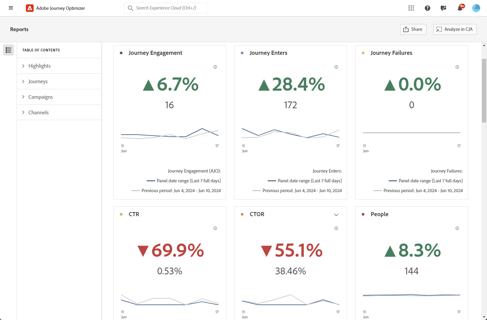
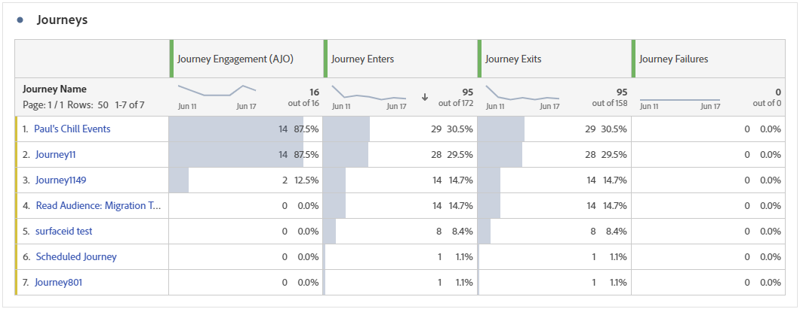
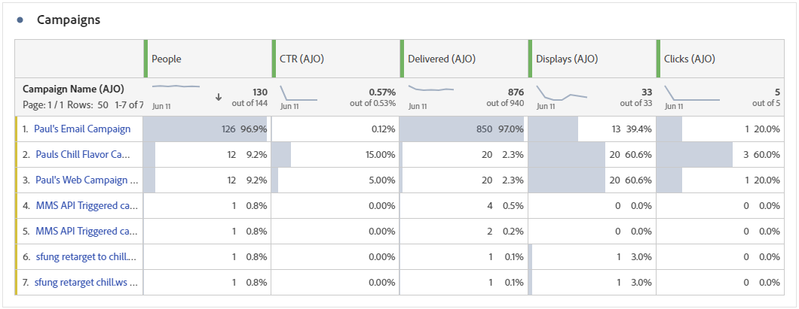
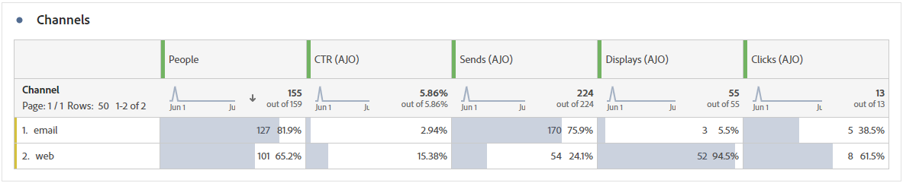
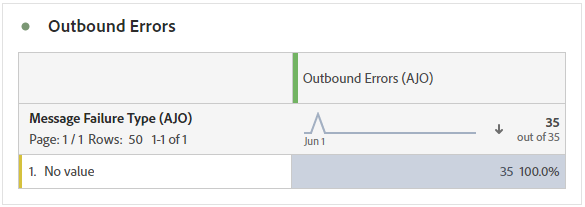
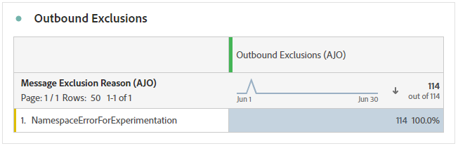

# 概觀報表 {#channel-report-cja}

概述報表可為使用者提供您環境中所有行銷活動和歷程的流量和參與量度的完整摘要。 這些量度會結合，針對來自不同管道（包含各種行銷活動和歷程）的動作呈現統一值。

您可以導覽至&#x200B;**歷程管理**&#x200B;區段內的&#x200B;**報表**&#x200B;功能表，以存取概述報表。

報表頁面會顯示以下索引標籤：

* [歷程](#journey)
* [行銷活動](#campaign)
* [管道](#channel)

若要進一步瞭解Customer Journey Analytics Workspace以及如何篩選及分析資料，請參閱[此頁面](https://experienceleague.adobe.com/en/docs/analytics-platform/using/cja-workspace/home)。

## 反白顯示 {#highlights}

**[!UICONTROL 重點專案]** KPI是全方位的儀表板，提供您環境中所有行銷活動和歷程之關鍵量度的詳細劃分，讓您快速評估績效並識別需要改進的領域。

+++ 進一步瞭解重點量度

* **[!UICONTROL 歷程參與]**：接收透過歷程傳送之訊息的不重複個人總數，代表到達歷程中指定動作點的不同設定檔。

* **[!UICONTROL 歷程進入者]**：到達歷程進入事件的個人總數。

* **[!UICONTROL 歷程失敗]**：未成功執行的個別歷程總數。

* **[!UICONTROL 點進率]**：您訊息中的點按百分比。

* **[!UICONTROL 點進開啟率(CTOR)]**：訊息開啟的次數。

* **[!UICONTROL 人員]**：符合訊息目標設定檔資格的使用者設定檔數目。

* **[!UICONTROL 點按]**：內容在訊息中的點按次數。

* **[!UICONTROL 垃圾訊息申訴]**：訊息被宣告為垃圾郵件或垃圾訊息的次數。

* **[!UICONTROL 取消訂閱]**：取消訂閱連結的點按次數。

+++

## 歷程 {#journey}

**[!UICONTROL 歷程]**&#x200B;表格可作為完整的儀表板，提供與您的歷程相關的關鍵量度分析。 它包含已輸入的設定檔數和失敗個別歷程例項等詳細資訊，可讓您透徹瞭解歷程的有效性和參與層級。

按一下此表中所列任何歷程的名稱，您就可以輕鬆個別探索每個歷程，並在新索引標籤中立即取得其完整報告。

+++ 進一步瞭解歷程量度

* **[!UICONTROL 歷程進入者]**：到達歷程進入事件的個人總數。

* **[!UICONTROL 歷程結束]**：結束歷程的個人總數。

* **[!UICONTROL 歷程失敗]**：未成功執行的個別歷程總數。

+++

## 行銷活動 {#campaign}

**[!UICONTROL Campaign]**&#x200B;表格可作為全方位儀表板，呈現行銷活動關鍵量度的詳細概觀。 它提供基本資料，例如設定檔和傳送的數量，為您提供全面的insight，用於瞭解行銷活動的績效和參與程度。

按一下此表所列之任何行銷活動的名稱，您就可以輕鬆個別探索每個行銷活動，並在新索引標籤中立即取得其完整報告。

+++ 進一步瞭解Campaign量度

* **[!UICONTROL 人員]**：符合訊息目標設定檔資格的使用者設定檔數目。

* **[!UICONTROL 點進率(CTR)]**：您訊息中的點按百分比。

* **[!UICONTROL 傳送]**：每個行銷活動的傳送總數。

* **[!UICONTROL 已傳遞]**：已成功傳送的訊息數。

* **[!UICONTROL 顯示]**：訊息開啟的次數。

* **[!UICONTROL 點按]**：內容在訊息中的點按次數。

+++

## 管道 {#channel}

### 管道

**[!UICONTROL 管道]**&#x200B;表格提供設定檔在管道層級與訊息互動的詳細劃分。 這可讓您更深入地瞭解不同管道的表現。

+++ 進一步瞭解管道量度

* **[!UICONTROL 人員]**：符合訊息目標設定檔資格的使用者設定檔數目。

* **[!UICONTROL 點進率(CTR)]**：您訊息中的點按百分比。

* **[!UICONTROL 已傳遞]**：已成功傳送的訊息數。

* **[!UICONTROL 顯示]**：訊息開啟的次數。

* **[!UICONTROL 點按]**：內容在訊息中的點按次數。

+++

### 傳出錯誤

**[!UICONTROL 傳出錯誤]**&#x200B;表格可讓您找出整個傳送過程中發生的精確錯誤，以方便您清楚瞭解所遇到的任何問題。

### 傳出排除專案

**[!UICONTROL 傳出排除專案]**&#x200B;表格提供不同因素的完整檢視，這些因素導致從目標對象中排除使用者設定檔，導致未收到訊息。
