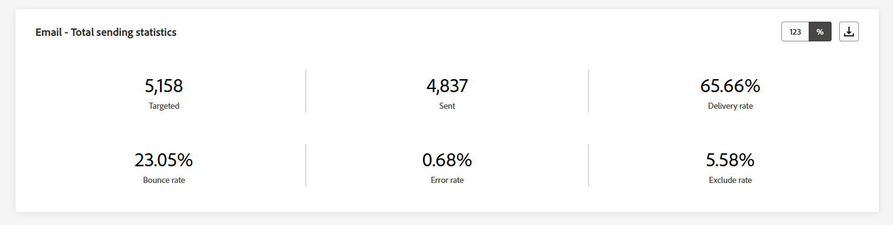
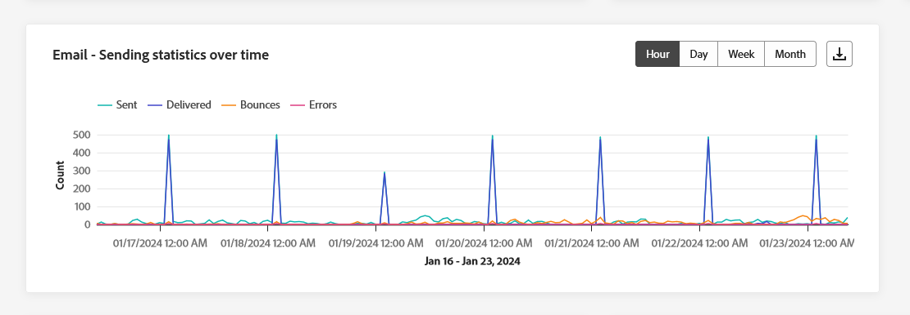
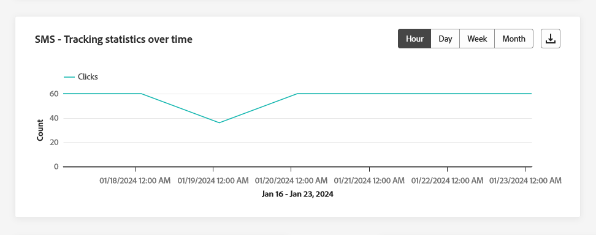

# 頻道報告 {#channel-report}

>[!CONTEXTUALHELP]
>id="ajo_channel_level_report"
>title="管道層級報告"
>abstract="管道報告提供所有管道的流量和參與量度的全面概述。您的報告會分為不同的介面工具，詳述行銷活動和歷程的成功和錯誤。每個報告儀表板都可以透過調整大小或移除介面工具來修改。"

>[!AVAILABILITY]
>
>目前的報告體驗將於2025年1月淘汰。 在此日期之後，新的報告體驗將成為標準體驗。建議您熟悉新功能，以確保順利轉換。 [開始使用Journey Optimizer的新報告介面。](report-gs-cja.md)

>[!IMPORTANT]
>
> 若要存取&#x200B;**報表**&#x200B;功能表，您必須擁有&#x200B;**[!UICONTROL 檢視管道報表]**&#x200B;許可權。 [了解更多](channel-report-gs.md#before-starting-manage-reports-prereq)

管道報表為使用者提供管道層級流量和參與量度的完整概觀。 這些量度會經過彙總，針對來自所選頻道的動作（橫跨各種促銷活動和歷程）呈現彙總值。

您可以導覽至&#x200B;**歷程管理**&#x200B;區段內的&#x200B;**報表**&#x200B;功能表，以存取管道報表。 由於是完全可自訂的，您可以根據報表日期或動作來篩選資料。 [了解更多](channel-report-gs.md)

報表頁面會顯示以下索引標籤：

* [電子郵件](#email)
* [推播通知](#push)
* [簡訊](#sms)
* [應用程式內](#inapp)
* [Web](#web)
* [直接郵件](#direct-mail)

➡️ [在影片中探索此功能](#channel-report-video)

## 電子郵件 {#email}

在管道報表中，電子郵件功能表會詳細說明與行銷活動和歷程中傳送之電子郵件相關的主要資訊。 量度詳情如下。

### 電子郵件 - 傳送統計資料總計 {#email-total-sending}

>[!CONTEXTUALHELP]
>id="ajo_channel_email_sending_statistics"
>title="電子郵件 - 傳送統計資料總計"
>abstract="電子郵件 - 傳送統計資料總計 KPI 總結有關電子郵件的基本資料，例如指定對象或已送達的郵件。"

**[!UICONTROL 電子郵件總傳送統計資料]** Widget提供您電子郵件績效的完整總覽，顯示摘要您電子郵件相關重要資料的關鍵績效指標(KPI)。

+++ 進一步瞭解電子郵件傳送總計統計量度

* **[!UICONTROL 目標]**：已處理的電子郵件總數。

* **[!UICONTROL 已傳送]**：傳送總數。

* **[!UICONTROL 已傳遞]**：成功傳送的電子郵件數目，與已傳送的訊息總數相關。

* **[!UICONTROL 傳遞率]**：成功傳送的電子郵件百分比。

* **[!UICONTROL 跳出數]**：累積的錯誤總數，以及相對於已傳送訊息總數的自動傳回處理。

* **[!UICONTROL 跳出率]**：與已傳送電子郵件相比跳出的電子郵件百分比。

* **[!UICONTROL 錯誤]**：發生無法傳送至設定檔的錯誤總數。

* **[!UICONTROL 錯誤率]**：與已傳送的電子郵件相較之下，無法傳送的錯誤百分比。

* **[!UICONTROL 已排除]**： Adobe Journey Optimizer已排除的設定檔數目。

* **[!UICONTROL 排除率]**： Adobe Journey Optimizer已排除的設定檔百分比。

+++

### 電子郵件 - 追蹤統計資料總計 {#email-total-tracking}

>[!CONTEXTUALHELP]
>id="ajo_channel_email_tracking_statistics"
>title="電子郵件 - 追蹤統計資料總計"
>abstract="電子郵件 - 追蹤統計資料總計 KPI 提供有關你的電子郵件的輪廓活動的資料。"

**[!UICONTROL 電子郵件追蹤總計統計資料]** Widget提供與您的電子郵件相連結之設定檔活動的詳細快照，提供參與度和電子郵件有效性的基本深入分析。

+++ 進一步瞭解電子郵件追蹤統計資料總計

* **[!UICONTROL 開啟]**：訊息開啟的次數。

* **[!UICONTROL 開啟率]**：與已傳遞電子郵件數相較的已開啟電子郵件總數。

* **[!UICONTROL 點按]**：內容在訊息中被點按的次數。

* **[!UICONTROL 點按率]**：與電子郵件互動的使用者百分比。

* **[!UICONTROL 垃圾訊息申訴]**：訊息被宣告為垃圾郵件或垃圾訊息的次數。

* **[!UICONTROL 垃圾郵件投訴率]**：與已傳送的電子郵件數目相較之下，宣告為垃圾郵件或垃圾郵件的郵件百分比。

* **[!UICONTROL 取消訂閱]**：對訂閱連結的點按次數。

* **[!UICONTROL 取消訂閱率]**：與已傳送電子郵件數目相較的取消訂閱百分比。

+++

### 電子郵件 - 時間區間內傳送統計資料 {#email-sending-statistics-overtime}

>[!CONTEXTUALHELP]
>id="ajo_channel_email_sending_statistics_overtime"
>title="電子郵件 - 時間區間內傳送統計資料"
>abstract="「電子郵件 - 時間區間內傳送統計資料」圖表顯示有關已傳送的電子郵件的資料，依每小時、每天、每週或每月進行劃分。"

**[!UICONTROL 電子郵件 — 隨著時間傳送統計資料]**&#x200B;圖表提供動態表示，顯示電子郵件活動的分析。 此圖形表示提供已傳送電子郵件的完整劃分，可讓您以每小時、每日、每週或每月規模觀察趨勢和模式。

+++ 進一步瞭解電子郵件 — 傳送一段時間量度的統計資料

* **[!UICONTROL 已傳送]**：傳送總數。

* **[!UICONTROL 已傳遞]**：與已傳送電子郵件總數相關的成功傳送電子郵件數目。

* **[!UICONTROL 跳出數]**：累計的錯誤總數，以及相對於已傳送電子郵件總數的自動傳回處理。

* **[!UICONTROL 錯誤]**：發生無法傳送至設定檔的錯誤總數。

+++

### 電子郵件 - 時間區間內追蹤統計資料 {#email-tracking-statistics-overtime}

>[!CONTEXTUALHELP]
>id="ajo_channel_email_tracking_statistics_overtime"
>title="電子郵件 - 時間區間內追蹤統計資料"
>abstract="「電子郵件 - 時間區間內追蹤統計資料」圖表提供有關你的電子郵件的輪廓活動相關資料，依每小時、每天、每週或每月進行劃分。"

**[!UICONTROL 電子郵件 — 追蹤一段時間內的統計資料]**&#x200B;圖表提供與您的電子郵件相關之設定檔活動的詳細概觀。 此圖形表示法以每小時、每日、每週或每月為基準劃分資料，提供收件者參與度如何隨著不同時間間隔演變的寶貴見解。

+++ 進一步瞭解電子郵件 — 追蹤一段時間量度的統計資料

* **[!UICONTROL 開啟]**：訊息開啟的次數。

* **[!UICONTROL 點按]**：內容在訊息中被點按的次數。

+++

### 電子郵件 - 退回郵件的類別和原因 {#bounce-categories}

>[!CONTEXTUALHELP]
>id="ajo_channel_email_bounce_categories"
>title="退回類別"
>abstract="「退回」類別的圖表和表格提供有關暫時性和永久錯誤的資料。"

>[!CONTEXTUALHELP]
>id="ajo_channel_email_bounce_reasons"
>title="退回原因"
>abstract="「退回原因」圖表和表格包含與退回郵件相關的可用資料。"

「**[!UICONTROL 跳出類別]**」和「**[!UICONTROL 跳出原因]**」Widget會封裝與跳出訊息相關的資料，提供各種類別和訊息跳出特定原因的完整概觀

如需退信的詳細資訊，請參閱[隱藏清單](../reports/suppression-list.md)頁面。

+++ 進一步瞭解跳出類別量度

* **[!UICONTROL 硬退信]**：永久錯誤的總數，例如錯誤的電子郵件地址。 這包含明確指出地址無效的錯誤訊息，例如「未知使用者」。

* **[!UICONTROL 軟退信]**：暫時性錯誤的總數，例如完整的收件匣。

* **[!UICONTROL Ignored]**：暫時性的總數，例如「不在辦公室」，或是技術錯誤，例如，如果寄件者型別是郵遞員。

+++

### 錯誤原因 {#error-reasons}

>[!CONTEXTUALHELP]
>id="ajo_channel_email_error_reasons"
>title="錯誤原因"
>abstract="「錯誤原因」圖表和表格讓你能夠確認傳送過程中發生的特定錯誤。"

**[!UICONTROL 錯誤原因]**&#x200B;圖表和表格可讓您找出整個傳送過程中發生的精確錯誤，以方便您清楚瞭解遇到的任何問題。

### 排除原因 {#excluded-reasons}

>[!CONTEXTUALHELP]
>id="ajo_channel_email_excluded_reasons"
>title="排除原因"
>abstract="「排除原因」圖表和表格說明導致使用者輪廓被排除在目標客群之外而未能收到訊息的各項因素。"

**[!UICONTROL 排除的原因]**&#x200B;圖表和表格呈現不同因素的完整檢視，這些因素導致目標對象排除使用者設定檔，導致未收到訊息。

如需排除原因的完整清單，請參閱[此頁面](exclusion-list.md)。

### 依網域劃分的已傳送和已送達郵件 {#sent-delivered-domains}

>[!CONTEXTUALHELP]
>id="ajo_channel_email_sending_delivered_domains"
>title="依網域劃分的已傳送和已送達郵件"
>abstract="「依網域劃分的已傳送和已送達郵件」圖表和表格呈現依網域層級劃分的每封傳送資料的重要電子郵件。"

網域&#x200B;]**的**[!UICONTROL &#x200B;傳送與傳遞表格和圖表提供網域層級電子郵件傳遞的詳細劃分，提供您電子郵件效能的完整深入分析。

+++ 進一步瞭解依網域進行之傳送和傳遞的量度

* **[!UICONTROL 已傳送]**：您電子郵件的傳送總數。

* **[!UICONTROL 已傳遞]**：與已傳送訊息總數相關的成功傳送訊息數。

+++

### 依網域劃分的退回情形與錯誤 {#bounces-errors-domains}

>[!CONTEXTUALHELP]
>id="ajo_channel_email_bounces_errors_domains"
>title="依網域劃分的退回情形與錯誤"
>abstract="「依網域劃分的退回情形與錯誤」圖表和表格呈現依網域層級劃分的傳送過程中發生的特定錯誤。"

依網域&#x200B;]**的**[!UICONTROL &#x200B;跳出和錯誤圖表和表格提供傳送程式期間遇到的特定錯誤的網域層級劃分，提供所發生問題的詳細分析。

+++ 進一步瞭解依網域量度的跳出和錯誤

* **[!UICONTROL 跳出數]**：在傳送程式期間累積的錯誤總數，以及相對於已傳送訊息總數的自動傳回處理次數。

* **[!UICONTROL 錯誤]**：在傳送過程中發生的錯誤總數，導致無法將其傳送至設定檔。

+++

### 依網域劃分的開啟和點按動作 {#open-clicks-domains}

>[!CONTEXTUALHELP]
>id="ajo_channel_email_open_clicks_domains"
>title="依網域劃分的開啟和點按動作"
>abstract="「依網域劃分的開啟和點選動作」圖表和表格呈現依網域層級劃分的訪客參與電子郵件互動的情形。"

**[!UICONTROL 依網域開啟和點按]**&#x200B;的圖表和表格會顯示訪客與您的電子郵件互動的網域層級劃分，提供不同網域與您的內容互動方式的寶貴見解。

+++ 進一步瞭解依網域量度的開啟和點按次數

* **[!UICONTROL 開啟次數]**：電子郵件開啟的次數。

* **[!UICONTROL 點按次數]**：在電子郵件中點按內容的次數。

+++

### 依網域劃分的退回原因 {#bounce-reasons-domains}

>[!CONTEXTUALHELP]
>id="ajo_channel_email_bounce_reasons_domains"
>title="依網域劃分的退回原因"
>abstract="「依網域劃分的退回原因」圖表和表格呈現依網域層級劃分的暫時性錯誤和永久錯誤的資料。"

依網域&#x200B;]**的**[!UICONTROL &#x200B;跳出原因圖表和表格提供與暫時和永久錯誤相關的網域層級資料劃分，提供跳出訊息背後原因的詳細分析。

如需退信的詳細資訊，請參閱[隱藏清單](../reports/suppression-list.md)頁面。

## 推播通知 {#push}

從您的管道報表中，**推播通知**&#x200B;功能表會詳細說明與行銷活動和歷程中傳送之推播通知相關的主要資訊。 量度詳情如下。

### 推播通知 - 傳送統計資料總計 {#push-total-sending}

>[!CONTEXTUALHELP]
>id="ajo_channel_push_sending_statistics"
>title="推播通知 - 傳送統計資料總計"
>abstract="推播通知 - 傳送統計資料總計 KPI 總結有關推播通知的基本資料，例如指定對象或已送達的郵件。"

**[!UICONTROL 推播通知 — 傳送統計資料總數]** KPI可作為完整摘要，封裝與推播通知相關的重要資料。 這些量度包含目標對象和實際傳送狀態的詳細深入分析，讓您更全面地瞭解推播通知的有效性和觸及範圍。

+++ 深入瞭解推播通知 — 傳送統計資料量度總計

* **[!UICONTROL 目標]**：已處理的推播通知總數。

* **[!UICONTROL 已傳送]**：已傳送推播通知總數。

* **[!UICONTROL 已傳遞]**：成功傳送的推播通知數目（與已傳送的推播通知總數相關）。

* **[!UICONTROL 傳遞率]**：成功傳送的推播通知百分比。

* **[!UICONTROL 跳出數]**：累積的錯誤總數，以及相對於已傳送訊息總數的自動傳回處理。

* **[!UICONTROL 跳出率]**：與已傳送的推播通知相比跳出的推播通知百分比。

* **[!UICONTROL 錯誤]**：發生無法傳送至設定檔的錯誤總數。

* **[!UICONTROL 錯誤率]**：與已傳送的推播通知比較，無法傳送的錯誤百分比。

* **[!UICONTROL 已排除]**： Adobe Journey Optimizer已排除的設定檔數目。

* **[!UICONTROL 排除率]**： Adobe Journey Optimizer已排除的設定檔百分比。

+++

### 推播通知 - 追蹤統計資料總計 {#push-total-tracking}

>[!CONTEXTUALHELP]
>id="ajo_channel_push_tracking_statistics"
>title="推播通知 - 追蹤統計資料總計"
>abstract="「推播通知 - 追蹤統計資料總計」提供有關推播通知的輪廓活動的資料。"

**[!UICONTROL 推播通知 — 追蹤統計資料總計]** Widget提供與您的推播通知相連結之設定檔活動的詳細快照，提供參與和推播通知有效性的基本深入分析。

+++ 進一步瞭解推播通知 — 追蹤統計量度總計

* **[!UICONTROL 開啟]**：推播通知開啟的次數。

* **[!UICONTROL 開啟率]**：已開啟推播通知的百分比。

* **[!UICONTROL 動作]**：已傳送推播通知上的動作總數，例如按鈕點選或解除。

* **[!UICONTROL 動作率]**：已傳送推播通知的動作佔已傳送推播通知的動作百分比。

+++

### 推播通知 - 時間區間內的傳送統計資料 {#push-sending-overtime}

>[!CONTEXTUALHELP]
>id="ajo_channel_push_sending_statistics_overtime"
>title="推播通知 - 時間區間內的傳送統計資料"
>abstract="「推播通知時間區間內傳送統計資料」圖表呈有關已傳送推播通知的資料，依每小時、每天、每週或每月劃分顯示。"

**[!UICONTROL 推播通知 — 傳送一段時間內的統計資料]**&#x200B;圖表提供動態表示，顯示推播通知活動的分析。 此圖形表示提供已傳送推播通知的完整劃分，可讓您以每小時、每日、每週或每月規模觀察趨勢和模式。

+++ 深入瞭解推播通知 — 傳送一段時間量度的統計資料

* **[!UICONTROL 已傳送]**：已傳送推播通知總數。

* **[!UICONTROL 已傳遞]**：成功傳送的推播通知數目（與已傳送的推播通知總數相關）。

* **[!UICONTROL 跳出數]**：累積的錯誤總數，以及相對於已傳送訊息總數的自動傳回處理。

* **[!UICONTROL 錯誤]**：發生無法傳送至設定檔的錯誤總數。

+++

### 推播通知 - 時間區間內追蹤統計資料 {#push-tracking-overtime}

>[!CONTEXTUALHELP]
>id="ajo_channel_push_tracking_statistics_overtime"
>title="推播通知 - 時間區間內追蹤統計資料"
>abstract="「推播通知 - 時間區間內追蹤統計資料」圖表提供有關你的推播通知的輪廓活動相關資料，依每小時、每天、每週或每月劃分顯示。"

**[!UICONTROL 推播通知 — 追蹤一段時間內的統計資料]**&#x200B;圖表提供與您的推播通知相關的設定檔活動的詳細概觀。 此圖形表示法以每小時、每日、每週或每月為基準劃分資料，提供收件者參與度如何隨著不同時間間隔演變的寶貴見解。

+++ 進一步瞭解推播通知 — 追蹤一段時間量度的統計資料

* **[!UICONTROL 開啟]**：您的推播通知開啟的次數。

* **[!UICONTROL 動作]**：已傳送推播通知上的動作總數，例如按鈕點選或解除。

+++

### 推播通知 - 排除原因 {#push-excluded-reasons}

>[!CONTEXTUALHELP]
>id="ajo_channel_push_excluded_reasons"
>title="排除原因"
>abstract="「排除原因」圖表和表格說明導致使用者輪廓被排除在目標客群之外而未能收到訊息的各項因素。"

**[!UICONTROL 排除的原因]**&#x200B;圖表和表格會顯示阻止使用者設定檔接收推播通知的不同原因（從目標設定檔排除）。

如需排除原因的完整清單，請參閱[此頁面](exclusion-list.md)。

### 推播通知 - 錯誤原因 {#push-error-reasons}

>[!CONTEXTUALHELP]
>id="ajo_channel_push_error_reasons"
>title="錯誤原因"
>abstract="「錯誤原因」圖表和表格讓你能夠確認傳送過程中發生的特定錯誤。"

**[!UICONTROL 錯誤原因]**&#x200B;圖表和表格可讓您識別推播通知傳送過程中發生的特定錯誤，提供過程中所遇到任何問題的詳細深入分析。

### 推播通知 - 依據平台的追蹤 {#push-tracking-platform}

>[!CONTEXTUALHELP]
>id="ajo_channel_push_tracking_statistics_platform"
>title="依平台劃分的追蹤統計資料"
>abstract="「依平台劃分的追蹤統計資料」圖表和表格根據你的輪廓的作業系統提供推播通知的輪廓活動相關資料。"

**[!UICONTROL 推播通知 — 依據平台的追蹤]**&#x200B;圖形和表格會根據您設定檔的作業系統，詳細描述推播通知的收件者活動。

### 推播通知 - 依據平台的傳送 {#push-sending-platform}

>[!CONTEXTUALHELP]
>id="ajo_channel_push_sending_statistics_platform"
>title="依平台劃分傳送統計資料"
>abstract="「依平台劃分的傳送統計資料」圖表和表格顯示有關已傳送推播通知的資料。"

**[!UICONTROL 推播通知 — 由平台]**&#x200B;傳送的圖表和表格提供完整的劃分，詳述您的推播通知相對於設定檔作業系統的成功情形。 這項全面分析針對不同平台的推播通知有效性提供寶貴見解。

## 簡訊 {#sms}

從您的&#x200B;**頻道**&#x200B;報告，簡訊功能表會詳細說明行銷活動和歷程中傳送之簡訊的相關主要資訊。 量度詳情如下。

### 簡訊 - 傳送統計資料總計 {#sms-sending-statistics}

>[!CONTEXTUALHELP]
>id="ajo_channel_sms_sending_statistics"
>title="簡訊 - 傳送統計資料總計"
>abstract="簡訊 - 傳送統計資料總計 KPI 總結有關簡訊的基本資料，例如指定對象或已送達的簡訊。"

**[!UICONTROL 簡訊 — 傳送統計資料總數]**&#x200B;個KPI可作為完整摘要，封裝與簡訊相關的重要資料。 這些量度包含目標對象和實際傳送狀態的詳細深入分析，提供您SMS訊息成效和觸及範圍的完整檢視。

+++ 深入瞭解推播通知 — 傳送統計資料量度總計

* **[!UICONTROL 目標]**：符合簡訊頻道目標設定檔資格的使用者設定檔數目。

* **[!UICONTROL 已傳送]**：已傳送的SMS訊息總數。

* **[!UICONTROL 已傳遞]**：成功傳送的SMS訊息數目（與已傳送的SMS訊息總數相關）。

* **[!UICONTROL 傳遞率]**：成功傳送的SMS訊息百分比。

* **[!UICONTROL 跳出數]**：累計的錯誤總數，以及相對於已傳送SMS訊息總數的自動傳回處理數。

* **[!UICONTROL 跳出率]**：與傳送的SMS訊息相比，跳出的簡訊訊息百分比。

* **[!UICONTROL 錯誤]**：發生無法傳送至設定檔的錯誤總數。

* **[!UICONTROL 錯誤率]**：與已傳送的SMS訊息相較之下，無法傳送的錯誤百分比。

* **[!UICONTROL 已排除]**：從目標設定檔中排除且未收到訊息的使用者設定檔數目。

* **[!UICONTROL 排除率]**： Adobe Journey Optimizer已排除的設定檔百分比。

+++

### 簡訊 - 追蹤統計資料總計 {#sms-tracking-statistics}

>[!CONTEXTUALHELP]
>id="ajo_channel_sms_tracking_statistics"
>title="簡訊 - 追蹤統計資料總計"
>abstract="「SMS - 追蹤統計資料總計」提供有關你的簡訊的輪廓活動相關資料。"

**[!UICONTROL SMS — 追蹤統計總數]** Widget提供與訪客與您URL互動相關之重要資訊的詳細概觀，提供您SMS訊息有效性的深入分析：

* **[!UICONTROL 點按]**：內容在簡訊訊息中被點按的次數。

### 簡訊 - 時間區間內傳送統計資料 {#sms-sending-statistics-overtime}

>[!CONTEXTUALHELP]
>id="ajo_channel_sms_sending_statistics_overtime"
>title="簡訊 - 時間區間內傳送統計資料"
>abstract="「簡訊- 時間區間內傳送統計資料」圖表顯示有關已傳送簡訊的資料，依每小時、每天、每週或每月劃分顯示。"

**[!UICONTROL SMS — 隨著時間傳送統計資料]**&#x200B;圖表提供已傳送SMS訊息的完整檢視，提供每小時、每日、每週或每月劃分的資料。 此圖形表示法可讓您追蹤和分析簡訊活動在不同時間間隔內的趨勢。

+++ 進一步瞭解簡訊 — 傳送一段時間量度內的統計資料

* **[!UICONTROL 已傳送]**：已傳送的SMS訊息總數。

* **[!UICONTROL 跳出數]**：累計的錯誤總數，以及相對於已傳送SMS訊息總數的自動傳回處理數。

* **[!UICONTROL 錯誤]**：發生無法傳送至設定檔的錯誤總數。

+++

### 簡訊 - 時間區間內追蹤統計資料 {#sms-tracking-statistics-overtime}

>[!CONTEXTUALHELP]
>id="ajo_channel_sms_tracking_statistics_overtime"
>title="簡訊 - 時間區間內追蹤統計資料"
>abstract="「簡訊 - 時間區間內追蹤統計資料」圖表提供有關你的簡訊的輪廓活動相關資料，依每小時、每天、每週或每月劃分顯示。"

**[!UICONTROL SMS — 追蹤統計資料隨時間變化]**&#x200B;圖表會提供與您的SMS訊息相關的設定檔活動資料，提供每小時、每日、每週或每月詳細劃分。 此圖形表示法可讓您分析和瞭解使用者在不同時間間隔內的參與模式。

* **[!UICONTROL 點按]**：內容在簡訊訊息中被點按的次數。

### 排除原因 {#sms-excluded-reasons}

>[!CONTEXTUALHELP]
>id="ajo_channel_sms_excluded_reasons"
>title="排除原因"
>abstract="「排除原因」圖表和表格說明導致使用者輪廓被排除在目標客群之外而未能收到訊息的各項因素。"

**[!UICONTROL 排除原因]**&#x200B;圖表和表格會以視覺化方式描述導致目標對象中排除使用者設定檔的各種因素，以防止他們接收您的SMS訊息。

如需排除原因的完整清單，請參閱[此頁面](exclusion-list.md)。

### 退回原因 {#sms-bounce-reasons}

>[!CONTEXTUALHELP]
>id="ajo_channel_sms_bounce_reasons"
>title="退回原因"
>abstract="「退回原因」圖表和表格包含與退回郵件相關的可用資料。"

**[!UICONTROL 退信原因]**&#x200B;圖表和表格提供與退信SMS訊息相關的完整資料概觀，針對SMS訊息退信例項背後的特定原因提供有價值的深入分析。

### 錯誤原因 {#sms-error-reasons}

>[!CONTEXTUALHELP]
>id="ajo_channel_sms_error_reasons"
>title="錯誤原因"
>abstract="「錯誤原因」圖表和表格讓你能夠確認傳送過程中發生的特定錯誤。"

**[!UICONTROL 錯誤原因]**&#x200B;圖表和表格可讓您識別在傳送SMS訊息過程中發生的特定錯誤，協助徹底分析遇到的任何問題。

## 直接郵件 {#direct-mail}

從您的&#x200B;**頻道**&#x200B;報告，**直接郵件**&#x200B;功能表會詳細說明與您的&#x200B;**行銷活動**&#x200B;和&#x200B;**歷程**&#x200B;中傳送之直接郵件訊息相關的主要資訊。 量度詳情如下。

### 直接郵件 - 傳送統計資料總計 {#direct-mail-total-sending}

>[!CONTEXTUALHELP]
>id="ajo_channel_direct_sending_statistics"
>title="直接郵件 - 傳送統計資料總計"
>abstract="直接郵件 - 傳送統計資料總計 KPI 總結有關直接郵件的基本資料，例如指定對象或已送達的郵件。"

**[!UICONTROL 直接郵件 — 總傳送統計資料]** Widget提供您直接郵件訊息效能的完整概觀，顯示摘要您直接郵件訊息基本資料的關鍵績效指標(KPI)。

+++ 深入瞭解直接郵件 — 傳送統計量度總計

* **[!UICONTROL 目標]**：符合直接郵件訊息目標設定檔資格的使用者設定檔數目。

* **[!UICONTROL 已傳送]**：傳送總數。

* **[!UICONTROL 錯誤]**：發生無法傳送至設定檔的錯誤總數。

* **[!UICONTROL 錯誤率]**：與已傳送的推播通知比較，無法傳送的錯誤百分比。

* **[!UICONTROL 已排除]**：從目標設定檔中排除且未收到訊息的使用者設定檔數目。

* **[!UICONTROL 排除率]**： Adobe Journey Optimizer已排除的設定檔百分比。

+++

### 排除原因 {#direct-mail-excluded-reasons}

>[!CONTEXTUALHELP]
>id="ajo_channel_direct_excluded_reasons"
>title="排除原因"
>abstract="「排除原因」圖表和表格說明導致使用者輪廓被排除在目標客群之外而未能收到訊息的各項因素。"

**[!UICONTROL 直接郵件 — 排除的原因]**&#x200B;圖表和表格以視覺化方式說明導致從目標對象中排除使用者設定檔的各種因素，以防止他們接收您的直接郵件訊息。

如需排除原因的完整清單，請參閱[此頁面](exclusion-list.md)。

### 錯誤原因 {#direct-mail-error-reasons}

>[!CONTEXTUALHELP]
>id="ajo_channel_direct_error_reasons"
>title="錯誤原因"
>abstract="「錯誤原因」圖表和表格讓你能夠確認傳送過程中發生的特定錯誤。"

**[!UICONTROL 直接郵件 — 錯誤原因]**&#x200B;提供了識別直接郵件訊息傳送過程中發生的特定錯誤的方法，允許詳細分析遇到的任何問題。

## 應用程式內 {#in-app}

在管道報表中，應用程式內功能表會詳細說明與促銷活動和歷程中傳送之應用程式內訊息有關的主要資訊。 量度詳情如下。

### 應用程式內參與度總計 {#inapp-total-engagement}

>[!CONTEXTUALHELP]
>id="ajo_channel_inapp_engagement"
>title="應用程式內 - 參與度總計"
>abstract="應用程式內 - 參與度總計 KPI 提供有關訪客參與應用程式內訊息的互動的綜合資訊，包括曝光和互動次數等量度。"

**[!UICONTROL 應用程式內參與總數]** KPI可全面分析訪客與應用程式內訊息的參與情形，包含&#x200B;**曝光數**&#x200B;和&#x200B;**互動數**&#x200B;等關鍵量度。

+++ 進一步瞭解應用程式內參與總計量度

* **[!UICONTROL 曝光次數]**：傳送給所有使用者的應用程式內訊息總數。

* **[!UICONTROL 互動]**：與應用程式內訊息的互動總數。 這包括使用者所執行的任何動作，例如點選、解僱或任何其他互動。

+++

### 應用程式內時間區間內參與度情形 {#inapp-engagement-overtime}

>[!CONTEXTUALHELP]
>id="ajo_channel_inapp_engagement_overtime"
>title="應用程式 - 時間區間內參與度情形"
>abstract="「應用程式內 - 時間區間內參與度」圖表追蹤應用程式內曝光和互動次數，提供依每小時、每日、每周和每月劃分的資料。"

**[!UICONTROL 應用程式內參與加班]**&#x200B;圖表會透過追蹤任何曝光、關閉或互動，顯示您相關期間應用程式內曝光和互動的演變。

+++ 進一步瞭解應用程式內參與超時量度

* **[!UICONTROL 曝光次數]**：傳送給所有使用者的應用程式內訊息總數。

* **[!UICONTROL 互動]**：與應用程式內訊息的互動總數。 這包括使用者所執行的任何動作，例如點選、解僱或任何其他互動。

+++

## Web {#web}

從您的&#x200B;**管道**&#x200B;報告，網頁功能表會詳細說明與包含在您的&#x200B;**行銷活動**&#x200B;和&#x200B;**歷程**&#x200B;中的網頁相關的主要資訊。 量度詳情如下。

### 網站 - 參與度總計 {#web-engagement-total}

>[!CONTEXTUALHELP]
>id="ajo_channel_web_engagement"
>title="網站 - 參與度總計"
>abstract="網頁 - 參與度總計 KPI 提供有關訪客參與網頁互動的綜合資訊，包括曝光和互動次數等量度。"

**[!UICONTROL 網站總參與度]** KPI可提供訪客與網頁參與度的全方位分析，包含曝光數和互動數等關鍵量度。

+++ 進一步瞭解網站總參與量度

* **[!UICONTROL 曝光次數]**：傳送給所有使用者的網頁體驗總數。

* **[!UICONTROL 互動]**：與網頁的互動總數。 這包括使用者所執行的任何動作，例如點按或任何其他互動。

+++

### 網頁 - 時間區間內參與度總計 {#web-engagement-total-overtime}

>[!CONTEXTUALHELP]
>id="ajo_channel_web_engagement_overtime"
>title="網頁 - 時間區間內參與度總計"
>abstract="「網頁 - 時間區間內參與度」圖表追蹤你的網頁曝光和互動次數，提供依每小時、每天、每周和每月劃分的資料。"

**[!UICONTROL Web參與加班]**&#x200B;圖表會監視您網頁的&#x200B;**曝光數**&#x200B;和&#x200B;**互動數**，提供每小時、每日、每週和每月的詳細劃分。

+++ 進一步瞭解Web參與超時量度

* **[!UICONTROL 曝光次數]**：傳送給所有使用者的網頁體驗總數。

* **[!UICONTROL 互動]**：與網頁的互動總數。 這包括使用者所執行的任何動作，例如點按或任何其他互動。

+++

## 管道報表（影片） {#channel-report-video}

透過此影片瞭解如何在頻道層級存取、導覽和匯出報告

>[!VIDEO](https://video.tv.adobe.com/v/3424537?quality=12)
