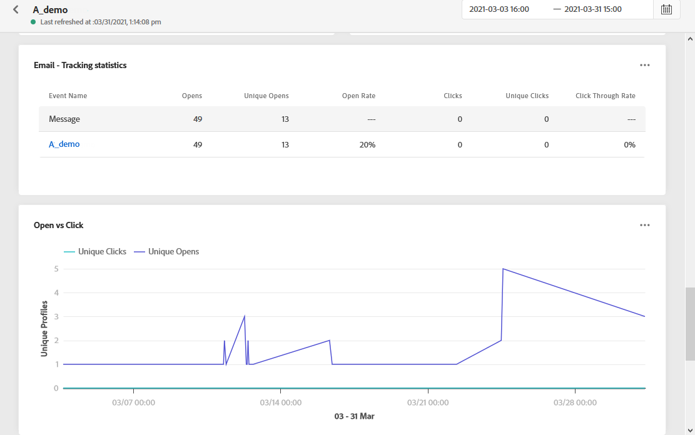

# 以電子郵件傳送全域報告 {#email-global-report}

電子郵件 **[!UICONTROL Global report]** 僅鎖定特定電子郵件傳送。

從 **[!UICONTROL Executions]** 的 **[!UICONTROL Messages]** 菜單，選擇 **[!UICONTROL Global view]** 然後，從所選傳送的進階功能表中選取 **[!UICONTROL Global report]**.

電子郵件 **[!UICONTROL Global report]** 會分為不同的小工具，詳述傳送的成功和錯誤。 如有需要，可對每個介面工具集調整大小並加以刪除。 如需詳細資訊，請參閱 [節](global-report.md#modify-dashboard).

**[!UICONTROL Email performance]** 使用KPI詳細說明與訊息相關的主要資訊：

* **[!UICONTROL Sent]**:傳送的傳送總數。

* **[!UICONTROL Delivery Rate]**:已成功發送的消息的百分比。

* **[!UICONTROL Bounce Rate]**:跳出的電子郵件與傳送的電子郵件的百分比。

* **[!UICONTROL Error Rate]**:傳送期間發生、無法傳送的錯誤百分比，與已傳送的電子郵件相比。

* **[!UICONTROL Open Rate]**:已開啟郵件的百分比。

* **[!UICONTROL Click Rate]**:傳送中的點按百分比。

* **[!UICONTROL Spam Complaint Rate]**:收件者標示為垃圾訊息的電子郵件與已傳送郵件的百分比。 如需投訴的詳細資訊，請參閱 [傳遞能力最佳實務指南](https://experienceleague.adobe.com/docs/deliverability-learn/deliverability-best-practice-guide/metrics-for-deliverability/complaints.html#metrics-for-deliverability){target=&quot;_blank&quot;}。

* **[!UICONTROL Unsubscribe Rate]**:不重複取消訂閱與已傳送訊息數量的百分比。 此指標不取決於取消訂閱連結的點按次數，而是根據收件者起始的取消訂閱次數。 了解更多取消訂閱，請參閱 [頁面](../consent.md).

此 **[!UICONTROL Email - Tracking statistics]** 包含您傳送的收件者活動可用資料：

* **[!UICONTROL Opens]**:傳送中開啟傳送的次數。

* **[!UICONTROL Unique Opens]**:已開啟傳遞的百分比。

* **[!UICONTROL Open Rate]**:已開啟電子郵件的總數與已傳送電子郵件的總數相比。

* **[!UICONTROL Clicks]**:電子郵件中內容被點按的次數。

* **[!UICONTROL Unique Clicks]**：按一下電子郵件內容的收件者人數。

* **[!UICONTROL Click through rate]**:與歷程互動的使用者百分比。

此 **[!UICONTROL Sending Statistics]** 圖表會詳細說明您的傳送是否成功：

* **[!UICONTROL Delivered]**:已成功傳送的訊息數，與已傳送的訊息總數相關。

* **[!UICONTROL Bounces]**:傳送和自動回傳處理期間累積的錯誤總數，與已傳送訊息的總數相關。

* **[!UICONTROL Errors]**:傳送期間發生的錯誤總數，使其無法傳送至設定檔。

此 **[!UICONTROL Bounce Reasons]** 和 **[!UICONTROL Bounce categories]** 小工具包含與退信消息相關的可用資料，例如：

* **[!UICONTROL Hard bounce]**:永久錯誤的總數，例如錯誤的電子郵件地址。 這包含明確指出地址無效的錯誤訊息，例如「未知」使用者。

* **[!UICONTROL Soft bounce]**:臨時錯誤（如完整收件箱）的總數。

* **[!UICONTROL Ignored]**:臨時（例如不在辦公室）或技術錯誤（例如，如果發送者類型是郵遞員）的總數。

如需退信的詳細資訊，請參閱 [隱藏清單](../suppression-list.md) 頁面。

此 **[!UICONTROL Error Reasons]** 圖形和表格可讓您查看在傳送期間發生的錯誤。

此 **[!UICONTROL Email - Top recipient domain]** 圖表和表格詳細說明收件者最常使用哪些網域來開啟電子郵件。

此 **[!UICONTROL Email - Top Url]** 圖表和表格會詳細說明哪些URL最常被瀏覽。

此 **[!UICONTROL Open vs Click]** 識別收件者與傳送的互動：

* **[!UICONTROL Unique Clicks]**：按一下電子郵件內容的收件者人數。

* **[!UICONTROL Unique Opens]**:開啟傳遞的收件者人數。

<!--

>[!NOTE]
>
>The Offers widgets and metrics are only available if a decision was inserted in an email. For more information on Decision Management, refer to this [page](../offers/get-started/starting-offer-decisioning.md).

The **[!UICONTROL Offers statistic]** and **[!UICONTROL Offers statistics]** over time widgets measure your offer's success and impact on your targeted audience. It detail the main information relative to your message with KPIs:

* **[!UICONTROL Offer sent]**: Total number of sends for the offer.

* **[!UICONTROL Offer impression]**: Number of times the offer was opened in a delivery.

* **[!UICONTROL Offer clicks]**: Number of times an offer was clicked on in a delivery.

The **[!UICONTROL Offers detailed statistic]** table contains the available data for recipient activity with your offer:

* **[!UICONTROL Placement name]**: Name of your placement used to display your offer. For more information on placement, refer to this [page](../offers/offer-library/creating-placements.md).

* **[!UICONTROL Offer name]**: Name of the offer added in the delivery. For more information on placement, refer to this [page](../offers/offer-library/creating-personalized-offers.md).

* **[!UICONTROL Offer sent]**: Total number of sends for the offer.

* **[!UICONTROL Offer impression rate]**: Percentage of opened offers compared to the number of sent offers.

* **[!UICONTROL Offer click rate]**: Percentage of users who interacted with the offer.
-->
>[!NOTE]
>
>具有 **[!UICONTROL Suppressed]** 或 **[!UICONTROL Not allowed]** 在訊息傳送程式期間會排除狀態。 因此，若 **歷程報表** 會將這些設定檔顯示為已在歷程中移動([讀取區段](../building-journeys/read-segment.md) 和 [訊息](../building-journeys/journeys-message.md) 活動), **電子郵件報表** 不會將其納入 **[!UICONTROL Sent]** 量度，因為在傳送電子郵件前會先將量度篩選掉。
>
>深入了解 [隱藏清單](../suppression-list.md) 和 [允許的清單](../allow-list.md). 若要找出所有排除案例的原因，您可以使用 [Adobe Experience Platform查詢服務](https://experienceleague.adobe.com/docs/experience-platform/query/api/getting-started.html){target=&quot;_blank&quot;}。
