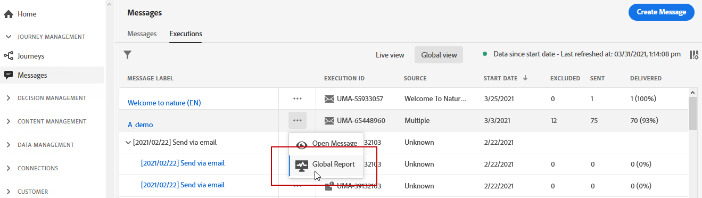
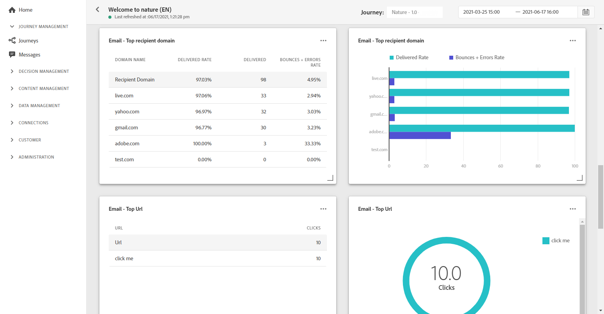

# 以電子郵件傳送全域報告 {#email-global-report}

電子郵件 **[!UICONTROL Global report]** 僅針對特定的電子郵件傳遞。

從 **[!UICONTROL Executions]** 頁籤 **[!UICONTROL Messages]** 菜單，選擇 **[!UICONTROL Global view]** 然後，從選定交貨的「高級」菜單中選擇 **[!UICONTROL Global report]**。

電子郵件 **[!UICONTROL Global report]** 被分成不同的小部件，詳細列出交付的成功和錯誤。 如果需要，可以調整每個小部件的大小並將其刪除。 有關此項的詳細資訊，請參閱 [節](global-report.md#modify-dashboard)。

**[!UICONTROL Email performance]** 使用KPI詳細列出與消息相關的主要資訊：

* **[!UICONTROL Sent]**:交貨的發送總數。

* **[!UICONTROL Delivery Rate]**:成功發送的郵件百分比。

* **[!UICONTROL Bounce Rate]**:與發送的電子郵件相比，已跳轉的電子郵件的百分比。

* **[!UICONTROL Error Rate]**:與發送的電子郵件相比，在發送過程中發生的阻止發送錯誤的百分比。

* **[!UICONTROL Open Rate]**:已開啟郵件的百分比。

* **[!UICONTROL Click Rate]**:交貨中的點擊百分比。

* **[!UICONTROL Spam Complaint Rate]**:收件人標籤為垃圾郵件的電子郵件與已傳遞郵件相比的百分比。 有關投訴的詳細資訊，請參閱 [交付能力最佳實踐指南](https://experienceleague.adobe.com/docs/deliverability-learn/deliverability-best-practice-guide/metrics-for-deliverability/complaints.html#metrics-for-deliverability){target=&quot;_blank&quot;}。

* **[!UICONTROL Unsubscribe Rate]**:唯一取消訂閱與已傳遞郵件數的百分比。 此指示器不依賴於取消訂閱連結上的按一下次數，而是基於收件人啟動的取消訂閱數。 瞭解有關此中取消訂閱的詳細資訊 [頁](../messages/consent.md)。

的 **[!UICONTROL Email - Tracking statistics]** 包含您交貨的收件人活動的可用資料：

* **[!UICONTROL Opens]**:在交貨中開啟交貨的次數。

* **[!UICONTROL Unique Opens]**:已開啟交貨的百分比。

* **[!UICONTROL Open Rate]**:已開啟電子郵件的總數與已發送電子郵件的數量相比。

* **[!UICONTROL Clicks]**:在電子郵件中按一下內容的次數。

* **[!UICONTROL Unique Clicks]**：按一下電子郵件內容的收件人數。

* **[!UICONTROL Click through rate]**:與旅程互動的用戶百分比。

的 **[!UICONTROL Sending Statistics]** 圖表詳細說明了您交付的成功：

* **[!UICONTROL Delivered]**:成功發送的消息數，與已發送的消息總數相關。

* **[!UICONTROL Bounces]**:在傳遞和自動返回處理期間累積的與已發送消息總數有關的錯誤總數。

* **[!UICONTROL Errors]**:在傳遞期間發生的錯誤總數，使其無法發送到配置檔案。

的 **[!UICONTROL Bounce Reasons]** 和 **[!UICONTROL Bounce categories]** 小部件包含與已恢復消息相關的可用資料，如：

* **[!UICONTROL Hard bounce]**:永久錯誤（如錯誤的電子郵件地址）的總數。 這涉及一條錯誤消息，該錯誤消息明確指出地址無效，如「未知用戶」。

* **[!UICONTROL Soft bounce]**:臨時錯誤（如完整收件箱）的總數。

* **[!UICONTROL Ignored]**:臨時（如外出）或技術錯誤（例如，如果發件人類型是郵遞員）的總數。

有關退貨的詳細資訊，請參閱 [隱藏清單](../reports/suppression-list.md) 的子菜單。

的 **[!UICONTROL Error Reasons]** 和 **[!UICONTROL Exclude Reasons]** 圖形和表格允許您查看在交付期間發生的錯誤和排除。

的 **[!UICONTROL Email - Top recipient domain]** 圖表和表詳細資訊，哪些域是收件人開啟電子郵件時最常用的域。

的 **[!UICONTROL Email - Top Url]** 圖表和表詳細資訊，您傳遞的URL訪問量最大。

的 **[!UICONTROL Open vs Click]** 標識收件人與遞送的交互：

* **[!UICONTROL Unique Clicks]**：按一下電子郵件內容的收件人數。

* **[!UICONTROL Unique Opens]**:開啟交貨的收件人數。

<!--

>[!NOTE]
>
>The Offers widgets and metrics are only available if a decision was inserted in an email. For more information on Decision Management, refer to this [page](../offers/get-started/starting-offer-decisioning.md).

The **[!UICONTROL Offers statistic]** and **[!UICONTROL Offers statistics]** over time widgets measure your offer's success and impact on your targeted audience. It detail the main information relative to your message with KPIs:

* **[!UICONTROL Offer sent]**: Total number of sends for the offer.

* **[!UICONTROL Offer impression]**: Number of times the offer was opened in a delivery.

* **[!UICONTROL Offer clicks]**: Number of times an offer was clicked on in a delivery.

The **[!UICONTROL Offers detailed statistic]** table contains the available data for recipient activity with your offer:

* **[!UICONTROL Placement name]**: Name of your placement used to display your offer. For more information on placement, refer to this [page](../offers/offer-library/creating-placements.md).

* **[!UICONTROL Offer name]**: Name of the offer added in the delivery. For more information on placement, refer to this [page](../offers/offer-library/creating-personalized-offers.md).

* **[!UICONTROL Offer sent]**: Total number of sends for the offer.

* **[!UICONTROL Offer impression rate]**: Percentage of opened offers compared to the number of sent offers.

* **[!UICONTROL Offer click rate]**: Percentage of users who interacted with the offer.
-->
>[!NOTE]
>
>配置檔案 **[!UICONTROL Suppressed]** 或 **[!UICONTROL Not allowed]** 在消息發送過程中，狀態被排除。 因此，當 **行程報告** 將顯示這些配置檔案在旅途中移動([讀取段](../building-journeys/read-segment.md) 和 [消息](../building-journeys/journeys-message.md) 活動), **電子郵件報告** 不會把它們包括在 **[!UICONTROL Sent]** 在發送電子郵件之前過濾掉度量。
>
>瞭解 [隱藏清單](../reports/suppression-list.md) 和 [允許清單](allow-list.md)。 要查找所有排除案例的原因，可使用 [Adobe Experience Platform查詢服務](https://experienceleague.adobe.com/docs/experience-platform/query/api/getting-started.html){target=&quot;_blank&quot;}。
