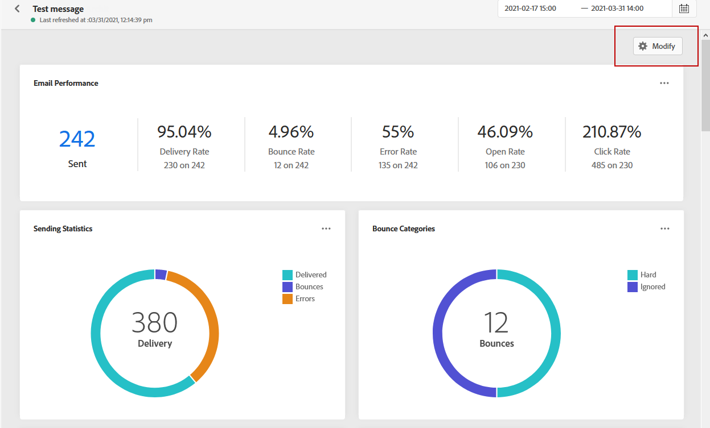
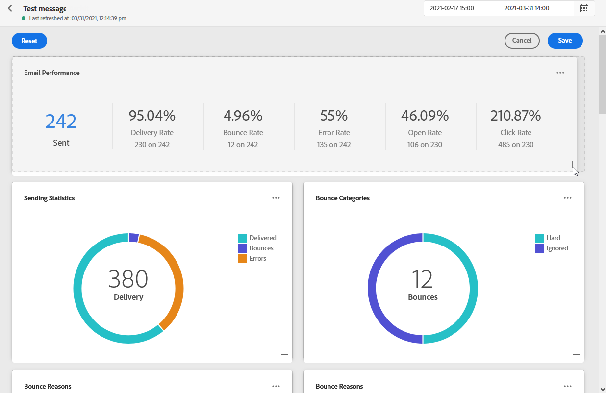

# 全域報表{#global-report}

>[!NOTE]
>
> 如果使用查詢服務時透過API進行自訂查詢，報表可能會延遲一些。

**[!UICONTROL Global report]**&#x200B;可讓您測量所選時段內歷程和傳送的成效。

* 如果您想要定位歷程中的歷程或傳送，請從&#x200B;**[!UICONTROL Journeys]**&#x200B;功能表存取您的歷程，然後按一下&#x200B;**[!UICONTROL Global report]**&#x200B;圖示。 接著，您就可以找到歷程、電子郵件和推播&#x200B;**[!UICONTROL Global report]**。

* 如果要定位特定傳送，請從訊息的&#x200B;**[!UICONTROL Executions]**&#x200B;標籤的&#x200B;**[!UICONTROL Global view]**&#x200B;中，從所選傳送的進階功能表選取&#x200B;**[!UICONTROL Global Report]**。

## 修改儀表板{#modify-dashboard}

每個報表控制面板都可透過調整大小、移除小工具或變更目標時間範圍來修改。 變更介面工具集只會影響目前使用者的控制面板。 其他使用者會看到自己的控制面板或預設設定的控制面板。

1. 在&#x200B;**[!UICONTROL Global report]**&#x200B;控制面板中，按一下排程器按鈕。

1. 選取開始和結束日期。 您可以選取&#x200B;**[!UICONTROL Start time]**&#x200B;和&#x200B;**[!UICONTROL End time]**&#x200B;來進一步微調報表。

   

1. click **[!UICONTROL Modify dashboard]**.

   

1. 拖曳介面工具集的右下角來調整介面工具集大小。

   

1. 按一下&#x200B;**[!UICONTROL Remove]**&#x200B;以移除您不需要追蹤彈回的其他小工具。

   

1. 對顯示順序和小部件的大小感到滿意後，按一下&#x200B;**[!UICONTROL Save]**。

您的控制面板現在已儲存。 您的不同變更將會重新套用，以供稍後使用全域報表。 如果需要，請使用&#x200B;**[!UICONTROL Reset]**&#x200B;選項恢復預設小部件和小部件的順序。
