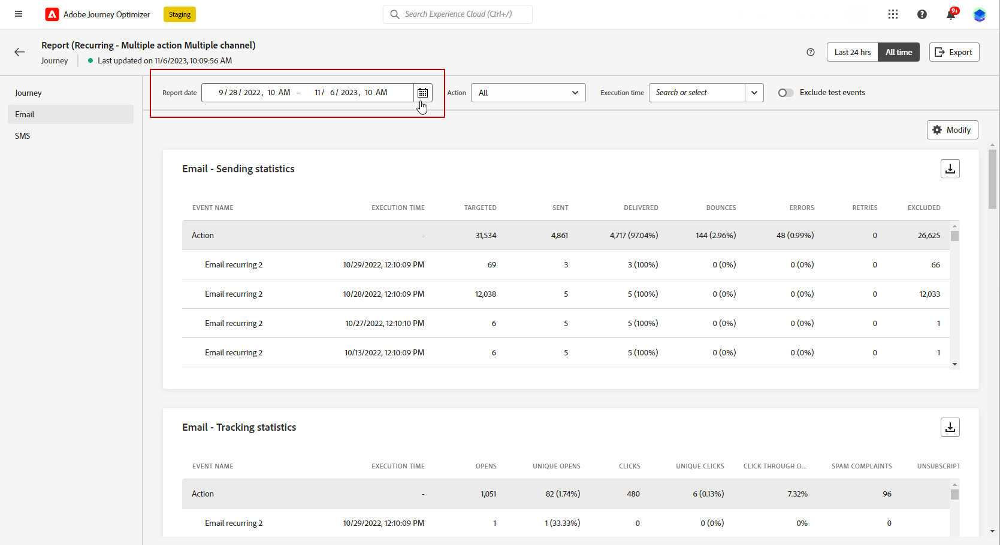

# 全局報告入門 {#global-report}

>[!NOTE]
>
> 如果在使用查詢服務時通過API進行自定義查詢，請期望報告出現延遲。

使用 **[!UICONTROL 全局報告]** 以測量所選時段內的行程和交貨的影響。

* 如果要在行程上下文中確定行程或交貨，請從 **[!UICONTROL 旅程]** 菜單，訪問您的旅程，然後按一下 **[!UICONTROL 查看報表]** 按鈕 然後，您可以找到「旅程」、「電子郵件」、「簡訊」和「推送」全局報告。

   

* 如果要針對市場活動，請 **[!UICONTROL 市場活動]** 菜單，訪問您的市場活動，然後按一下 **[!UICONTROL 報告]** 按鈕

   

* 如果要從 **[!UICONTROL 即時報告]** 到 **[!UICONTROL 全局報告]** 對於您的交貨，按一下 **[!UICONTROL 所有時間]** 按鈕。

   

有關Adobe Journey Optimizer可用的每個指標的詳細清單，請參閱 [此頁](#list-of-components-global)

## 自定義儀表板 {#modify-dashboard}

可以通過更改時間段和調整小部件大小或刪除小部件來修改每個報告儀表板。 更改小部件僅影響當前用戶的儀表板。 其他用戶將看到自己的儀表板或預設設定的儀表板。

1. 從「全局」報告中，選擇「開始」和「結束時間」以針對特定資料。

   

1. 選擇是否要使用切換欄從報表中排除test事件。 有關test事件的詳細資訊，請參閱 [此頁](../building-journeys/testing-the-journey.md)。

   請注意 **[!UICONTROL 排除test事件]** 選項僅可用於行程報告。

   

1. 按一下 **[!UICONTROL 修改]** 開始自定義儀表板。

   

1. 通過拖動小部件的右下角來調整小部件大小。

   

1. 按一下 **[!UICONTROL 刪除]** 刪除任何不需要的小部件。

   

1. 對顯示順序和小部件大小感到滿意後，按一下 **[!UICONTROL 保存]**。

1. 要自定義資料的顯示方式，可以從不同的可視化選項（如圖形、表和圓形圖表）進行切換。

   

您的儀表板現在已保存。 將重新應用您的不同更改，以便以後使用您的即時報告。 如果需要，請使用 **[!UICONTROL 重置]** 選項以恢復預設小部件和小部件的順序。

## 導出報告 {#export-reports}

您可以輕鬆將不同的報告導出為PDF格式，從而共用或打印它們。

1. 在報告中，按一下 **[!UICONTROL 導出]**。

   

1. 在「打印」窗口中，根據需要配置文檔。 請注意，選項可能因瀏覽器而異。

1. 選擇打印或將報表另存為PDF。

1. 找到要保存檔案的資料夾，根據需要更名該檔案，然後按一下「保存」。

您的報告現在可以查看或共用PDF檔案。

