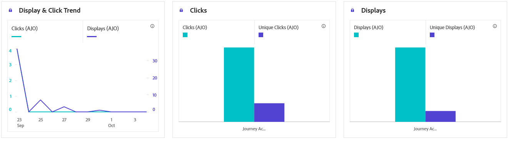
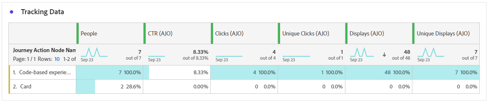

# 程式碼型歷程報告 {#journey-global-report}

>[!INFO]
>
> 您的歷程報告可能同時顯示多個歷程的資訊，因為使用者一次可以涉及多個歷程。 因此，如果輸入通訊（應用程式內、網頁和程式碼型）是為參與同時作用中歷程的使用者觸發的，則可能會顯示在多個歷程中，這可能會造成資料重疊。

>[!BEGINSHADEBOX]

您可以按一下歷程中的&#x200B;**[!UICONTROL 檢視報告]**&#x200B;按鈕，存取您的程式碼型歷程報告。 [了解更多](report-gs-cja.md)

>[!ENDSHADEBOX]

>[!NOTE]
>
>程式碼型體驗可作為傳入互動，讓使用者透過存取您的網站或應用程式來選擇加入。 因此，追蹤為傳出訊息傳遞所選擇之設定檔的&#x200B;**已鎖定目標**&#x200B;或&#x200B;**對象**&#x200B;量度，對於程式碼型行銷活動而言不會增加。

## 顯示並按一下 {#impressions-code}

**[!UICONTROL 顯示和點按]**&#x200B;圖表會顯示設定檔與程式碼型體驗互動的詳細分析，提供設定檔與內容互動方式的寶貴見解。

+++ 進一步瞭解曝光和點選量度

* **[!UICONTROL 不重複點按]**：在您的體驗中點按內容的設定檔數目。

* **[!UICONTROL 點按次數]**：內容在您的體驗中被點按的次數。

* **[!UICONTROL 顯示]**：體驗開啟的次數。

* **[!UICONTROL 不重複顯示]**：體驗開啟的次數，未考慮一個設定檔的多個互動。

+++

## 追蹤資料 {#track-data-code}

**[!UICONTROL 追蹤資料]**&#x200B;表格提供與您的程式碼式體驗繫結的設定檔活動詳細快照，提供參與和體驗有效性的基本深入分析。

+++ 進一步瞭解追蹤資料量度

* **[!UICONTROL 人員]**：符合體驗目標設定檔資格的使用者設定檔數目。

* **[!UICONTROL 點進率(CTR)]**：與您體驗互動的使用者百分比。

* **[!UICONTROL 點按次數]**：內容在您的體驗中被點按的次數。

* **[!UICONTROL 不重複點按]**：在您的體驗中點按內容的設定檔數目。

* **[!UICONTROL 顯示]**：您的體驗開啟的次數。

* **[!UICONTROL 不重複顯示]**：您的體驗開啟的次數，一個設定檔的多個互動未列入考量。

+++

## 追蹤的連結標籤 {#track-link-code}

**[!UICONTROL 追蹤的連結標籤]**&#x200B;表格提供程式碼型體驗中連結標籤的完整概觀，其中會強調產生最高訪客流量的連結。 此功能可讓您識別最熱門的連結並加以優先處理。

+++ 深入瞭解追蹤的連結標籤量度

* **[!UICONTROL 不重複點按]**：在您的程式碼型體驗中點按內容的設定檔數目。

* **[!UICONTROL 點按次數]**：在您的程式碼型體驗中點按內容的次數。

* **[!UICONTROL 顯示]**：體驗開啟的次數。

* **[!UICONTROL 不重複顯示]**：體驗開啟的次數，未考慮一個設定檔的多個互動。

+++
