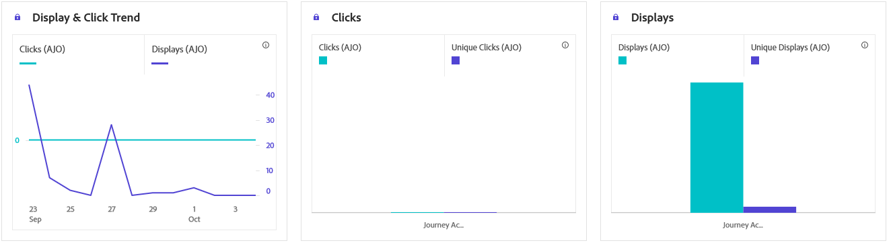

# 內容卡歷程報告 {#journey-global-report}

## 顯示並按一下 {#displays-content-card}

**[!UICONTROL 顯示和點按]**&#x200B;圖表顯示設定檔與內容卡互動的詳細分析，提供設定檔與內容互動方式的寶貴見解。

+++ 進一步瞭解顯示和點按量度

* **[!UICONTROL 不重複點按]**：在內容卡片中點按內容的設定檔數目。

* **[!UICONTROL 點按]**：內容卡片中的內容點按次數。

* **[!UICONTROL 顯示]**：您的內容卡開啟次數。

* **[!UICONTROL 不重複顯示]**：內容卡開啟的次數，未考慮一個設定檔的多個互動。

+++

## 追蹤資料 {#track-data-content}

**[!UICONTROL 追蹤資料]**&#x200B;表格提供與您的內容卡繫結的設定檔活動詳細快照，提供參與和體驗有效性的基本深入分析。

+++ 進一步瞭解追蹤資料量度

* **[!UICONTROL 人員]**：符合內容卡目標設定檔資格的使用者設定檔數目。

* **[!UICONTROL 點進率(CTR)]**：與您內容卡互動的使用者百分比。

* **[!UICONTROL 點按]**：內容卡片中的內容點按次數。

* **[!UICONTROL 不重複點按]**：在內容卡片中點按內容的設定檔數目。

* **[!UICONTROL 顯示]**：您的內容卡開啟次數。

* **[!UICONTROL 不重複顯示]**：您的內容卡已開啟的次數，一個設定檔的多個互動未列入考量。

+++

## 追蹤的連結標籤 {#track-link-content}

**[!UICONTROL 追蹤的連結標籤]**&#x200B;表格提供內容卡中連結標籤的完整概觀，重點說明產生最高訪客流量的連結。 此功能可讓您識別最熱門的連結並加以優先處理。

+++ 進一步瞭解追蹤的連結標籤量度

* **[!UICONTROL 不重複點按]**：在內容卡片中點按內容的設定檔數目。

* **[!UICONTROL 點按]**：內容卡片中的內容點按次數。

* **[!UICONTROL 顯示]**：內容卡開啟的次數。

* **[!UICONTROL 不重複顯示]**：內容卡開啟的次數，未考慮一個設定檔的多個互動。

+++
