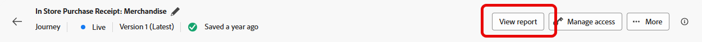
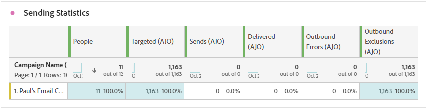
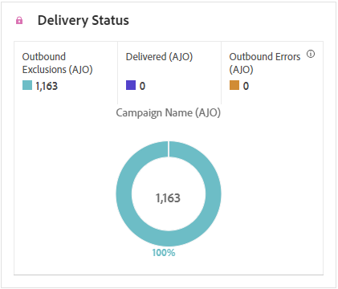

# 直接郵件歷程報告 {#journey-global-report}

>[!BEGINSHADEBOX]

您可以按一下歷程中的&#x200B;**[!UICONTROL 檢視報告]**&#x200B;按鈕，存取您的直接郵件歷程報告。 [了解更多](report-gs-cja.md)

>[!ENDSHADEBOX]

## 正在傳送統計數據 {#sending-statistics-directmail}

**[!UICONTROL 傳送統計資料]**&#x200B;表格可提供您直接郵件歷程效能的insight。 檢視關鍵量度，例如鎖定目標的收件者人數和成功傳送的件數，協助您評估郵件的觸及範圍和成效。

+++ 進一步瞭解如何傳送統計資料

* **[!UICONTROL 人員]**：符合訊息目標設定檔資格的使用者設定檔數目。

* **[!UICONTROL 目標]**：傳送過程中已處理的直接郵件訊息總數。

* **[!UICONTROL 傳送]**：直接郵件訊息的傳送總數。

* **[!UICONTROL 已傳遞]**：成功傳送的直接郵件訊息數目，與已傳送的訊息總數相關。

* **[!UICONTROL 傳出錯誤]**：在傳送過程中發生的錯誤總數，導致無法將其傳送至設定檔。

* **[!UICONTROL 傳出排除]**： Adobe Journey Optimizer已排除的設定檔數目。

+++

## 傳遞狀態 {#delivery-status-directmail}

**[!UICONTROL 傳遞狀態]**&#x200B;圖表提供歷程中已傳送直接郵件訊息相關資料的完整檢視，提供關鍵量度的深入分析，例如傳遞和錯誤。 這可讓您詳細分析直接郵件訊息傳送流程，提供關於歷程效率和效能的寶貴資訊。

+++ 進一步瞭解傳遞狀態量度

* **[!UICONTROL 已傳遞]**：成功傳送的直接郵件訊息數目，與已傳送的直接郵件訊息總數相關。

* **[!UICONTROL 傳出錯誤]**：傳送程式期間發生的錯誤總數，導致直接郵件訊息無法傳送至設定檔。

* **[!UICONTROL 傳出排除]**： Adobe Journey Optimizer已排除的設定檔數目。

+++

## 錯誤原因 {#error-reasons-directmail}

**[!UICONTROL 錯誤原因]**&#x200B;表格可讓您識別直接郵件訊息傳送過程中發生的特定錯誤，以便深入分析所發生的任何問題。

## 排除原因 {#exclude-reasons-directmail}

**[!UICONTROL 排除原因]**&#x200B;表格以視覺化方式呈現導致目標對象中排除使用者設定檔的各種因素，以防止他們接收您的直接郵件訊息。

如需排除原因的完整清單，請參閱[此頁面](exclusion-list.md)。
