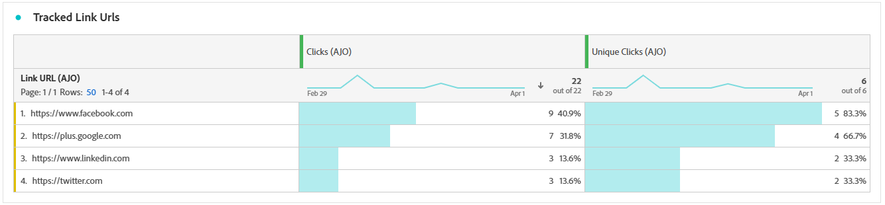

# 電子郵件歷程報告 {#journey-global-report}

>[!INFO]
>
>由於Apple為原生郵件應用程式引入了新的隱私權保護功能，包括郵件隱私權保護，因此傳送者無法再使用追蹤畫素來收集已啟用Apple郵件隱私權保護的設定檔資料。 因此，Adobe Journey Optimizer使用追蹤畫素來追蹤電子郵件開啟的能力可能會受到影響。
> [深入瞭解](https://experienceleaguecommunities.adobe.com/t5/adobe-campaign-classic-blogs/the-impact-of-apple-ios-privacy-changes-on-email-marketing-and/ba-p/699780?profile.language=zh-Hant) Apple iOS隱私權變更對電子郵件行銷的影響。
> 
> 我們建議將重點放在點按次數和轉換量度上，而非開放率，以取得更準確的深入分析。

>[!BEGINSHADEBOX]

您可以按一下歷程中的&#x200B;**[!UICONTROL 檢視報告]**&#x200B;按鈕，存取您的電子郵件歷程報告。 [了解更多](report-gs-cja.md)

>[!ENDSHADEBOX]

## 已傳遞vs點選趨勢 {#delivered-click}

**[!UICONTROL 已傳遞與點選趨勢]**&#x200B;圖表提供您設定檔與電子郵件互動的詳細分析，提供各種網域如何與您的內容互動的寶貴見解。

+++ 深入瞭解已傳遞與點選趨勢量度

* **[!UICONTROL 已傳遞]**：與已傳送電子郵件總數相關的成功傳送電子郵件數目。

* **[!UICONTROL 點按]**：內容在電子郵件中的點按次數。

+++

## 傳遞狀態 {#delivery-status}

**[!UICONTROL 傳遞狀態]**&#x200B;圖表可讓您一目瞭然地檢視電子郵件執行狀況。 追蹤關鍵量度，例如傳送和跳出，讓您快速瞭解電子郵件歷程的效率。

+++ 進一步瞭解傳遞狀態量度

* **[!UICONTROL 已傳遞]**：與已傳送電子郵件總數相關的成功傳送電子郵件數目。

* **[!UICONTROL 傳出頻道的跳出數]**：傳送程式與自動傳回處理期間累計的錯誤總數，與已傳送訊息總數相關。

* **[!UICONTROL 傳出錯誤]**：傳送程式期間發生的錯誤總數，使它無法傳送至設定檔。

* **[!UICONTROL 已排除]**： Adobe Journey Optimizer已排除的設定檔數目。

+++

## 傳送統計資料 {#email-sending-statistics}

**[!UICONTROL 傳送統計資料]**&#x200B;表格可讓您清楚瞭解歷程中電子郵件執行的情形。 它會追蹤關鍵量度，例如傳送率和互動，為您提供有價值的深入分析，以最佳化您的電子郵件策略，以獲得更好的觸及率和參與度。

+++ 進一步瞭解如何傳送統計資料

* **[!UICONTROL 已鎖定目標]**：傳送程式期間處理的電子郵件總數。

* **[!UICONTROL 傳送]**：您電子郵件的傳送總數。

* **[!UICONTROL 已傳遞]**：成功傳送的電子郵件數目，與已傳送的訊息總數相關。

* **[!UICONTROL 不重複送達]**：成功收到至少一封電子郵件的設定檔數。

* **[!UICONTROL 傳出頻道的跳出數]**：傳送程式與自動傳回處理期間累計的錯誤總數，與已傳送訊息總數相關。

* **[!UICONTROL 傳出錯誤]**：在傳送過程中發生的錯誤總數，導致無法將其傳送至設定檔。

* **[!UICONTROL 傳出排除]**： Adobe Journey Optimizer已排除的設定檔數目。

+++

## 電子郵件 - 追蹤統計資料 {#email-tracking}

**[!UICONTROL 電子郵件 — 追蹤統計資料]**&#x200B;表格提供與歷程中包含之電子郵件相關的設定檔活動詳細帳戶。 其中包括開啟次數、點按次數和其他相關的參與指標，以提供設定檔與電子郵件內容互動方式的完整檢視。

+++ 進一步瞭解追蹤統計量度

* **[!UICONTROL 點進率(CTR)]**：與電子郵件互動的使用者百分比。

* **[!UICONTROL 點進開啟率(CTOR)]**：電子郵件開啟的次數。

* **[!UICONTROL 點按]**：內容在電子郵件中的點按次數。

* **[!UICONTROL 不重複點按]**：點按電子郵件中內容的設定檔數目。

* **[!UICONTROL 電子郵件開啟次數]**：您的電子郵件在行銷活動中開啟的次數。

* **[!UICONTROL 不重複電子郵件開啟次數]**：開啟電子郵件的設定檔數目。

* **[!UICONTROL 垃圾訊息申訴]**：訊息被宣告為垃圾郵件或垃圾訊息的次數。

* **[!UICONTROL 取消訂閱]**：取消訂閱連結的點按次數。

* **[!UICONTROL 不重複電子郵件取消訂閱]**：取消訂閱您電子郵件的設定檔數目。
+++

## 電子郵件網域 {#email-domains}

**[!UICONTROL 電子郵件網域]**&#x200B;表格提供依網域分類的電子郵件深入劃分，讓您深入瞭解電子郵件歷程的績效量度。 這項全方位的分析可讓您瞭解不同網域在回應電子郵件內容時的行為。

+++ 進一步瞭解電子郵件網域量度

* **[!UICONTROL 傳送]**：您電子郵件的傳送總數。

* **[!UICONTROL 已傳遞]**：與已傳送電子郵件總數相關的成功傳送電子郵件數目。

* **[!UICONTROL 電子郵件開啟次數]**：您的電子郵件在歷程中開啟的次數。

* **[!UICONTROL 點按]**：內容在電子郵件中的點按次數。

* **[!UICONTROL 傳出頻道的跳出數]**：傳送程式與自動傳回處理期間累計的錯誤總數，與已傳送電子郵件總數相關。

* **[!UICONTROL 傳出錯誤]**：在傳送過程中發生的錯誤總數，導致無法將其傳送至設定檔。

* **[!UICONTROL 傳出排除]**： Adobe Journey Optimizer已排除的設定檔數目。

+++

## 追蹤的連結標籤 {#track-link-label}

**[!UICONTROL 追蹤的連結標籤]**&#x200B;表格提供您電子郵件中連結標籤的完整概觀，其中會強調產生最高訪客流量的連結。 此功能可讓您識別最熱門的連結並加以優先處理。

+++ 深入瞭解追蹤的連結標籤量度

* **[!UICONTROL 不重複點按]**：點按電子郵件中內容的設定檔數目。

* **[!UICONTROL 點按]**：內容在電子郵件中的點按次數。

+++

## 追蹤的連結 URL {#track-link-url}

**[!UICONTROL 追蹤的連結URL]**&#x200B;表格提供您電子郵件中吸引最高訪客流量之URL的完整概觀。 這可讓您識別最熱門的連結並排定其優先順序，進而更瞭解電子郵件中特定內容的設定檔參與情形。

+++ 深入瞭解追蹤的連結URL量度

* **[!UICONTROL 不重複點按]**：點按電子郵件中內容的設定檔數目。

* **[!UICONTROL 點按]**：內容在電子郵件中的點按次數。

+++

## 電子郵件主旨 {#email-subject}

**[!UICONTROL 電子郵件主題]**&#x200B;表格提供吸引最多訪客流量的電子郵件主題的完整概觀。 此資源提供受眾參與動態的寶貴見解。

+++ 進一步瞭解電子郵件主題量度

* **[!UICONTROL 已傳遞]**：與已傳送電子郵件總數相關的成功傳送電子郵件數目。

* **[!UICONTROL 唯一傳遞]**：成功收到至少一個電子郵件的不同設定檔數目，確保不計算重複專案。
+++

## 退回原因 {#email-bounce-reasons}

**[!UICONTROL 退回原因]**&#x200B;表格會編譯與退回訊息相關的可用資料，提供電子郵件退回背後特定原因的詳細深入分析。

如需退信的詳細資訊，請參閱[隱藏清單](../reports/suppression-list.md)頁面。

## 排除原因 {#email-excluded}

**[!UICONTROL 排除的原因]**&#x200B;表格提供不同因素的完整檢視，這些因素導致從目標對象中排除使用者設定檔，導致未收到訊息。

如需排除原因的完整清單，請參閱[此頁面](exclusion-list.md)。

## 錯誤原因 {#email-errors}

**[!UICONTROL 錯誤原因]**&#x200B;表格提供傳送程式期間發生的特定錯誤的可見度，提供有關錯誤性質和發生情況的寶貴資訊。
