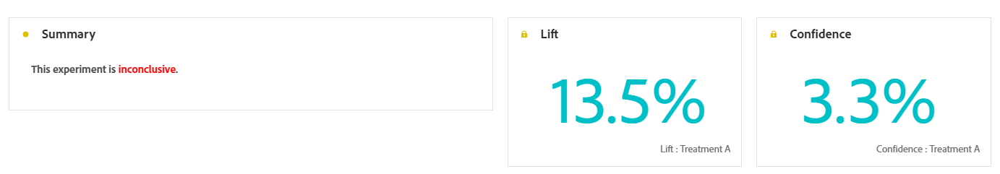
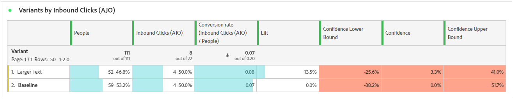

# 實驗歷程報告 {#campaign-global-report-cja-experimentation}

您的歷程報告可讓您全面瞭解實驗的執行情況，以及瞭解其影響所需的關鍵量度。

在Journey Optimizer中，歷程實驗分為兩種型別：

* [內容實驗](../content-management/content-experiment.md)

  請注意，內容實驗的詳細表格和KPI與路徑實驗的表格和KPI相同。 如果您已設定內容實驗，請參閱以下[檔案](#experimentation)。

* [路徑實驗](../building-journeys/optimize.md)

## 路徑實驗 {#experimentation}

### 實驗KPI {#experimentation-kpis}

**實驗摘要**&#x200B;提供您實驗效能的重要深入分析，並識別最成功的實驗。 請注意，定義績效最佳者可能需要一些時間。 如果您的實驗不成功，它將會設定為&#x200B;**尚無結果**。

**實驗關鍵績效指標(KPI)**&#x200B;可作為全方位儀表板，提供與您的實驗相關之基本量度的分析。

+++ 進一步瞭解實驗KPI量度

* **[!UICONTROL 提升度]**：測量指定處理的轉換率相對於基準的提升百分比。

* **[!UICONTROL 信賴度]**：指定處理與基準處理相同的證據。 [了解更多](../content-management/experiment-calculations.md#adobes-statistical-methodology-any-time-valid-confidence-sequences)

+++

### 依成功量度的變體 {#variant-inbound}

成功量度的&#x200B;**變體**&#x200B;表格會根據設定實驗時選取的成功量度，顯示每個變體的執行方式。
如需深入瞭解這些結果以及如何解譯，請參閱[此頁面](../content-management/get-started-experiment.md#interpret-results)。

+++ 進一步瞭解「依成功量度區分的變體」

* **[!UICONTROL 人員]**：符合訊息目標設定檔資格的使用者設定檔數目。

* **[!UICONTROL 傳入點按次數]**：建立實驗時，先前選取的成功量度總值。

* **[!UICONTROL 轉換率]**：建立實驗時先前選取的成功量度總值除以設定檔數目。

* **[!UICONTROL 提升度]**：測量指定處理的轉換率相對於基準的提升百分比。

* **[!UICONTROL 信賴下限]**：在選擇的信賴區間內，處理與基準之間轉換率差異的最低預估值。

* **[!UICONTROL 信賴度]**：指定處理與基準處理相同的證據。 [了解更多](../content-management/experiment-calculations.md#adobes-statistical-methodology-any-time-valid-confidence-sequences)

* **[!UICONTROL 信賴上限]**：在選擇的信賴區間內，處理與基準之間轉換率差異的最大估計值。

+++

### 成功量度的轉換率 {#conversion-rate}

**[!UICONTROL 信賴區間]**&#x200B;圖表會顯示可能的改善範圍，比較基準與所選成功量度的最佳績效處理方式。 [了解更多](../content-management/experiment-calculations.md#adobes-statistical-methodology-any-time-valid-confidence-sequences)。
