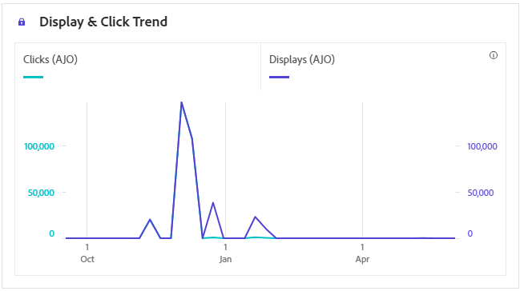
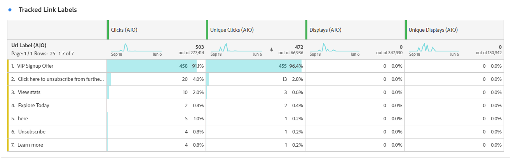
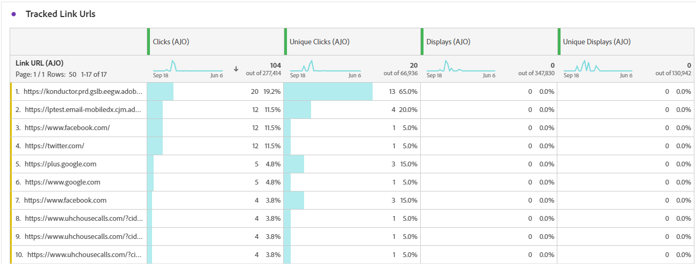

# 應用程式內歷程報告 {#journey-global-report}

>[!INFO]
>
>您的歷程報告可能同時顯示多個歷程的資訊，因為使用者一次可以涉及多個歷程。 因此，如果輸入通訊（應用程式內、網頁和程式碼型）是為參與同時作用中歷程的使用者觸發的，則可能會顯示在多個歷程中，這可能會造成資料重疊。

>[!BEGINSHADEBOX]

您可以按一下歷程中的&#x200B;**[!UICONTROL 報告]**&#x200B;按鈕，存取應用程式內歷程報告。 [了解更多](report-gs-cja.md)

>[!ENDSHADEBOX]

## 顯示與點選趨勢 {#display-click-trend}

**[!UICONTROL 顯示和點按趨勢]**&#x200B;圖表提供設定檔與應用程式內訊息互動的詳細分析，提供設定檔與內容互動方式的寶貴見解。

+++ 進一步瞭解「顯示和點按趨勢」量度

* **[!UICONTROL 點按]**：使用者與應用程式內訊息互動的次數。

* **[!UICONTROL 顯示]**：向使用者顯示應用程式內訊息的次數。

+++

## 點按次數 {#clicks-inapp}

**[!UICONTROL 點按次數]**&#x200B;圖形會顯示應用程式內點按量度，說明內容點按總次數和點按內容的不重複設定檔數量。

+++ 進一步瞭解點選量度

* **[!UICONTROL 不重複點按]**：在您的應用程式內訊息中點按內容的設定檔數目

* **[!UICONTROL 點按]**：使用者與應用程式內訊息互動的次數。

+++

## 顯示 {#display-inapp}

**[!UICONTROL 顯示]**&#x200B;圖表可協助您瞭解訊息的整體觸及範圍和與其互動的不重複設定檔數目。

+++ 進一步瞭解顯示量度

* **[!UICONTROL 顯示]**：向使用者顯示應用程式內訊息的次數。

* **[!UICONTROL 不重複顯示]**：訊息開啟的次數，一個設定檔的多個互動未列入考量。

+++

## 追蹤資料 {#tracking-data-inapp}

**[!UICONTROL 追蹤資料]**&#x200B;表格提供與您的應用程式內訊息繫結的設定檔活動詳細快照，提供參與和應用程式內訊息有效性的基本深入分析。

+++ 進一步瞭解追蹤資料量度

* **[!UICONTROL 人員]**：符合應用程式內訊息目標設定檔資格的使用者設定檔數目。

* **[!UICONTROL 點進率(CTR)]**：與應用程式內訊息互動的使用者百分比。

* **[!UICONTROL 點進開啟率(CTOR)]**：應用程式內訊息開啟的次數。

* **[!UICONTROL 點按]**：使用者與應用程式內訊息互動的次數。

* **[!UICONTROL 不重複點按]**：在您的應用程式內訊息中點按內容的設定檔數目。

* **[!UICONTROL 顯示]**：向使用者顯示應用程式內訊息的次數。

* **[!UICONTROL 不重複顯示]**：訊息開啟的次數，一個設定檔的多個互動未列入考量。

* **[!UICONTROL 傳送]**：您的應用程式內訊息的傳送總數。

* **[!UICONTROL 傳入已觸發]**：使用者互動或預先定義的事件已觸發應用程式內訊息的次數。

* **[!UICONTROL 傳入解除次數]**：使用者未與應用程式內訊息互動即解除該訊息的次數。

+++

## 追蹤的連結標籤 {#track-link-label-inapp}

**[!UICONTROL 追蹤的連結標籤]**&#x200B;表格提供您應用程式內訊息中連結標籤的完整概觀，其中會強調產生最高訪客流量的連結。 此功能可讓您識別最熱門的連結並加以優先處理。

+++ 深入瞭解追蹤的連結標籤量度

* **[!UICONTROL 不重複點按]**：在您的應用程式內訊息中點按內容的設定檔數目。

* **[!UICONTROL 點按]**：使用者與應用程式內訊息互動的次數。

* **[!UICONTROL 顯示]**：向使用者顯示應用程式內訊息的次數。

* **[!UICONTROL 不重複顯示]**：訊息開啟的次數，一個設定檔的多個互動未列入考量。

+++

## 追蹤的連結 URL {#track-link-url-inapp}

**[!UICONTROL 追蹤的連結URL]**&#x200B;表格提供應用程式內訊息中吸引最高訪客流量的URL的完整概觀。 這可讓您識別最熱門的連結並排定其優先順序，進而更瞭解應用程式內訊息中特定內容的設定檔參與情形。

+++ 深入瞭解追蹤的連結URL量度

* **[!UICONTROL 不重複點按]**：在您的應用程式內訊息中點按內容的設定檔數目

* **[!UICONTROL 點按]**：使用者與應用程式內訊息互動的次數。

+++
