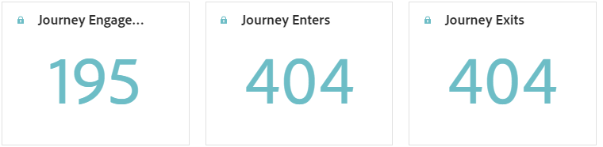
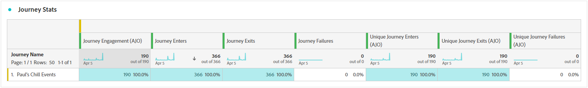
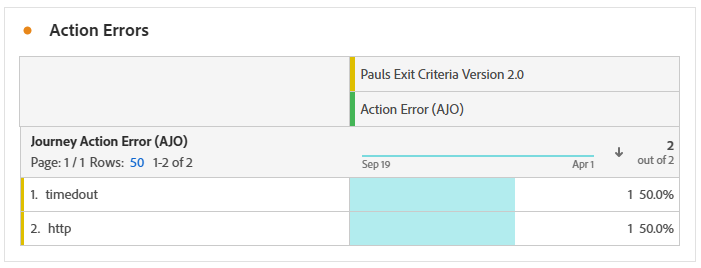
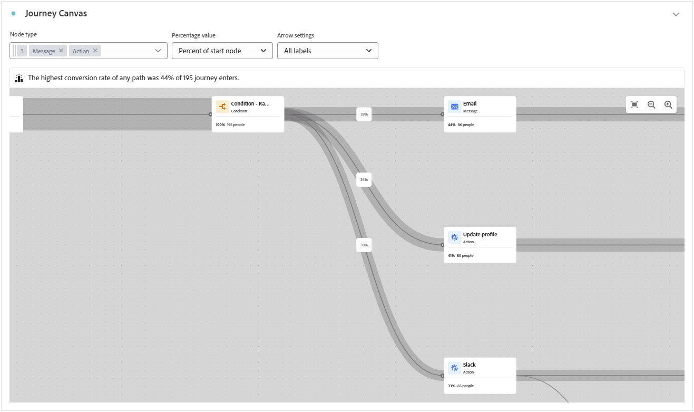
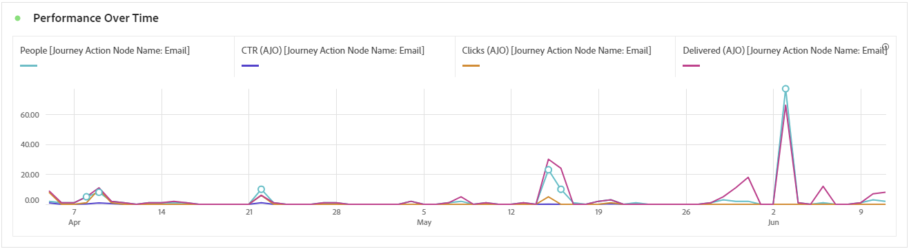
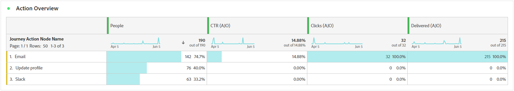
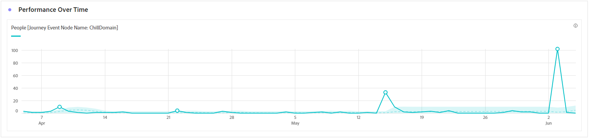
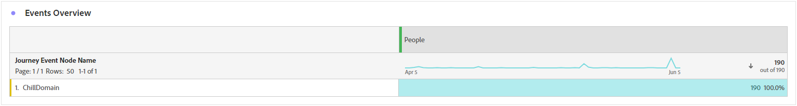
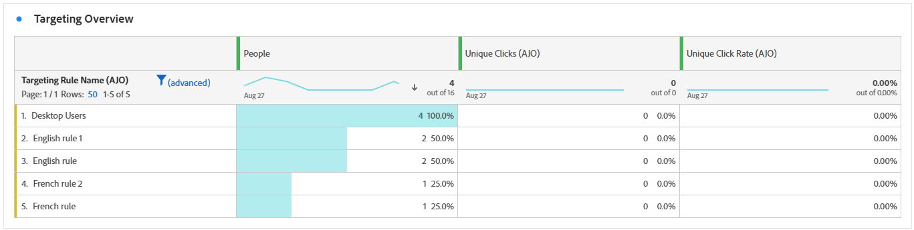

# 歷程報告 {#journey-global-report}

**歷程報告**&#x200B;可作為全方位儀表板，提供與您的歷程相關聯的基本量度分析。 這包含諸如輸入的設定檔計數和失敗的個人歷程例項等詳細資訊，提供全面的insight來瞭解歷程的有效性和參與程度。

使用&#x200B;**檢視報告**&#x200B;按鈕，可以直接從您的歷程存取&#x200B;**[!UICONTROL 歷程報告]**。

若要進一步瞭解Customer Journey Analytics Workspace以及如何篩選及分析資料，請參閱[此頁面](https://experienceleague.adobe.com/zh-hant/docs/analytics-platform/using/cja-workspace/home)。

## 歷程概觀 {#journey-global}

**[!UICONTROL 歷程]**&#x200B;報告可讓您清楚檢視歷程最重要的追蹤資料。

### 歷程KPI {#journey-perfomance}

**[!UICONTROL 歷程]**&#x200B;關鍵績效指標(KPI)可作為全方位儀表板，提供與您的歷程相關之基本量度的分析。 這包含已進入設定檔計數和失敗個別歷程例項等詳細資訊，提供全面的insight，用於瞭解歷程的成效和參與程度。

+++ 進一步瞭解Journey KPI量度

* **[!UICONTROL 歷程參與]**：接收透過歷程傳送之訊息的不重複個人總數，代表到達歷程中指定動作點的不同設定檔。

* **[!UICONTROL 歷程進入者]**：到達歷程進入事件的個人總數。

* **[!UICONTROL 歷程結束]**：結束歷程的個人總數。

+++

### 歷程統計資料 {#journey-stats}

**[!UICONTROL 歷程統計資料]**&#x200B;表格提供有關您歷程的重要資料的詳細摘要。 其中包括關鍵量度，例如失敗次數和成功登入次數，針對您的電子郵件和歷程的效能和觸及範圍提供有價值的深入分析。

+++ 進一步瞭解歷程統計量度

* **[!UICONTROL 歷程排除]**：由於預先定義的條件或隱藏規則而從歷程排除的個人總數。

* **[!UICONTROL 歷程參與]**：接收透過歷程傳送之訊息的不重複個人總數，代表到達歷程中指定動作點的不同設定檔。

* **[!UICONTROL 歷程進入者]**：到達歷程進入事件的個人總數。

* **[!UICONTROL 歷程結束]**：結束歷程的個人總數。

* **[!UICONTROL 歷程失敗]**：未成功執行的個別歷程總數。

* **[!UICONTROL 進入的不重複歷程]**：到達歷程進入事件的個人總數，不會考量一個設定檔的多個互動。

* **[!UICONTROL 唯一歷程結束]**：結束歷程的個人總數，不會考量一個設定檔的多個互動。

* **[!UICONTROL 不重複歷程失敗]**：未成功執行的個別歷程總數，未考慮一個設定檔的多個互動。

+++

## 歷程排除 {#journey-exclusion}

**[!UICONTROL 歷程排除]**&#x200B;表格提供導致排除使用者設定檔的不同因素的完整檢視。

## 動作錯誤 {#action-error}

**[!UICONTROL 動作錯誤]** Widget會詳細說明歷程動作所發生的不同錯誤。

## 歷程畫布 {#journey-canvas}

**[!UICONTROL 歷程畫布]** Widget可讓您在目標設定檔瀏覽您的歷程時，以視覺化方式追蹤其軌跡。 [在Customer Journey Analytics檔案中進一步瞭解](https://experienceleague.adobe.com/zh-hant/docs/analytics-platform/using/cja-workspace/visualizations/journey-canvas/journey-canvas)

使用下列選項增強畫布自訂功能：

* 從&#x200B;**[!UICONTROL 節點型別]**&#x200B;下拉式功能表中新增或移除所需的活動型別，例如訊息或條件。
* 調整&#x200B;**[!UICONTROL 百分比值]**&#x200B;以決定不同歷程路徑之間的流量分佈。
* 自訂您的&#x200B;**[!UICONTROL 箭頭設定]**&#x200B;以包含標籤、條件，或選擇乾淨顯示。
* 啟用&#x200B;**[!UICONTROL 顯示流失]**&#x200B;選項，將直接在畫布上結束您歷程的設定檔視覺化。

使用&#x200B;**[!UICONTROL 節點型別]**&#x200B;篩選時套用下列規則：

* 在節點上建立區段時，即使已透過&#x200B;**[!UICONTROL 節點型別]**&#x200B;篩選器排除那些節點，該區段仍會包含歷程早期階段的節點。

* 如果歷程早期階段的節點已透過&#x200B;**[!UICONTROL 節點型別]**&#x200B;篩選器排除，則無法建立由箭頭形成的區段。 在這種情況下，這些箭頭上的右鍵功能將會停用。

## 動作績效 {#action-performance}

### 一段時間的效能 {#action-overtime}

**[!UICONTROL 特定期間的效能]**&#x200B;圖表可讓您識別和分析符合條件的設定檔數目，以將其視為您動作的目標設定檔。 此視覺效果可提供策略有效性的寶貴見解，並幫助您制定資料導向型決策以最佳化您的績效。

### 動作概觀 {#action-overview}

**[!UICONTROL 動作總覽]**&#x200B;表格可作為完整的儀表板，提供與歷程中動作相關的關鍵量度分析。 這包括重要細節，例如互動次數和點進率

+++ 進一步瞭解動作概觀量度

* **[!UICONTROL 節點進入]**：進入歷程中特定節點的個人總數。

* **[!UICONTROL 歷程失敗]**：未成功執行的個別歷程總數。

* **[!UICONTROL 點進率]**：與動作互動的使用者百分比。

* **[!UICONTROL 點按]**：內容在您的動作中被點按的次數。

* **[!UICONTROL 已傳遞]**：與已傳送動作總數相關的成功傳送動作數。

+++

## 事件效能 {#events-performance}

### 一段時間的效能 {#event-overtime}

**[!UICONTROL 一段時間內的效能]**&#x200B;圖表可讓您識別和分析符合事件目標設定檔資格的設定檔數目。 這個強大的工具可協助您追蹤一段時間內的趨勢和模式，提供有價值的深入分析以最佳化您的事件策略。

### 事件總覽 {#event-overview}

**[!UICONTROL 事件總覽]**&#x200B;表格會顯示一段時間內符合您事件條件的設定檔數目。 此工具可協助您識別合格率中的模式，以精簡事件策略。

+++ 進一步瞭解歷程統計量度

* **[!UICONTROL 人員]**：符合活動目標設定檔資格的使用者設定檔數目。

+++

## 目標定位概觀 {#targeting}

如果您為內容設定&#x200B;**[!UICONTROL 鎖定目標規則]**，**[!UICONTROL 鎖定目標總覽]**&#x200B;表格會提供關鍵參與量度的詳細檢視，顯示每個規則的目標設定檔如何與您的內容互動。

➡️ [進一步瞭解鎖定目標規則](../content-management/optimization-targeting.md)

+++ 進一步瞭解鎖定目標總覽量度

* **[!UICONTROL 人員]**：符合活動目標設定檔資格的使用者設定檔數目。

* **[!UICONTROL 不重複點按]**：點按電子郵件中內容的設定檔數目。

* **[!UICONTROL 不重複點按率]**：至少點按一次的目標設定檔百分比。

+++
